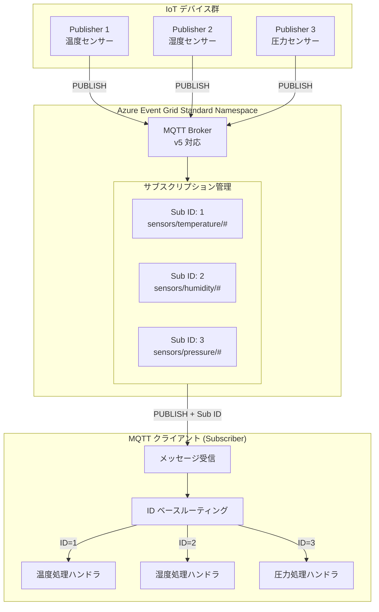

# Azure Event Grid: MQTT v5 Subscription Identifier サポート

**リリース日**: 2026-06-02

**サービス**: Azure Event Grid

**機能**: MQTT v5 Subscription Identifier サポート

**ステータス**: Launched (GA)

[このアップデートのインフォグラフィックを見る](https://takech9203.github.io/azure-news-summary/20260602-event-grid-mqtt-v5.html)

## 概要

Azure Event Grid Standard Namespace において、MQTT v5 Subscription Identifier 機能が一般提供 (GA) として開始されました。この機能により、各 MQTT サブスクリプションにはメッセージ配信時に含まれる識別子を設定でき、アプリケーションはサブスクリプション識別子に基づいてイベントを即座にルーティングできるようになります。

MQTT v5 Subscription Identifier は、MQTT v5 プロトコル仕様で定義された機能で、クライアントが SUBSCRIBE パケットで指定した整数 ID が、マッチするメッセージの PUBLISH パケットに含まれて配信されます。これにより、複数のサブスクリプションを持つクライアントが、メッセージのトピックをパースすることなく、どのサブスクリプションにマッチしたメッセージかを即座に判定できます。

**アップデート前の課題**

- 複数のサブスクリプションを持つ MQTT クライアントは、受信メッセージのトピック文字列をパースしてルーティング先を判定する必要があった
- トピックフィルタが複雑な場合（ワイルドカード使用時など）、メッセージの振り分けロジックが煩雑になっていた
- メッセージルーティングの判定にトピック文字列の解析が必要なため、処理レイテンシが増加していた

**アップデート後の改善**

- サブスクリプション ID による即座のメッセージルーティングが可能
- トピック文字列のパース不要で、整数値の比較のみでルーティング判定が完了
- 複数サブスクリプション環境でのメッセージ処理パフォーマンスが向上
- MQTT v5 プロトコル仕様への準拠度が向上

## アーキテクチャ図



この図は、MQTT v5 Subscription Identifier を使用したメッセージルーティングの流れを示しています。パブリッシャーがメッセージを送信し、ブローカーがサブスクリプション ID を付与して配信、クライアントは ID に基づいて即座にハンドラを選択します。

## サービスアップデートの詳細

### 主要機能

1. **Subscription Identifier の設定**
   - SUBSCRIBE パケットで各サブスクリプションに一意の整数 ID（1 ~ 268,435,455）を指定
   - 1 つのクライアント接続で複数のサブスクリプション ID を管理

2. **メッセージ配信時の ID 付与**
   - ブローカーがマッチしたサブスクリプションの ID を PUBLISH パケットのプロパティとして付与
   - 1 つのメッセージが複数のサブスクリプションにマッチした場合、複数の ID が含まれる

3. **高速メッセージルーティング**
   - 整数値の比較のみでメッセージの処理先を判定
   - トピック文字列のパターンマッチング不要
   - IoT シナリオでの大量メッセージ処理パフォーマンスが向上

## 技術仕様

| 項目 | 詳細 |
|------|------|
| プロトコル | MQTT v5.0 |
| 機能 | Subscription Identifier (Property ID: 0x0B) |
| ID 範囲 | 1 ~ 268,435,455 (Variable Byte Integer) |
| 対象サービス | Azure Event Grid Standard Namespace |
| ステータス | 一般提供 (GA) |
| 複数 ID 対応 | 1 メッセージに複数の Subscription ID を含めることが可能 |

## 設定方法

### 前提条件

1. Azure Event Grid Standard Namespace が作成済みであること
2. MQTT v5 対応のクライアントライブラリを使用していること
3. 適切なネットワーク設定（MQTT ポート 8883 / WebSocket 経由）

### MQTT クライアント実装例（Python - paho-mqtt）

```python
import paho.mqtt.client as mqtt
from paho.mqtt.properties import Properties
from paho.mqtt.packettypes import PacketTypes

# コールバック: サブスクリプション ID に基づくルーティング
def on_message(client, userdata, msg):
    # メッセージプロパティから Subscription Identifier を取得
    sub_ids = msg.properties.SubscriptionIdentifier
    
    for sub_id in sub_ids:
        if sub_id == 1:
            handle_temperature(msg)
        elif sub_id == 2:
            handle_humidity(msg)
        elif sub_id == 3:
            handle_pressure(msg)

# MQTT v5 クライアントの作成
client = mqtt.Client(
    client_id="iot-processor-01",
    protocol=mqtt.MQTTv5
)

client.on_message = on_message

# Event Grid MQTT エンドポイントに接続
client.tls_set()
client.username_pw_set(username="<CLIENT_ID>", password="<SAS_TOKEN>")
client.connect("<NAMESPACE>.centralus-1.ts.eventgrid.azure.net", 8883)

# Subscription Identifier を指定してサブスクライブ
props_temp = Properties(PacketTypes.SUBSCRIBE)
props_temp.SubscriptionIdentifier = 1
client.subscribe("sensors/temperature/#", qos=1, properties=props_temp)

props_humid = Properties(PacketTypes.SUBSCRIBE)
props_humid.SubscriptionIdentifier = 2
client.subscribe("sensors/humidity/#", qos=1, properties=props_humid)

props_press = Properties(PacketTypes.SUBSCRIBE)
props_press.SubscriptionIdentifier = 3
client.subscribe("sensors/pressure/#", qos=1, properties=props_press)

client.loop_forever()
```

### Azure CLI - Event Grid Namespace の作成

```bash
# Event Grid Standard Namespace の作成（MQTT 対応）
az eventgrid namespace create \
  --resource-group <RESOURCE_GROUP> \
  --name <NAMESPACE_NAME> \
  --location <LOCATION> \
  --topic-spaces-configuration "{state:'Enabled'}" \
  --sku Standard
```

## メリット

### ビジネス面

- **IoT ソリューションの処理効率向上**: 大量のセンサーデータを効率的にルーティング可能
- **開発工数の削減**: ルーティングロジックが大幅に簡素化され、開発・保守コストが削減
- **MQTT v5 標準準拠**: 業界標準プロトコルへの準拠により、既存の MQTT v5 クライアントとの互換性を確保

### 技術面

- **低レイテンシルーティング**: 文字列パースではなく整数比較による高速な判定
- **スケーラブルなサブスクリプション管理**: 最大 268,435,455 個のサブスクリプション ID をサポート
- **コードの簡素化**: 複雑なトピックマッチングロジックを整数比較に置き換え可能
- **マルチマッチ対応**: 1 つのメッセージが複数のサブスクリプションにマッチした場合の適切な処理

## デメリット・制約事項

- MQTT v5 プロトコルのみ対応（MQTT v3.1.1 では利用不可）
- クライアントライブラリが MQTT v5 Subscription Identifier に対応している必要がある
- Event Grid Standard Namespace のみで利用可能（Basic は非対応）
- Subscription Identifier の値 0 は予約されており使用不可

## ユースケース

### ユースケース 1: スマートファクトリーのセンサーデータ処理

**シナリオ**: 工場内の多数のセンサーからのデータを単一の MQTT クライアントで受信し、センサータイプ（温度、振動、圧力など）に応じて異なる処理パイプラインにルーティングしたい場合。

**実装例**:

```python
# 各センサータイプに Subscription ID を割り当て
subscriptions = {
    1: ("factory/line-a/temperature/#", handle_temp_alert),
    2: ("factory/line-a/vibration/#", handle_vibration_analysis),
    3: ("factory/line-a/pressure/#", handle_pressure_monitoring),
    4: ("factory/+/emergency/#", handle_emergency),
}

for sub_id, (topic, _) in subscriptions.items():
    props = Properties(PacketTypes.SUBSCRIBE)
    props.SubscriptionIdentifier = sub_id
    client.subscribe(topic, qos=1, properties=props)
```

**効果**: 単一クライアントで多種類のセンサーデータを効率的に受信・分類でき、ファクトリーゲートウェイの実装が簡素化。

### ユースケース 2: マルチテナント IoT プラットフォーム

**シナリオ**: 複数のテナントからの MQTT メッセージを受信し、テナントごとに異なる処理を適用するバックエンドサービスを構築する場合。

**効果**: テナント ID に対応する Subscription Identifier を使用することで、テナント判定のためのトピック解析が不要となり、処理スループットが向上。

## 利用可能リージョン

Azure Event Grid Standard Namespace が利用可能なすべてのリージョンで GA として提供されます。

## 関連サービス・機能

- **Azure Event Grid Standard Namespace**: MQTT ブローカー機能を提供する本アップデートの基盤サービス
- **Azure IoT Hub**: IoT デバイス管理とメッセージングのマネージドサービス
- **Azure Event Hubs**: 大規模イベントストリーミング（Event Grid からのルーティング先）
- **Azure Functions**: MQTT メッセージのイベント駆動処理

## 参考リンク

- [インフォグラフィック](https://takech9203.github.io/azure-news-summary/20260602-event-grid-mqtt-v5.html)
- [公式アップデート情報](https://azure.microsoft.com/updates?id=564532)
- [Azure Event Grid MQTT ドキュメント](https://learn.microsoft.com/en-us/azure/event-grid/mqtt-overview)
- [MQTT v5.0 仕様 - Subscription Identifier](https://docs.oasis-open.org/mqtt/mqtt/v5.0/os/mqtt-v5.0-os.html#_Toc3901166)

## まとめ

Azure Event Grid Standard Namespace における MQTT v5 Subscription Identifier の GA は、IoT およびイベント駆動アーキテクチャにおけるメッセージルーティングの効率を大幅に向上させるアップデートです。

この機能により、複数のトピックサブスクリプションを持つ MQTT クライアントは、受信メッセージのルーティング先をトピック文字列のパースではなく整数値の比較のみで判定できるようになります。特に IoT シナリオにおいて、数百のサブスクリプションを管理するゲートウェイやバックエンドサービスでは、処理パフォーマンスの顕著な改善が期待できます。

MQTT v5 対応のクライアントライブラリを使用している場合は、既存のサブスクライブ処理に Subscription Identifier を追加するだけで利用開始でき、移行コストが低い点も魅力です。

---

**タグ**: #AzureEventGrid #MQTT #MQTTv5 #SubscriptionIdentifier #IoT #GA #Messaging #EventDriven #MicrosoftBuild
