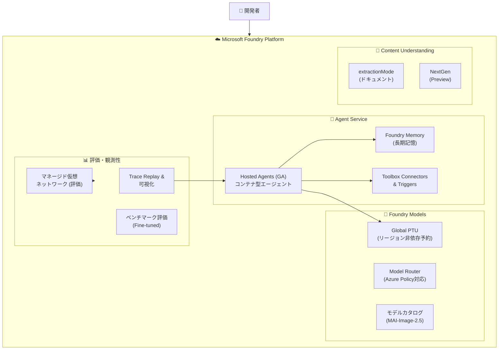

# Microsoft Foundry: Build 2026 - プラットフォーム機能強化（PTU・エージェント・評価）

**リリース日**: 2026-06-02

**サービス**: Microsoft Foundry

**機能**: Build 2026 - プラットフォーム機能強化（PTU・エージェント・評価）

**ステータス**: Launched (GA) / In preview (mixed)

[このアップデートのインフォグラフィックを見る](https://takech9203.github.io/azure-news-summary/20260602-foundry-platform-build-2026-updates.html)

## 概要

Microsoft Build 2026 において、Microsoft Foundry プラットフォームに関する多数のアップデートが発表された。GA（一般提供開始）として 4 件、パブリックプレビューとして 7 件の計 11 件のアップデートが含まれる。これらは Foundry プラットフォームの基盤能力（プロビジョンドスループット、エージェントサービス、評価機能、メモリ、モデルカタログ）を横断的に強化するものであり、エンタープライズ AI アプリケーション開発の生産性と運用効率を大幅に向上させる。

主要なテーマは以下の 3 つに分類される。(1) Global PTU のリージョン非依存型予約による推論コスト最適化と可用性向上、(2) Hosted Agents の GA 化によるコンテナ型エージェントのマネージド運用基盤の確立、(3) 評価・観測性機能の強化（マネージド仮想ネットワーク、Trace Replay、ベンチマーク評価）によるエンタープライズ対応の深化。

**アップデート前の課題**

- Global PTU の予約が特定リージョンに紐づいており、キャパシティの柔軟な活用が困難だった
- カスタムエージェントのデプロイ・スケーリング・監視をすべて自前で管理する必要があった
- 評価実行時にパブリックエンドポイント経由でしかアクセスできず、セキュリティ要件の厳しい環境での利用に制約があった
- エージェントにセッション跨ぎの長期記憶がなく、ユーザーが毎回コンテキストを再入力する必要があった
- ファインチューニング済みモデルの品質を標準ベンチマークで評価する手段がプラットフォーム上になかった

**アップデート後の改善**

- Global PTU 予約がリージョン非依存となり、複数リージョンにまたがるデプロイメントを単一予約でカバー可能に
- Hosted Agents が GA し、コンテナ化されたエージェントをマネージド基盤上でスケーリング・監視可能に
- 評価環境にマネージド仮想ネットワークを適用し、プライベートネットワーク経由での評価実行が可能に
- Foundry Memory のプレビューリフレッシュにより、アイテムレベルの CRUD 操作やリテンション制御が追加
- ベンチマーク評価機能により、ファインチューニング済みモデルの品質を標準指標で定量的に評価可能に

## アーキテクチャ図

Microsoft Foundry プラットフォームの Build 2026 アップデートの全体構成。Models 層・Agent Service 層・評価/観測性層・Content Understanding 層に跨る包括的な機能強化を示す。

## サービスアップデートの詳細

### GA（一般提供開始）- 4 件

#### 1. Region-agnostic reservations for Global PTU

**ステータス**: Launched (GA)

Global Provisioned Throughput Units (PTU) の Azure 予約がリージョン非依存となった。従来は予約購入時に特定リージョンを指定する必要があったが、本アップデートにより単一の予約で複数リージョンにデプロイされた Global PTU 容量をカバーできるようになった。

- **Global PTU** (`GlobalProvisionedManaged`): 推論リクエストを Azure リージョンをまたいでグローバルにルーティングし、最高の可用性を提供するデプロイメントタイプ
- 予約は 1 カ月または 1 年の期間で購入可能で、時間単位の PTU 課金に対する割引が適用される
- 予約とデプロイメントは疎結合であり、先にデプロイメントを作成してキャパシティを確認した後に予約を購入する運用が推奨される
- 本変更により、マルチリージョンに分散した推論ワークロードのコスト管理が大幅に簡素化される

| 項目 | 詳細 |
|------|------|
| デプロイメントタイプ | Global Provisioned (`GlobalProvisionedManaged`) |
| 予約期間 | 1 カ月 / 1 年 |
| リージョン制約 | なし（リージョン非依存） |
| 課金単位 | $/PTU/時間（予約適用時は割引） |

#### 2. Hosted Agents in Microsoft Foundry Agent Service

**ステータス**: Launched (GA)

Foundry Agent Service の Hosted Agents が GA となった。Hosted Agents は、コンテナ化されたエージェントアプリケーションを Foundry のマネージドインフラストラクチャ上にデプロイ・運用するためのフルマネージドホスティング機能である。

**主要な特徴:**

- **コンテナベースのデプロイ**: エージェントコードを Docker コンテナとしてパッケージ化し、Azure Container Registry 経由でデプロイ
- **VM 分離型サンドボックス**: セッションごとに分離されたサンドボックスで実行され、永続ファイルシステム (`$HOME`、`/files`) を提供
- **自動スケーリング**: セッション単位でスケールし、レプリカ数の設定は不要。アイドルタイムアウト 15 分後に自動デプロビジョニング
- **専用 Microsoft Entra ID**: エージェントごとに自動的に専用 ID が作成され、モデル呼び出しやツールアクセスに使用
- **複数プロトコル対応**: Responses（会話型）、Invocations（Webhook/カスタムペイロード）、Invocations WebSocket（リアルタイム音声）、A2A（エージェント間連携）

| 項目 | 詳細 |
|------|------|
| サンドボックスサイズ | 0.5 vCPU/1 GiB、1 vCPU/2 GiB、2 vCPU/4 GiB |
| アイドルタイムアウト | 15 分 |
| セッション最大期間 | 30 日 |
| 同時セッション上限 | 50（サブスクリプション/リージョン、調整可能） |
| 対応言語 | Python、C# |
| 対応フレームワーク | Agent Framework、LangGraph、Semantic Kernel、カスタムコード |

#### 3. Content Understanding extractionMode for documents

**ステータス**: Launched (GA)

Microsoft Foundry の Content Understanding サービスにおいて、ドキュメント処理の `extractionMode` が GA となった。ドキュメントからの構造化データ抽出において、抽出モードを明示的に指定できるようになり、処理の精度と効率が向上する。

#### 4. Managed virtual network for evaluations in Microsoft Foundry

**ステータス**: Launched (GA)

Foundry の評価機能（Evaluations）においてマネージド仮想ネットワークのサポートが GA となった。これにより、プライベートネットワーク経由でのモデル評価実行が可能となり、データがパブリックインターネットを経由しない安全な評価環境を構築できる。

- セキュリティ要件の厳しいエンタープライズ環境での評価ワークロード実行が可能に
- プライベートエンドポイント経由でデータソースやモデルエンドポイントにアクセス
- 既存の Foundry リソースのネットワーク分離設定と統合

---

### Preview（パブリックプレビュー）- 7 件

#### 5. Azure Policy Coverage for Model Router in Foundry Models

**ステータス**: In preview

Foundry Models の Model Router（モデルルーター）に対する Azure Policy の適用が可能になった。Model Router は単一の API エンドポイントから複数のモデルへのリクエストルーティングを行う機能であり、本アップデートにより組織のガバナンスポリシーをモデルルーティングレベルで強制できるようになる。

- 使用可能なモデルの制限
- 特定のデプロイメントタイプへのルーティング制御
- コンプライアンス要件に基づくモデルアクセス制御

#### 6. Foundry Memory preview refresh

**ステータス**: In preview

Foundry Agent Service の Memory 機能がプレビューリフレッシュされ、新しいケイパビリティが追加された。Foundry Memory はエージェントにセッションを跨いだ長期記憶を提供するマネージドソリューションであり、ユーザープリファレンスの保持、会話履歴の要約、手続き的記憶の学習を実現する。

**本リフレッシュの新機能:**

- **メモリアイテム操作**: 個々のメモリレコードに対する CRUD（作成・読取・更新・一覧・削除）操作
- **ストアレベルのリテンション制御**: デフォルト TTL を新規作成時に設定可能
- **直接的な remember/forget コマンド**: ユーザーが明示的にメモリの記憶・忘却を指示した場合の同期的な動作

**メモリタイプ:**

| タイプ | 説明 | 取得タイミング |
|--------|------|---------------|
| User profile memory | ユーザーの嗜好・個人コンテキスト | 会話開始時 |
| Chat summary memory | 過去の会話トピック・スレッドの要約 | ターンごと |
| Procedural memory | 再利用可能な手順・操作パターン | タスク実行時 |

**クォータ:**
- スコープあたり最大メモリ数: 10,000
- メモリストアあたり最大スコープ: 100
- 検索リクエスト: 1,000 回/分
- 更新リクエスト: 1,000 回/分

#### 7. MAI-Image-2.5 in Microsoft Foundry model catalog

**ステータス**: In preview

Microsoft の画像生成モデル MAI-Image-2.5 が Foundry モデルカタログに追加された。Microsoft 独自の画像生成 AI モデルとして、テキストからの高品質画像生成を Foundry プラットフォーム上で利用可能になる。

#### 8. Toolbox connectors and triggers in Microsoft Foundry

**ステータス**: In preview

Foundry の Toolbox にコネクタとトリガーが追加された。Toolbox はエージェントが利用可能なツールのカタログ（1,400 以上のツールを提供）であり、本アップデートにより外部サービスとの接続（コネクタ）やイベント駆動型のエージェント起動（トリガー）が新たに可能になる。

- コネクタ: 外部サービスとの認証付き接続を管理
- トリガー: 外部イベント（Webhook、スケジュールなど）に基づくエージェントの自動起動
- OAuth、エージェント ID、キーベースなど複数の認証方式をサポート

#### 9. Trace Replay and trace visualizations for Foundry agents

**ステータス**: In preview

Foundry エージェントの Trace Replay 機能とトレース可視化が追加された。エージェントの実行トレースを再生・視覚化することで、デバッグやパフォーマンス分析が大幅に効率化される。

- 過去のエージェント実行をステップごとに再現
- ツール呼び出し、モデル推論、メモリアクセスなどの各ステップを時系列で可視化
- ボトルネックの特定やエラーの根本原因分析に活用

#### 10. Content Understanding NextGen in Microsoft Foundry

**ステータス**: In preview

Content Understanding の次世代版（NextGen）がプレビューとして提供開始された。ドキュメント、画像、音声、動画などのマルチモーダルコンテンツからの理解・抽出能力が次世代レベルに強化される。

#### 11. Benchmark evaluations for fine-tuned models in Microsoft Foundry

**ステータス**: In preview

ファインチューニング済みモデルに対するベンチマーク評価機能がプレビューとして追加された。標準的なベンチマーク（例: MMLU、HumanEval など）を使用して、カスタマイズしたモデルの品質を定量的に評価・比較できるようになる。

- ファインチューニング前後のモデル性能比較
- 標準ベンチマークに基づく品質の客観的評価
- 複数モデル間の比較によるモデル選択の支援

## メリット

### ビジネス面

- Global PTU のリージョン非依存予約により、マルチリージョン展開時のコスト管理が簡素化され、予約の未消化リスクが低減
- Hosted Agents の GA により、エージェント開発チームがインフラ管理から解放され、ビジネスロジックに集中可能
- Azure Policy の Model Router 対応により、組織全体での AI ガバナンスを自動化
- Foundry Memory により、ユーザーが繰り返し情報を入力する必要がなくなり、カスタマー体験が向上

### 技術面

- Hosted Agents の VM 分離型サンドボックスにより、セッション間の完全な分離とステートフルな処理を両立
- マネージド仮想ネットワーク対応により、評価ワークロードのネットワーク分離が実現し、セキュリティ監査への対応が容易に
- Trace Replay により、本番環境で発生した問題を再現・分析するデバッグ能力が向上
- Toolbox のコネクタ・トリガーにより、イベントドリブンなエージェントアーキテクチャの構築が容易に

## デメリット・制約事項

- Hosted Agents のデフォルト同時セッション上限は 50（サブスクリプション/リージョン）であり、大規模利用時はクォータ増加申請が必要
- Foundry Memory は現時点で互換性のある Azure OpenAI のチャットモデルと埋め込みモデルのデプロイが必要
- Memory のプレビュー期間中は統合動作や料金が変更される可能性あり
- Hosted Agents のコンテナレジストリ（ACR）はパブリックエンドポイントが現時点で必須（プライベート ACR 非対応）
- Invocations (WebSocket) プロトコルは North Central US のみで利用可能

## ユースケース

### ユースケース 1: グローバル展開のエンタープライズ AI アシスタント

**シナリオ**: 複数リージョンにユーザーが分散する企業が、Foundry 上にカスタマーサポートエージェントを構築する。

**構成例**:
- Global PTU のリージョン非依存予約でコスト最適化
- Hosted Agents で Python ベースのエージェントをデプロイ
- Foundry Memory でユーザーの問い合わせ履歴・嗜好を長期保持
- Trace Replay で問題発生時のエージェント動作を再現・分析

**効果**: インフラ管理負荷の軽減、リージョンをまたいだ一貫したレスポンス品質、パーソナライズされたサポート体験の実現

### ユースケース 2: 規制産業でのモデル評価パイプライン

**シナリオ**: 金融・医療などの規制産業で、ファインチューニング済みモデルを本番投入前に評価する。

**構成例**:
- マネージド仮想ネットワーク内で評価を実行し、データがパブリックインターネットを経由しないことを保証
- ベンチマーク評価でモデル品質を定量的に確認
- Azure Policy で使用可能モデルを組織ポリシーに準拠したものに制限

**効果**: コンプライアンス要件を満たしながら、AI モデルの品質保証プロセスを自動化

## 利用可能リージョン

Hosted Agents は以下のリージョンで利用可能:
East US 2、North Central US、Sweden Central、Canada Central、Canada East、Southeast Asia、Poland Central、South Africa North、Korea Central、South India、Brazil South、West US、West US 3、Norway East、Japan East、France Central、Germany West Central、Switzerland North、Spain Central、Australia East

Foundry Memory は以下のリージョンで利用可能:
Australia East、Brazil South、Canada East、East US 2、France Central、Italy North、Japan East、Korea Central、North Central US、Norway East、South Africa North、South India、Sweden Central、Switzerland North、UAE North、UK South、West US、West US 2、West US 3

Global PTU は Foundry Models がプロビジョンドスループットをサポートするリージョンで利用可能。

## 関連サービス・機能

- **Microsoft Agent Framework**: Hosted Agents 上で動作するオーケストレーションフレームワーク。v1.0 GA（2026-04-29）
- **Foundry IQ**: エージェントをエンタープライズデータやWebコンテンツでグラウンディングするナレッジ統合機能
- **Azure Policy**: Model Router へのポリシー適用による AI ガバナンスの自動化
- **Application Insights**: Hosted Agents に自動統合される可観測性基盤
- **Azure Virtual Network**: 評価環境および Hosted Agents のネットワーク分離に使用

## 参考リンク

- [インフォグラフィック](https://takech9203.github.io/azure-news-summary/20260602-foundry-platform-build-2026-updates.html)
- [Managed virtual network for evaluations](https://azure.microsoft.com/updates?id=564402)
- [Content Understanding extractionMode](https://azure.microsoft.com/updates?id=563257)
- [Region-agnostic reservations for Global PTU](https://azure.microsoft.com/updates?id=563212)
- [Hosted Agents in Foundry Agent Service](https://azure.microsoft.com/updates?id=563596)
- [Azure Policy for Model Router](https://azure.microsoft.com/updates?id=563636)
- [Foundry Memory preview refresh](https://azure.microsoft.com/updates?id=563616)
- [MAI-Image-2.5](https://azure.microsoft.com/updates?id=563581)
- [Toolbox connectors and triggers](https://azure.microsoft.com/updates?id=563456)
- [Trace Replay and trace visualizations](https://azure.microsoft.com/updates?id=563426)
- [Content Understanding NextGen](https://azure.microsoft.com/updates?id=563361)
- [Benchmark evaluations for fine-tuned models](https://azure.microsoft.com/updates?id=563167)
- [Microsoft Foundry ドキュメント](https://learn.microsoft.com/azure/ai-foundry/what-is-ai-foundry)
- [Foundry Agent Service - Hosted Agents](https://learn.microsoft.com/azure/ai-foundry/agents/concepts/hosted-agents)
- [Foundry Memory](https://learn.microsoft.com/azure/ai-foundry/agents/concepts/what-is-memory)
- [Provisioned Throughput](https://learn.microsoft.com/azure/ai-foundry/openai/concepts/provisioned-throughput)

## まとめ

Build 2026 における Microsoft Foundry プラットフォームのアップデートは、エンタープライズ AI アプリケーション開発の 3 つの柱を強化するものである。(1) Global PTU のリージョン非依存予約によるコスト最適化、(2) Hosted Agents GA によるマネージドエージェント運用基盤の確立、(3) マネージド仮想ネットワーク・Trace Replay・ベンチマーク評価による観測性・品質保証の強化。

Solutions Architect として推奨される次のアクション:
- 既存の Global PTU 予約をリージョン非依存型に移行し、コスト効率を最適化する
- カスタムエージェントを Hosted Agents に移行し、インフラ管理負荷を削減する
- セキュリティ要件の高い評価ワークロードにマネージド仮想ネットワークを適用する
- Foundry Memory を活用して、エージェントのパーソナライズ体験を設計する

---

**タグ**: #MicrosoftFoundry #Build2026 #HostedAgents #GlobalPTU #FoundryMemory #AgentService #AI #Evaluation #ContentUnderstanding #ModelRouter #AzurePolicy
