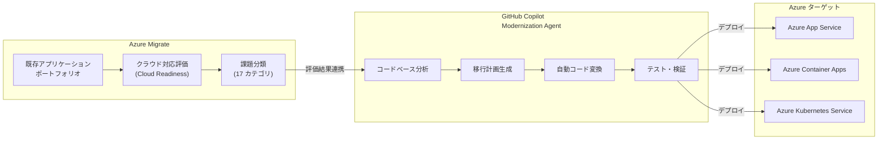

# GitHub Copilot Modernization: アプリケーション近代化エージェント GA

**リリース日**: 2026-06-02

**サービス**: GitHub Copilot / Azure Migrate

**機能**: アプリケーション近代化エージェント

**ステータス**: Launched (GA)

[このアップデートのインフォグラフィックを見る](https://takech9203.github.io/azure-news-summary/20260602-github-copilot-modernization-ga.html)

## 概要

GitHub Copilot modernization agent が一般提供 (GA) となった。このエージェントは、Azure Migrate によるアプリケーション評価とコードレベルの変換を統合的に接続し、アプリケーションポートフォリオ全体にわたるアセスメントとアップグレードをスケーラブルに実行する。

従来、アプリケーション近代化はインフラストラクチャの評価とコードの変換が分断されたプロセスであり、手動での調査・計画・実装に数か月を要していた。本エージェントは、Azure Migrate のクラウド対応評価から GitHub Copilot によるコード変換まで、エンドツーエンドのオーケストレーションを提供し、近代化にかかる時間を大幅に短縮する。

**アップデート前の課題**

- アプリケーション評価 (Azure Migrate) とコード変換が分離されたワークフローだった
- レガシーアプリの近代化に数か月のタイムラインが必要だった
- アプリケーションごとの個別調査・計画・実装が手動で行われていた
- ポートフォリオ全体の一貫したアップグレード戦略を実現することが困難だった

**アップデート後の改善**

- Azure Migrate の評価結果から直接コード変換ワークフローに接続可能
- 近代化タイムラインを数か月から数日に短縮 (公称 70% の時間削減)
- エージェントがコードベースを分析し、アプリケーション固有の移行計画を自動生成
- ポートフォリオ全体にわたるスケーラブルな評価とアップグレードの実行

## アーキテクチャ図

Azure Migrate による資産評価から GitHub Copilot modernization agent によるコード変換、そして Azure サービスへのデプロイまでのエンドツーエンドフローを示す。評価結果がエージェントの変換計画に直接接続される点が本機能の核心である。

## サービスアップデートの詳細

### 主要機能

1. **スケーラブルなアプリケーション評価**
   - ポートフォリオ全体のアプリケーションを一括で評価
   - クラウド対応度を 17 の課題カテゴリで分類
   - ソリューションカバレッジ (Microsoft ソリューションで解決可能な課題の割合) を可視化

2. **エージェント駆動のコード変換**
   - Copilot がコードベースを自律的に分析し、移行計画を生成
   - ブロッカーの特定と修正提案を自動化
   - 設定ファイル、ライブラリ、依存関係の更新を一括処理

3. **カスタムスキルによるビジネスロジック適用**
   - 組織固有のビジネスロジックをエンコード可能
   - ソフトウェアファクトリーパターンの定義
   - アウトカムの標準化

4. **セキュリティ統合**
   - CVE (Common Vulnerabilities and Exposures) の早期検出
   - 組織のポリシーとスタンダードへの準拠確認
   - 変更は既存のテストと CI/CD パイプラインで検証

5. **段階的な承認フロー**
   - エージェントの推奨事項をレビュー可能
   - アクションごとに「Allow」「Skip」の選択肢を提供
   - 開発者が制御を維持しながら自動化の恩恵を受ける

## 技術仕様

| 項目 | 詳細 |
|------|------|
| サポート言語 | .NET、Java |
| .NET アップグレード | .NET Framework から最新 .NET (例: .NET 8) へのアップグレード |
| Java アップグレード | Java ランタイム・フレームワークのアップグレード |
| ターゲット Azure サービス | Azure App Service、Azure Container Apps、Azure Kubernetes Service |
| 評価カテゴリ | Cloud Readiness (17 カテゴリ)、Java Upgrade (4 カテゴリ) |
| 自動化内容 | 設定ファイル、ライブラリ、依存関係の更新 |
| セキュリティ | CVE 検出、ポリシー準拠チェック |
| 公称効果 | 移行作業時間 70% 削減、アップグレード工数 50% 削減 |

## メリット

### ビジネス面

- **近代化の加速**: 従来数か月かかっていた移行を数日に短縮 (70% の時間削減)
- **スケーラビリティ**: ポートフォリオ全体の一括評価・アップグレードが可能
- **コスト削減**: 手動調査・実装工数の大幅削減 (50% の工数削減)
- **予測可能性**: エージェントによる事前評価で移行の複雑さとリスクを可視化

### 技術面

- **エンドツーエンド統合**: Azure Migrate 評価からコード変換までシームレスに接続
- **自律的分析**: エージェントがコードベースを解析し固有の移行計画を生成
- **品質保証**: 既存テスト・CI/CD パイプラインとの統合による変更検証
- **セキュリティ強化**: CVE 早期検出と互換性ガイダンスの提供

## デメリット・制約事項

- サポート言語が現時点では .NET と Java に限定されている (Python、Go、Node.js などは未対応)
- エージェントの推奨は完全自動ではなく、開発者によるレビューと承認が必要
- 大規模なアーキテクチャ変更 (モノリスからマイクロサービスへの分解など) は、エージェント単独では完結しない可能性がある
- 組織固有のフレームワークやカスタムライブラリへの対応は、カスタムスキルの構築が必要
- 公称の効果 (70% 時間削減) はアプリケーションの複雑さにより変動する

## ユースケース

### ユースケース 1: レガシー .NET Framework から .NET 8 への移行

**シナリオ**: 企業が数十の .NET Framework 4.x アプリケーションを運用しており、サポート終了に伴い最新の .NET 8 へアップグレードする必要がある。

**ワークフロー**:
1. Azure Migrate でアプリケーションポートフォリオを評価
2. Copilot modernization agent がコードベースを分析し、NuGet パッケージ互換性、API 変更点、非推奨機能を特定
3. エージェントが設定ファイル (csproj、web.config から appsettings.json) の変換を実行
4. 依存ライブラリの更新とコードの修正提案を生成
5. 開発者がレビュー・承認後、CI/CD で検証しデプロイ

**効果**: 手動で 1 アプリあたり数週間かかっていた移行作業を数日に短縮

### ユースケース 2: Java EE アプリケーションのクラウド最適化

**シナリオ**: オンプレミスで稼働する Java EE アプリケーションを Azure App Service または Azure Container Apps に移行したい。

**ワークフロー**:
1. Azure Migrate で Java アプリケーションのクラウド対応度を評価 (4 カテゴリの課題分類)
2. Copilot modernization agent が Java ランタイムとフレームワークのアップグレードパスを特定
3. 設定ファイル、ライブラリ依存関係、デプロイ構成の自動変換
4. 互換性ガイダンスとセキュリティ強化の推奨事項を提示

**効果**: Java EE からクラウドネイティブ環境への移行プロセスを標準化し、一貫性のあるアウトプットを実現

### ユースケース 3: 大規模ポートフォリオの一括近代化

**シナリオ**: 100 以上のアプリケーションを抱える企業が、クラウド移行戦略の一環として段階的な近代化を実施する。

**ワークフロー**:
1. 全アプリケーションを Azure Migrate で一括評価
2. ソリューションカバレッジに基づき優先順位を決定
3. カスタムスキルで組織のパターン (マイクロサービス構成、CI/CD テンプレート) を定義
4. エージェントがバッチ処理でアプリケーションを順次変換
5. 500,000 行以上のコード変更を数週間で完了

**効果**: 大規模ポートフォリオの近代化を予測可能なタイムラインで実行

## 関連サービス・機能

- **Azure Migrate**: アプリケーション資産の検出・評価基盤。本エージェントの入力となるクラウド対応評価を提供
- **GitHub Copilot**: AI コーディングアシスタント基盤。modernization agent はその拡張機能として動作
- **Azure App Service**: 近代化後のアプリケーションのホスティング先の一つ
- **Azure Container Apps**: コンテナ化されたアプリケーションのデプロイ先
- **Azure Kubernetes Service (AKS)**: マイクロサービスアーキテクチャへの移行先
- **GitHub Actions**: エージェントの変換結果を検証する CI/CD パイプライン

## 参考リンク

- [インフォグラフィック](https://takech9203.github.io/azure-news-summary/20260602-github-copilot-modernization-ga.html)
- [公式アップデート情報](https://azure.microsoft.com/updates?id=564431)
- [GitHub Copilot App Modernization](https://github.com/solutions/use-case/app-modernization)
- [Azure Migrate ドキュメント](https://learn.microsoft.com/azure/migrate/)

## まとめ

GitHub Copilot modernization agent の GA は、アプリケーション近代化のアプローチを根本的に変える可能性を持つ。Azure Migrate によるインフラ評価と GitHub Copilot によるコードレベル変換を統合することで、従来分断されていたワークフローをエンドツーエンドで自動化する。

Solutions Architect としては、以下のアクションを推奨する:

1. **ポートフォリオ評価の実施**: Azure Migrate でアプリケーション資産の棚卸しとクラウド対応度評価を開始する
2. **パイロットプロジェクトの選定**: 比較的シンプルな .NET または Java アプリケーションでエージェントの効果を検証する
3. **カスタムスキルの検討**: 組織固有のパターンやスタンダードがある場合、早期にカスタムスキルを定義する
4. **段階的ロールアウト計画**: ポートフォリオ全体の近代化を優先度に基づき段階的に計画する

現時点では .NET と Java が対象だが、今後のサポート言語拡張にも注目すべきである。

---

**タグ**: #GitHub #Copilot #Modernization #AzureMigrate #Build2026
