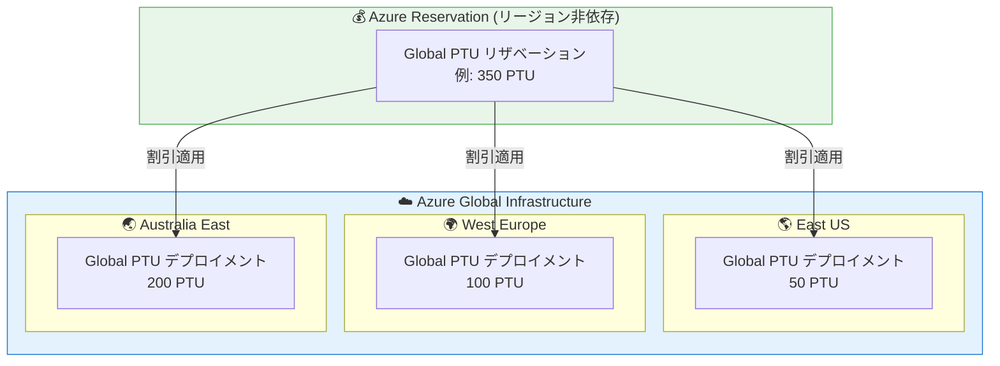

# Microsoft Foundry (Azure OpenAI): Global PTU リザベーション リージョン非依存化

**リリース日**: 2026-06-02

**サービス**: Microsoft Foundry (Azure OpenAI)

**機能**: Global PTU リザベーション リージョン非依存化

**ステータス**: Launched (GA)

[このアップデートのインフォグラフィックを見る](https://takech9203.github.io/azure-news-summary/20260602-global-ptu-region-agnostic.html)

## 概要

Global Provisioned Throughput (PTU) のリザベーションがリージョン非依存 (Region-Agnostic) となり、単一のリザベーションで複数リージョンにまたがる Global PTU デプロイメントをカバーできるようになった。これは Microsoft Build 2026 で発表された一般提供 (GA) のアップデートである。

従来、Azure Reservations は特定のリージョンに紐づいて購入する必要があり、複数リージョンに Global PTU デプロイメントを持つ場合はリージョンごとにリザベーションを個別購入する運用が一般的だった。今回のアップデートにより、Global Provisioned リザベーションはリージョンの制約を受けず、スコープ内の全リージョンの Global PTU デプロイメントに対して自動的に割引が適用される。

**アップデート前の課題**

- 複数リージョンに Global PTU をデプロイしている場合、各リージョンの使用量を個別に把握してリザベーションを購入する必要があった
- リージョン間でワークロードが変動した際に、一部リージョンのリザベーション利用率が低下し、コスト効率が悪化する可能性があった
- リージョン移行やスケール変更時にリザベーションの再購入・キャンセルが必要だった

**アップデート後の改善**

- 単一の Global リザベーションで全リージョンの Global PTU デプロイメントをカバー可能
- リージョン間のワークロード変動に関係なく、合計 PTU 数がリザベーション数量以内であれば全額割引適用
- リザベーション管理の簡素化 (統合購入が可能)

## アーキテクチャ図

単一の Global PTU リザベーション (例: 350 PTU) が、East US (50 PTU)、West Europe (100 PTU)、Australia East (200 PTU) の各リージョンのデプロイメントに対してリージョンを問わず割引を自動適用する構成を示す。

## サービスアップデートの詳細

### 主要機能

1. **リージョン非依存のリザベーション適用**
   - Global Provisioned リザベーションは購入時に指定したリージョンに関係なく、スコープ内の全リージョンの Global PTU デプロイメントに割引が適用される
   - デプロイメントの合計 PTU 数がリザベーション数量以内であれば、全額が割引対象

2. **リザベーションの統合購入**
   - 複数リージョンの Global PTU デプロイメントを 1 つのリザベーションに統合可能
   - 例: East US 50 PTU + West Europe 100 PTU + Australia East 200 PTU = 1 つの 350 PTU リザベーションで全カバー

3. **自動マッチング**
   - リザベーションの割引は、デプロイメントタイプ (Global Provisioned) とスコープ (サブスクリプション/リソースグループ) が一致するデプロイメントに自動適用される
   - リージョンはマッチング条件に含まれない (Global Provisioned の場合)

4. **モデル非依存**
   - リザベーションは特定のモデルに紐づかず、サポートされる全モデルのデプロイメントに適用
   - 新しいモデルを追加しても既存のリザベーションがそのままカバー

## 技術仕様

| 項目 | 詳細 |
|------|------|
| 対象デプロイメントタイプ | Global Provisioned (`GlobalProvisionedManaged`) |
| リザベーション期間 | 1 か月 または 1 年 |
| スコープオプション | リソースグループ / サブスクリプション / 管理グループ / 請求アカウント全体 |
| マッチング条件 | デプロイメントタイプ + スコープ (リージョンは不問) |
| 超過分の課金 | リザベーション数量を超えた PTU は時間課金レートで請求 |
| モデル依存性 | なし (全サポートモデルに適用) |

## 設定方法

### 前提条件

1. Global PTU デプロイメントが作成済みであること (キャパシティの確保が先)
2. Azure Reservations の購入に必要なロール (Reservation Purchaser 以上)
3. 適切なサブスクリプションまたは管理グループへのアクセス権

### Azure Portal

1. [Azure Portal の Reservations ページ](https://portal.azure.com/#view/Microsoft_Azure_Reservations/ReservationsBrowseBlade/productType/Reservations) を開く
2. 「追加」からプロビジョニング済みスループットのリザベーションを選択
3. 製品タイプとして「Global Provisioned」を選択
4. PTU 数量を指定 (全リージョンの Global PTU デプロイメント合計に合わせる)
5. 期間 (1 か月/1 年) とスコープを選択して購入

### 統合リザベーションの例

既存のリージョン別リザベーションを持つ場合:
1. 各リージョンの Global PTU デプロイメント数を合計する
2. 合計 PTU 数で新しい Global リザベーションを 1 つ購入する
3. 既存のリージョン別リザベーションは期間終了時に自動更新を無効化する

## メリット

### ビジネス面

- **コスト最適化**: リージョン間のワークロード変動によるリザベーション未使用分の削減
- **管理簡素化**: 複数リージョン分を 1 つのリザベーションで管理でき、運用負荷を軽減
- **柔軟なスケーリング**: リージョン間のデプロイメント配置変更時にリザベーションの再購入が不要

### 技術面

- **利用率の最大化**: 全リージョンの合計 PTU でマッチングされるため、個別リージョンの変動に強い
- **グローバル展開の容易化**: 新規リージョンへの展開時に追加のリザベーション購入手続きが不要
- **Spillover との併用**: Global PTU のオーバーフローは Standard デプロイメントへ自動ルーティング可能

## デメリット・制約事項

- Data Zone Provisioned および Regional Provisioned のリザベーションには適用されない (従来通りリージョン指定が必要)
- リザベーションはキャパシティを保証しない (デプロイメントの作成が先に必要)
- Global Provisioned と他のデプロイメントタイプ間でのリザベーション交換は不可
- キャンセルや交換には早期終了手数料が発生する場合がある

## ユースケース

### ユースケース 1: グローバル展開の AI アプリケーション

**シナリオ**: 複数リージョン (米国、欧州、アジア太平洋) で AI チャットボットを運用し、各リージョンに Global PTU デプロイメントを配置している企業

**効果**: 1 つのリザベーション購入で全リージョンをカバーでき、リージョン間のトラフィック変動 (タイムゾーン差による日中/夜間の偏り) があっても合計利用率が高ければ割引を最大限活用可能

### ユースケース 2: 段階的なリージョン拡張

**シナリオ**: 最初は East US のみでデプロイしていたが、ユーザー増加に伴い West Europe と Japan East にもデプロイメントを追加するケース

**効果**: 既存の Global リザベーションのスコープを調整するだけで新リージョンのデプロイメントも自動的に割引対象に含まれる。追加のリザベーション購入は合計 PTU がリザベーション数量を超える場合のみ必要

## 料金

Global PTU の料金はモデルファミリーおよび期間に応じた PTU あたりの時間課金制。リザベーション購入により時間課金レートから割引が適用される。

| 課金モード | 概要 |
|------|------|
| 時間課金 (Hourly) | デプロイ中の PTU 数 x 時間単価で課金。短期利用向け |
| 1 か月リザベーション | 1 か月コミットメントで割引レート適用 |
| 1 年リザベーション | 1 年コミットメントで最大割引レート適用 |

具体的な料金については [Azure OpenAI 料金ページ](https://azure.microsoft.com/pricing/details/cognitive-services/openai-service/) または [Azure 料金計算ツール](https://azure.microsoft.com/pricing/calculator/) を参照。

## 利用可能リージョン

Global Provisioned デプロイメントはリクエストがグローバルにルーティングされるため、Azure のグローバルインフラストラクチャ全体で利用可能。リザベーションはリージョン非依存のため、任意のリージョンで購入し全リージョンのデプロイメントに適用できる。

具体的なモデル別の対応リージョンについては [Microsoft Learn のリージョン可用性ドキュメント](https://learn.microsoft.com/azure/foundry/foundry-models/concepts/models-sold-directly-by-azure-region-availability?pivots=provisioned) を参照。

## 関連サービス・機能

- **Microsoft Foundry Models**: Global PTU デプロイメントの基盤となるモデルサービスプラットフォーム
- **Azure Cost Management**: リザベーション利用率の監視、コスト分析、チャージバックに使用
- **Spillover (オーバーフロー制御)**: PTU 容量を超えたリクエストを Standard デプロイメントに自動転送する機能
- **Model Router**: コスト目標とレイテンシ要件に基づいてリクエストを最適なモデルにルーティング
- **Data Zone Provisioned / Regional Provisioned**: データ居住性要件がある場合の代替デプロイメントタイプ (リザベーションはリージョン指定)

## 参考リンク

- [インフォグラフィック](https://takech9203.github.io/azure-news-summary/20260602-global-ptu-region-agnostic.html)
- [公式アップデート情報](https://azure.microsoft.com/updates?id=562657)
- [Azure Blog: A Developer's Guide to Managing Models, Cost and Quality in Microsoft Foundry](https://devblogs.microsoft.com/foundry/build-2026-foundry-models/)
- [Microsoft Learn: Provisioned throughput for Foundry Models](https://learn.microsoft.com/azure/foundry/openai/concepts/provisioned-throughput)
- [Microsoft Learn: Provisioned throughput billing and cost management](https://learn.microsoft.com/azure/foundry/openai/concepts/provisioned-throughput-billing)
- [Azure Reservations for Foundry Provisioned Throughput](https://learn.microsoft.com/azure/cost-management-billing/reservations/microsoft-foundry)
- [料金ページ: Azure OpenAI Service](https://azure.microsoft.com/pricing/details/cognitive-services/openai-service/)

## まとめ

Global PTU リザベーションのリージョン非依存化は、複数リージョンで AI ワークロードを運用する組織にとって大きなコスト最適化の機会を提供する。従来はリージョンごとにリザベーションを個別管理する必要があったが、今後は単一のリザベーションで全リージョンをカバーでき、利用率の向上とオペレーション負荷の削減が期待できる。

**推奨アクション**:
1. 現在のリージョン別 Global PTU リザベーションの利用状況を確認し、統合の余地があるか評価する
2. 新規リザベーション購入時はリージョン非依存の単一リザベーションへの統合を検討する
3. Microsoft Cost Management でリザベーション利用率を定期的にモニタリングする

---

**タグ**: #Azure #MicrosoftFoundry #AzureOpenAI #PTU #ProvisionedThroughput #Reservations #CostOptimization #Build2026 #GA
