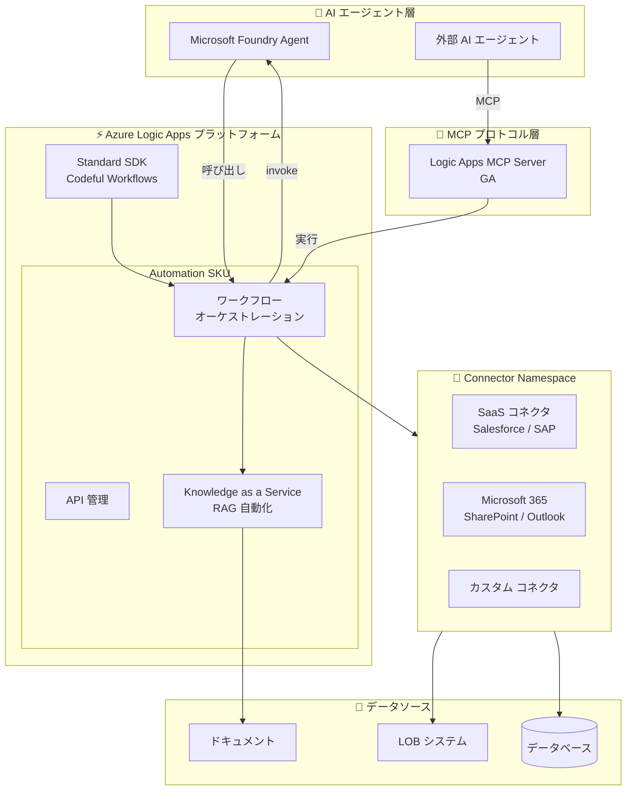

# Azure Logic Apps: Build 2026 - MCP・エージェント統合とプロセス自動化

**リリース日**: 2026-06-02

**サービス**: Azure Logic Apps

**機能**: Build 2026 - MCP・エージェント統合とプロセス自動化

**ステータス**: Launched (GA) / In preview

[このアップデートのインフォグラフィックを見る](https://takech9203.github.io/azure-news-summary/20260602-logic-apps-build-2026-updates.html)

## 概要

Microsoft Build 2026 において、Azure Logic Apps に AI エージェント時代に向けた大規模なアップデートが発表された。MCP (Model Context Protocol) サーバーの GA、Microsoft Foundry エージェントとの直接統合、Knowledge as a Service による RAG の簡素化、エージェンティック自動化向けの新しい Automation SKU、Connector Namespace、およびコードベースのワークフロー開発を可能にする Standard SDK の計 6 項目が発表されている。

これらのアップデートは、AI エージェントとビジネスプロセス自動化の融合を促進するもので、Logic Apps を「AI エージェントのためのオーケストレーションプラットフォーム」として位置づける戦略的な方向性を示している。特に MCP サーバーの GA は、既存のワークフローを AI エージェントから直接呼び出し可能にすることで、エージェント統合の開発負荷を大幅に軽減する。

**アップデート前の課題**

- AI エージェントから既存のワークフローを呼び出すために、カスタム API レイヤーの構築・維持が必要だった
- エージェント構築 (AI Foundry) とビジネスプロセス自動化 (Logic Apps) が分断されており、統合が困難だった
- RAG 実装には取り込みパイプライン、チャンキング、エンベディング、ベクトルストアの構築・運用が必要だった
- ワークフロー、API、AI エージェントを本番環境で統合するために複数の Azure サービスを組み合わせる必要があった
- SaaS/LOB システムとの連携にカスタム API クライアントコード、認証管理、リトライ処理の実装が必要だった
- コードでワークフローを記述したい開発者が、マネージドオーケストレーションやエンタープライズコネクタの恩恵を受けにくかった

**アップデート後の改善**

- MCP サーバーにより既存ワークフローが AI エージェントから標準プロトコルで直接呼び出し可能に (GA)
- Logic Apps ワークフロー内から Microsoft Foundry エージェントを直接呼び出し、オーケストレーションが可能に
- Knowledge as a Service により、カスタム RAG パイプラインなしでドキュメントをナレッジベース化可能に
- Automation SKU でワークフロー、API、AI エージェントを単一プラットフォームで統合可能に
- Connector Namespace によりプリビルトコネクタがフルマネージドサービスとして任意の Azure コンピュートから利用可能に
- Standard SDK によりコードベースでワークフローを記述しながらマネージドオーケストレーション機能を活用可能に

## アーキテクチャ図

Logic Apps が MCP サーバーを通じて AI エージェントのツールとして機能する一方、ワークフローから Foundry エージェントを呼び出す双方向の統合アーキテクチャを実現している。Automation SKU がこれらの機能を統合プラットフォームとして提供する。

## サービスアップデートの詳細

### 1. Azure Logic Apps MCP Server (GA)

**ステータス**: Generally Available

AI エージェントや MCP ベースのツールを導入する組織が、既存のワークフローをエージェントから呼び出し可能にするためにカスタム API レイヤーを構築・維持する必要があったが、MCP サーバーにより標準化されたプロトコルで既存ワークフローを直接公開できるようになった。

- **主要機能**: 既存の Logic Apps ワークフローを MCP 互換エンドポイントとして公開
- **利点**: カスタム API プラミングが不要になり、開発工数と運用複雑性を削減
- **対象**: MCP ベースのツールや AI エージェントを活用するインテグレーションチーム

### 2. Microsoft Foundry エージェント統合 (Preview)

**ステータス**: Public Preview

Azure AI Foundry で構築したエージェントを Logic Apps ワークフローから直接呼び出し可能になった。エージェント構築とビジネスプロセス自動化の分断を解消する。

- **主要機能**: ワークフロー内から Foundry エージェントを直接 invoke するアクション
- **利点**: Foundry でインテリジェンスを構築し、Logic Apps でオーケストレーションと自動化を実現する分業モデル
- **コンセプト**: 「Foundry brings the intelligence; Logic Apps brings the automation and orchestration」

### 3. Knowledge as a Service (Preview)

**ステータス**: Public Preview

従来複雑だった RAG (Retrieval-Augmented Generation) 実装を Logic Apps でネイティブに実現する機能。取り込みパイプライン、チャンキング、エンベディング、ベクトルストア、検索レイヤーの構築・運用をすべて抽象化する。

- **主要機能**: ドキュメントからナレッジベースを自動構築し、すぐに利用可能な状態で提供
- **利点**: カスタム RAG パイプラインの構築なしに、ドキュメントを AI エージェントが利用可能なナレッジベースに変換
- **対象**: エンタープライズドキュメントの AI 活用を迅速に始めたい組織

### 4. Automation SKU (Preview)

**ステータス**: Public Preview

エージェンティック自動化に向けた新しい SKU。ワークフロー、API、AI エージェントを本番環境対応のビジネスプロセスとして統合するための単一プラットフォームを提供する。

- **主要機能**: ワークフロー + API + AI エージェントを統合した包括的な自動化プラットフォーム
- **利点**: 複数の Azure サービスを組み合わせる必要がなくなり、エージェンティック自動化のエントリーバリアを低減
- **コンセプト**: 「Low barrier to entry. Built for production.」

### 5. Connector Namespace (Preview)

**ステータス**: Public Preview

SaaS や LOB システムとの連携において、カスタム API クライアントコード、認証管理、リトライ・ページネーション・Webhook 処理を個別に実装する必要があった課題を解消する。

- **主要機能**: プリビルトコネクタをフルマネージドサービスとして提供し、任意の Azure コンピュートから利用可能に
- **利点**: SharePoint、Salesforce、SAP、Outlook などとの統合を標準化し、コネクタのインフラ管理が不要に
- **対象**: Logic Apps 以外のコンピュート (Azure Functions、Container Apps など) からもコネクタを利用したい開発者

### 6. Codeful Workflows / Standard SDK (Preview)

**ステータス**: Public Preview

コードでワークフローを直接記述しながら、マネージドオーケストレーション、エンタープライズコネクタ、クラウドスケールの運用機能を活用できるようにする SDK。

- **主要機能**: コードファーストのワークフロー開発が可能な Logic Apps Standard SDK
- **利点**: 従来のビジュアルデザイナーに加え、プログラマティックなワークフロー定義が可能に
- **対象**: 柔軟性とコード管理を重視するモダンなインテグレーション・自動化チーム

## 技術仕様

| 項目 | 詳細 |
|------|------|
| MCP Server ステータス | Generally Available |
| Foundry エージェント統合 | Public Preview |
| Knowledge as a Service | Public Preview |
| Automation SKU | Public Preview |
| Connector Namespace | Public Preview |
| Codeful Workflows SDK | Public Preview |
| MCP プロトコル | Model Context Protocol (標準仕様) |
| 対象プラットフォーム | Logic Apps Standard |
| 発表イベント | Microsoft Build 2026 |

## メリット

### ビジネス面

- AI エージェントと既存ビジネスプロセスの統合が大幅に簡素化され、Time-to-Value が短縮
- RAG 実装の複雑性が排除され、ドキュメント活用の AI ソリューションを迅速に構築可能
- Automation SKU により、エージェンティック自動化のエントリーバリアが低減
- 既存のワークフロー資産を MCP 経由で AI エージェントから再利用可能

### 技術面

- MCP 標準プロトコルにより、カスタム API レイヤーの構築・維持が不要
- Connector Namespace により、任意のコンピュートからプリビルトコネクタを利用可能
- Standard SDK によりコードベースのワークフロー開発とマネージドオーケストレーションの両立
- Foundry エージェントとの双方向統合 (呼び出し/呼び出され) で柔軟なアーキテクチャ設計

## デメリット・制約事項

- 6 機能中 5 機能がパブリックプレビュー段階であり、本番環境での利用には SLA や機能変更のリスクを考慮する必要がある
- MCP サーバー (GA) 以外は Preview のため、GA 時に仕様変更の可能性がある
- Automation SKU の具体的な料金体系は現時点で未公開
- Knowledge as a Service の対応ドキュメント形式やサイズ制限は詳細ドキュメントの確認が必要
- Connector Namespace の対応コネクタ数や利用可能リージョンは段階的に拡大される可能性がある

## ユースケース

### ユースケース 1: AI エージェントによる業務プロセス自動化

**シナリオ**: カスタマーサポート AI エージェントが顧客の問い合わせに基づき、既存の承認ワークフローや注文処理フローを自動的に呼び出す。

**構成**:
- Microsoft Foundry で構築したカスタマーサポートエージェント
- MCP サーバー経由で公開された既存の Logic Apps ワークフロー (注文処理、返品処理、エスカレーション)
- Knowledge as a Service で構築した製品マニュアルのナレッジベース

**効果**: エージェントが顧客対応からバックエンド処理まで一気通貫で自動化。カスタム API 開発なしに既存資産を活用可能。

### ユースケース 2: エンタープライズ RAG の迅速な構築

**シナリオ**: 社内ドキュメント (規程、マニュアル、FAQ) を AI エージェントが参照可能なナレッジベースとして活用する。

**構成**:
- Knowledge as a Service でドキュメントを自動的にナレッジベース化
- Foundry エージェントから Logic Apps ワークフロー経由でナレッジを検索
- 回答生成と承認フローの組み合わせ

**効果**: カスタムの取り込みパイプライン、ベクトルストア構築なしに、数時間でエンタープライズ RAG を実現。

### ユースケース 3: マルチシステム統合の簡素化

**シナリオ**: Azure Functions や Container Apps 上で動作するマイクロサービスから、Salesforce、SAP、SharePoint などの SaaS/LOB システムと連携する。

**構成**:
- Connector Namespace を使用して、任意のコンピュートからプリビルトコネクタにアクセス
- Standard SDK でコードベースのワークフロー定義
- Automation SKU で統合的な運用管理

**効果**: 各サービスごとのカスタム API クライアント実装が不要になり、認証・リトライ・ページネーションをマネージドサービスに委任。

## 関連サービス・機能

- **Microsoft Foundry (Azure AI Foundry)**: AI エージェントの構築プラットフォーム。Logic Apps との双方向統合により、インテリジェンスとオーケストレーションの分業を実現
- **Azure API Management**: MCP サーバーとの連携、API Center によるエンタープライズ全体の API/AI アセット発見
- **Azure Functions / Container Apps**: Connector Namespace により Logic Apps コネクタを利用可能なコンピュートプラットフォーム
- **Azure AI Search**: Knowledge as a Service の内部でベクトル検索に活用される可能性のある関連サービス

## 参考リンク

- [インフォグラフィック](https://takech9203.github.io/azure-news-summary/20260602-logic-apps-build-2026-updates.html)
- [MCP Server - 公式アップデート](https://azure.microsoft.com/updates?id=562868)
- [Foundry エージェント統合 - 公式アップデート](https://azure.microsoft.com/updates?id=562939)
- [Knowledge as a Service - 公式アップデート](https://azure.microsoft.com/updates?id=562929)
- [Automation SKU - 公式アップデート](https://azure.microsoft.com/updates?id=562924)
- [Connector Namespace - 公式アップデート](https://azure.microsoft.com/updates?id=562874)
- [Codeful Workflows SDK - 公式アップデート](https://azure.microsoft.com/updates?id=562863)
- [What's new in Azure Logic Apps at Microsoft Build 2026 (Tech Community Blog)](https://techcommunity.microsoft.com/blog/integrationsonazureblog/whats-new-in-azure-logic-apps-at-microsoft-build-2026/4524685)
- [Meet Azure Logic Apps Automation (Tech Community Blog)](https://techcommunity.microsoft.com/blog/integrationsonazureblog/🎉-automation-just-became-a-team-sport-meet-azure-logic-apps-automation-/4524555)
- [Knowledge as a Service (Tech Community Blog)](https://techcommunity.microsoft.com/blog/integrationsonazureblog/📢-announcing-knowledge-as-a-service-for-azure-logic-apps/4524601)
- [Foundry + Logic Apps (Tech Community Blog)](https://techcommunity.microsoft.com/blog/integrationsonazureblog/better-together-build-agents-in-microsoft-foundry-automate-them-with-azure-logic/4524557)
- [Connector Namespace (Tech Community Blog)](https://techcommunity.microsoft.com/blog/integrationsonazureblog/azure-connector-namespaces-managed-integration-for-any-azure-compute/4524250)

## まとめ

Build 2026 での Azure Logic Apps のアップデートは、同サービスを「AI エージェント時代のビジネスプロセス自動化プラットフォーム」として明確に位置づける戦略的なリリースである。MCP サーバーの GA により既存ワークフローを AI エージェントのツールとして公開する基盤が整い、Foundry エージェント統合で双方向のオーケストレーションが可能になった。

Solutions Architect への推奨アクション:
1. **即時検討**: MCP サーバー (GA) を活用し、既存の Logic Apps ワークフローを AI エージェントから呼び出し可能にする設計を検討
2. **PoC 推奨**: Automation SKU と Knowledge as a Service を組み合わせたエージェンティック自動化の PoC を計画
3. **アーキテクチャ見直し**: Connector Namespace により、Logic Apps 以外のコンピュートからもコネクタを利用する統合アーキテクチャを検討
4. **開発体験の向上**: コード管理を重視するチームは Standard SDK による Codeful Workflows を評価

---

**タグ**: #Azure #LogicApps #MCP #AIAgents #Automation #Build2026 #Integration #Foundry #RAG #Preview #GA
