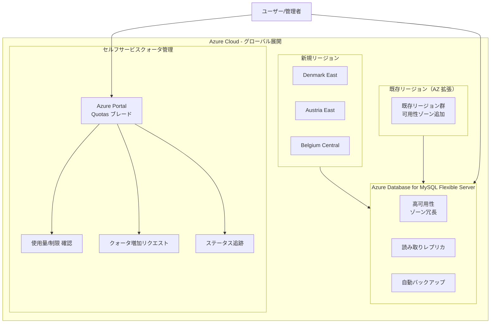

# Azure Database for MySQL: 新リージョン展開とセルフサービスクォータ管理

**リリース日**: 2026-06-02

**サービス**: Azure Database for MySQL

**機能**: 新リージョン展開とセルフサービスクォータ管理

**ステータス**: Launched (GA)

[このアップデートのインフォグラフィックを見る](https://takech9203.github.io/azure-news-summary/20260602-mysql-regions-quota.html)

## 概要

Microsoft Build 2026 にて、Azure Database for MySQL Flexible Server に関する 2 つの重要なアップデートが発表されました。新リージョンへの展開と可用性ゾーンの拡張、およびセルフサービスクォータ管理エクスペリエンスの一般提供開始です。

Azure Database for MySQL Flexible Server のグローバルフットプリントが拡大され、Denmark East、Austria East、Belgium Central の新リージョンで利用可能になりました。また、既存リージョンでの可用性ゾーンサポートも強化されています。

セルフサービスクォータ管理では、Azure Portal の Azure Quotas ブレードを通じて、現在のクォータ使用量と制限の確認、クォータ増加のリクエスト、リクエストステータスの追跡が可能になりました。サポートチケットを起票することなく、より迅速かつ透明性の高いクォータ管理が実現されます。

**アップデート前の課題**

- 一部の地域（北欧、中東欧など）で Azure Database for MySQL Flexible Server が利用できず、データレジデンシー要件を満たせない場合があった
- クォータの増加にはサポートチケットの作成が必要で、承認までに時間がかかっていた
- クォータの現在の使用状況や制限を簡単に確認する手段が限られていた

**アップデート後の改善**

- Denmark East、Austria East、Belgium Central リージョンでのデプロイが可能になり、EU データレジデンシー要件への対応が強化
- 可用性ゾーンの拡張により、高可用性構成のオプションが増加
- Azure Portal から直接クォータの確認・増加リクエストが可能に
- クォータリクエストのステータスをリアルタイムで追跡可能

## アーキテクチャ図



この図は、新リージョンへの展開と既存リージョンでの可用性ゾーン拡張、およびセルフサービスクォータ管理のワークフローを示しています。

## サービスアップデートの詳細

### 主要機能

1. **新リージョンでの一般提供**
   - Denmark East リージョンでの Azure Database for MySQL Flexible Server 利用開始
   - Austria East リージョンでの Azure Database for MySQL Flexible Server 利用開始
   - Belgium Central リージョンでの Azure Database for MySQL Flexible Server 利用開始

2. **可用性ゾーンの拡張**
   - 既存リージョンでの可用性ゾーンサポートの強化
   - ゾーン冗長高可用性構成の選択肢が拡大
   - 障害ドメインの分離による耐障害性の向上

3. **セルフサービスクォータ管理**
   - Azure Portal の Azure Quotas ブレードからクォータを管理
   - 現在のクォータ使用量と制限をリアルタイムで確認
   - サポートチケット不要のクォータ増加リクエスト
   - リクエストステータスのリアルタイム追跡

## 技術仕様

| 項目 | 詳細 |
|------|------|
| サービスタイプ | Azure Database for MySQL Flexible Server |
| 新規リージョン | Denmark East, Austria East, Belgium Central |
| 高可用性 | ゾーン冗長 HA 対応 |
| クォータ管理方法 | Azure Portal (Azure Quotas ブレード) |
| ステータス | 一般提供 (GA) |
| 発表イベント | Microsoft Build 2026 |

## 設定方法

### 前提条件

1. アクティブな Azure サブスクリプション
2. 対象リージョンへのデプロイ権限
3. 適切なリソースプロバイダー (Microsoft.DBforMySQL) の登録

### Azure CLI - 新リージョンでのデプロイ

```bash
# Denmark East リージョンに MySQL Flexible Server を作成
az mysql flexible-server create \
  --resource-group <RESOURCE_GROUP> \
  --name <SERVER_NAME> \
  --location "denmarkeast" \
  --admin-user <ADMIN_USER> \
  --admin-password <ADMIN_PASSWORD> \
  --sku-name Standard_D2ds_v4 \
  --tier GeneralPurpose \
  --high-availability ZoneRedundant \
  --zone 1 \
  --standby-zone 2
```

### Azure Portal - クォータ管理

1. Azure Portal にサインイン
2. **Azure Quotas** ブレードに移動（検索バーで「Quotas」と入力）
3. **Azure Database for MySQL** を選択
4. 現在の使用量と制限が一覧表示される
5. 増加が必要なクォータの行で **Request increase** をクリック
6. 必要な新しい制限値を入力し、リクエストを送信
7. **My requests** タブでリクエストのステータスを追跡

## メリット

### ビジネス面

- **EU データレジデンシーへの対応強化**: Denmark East、Austria East、Belgium Central の追加により、EU 圏内でのデータ保管オプションが拡充
- **運用効率の向上**: セルフサービスクォータ管理により、サポートチケットの待機時間を削減
- **迅速なスケーリング**: クォータ増加のリクエストが即座に可能になり、ビジネス成長への対応が迅速化
- **コンプライアンス対応の容易化**: 新リージョンの追加により、地域固有のデータ規制への対応が容易に

### 技術面

- **高可用性の選択肢拡大**: 新リージョンでもゾーン冗長 HA を利用可能
- **レイテンシの低減**: ユーザーに近いリージョンを選択可能に
- **セルフサービス運用**: 開発・テスト環境のクォータ調整を開発者自身が実施可能
- **可視性の向上**: クォータの使用状況をリアルタイムで把握

## デメリット・制約事項

- 新リージョンでは初期段階のため、一部の SKU やインスタンスタイプが利用できない可能性がある
- セルフサービスクォータ増加には上限があり、大幅な増加にはサポートチケットが必要な場合がある
- 新リージョンへの移行には、既存のネットワーク構成（VNet、Private Link など）の再設定が必要

## ユースケース

### ユースケース 1: EU データレジデンシー要件への対応

**シナリオ**: 欧州の顧客データを EU 圏内に保管する法的要件がある企業が、デンマークやオーストリアの顧客に低レイテンシでサービスを提供したい場合。

**実装例**:

```bash
# Denmark East にゾーン冗長 HA 構成で MySQL サーバーをデプロイ
az mysql flexible-server create \
  --resource-group rg-eu-production \
  --name mysql-dk-prod \
  --location "denmarkeast" \
  --sku-name Standard_D4ds_v4 \
  --tier GeneralPurpose \
  --high-availability ZoneRedundant \
  --storage-size 256
```

**効果**: デンマーク国内でのデータ保管により GDPR 準拠を確保しつつ、北欧ユーザーへの低レイテンシアクセスを実現。

### ユースケース 2: 開発環境の迅速なスケーリング

**シナリオ**: 開発チームが新プロジェクト開始時にクォータ不足でデプロイできない問題を、サポートチケットなしで即座に解決したい場合。

**効果**: Azure Quotas ブレードからの即時クォータ確認・増加リクエストにより、開発着手までのリードタイムを大幅に短縮。

## 利用可能リージョン

**新規追加リージョン:**
- Denmark East
- Austria East
- Belgium Central

**既存リージョン（可用性ゾーン拡張）:**
- その他の既存リージョンでも可用性ゾーンのサポートが拡張

全リージョン一覧は [Azure Database for MySQL のリージョン可用性ページ](https://learn.microsoft.com/en-us/azure/mysql/flexible-server/overview#azure-regions) を参照してください。

## 関連サービス・機能

- **Azure Database for MySQL Flexible Server**: 本アップデートの対象サービス。マネージド MySQL データベースサービス
- **Azure Quotas**: セルフサービスクォータ管理の基盤サービス
- **Azure Availability Zones**: ゾーン冗長高可用性を支える物理的に分離されたデータセンター
- **Azure Private Link**: プライベートネットワーク経由での MySQL サーバーへの接続

## 参考リンク

- [インフォグラフィック](https://takech9203.github.io/azure-news-summary/20260602-mysql-regions-quota.html)
- [公式アップデート情報 - 新リージョン展開](https://azure.microsoft.com/updates?id=563152)
- [公式アップデート情報 - クォータ管理](https://azure.microsoft.com/updates?id=563147)
- [Azure Database for MySQL Flexible Server ドキュメント](https://learn.microsoft.com/en-us/azure/mysql/flexible-server/)
- [Azure Quotas ドキュメント](https://learn.microsoft.com/en-us/azure/quotas/)

## まとめ

Azure Database for MySQL Flexible Server の新リージョン展開（Denmark East、Austria East、Belgium Central）とセルフサービスクォータ管理の GA は、グローバル展開と運用効率の両面で重要なアップデートです。

EU 圏内の新リージョン追加により、欧州のデータレジデンシー要件への対応オプションが大幅に拡充されました。特に北欧・中欧地域の顧客にサービスを提供する企業にとって、データ主権を確保しながらレイテンシを最小化できる選択肢が増えたことは大きなメリットです。

セルフサービスクォータ管理により、従来サポートチケットが必要だったクォータ増加が Azure Portal から直接リクエスト可能になり、開発・運用のリードタイムが短縮されます。特に急速にスケールするワークロードを持つ組織にとって、迅速なリソース確保が可能になる重要な改善です。

---

**タグ**: #AzureDatabaseForMySQL #FlexibleServer #NewRegions #QuotaManagement #HighAvailability #GA #MicrosoftBuild #EU #DataResidency #Databases
