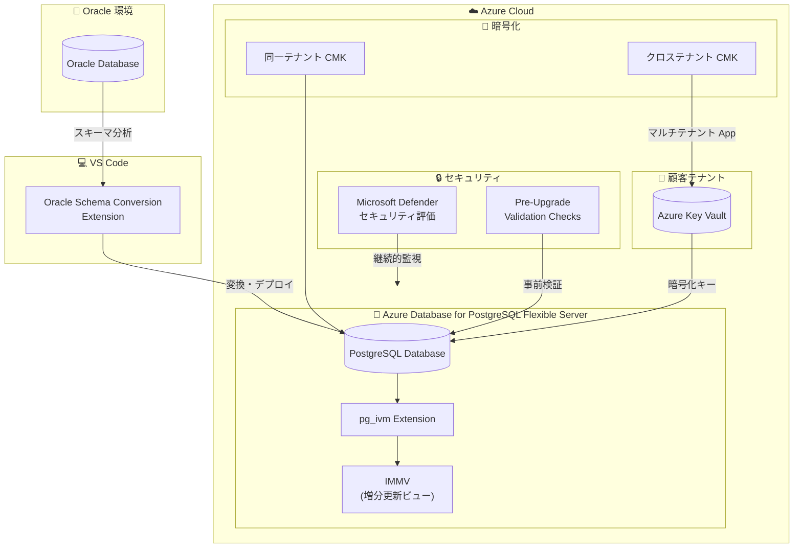

# Azure Database for PostgreSQL: Build 2026 - Oracle 移行ツール・pg_ivm とセキュリティ強化

**リリース日**: 2026-06-02

**サービス**: Azure Database for PostgreSQL

**機能**: Build 2026 - Oracle 移行ツール・pg_ivm とセキュリティ強化

**ステータス**: Launched (GA) / In preview (混合)

[このアップデートのインフォグラフィックを見る](https://takech9203.github.io/azure-news-summary/20260602-postgresql-build-2026-updates.html)

## 概要

Microsoft Build 2026 にて、Azure Database for PostgreSQL に関する 5 つの重要なアップデートが発表された。GA として Oracle スキーマ変換ツール (VS Code 拡張機能) と pg_ivm (Incremental View Maintenance) 拡張機能が正式リリースされ、プレビューとしてアップグレード前検証チェック、Microsoft Defender セキュリティ評価、クロステナント顧客管理キー (CMK) の 3 機能が公開された。

これらのアップデートは、Oracle からの移行加速、マテリアライズドビューのパフォーマンス改善、メジャーバージョンアップグレードの安全性向上、セキュリティ体制の強化、マルチテナント環境での暗号化柔軟性の向上という、Azure Database for PostgreSQL の主要な改善領域を包括的にカバーしている。

**アップデート前の課題**

- Oracle から PostgreSQL への移行時、スキーマ変換に専用ツール (Ora2Pg 等) の導入・手動調整が必要で工数が大きかった
- マテリアライズドビューの更新には `REFRESH MATERIALIZED VIEW` でビュー全体を再計算する必要があり、大規模データでは高コストだった
- メジャーバージョンアップグレードで互換性問題が発見されるのはアップグレード実行中のため、ダウンタイムが予想外に延びるリスクがあった
- PostgreSQL のセキュリティ評価を手動で実施する必要があり、脆弱な構成の見落としリスクがあった
- マルチテナント SaaS 環境で顧客のテナントに保管された暗号化キーを使用できなかった

**アップデート後の改善**

- VS Code 内で Oracle スキーマを直接分析・変換でき、PostgreSQL 互換スキーマへの移行がシームレスになった
- pg_ivm により差分のみの増分更新が可能になり、マテリアライズドビューの更新コストが大幅に削減された
- アップグレード前検証チェックにより、互換性問題を事前に検出・対処でき、計画的なアップグレードが可能になった
- Microsoft Defender がセキュリティ評価を自動実行し、構成の脆弱性を継続的に検出・通知するようになった
- ISV/SaaS プロバイダーが顧客テナントの Key Vault に保管されたキーでデータを暗号化できるようになった

## アーキテクチャ図



この図は Build 2026 で発表された 5 つの機能が Azure Database for PostgreSQL エコシステム全体でどのように配置されるかを示している。Oracle 移行、クエリパフォーマンス (pg_ivm)、運用管理 (PVC)、セキュリティ (Defender、クロステナント CMK) の各領域をカバーしている。

## サービスアップデートの詳細

### GA: Oracle スキーマ変換 (VS Code 拡張機能)

1. **Visual Studio Code での Oracle スキーマ変換**
   - VS Code 内で Oracle データベースに接続し、スキーマオブジェクトを分析
   - Oracle スキーマを Azure Database for PostgreSQL 互換のスキーマに自動変換
   - Azure Database for PostgreSQL の Migration Service と連携し、スキーマとデータの移行をシームレスに実行
   - 変換レポートにより、手動対応が必要な箇所を明確に提示

2. **Migration Service との統合**
   - Azure Database for PostgreSQL Migration Service は、スキーマとデータの両方の移行をサポート
   - オフライン移行 (一括コピー) とオンライン移行 (最小ダウンタイム) の両方に対応
   - データサイズの制限なし

### GA: pg_ivm 拡張機能 (Incremental View Maintenance)

1. **増分ビューメンテナンス (IVM)**
   - ベーステーブルの変更時に AFTER トリガーでマテリアライズドビューを即座に増分更新
   - `REFRESH MATERIALIZED VIEW` のような全体再計算が不要
   - Incrementally Maintainable Materialized View (IMMV) として新しいビュータイプを提供

2. **主要関数**
   - `pgivm.create_immv(immv_name, view_definition)`: IMMV の作成と初期データ投入
   - `pgivm.refresh_immv(immv_name, with_data)`: 完全リフレッシュ (必要時)
   - `pgivm.get_immv_def(immv)`: IMMV の定義クエリを取得

3. **サポートされるクエリ構文**
   - INNER JOIN / OUTER JOIN (セルフジョインを含む)
   - 集約関数: `count`, `sum`, `avg`, `min`, `max`
   - DISTINCT 句
   - サブクエリ (FROM 句の単純サブクエリ、WHERE 句の EXISTS サブクエリ)
   - CTE (非再帰的 WITH クエリ)

### Preview: アップグレード前検証チェック (Pre-Upgrade Validation Checks)

1. **検証内容**
   - サポートされていない拡張機能の検出
   - 論理レプリケーションスロットの検出
   - 準備済みトランザクションの確認
   - イベントトリガーの検出
   - サポートされていないオブジェクト依存関係の確認
   - 再起動が必要な構成変更の検出

2. **検証結果**
   - **問題なし**: アップグレードをブロックする問題が検出されなかった場合
   - **ブロッキング問題検出**: アップグレード前に解決が必要な問題が特定された場合

3. **特徴**
   - サーバーバージョンの変更、ダウンタイム、再起動を伴わない
   - 同じ検証はメジャーバージョンアップグレードワークフロー中にも自動実行される
   - 本番アップグレード前の実行を強く推奨

### Preview: Microsoft Defender セキュリティ評価

1. **保護対象**
   - Azure Database for PostgreSQL Flexible Server (全価格帯)
   - 異常なデータベースアクセスパターンの検出
   - 不審なデータベースアクティビティの検出

2. **アラートタイプ**
   - ブルートフォース攻撃 (成功・失敗の区別を含む)
   - 侵害されたコンピュータからのアクセス
   - MITRE ATT&CK タクティクスとの関連付け

### Preview: クロステナント顧客管理キー (Cross-Tenant CMK)

1. **マルチテナント構成**
   - ISV テナント: マルチテナントアプリケーションを作成し、ユーザー割り当てマネージド ID をフェデレーション資格情報として構成
   - 顧客テナント: マルチテナントアプリケーションをインストールし、Key Vault でキーのアクセス許可を付与
   - ISV テナント上の PostgreSQL インスタンスが顧客テナントの Key Vault のキーを使用してデータを暗号化

2. **自動キーバージョン更新**
   - バージョンレス キー URI を使用することで、キーローテーション時の自動更新が可能
   - Key Vault の自動ローテーション機能との組み合わせでライフサイクル管理を簡素化

## 技術仕様

| 項目 | 詳細 |
|------|------|
| Oracle スキーマ変換 | VS Code 拡張機能、Azure Migration Service 連携 |
| pg_ivm 対応バージョン | PostgreSQL 13, 14, 15, 16, 17, 18 |
| pg_ivm ロック方式 | ExclusiveLock (READ COMMITTED 分離レベル) |
| PVC 前提条件 | サーバーステータスが Ready であること |
| PVC 制限事項 | リードレプリカ非対応、他の操作中は実行不可 |
| Defender 対応 | Flexible Server 全価格帯 |
| クロステナント CMK API バージョン | 2025-03-15-privatepreview 以降 |
| クロステナント CMK 対応リージョン | East US 2, West US 2, US Central, Australia Southeast, Australia East, North Europe |
| キーサイズ (CMK) | RSA/RSA-HSM 2048, 3072, 4096 ビット |

## 設定方法

### pg_ivm の有効化

#### 前提条件

1. Azure Database for PostgreSQL Flexible Server インスタンス
2. `azure.extensions` パラメータで `pg_ivm` を許可リストに追加

#### Azure CLI

```bash
# pg_ivm を拡張機能許可リストに追加
az postgres flexible-server parameter set \
  --resource-group <resource_group> \
  --server-name <server> \
  --name azure.extensions \
  --value pg_ivm

# サーバーに接続して拡張機能を作成
psql -h <server>.postgres.database.azure.com -U <admin> -d <database>
```

```sql
-- pg_ivm 拡張機能を作成
CREATE EXTENSION pg_ivm;

-- IMMV (増分メンテナンスマテリアライズドビュー) を作成
SELECT pgivm.create_immv('sales_summary',
  'SELECT product_id, SUM(amount) as total_amount, COUNT(*) as order_count
   FROM orders GROUP BY product_id');

-- ベーステーブルへの挿入で IMMV が自動更新される
INSERT INTO orders (product_id, amount) VALUES (1, 100.00);
SELECT * FROM sales_summary; -- 即座に反映
```

### Pre-Upgrade Validation Checks の実行

#### Azure Portal

1. Azure Database for PostgreSQL Flexible Server のリソースページに移動
2. メジャーバージョンアップグレードの設定画面で「検証の実行」を選択
3. 検証結果を確認し、ブロッキング問題がある場合は解決

### クロステナント CMK の構成

#### ISV テナント側

```bash
# ユーザー割り当てマネージド ID の作成
az identity create \
  --resource-group <rg> \
  --name <umi-name>

# マルチテナントアプリケーション登録後、フェデレーション資格情報を構成
```

#### 顧客テナント側

```bash
# Key Vault でキーのアクセス許可を付与
# マルチテナントアプリケーションに Key Vault Crypto Service Encryption User ロールを割り当て
az role assignment create \
  --role "Key Vault Crypto Service Encryption User" \
  --assignee <app-client-id> \
  --scope /subscriptions/<sub>/resourceGroups/<rg>/providers/Microsoft.KeyVault/vaults/<vault-name>
```

## メリット

### ビジネス面

- Oracle から Azure PostgreSQL への移行障壁が大幅に低下し、クラウド移行プロジェクトの工期短縮が可能
- pg_ivm によりリアルタイムダッシュボードや分析ワークロードのパフォーマンスが向上し、ユーザー体験を改善
- ISV/SaaS プロバイダーが顧客のコンプライアンス要件 (キーの管理権限を顧客が保持) を満たしながらサービスを提供可能
- Defender 統合により、セキュリティ監査・コンプライアンスレポートの自動化が可能

### 技術面

- pg_ivm はベーステーブル変更時に差分のみを適用するため、大規模テーブルでの全体再計算を回避
- PVC によりアップグレード前に互換性問題を非破壊的に検出でき、計画的な対処が可能
- クロステナント CMK はバージョンレス キー URI に対応し、自動キーローテーションをサポート
- Oracle スキーマ変換ツールが VS Code に統合されたことで、開発者の既存ワークフローに自然に組み込み可能

## デメリット・制約事項

- **pg_ivm の制約**: ウィンドウ関数、HAVING、ORDER BY、LIMIT/OFFSET、UNION/INTERSECT/EXCEPT はサポートされない。ベーステーブルは単純テーブルのみ (ビュー、外部テーブル、パーティションテーブルは不可)
- **pg_ivm のパフォーマンス特性**: ベーステーブルの変更速度が低下するトレードオフがある。大量の一括変更時は増分メンテナンスを一時無効化する運用が推奨
- **PVC の制限**: リードレプリカでは実行不可。他のサーバー操作中は実行不可
- **クロステナント CMK のリージョン制限**: プレビュー期間中は 6 リージョンのみ対応
- **クロステナント CMK の制限**: Azure PowerShell/CLI 未対応、geo-redundant バックアップとの併用不可
- **CMK 全般**: サーバー作成時にのみ構成可能。後から CMK への変更は不可 (PITR で新サーバーに復元する必要あり)

## ユースケース

### ユースケース 1: Oracle データベースの Azure PostgreSQL 移行

**シナリオ**: 金融機関が基幹業務システムの Oracle データベースを Azure Database for PostgreSQL に移行したい。

**実装例**:

```bash
# 1. VS Code で Oracle Schema Conversion 拡張機能をインストール
# 2. Oracle データベースに接続してスキーマを分析
# 3. 変換レポートを確認し、手動対応箇所を修正
# 4. Azure Database for PostgreSQL Migration Service でデータ移行を実行

# Migration Service によるオンライン移行の開始
az postgres flexible-server migration create \
  --resource-group <rg> \
  --name <server> \
  --migration-name oracle-migration-01 \
  --properties @migration-config.json
```

**効果**: スキーマ変換の工数削減により、移行プロジェクト全体のタイムラインを短縮。VS Code 統合により開発者が使い慣れた環境で作業可能。

### ユースケース 2: リアルタイム集計ダッシュボードの高速化

**シナリオ**: EC サイトの売上ダッシュボードで、注文テーブルの集計ビューを頻繁に参照しているが、REFRESH MATERIALIZED VIEW のコストが高い。

**実装例**:

```sql
-- pg_ivm を使用した増分更新ビューの作成
SELECT pgivm.create_immv('daily_sales_summary',
  'SELECT date_trunc(''day'', order_date) as sale_date,
          category_id,
          SUM(total_amount) as revenue,
          COUNT(*) as order_count
   FROM orders
   INNER JOIN order_items ON orders.id = order_items.order_id
   GROUP BY date_trunc(''day'', order_date), category_id');

-- 注文が追加されるたびにビューが自動的に増分更新される
-- REFRESH MATERIALIZED VIEW の定期実行が不要に
```

**効果**: ダッシュボードのデータ鮮度がリアルタイムに向上し、全体再計算に伴う負荷スパイクが解消される。

### ユースケース 3: マルチテナント SaaS のコンプライアンス対応

**シナリオ**: ISV が提供する SaaS アプリケーションで、顧客がデータの暗号化キーを自身のテナントで管理することを要求している。

**実装例**:

```json
{
  "properties": {
    "dataEncryption": {
      "type": "AzureKeyVault",
      "primaryUserAssignedIdentityId": "/subscriptions/<isv-sub>/resourceGroups/<rg>/providers/Microsoft.ManagedIdentity/userAssignedIdentities/<umi>",
      "primaryKeyUri": "https://<customer-vault>.vault.azure.net/keys/<key-name>",
      "primaryFederatedIdentityClientId": "<multi-tenant-app-client-id>"
    }
  }
}
```

**効果**: 顧客がキーの完全な管理権限を保持しながら、ISV の SaaS サービスを利用可能。コンプライアンス要件 (BYOK) を満たしつつサービス提供を実現。

## 利用可能リージョン

- **Oracle スキーマ変換、pg_ivm、PVC、Defender**: Azure Database for PostgreSQL Flexible Server が利用可能な全リージョン (公式ドキュメントで確認のこと)
- **クロステナント CMK (プレビュー)**: East US 2, West US 2, US Central, Australia Southeast, Australia East, North Europe

## 関連サービス・機能

- **Azure Database for PostgreSQL Migration Service**: Oracle からの移行ワークフロー全体を管理。スキーマ変換ツールと連携してエンドツーエンドの移行を実現
- **Microsoft Defender for Cloud**: PostgreSQL のセキュリティ評価・脅威検出を提供。異常なアクセスパターンやブルートフォース攻撃を検出
- **Azure Key Vault / Managed HSM**: CMK の暗号化キーを安全に保管。クロステナントシナリオでは顧客テナントの Key Vault を使用
- **Visual Studio Code**: Oracle スキーマ変換拡張機能のホスト IDE。開発者の既存ワークフローに統合
- **Azure Monitor**: PostgreSQL のアップグレードログの監視・保持に使用。PVC の結果確認にも活用

## 参考リンク

- [インフォグラフィック](https://takech9203.github.io/azure-news-summary/20260602-postgresql-build-2026-updates.html)
- [Oracle schema conversion to Azure PostgreSQL in VS Code](https://azure.microsoft.com/updates?id=563791)
- [Azure Database for PostgreSQL flexible server pg_ivm extension](https://azure.microsoft.com/updates?id=563771)
- [Pre-upgrade validation checks for Azure Database for PostgreSQL](https://azure.microsoft.com/updates?id=563786)
- [Microsoft Defender security assessments for Azure Database for PostgreSQL](https://azure.microsoft.com/updates?id=563781)
- [Cross-tenant customer-managed keys](https://azure.microsoft.com/updates?id=563776)
- [Microsoft Learn - Major Version Upgrades](https://learn.microsoft.com/azure/postgresql/configure-maintain/concepts-major-version-upgrade)
- [Microsoft Learn - Data Encryption](https://learn.microsoft.com/azure/postgresql/security/security-data-encryption)
- [Microsoft Learn - Allow Extensions](https://learn.microsoft.com/azure/postgresql/extensions/how-to-allow-extensions)
- [Microsoft Learn - Migration Service Overview](https://learn.microsoft.com/azure/postgresql/migrate/migration-service/overview-migration-service-postgresql)
- [pg_ivm - GitHub](https://github.com/sraoss/pg_ivm)

## まとめ

Build 2026 での Azure Database for PostgreSQL アップデートは、移行、パフォーマンス、運用、セキュリティの 4 軸で包括的な強化が行われた。

**即時対応を推奨するアクション:**
- Oracle 移行を検討中の組織は、VS Code の Oracle Schema Conversion 拡張機能を評価し、移行計画の精度を向上させる
- マテリアライズドビューを使用しているワークロードでは、pg_ivm への移行を検討し、リフレッシュコストの削減を評価する
- メジャーバージョンアップグレードを予定している場合、Pre-Upgrade Validation Checks を事前に実行して互換性問題を把握する
- Microsoft Defender for PostgreSQL を有効化し、セキュリティ体制の継続的な監視を開始する
- マルチテナント SaaS を運用する ISV は、クロステナント CMK のプレビューを評価し、顧客のコンプライアンス要件への対応準備を進める

---

**タグ**: #AzurePostgreSQL #Build2026 #OracleMigration #pg_ivm #IncrementalViewMaintenance #MajorVersionUpgrade #MicrosoftDefender #CustomerManagedKeys #CrossTenant #DatabaseSecurity
