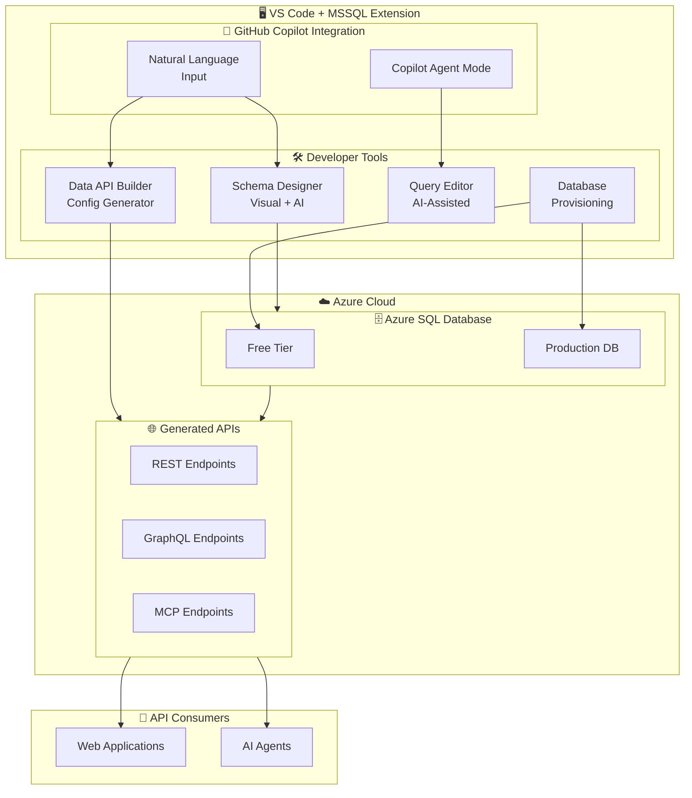

# Azure SQL Database: Build 2026 - Copilot 統合と開発者ツール強化

**リリース日**: 2026-06-02

**サービス**: Azure SQL Database

**機能**: Build 2026 - Copilot 統合と開発者ツール強化

**ステータス**: Launched (GA) / In preview

[このアップデートのインフォグラフィックを見る](https://takech9203.github.io/azure-news-summary/20260602-sql-database-build-2026-updates.html)

## 概要

Microsoft Build 2026 において、Azure SQL Database の開発者体験を大幅に向上させる複数のアップデートが発表された。VS Code 向け MSSQL 拡張機能における GitHub Copilot 統合が 3 つの領域で強化され、Schema Designer での AI アシスタント、Data API builder の Copilot による構成生成、そして Azure SQL Database のプロビジョニング機能 (プレビュー) が提供される。さらに、Azure SQL Database の 2026 年 6 月アップデートとして Microsoft Entra サーバープリンシパルの GA も含まれている。

これらのアップデートは、データベース開発のライフサイクル全体にわたって AI アシスタントを活用できる環境を構築するものである。スキーマ設計から API 生成、データベースプロビジョニングまで、VS Code 内で一貫した開発体験を提供し、開発者の生産性を大幅に向上させることを目的としている。

**アップデート前の課題**

- データベーススキーマの設計には DDL の手動記述が必要で、テーブル間のリレーションシップ設計に時間がかかっていた
- Data API builder の構成ファイル (JSON) を手動で作成する必要があり、REST/GraphQL エンドポイントのセットアップに手間がかかっていた
- Azure SQL Database のプロビジョニングには Azure Portal または CLI が必要で、VS Code から離れる必要があった
- SQL 開発において AI アシスタントの活用が限定的で、個々のツールが連携していなかった

**アップデート後の改善**

- Schema Designer で自然言語によるスキーマ設計が可能になり、テーブル構造やリレーションシップを対話的に生成できるようになった
- Data API builder の構成を GitHub Copilot が自然言語から自動生成し、REST/GraphQL/MCP エンドポイントの作成が大幅に簡素化された
- VS Code の MSSQL 拡張機能から直接 Azure SQL Database の無料枠を含むプロビジョニングが可能になった (プレビュー)
- Copilot による Query Explain、Analyze Query Performance、Rewrite Query などの AI 支援機能がスキーマ設計から API 生成まで一貫して利用可能になった

## アーキテクチャ図



VS Code 内の MSSQL 拡張機能を中心に、GitHub Copilot がスキーマ設計、API 生成、クエリ開発、データベースプロビジョニングの各フェーズを AI で支援する開発者ツールエコシステムを示している。

## サービスアップデートの詳細

### 主要機能

1. **GitHub Copilot integration in Schema Designer (GA)**
   - Schema Designer 内で自然言語によるスキーマ設計が可能
   - テーブル、カラム、リレーションシップを対話的に生成
   - ビジュアルなドラッグ＆ドロップ操作と AI 支援を組み合わせた設計体験
   - T-SQL スクリプトの自動生成機能を備える

2. **Data API builder with built-in GitHub Copilot (GA)**
   - 自然言語から Data API builder の構成ファイルを自動生成
   - REST、GraphQL、MCP エンドポイントを簡単に作成可能
   - Azure SQL Database、SQL Server、Azure Cosmos DB、PostgreSQL、MySQL に対応
   - JWT ベースの認証、ロールベースのアクセス制御を構成ファイルで定義可能

3. **Azure SQL Database provisioning in MSSQL extension (Preview)**
   - VS Code から直接 Azure SQL Database を作成・接続
   - 無料枠の Azure SQL Database のプロビジョニングに対応
   - Azure Portal に切り替えることなく開発ワークフローを完結可能

4. **Azure SQL updates for June 2026 (GA)**
   - Microsoft Entra サーバープリンシパル (ログイン) の一般提供開始
   - Microsoft Entra ID を使用したサーバープリンシパルの作成が GA となり、エンタープライズ環境での ID 管理が強化された

## 技術仕様

| 項目 | 詳細 |
|------|------|
| 対応エディタ | VS Code 1.98.0 以降 |
| 拡張機能 | MSSQL Extension (ms-mssql.mssql) |
| 対応 OS | Windows 11 (x64/arm64)、macOS (Intel/Apple Silicon)、Linux (x64/arm64) |
| Copilot 要件 | GitHub Copilot サブスクリプション |
| Data API builder | オープンソース (MIT ライセンス)、ステートレス実行 |
| DAB 対応 DB | SQL Server、Azure SQL、Azure Cosmos DB、PostgreSQL、MySQL |
| DAB エンドポイント | REST、GraphQL、MCP (v1.7+) |
| DB プロビジョニング | Azure SQL Database 無料枠対応 (プレビュー) |

## 設定方法

### 前提条件

1. VS Code 1.98.0 以降がインストールされていること
2. MSSQL 拡張機能 (ms-mssql.mssql) がインストールされていること
3. GitHub Copilot サブスクリプションが有効であること
4. Azure サブスクリプション (データベースプロビジョニングを使用する場合)

### Schema Designer with Copilot

1. VS Code で MSSQL 拡張機能をインストール
2. Object Explorer からデータベースに接続
3. Schema Designer を開く
4. Copilot チャットで自然言語によりテーブル構造を記述
5. 生成されたスキーマを確認し、必要に応じてビジュアルエディタで調整
6. T-SQL スクリプトを生成してデータベースに適用

### Data API builder with Copilot

```bash
# Data API builder CLI のインストール
dotnet tool install --global Microsoft.DataApiBuilder

# Copilot を使って構成ファイルを生成 (VS Code 内)
# 例: "Create REST and GraphQL endpoints for my Products and Orders tables"
# → dab-config.json が自動生成される

# Data API builder の起動
dab start
```

### Azure SQL Database プロビジョニング (Preview)

1. VS Code の MSSQL 拡張機能で Connections パネルを開く
2. "Create Azure SQL Database" オプションを選択
3. サブスクリプション、リソースグループ、サーバー名を指定
4. 無料枠またはプロダクション構成を選択
5. 作成完了後、自動的に接続が確立される

## メリット

### ビジネス面

- 開発者の生産性向上により、データベース関連タスクの所要時間を短縮
- API 層の自動生成により、CRUD 操作の手動実装コストを削減
- 無料枠プロビジョニングにより、概念実証 (PoC) やプロトタイプ開発のコスト障壁を低減
- 一貫した開発者体験により、チームのオンボーディング時間を短縮

### 技術面

- 自然言語でのスキーマ設計により、DDL 記述のエラーを削減
- Data API builder による型安全な API 生成で、手動実装時のバグリスクを低減
- VS Code 内で完結するワークフローにより、コンテキストスイッチを最小化
- MCP エンドポイント対応により、AI エージェントからのデータベースアクセスが標準化

## デメリット・制約事項

- GitHub Copilot サブスクリプションが別途必要 (MSSQL 拡張機能自体は無料)
- Azure SQL Database プロビジョニングはプレビュー段階であり、本番環境での利用は推奨されない
- Copilot による生成結果は必ずレビューが必要 (特にセキュリティ関連の構成)
- Data API builder の Copilot 統合は VS Code 内の MSSQL 拡張機能経由でのみ利用可能
- 自然言語からの生成精度はプロンプトの品質に依存する

## ユースケース

### ユースケース 1: 新規プロジェクトの迅速な立ち上げ

**シナリオ**: 新しい Web アプリケーションのバックエンドとして Azure SQL Database と REST/GraphQL API を構築する

**実装例**:

```
1. VS Code から Azure SQL Database (無料枠) をプロビジョニング
2. Schema Designer + Copilot で「ユーザー、商品、注文を管理するEコマーススキーマを設計して」と指示
3. 生成されたスキーマを確認・調整し、データベースに適用
4. Data API builder + Copilot で「Products と Orders テーブルに対する REST と GraphQL エンドポイントを作成して」と指示
5. 生成された dab-config.json を確認し、dab start で API を起動
```

**効果**: 従来数時間かかっていたデータベース設計から API 公開までのプロセスを数十分に短縮

### ユースケース 2: AI エージェント向けデータアクセス層の構築

**シナリオ**: AI エージェントが企業データベースにアクセスするための MCP エンドポイントを構築する

**実装例**:

```bash
# Data API builder で MCP エンドポイントを構成
# Copilot: "Create MCP endpoints for CustomerData and SalesHistory with read-only access for the agent role"
dab start --config dab-config.json
```

**効果**: AI エージェントが標準化された MCP プロトコルで安全にデータベースにアクセスでき、カスタム API の実装が不要

## 関連サービス・機能

- **GitHub Copilot**: AI コーディングアシスタント。MSSQL 拡張機能内でスキーマ設計、クエリ最適化、構成生成を支援
- **Data API builder**: オープンソースの API 生成エンジン。データベースから REST/GraphQL/MCP エンドポイントを自動生成
- **Azure SQL Database Free Offer**: サブスクリプション存続期間中、毎月 10 個の General Purpose データベース (各 100,000 vCore 秒) を無料で利用可能
- **Microsoft Entra ID**: Azure SQL Database のサーバープリンシパル認証。June 2026 で GA
- **VS Code MSSQL Extension**: SQL Server および Azure SQL Database 向けの統合開発環境。Object Explorer、Query Plan Visualizer、Schema Compare 等を提供

## 参考リンク

- [インフォグラフィック](https://takech9203.github.io/azure-news-summary/20260602-sql-database-build-2026-updates.html)
- [Azure SQL updates for June (公式アップデート)](https://azure.microsoft.com/updates?id=563137)
- [GitHub Copilot integration in Schema Designer (公式アップデート)](https://azure.microsoft.com/updates?id=563132)
- [Data API builder with built-in GitHub Copilot (公式アップデート)](https://azure.microsoft.com/updates?id=563127)
- [Azure SQL Database provisioning in MSSQL extension (公式アップデート)](https://azure.microsoft.com/updates?id=563122)
- [What's new in Azure SQL Database - Microsoft Learn](https://learn.microsoft.com/en-us/azure/azure-sql/database/doc-changes-updates-release-notes-whats-new)
- [Data API builder Overview - Microsoft Learn](https://learn.microsoft.com/en-us/azure/data-api-builder/overview)
- [MSSQL Extension - Visual Studio Marketplace](https://marketplace.visualstudio.com/items?itemName=ms-mssql.mssql)
- [Data API builder GitHub Repository](https://github.com/Azure/data-api-builder)

## まとめ

Build 2026 における Azure SQL Database 関連のアップデートは、GitHub Copilot を中心とした開発者ツールエコシステムの大幅な強化を特徴としている。Schema Designer、Data API builder、データベースプロビジョニングの 3 つの領域で AI アシスタントが統合され、データベース開発のライフサイクル全体をカバーする。

Solutions Architect としての推奨アクションは以下のとおり:

1. **即座に検証可能**: MSSQL 拡張機能を最新版にアップデートし、Schema Designer と Data API builder の Copilot 統合を評価する
2. **短期的**: 新規プロジェクトで Data API builder + Copilot を活用した API 層の自動生成を検討する
3. **中長期的**: Azure SQL Database プロビジョニング機能の GA を待ち、開発環境の標準化に組み込む
4. **セキュリティ**: Microsoft Entra サーバープリンシパルの GA を受け、既存のサーバー認証を Entra ID ベースに移行する計画を策定する

---

**タグ**: #AzureSQL #Build2026 #GitHubCopilot #DataAPIBuilder #MSSQL拡張機能 #SchemaDesigner #開発者ツール #MicrosoftEntra
