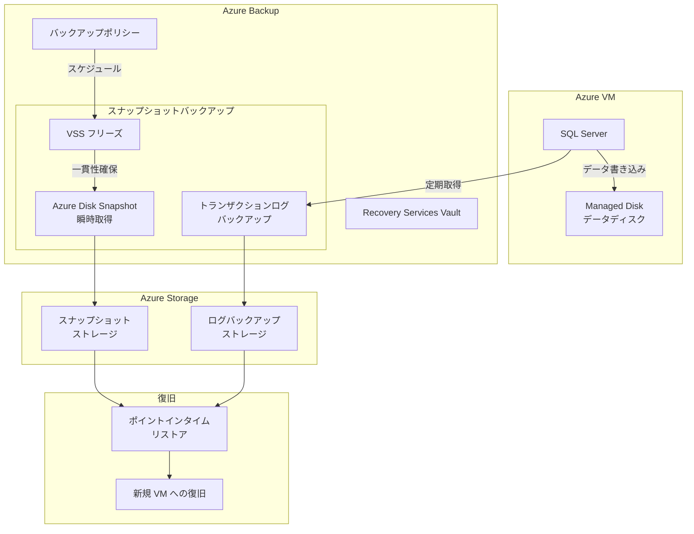

# Azure Backup: Azure VM 上の SQL Server スナップショットバックアップ

**リリース日**: 2026-06-02

**サービス**: Azure Backup

**機能**: Azure VM 上の SQL Server スナップショットバックアップ

**ステータス**: In preview

[このアップデートのインフォグラフィックを見る](https://takech9203.github.io/azure-news-summary/20260602-sql-server-snapshot-backup.html)

## 概要

Azure Backup において、Azure Virtual Machines 上で動作する SQL Server のスナップショットベースバックアップがパブリックプレビューとして提供開始されました。この新機能は、Azure ディスクスナップショットとネイティブ SQL トランザクションログバックアップを組み合わせることで、大規模な SQL データベースに対して瞬時かつ低負荷のフルバックアップを実現します。

従来のストリーミングベースのバックアップでは、大規模なデータベースのフルバックアップに長時間を要し、その間 SQL Server の I/O パフォーマンスに影響を与えていました。スナップショットベースのアプローチにより、データベースサイズに関係なく数秒でフルバックアップを取得できるようになります。

**アップデート前の課題**

- 大規模データベース（数 TB 以上）のフルバックアップに数時間を要していた
- バックアップ中の I/O 負荷により、プロダクションワークロードのパフォーマンスが低下
- バックアップウィンドウの確保が困難で、RPO（Recovery Point Objective）の短縮に制約があった
- ストリーミングバックアップのネットワーク帯域消費が大きかった

**アップデート後の改善**

- Azure ディスクスナップショットにより、データベースサイズに関係なく数秒でフルバックアップが完了
- I/O 負荷が最小限に抑えられ、プロダクションワークロードへの影響がほぼゼロ
- より短い RPO の実現が可能（頻繁なバックアップが実用的に）
- ネイティブ SQL トランザクションログバックアップとの組み合わせによる一貫した復旧ポイント

## アーキテクチャ図



この図は、スナップショットベースの SQL Server バックアップアーキテクチャを示しています。VSS フリーズにより一貫性を確保した上で Azure ディスクスナップショットを瞬時に取得し、トランザクションログバックアップと組み合わせてポイントインタイムリカバリを実現します。

## サービスアップデートの詳細

### 主要機能

1. **Azure ディスクスナップショットによるフルバックアップ**
   - データベースサイズに依存しない瞬時のフルバックアップ
   - Azure Managed Disk のスナップショット機能を活用
   - VSS (Volume Shadow Copy Service) による書き込み一貫性の確保

2. **ネイティブ SQL トランザクションログバックアップとの統合**
   - スナップショットフルバックアップ + 定期的なトランザクションログバックアップの組み合わせ
   - ポイントインタイムリカバリ（PITR）のサポート
   - RPO の柔軟な設定

3. **低負荷バックアップ**
   - バックアップ中の SQL Server への I/O 影響が最小限
   - プロダクションワークロードのパフォーマンスを維持
   - バックアップウィンドウの制約からの解放

## 技術仕様

| 項目 | 詳細 |
|------|------|
| バックアップ方式 | Azure Disk Snapshot + SQL トランザクションログ |
| 一貫性確保 | VSS (Volume Shadow Copy Service) |
| フルバックアップ所要時間 | 数秒（データベースサイズに非依存） |
| 復旧方式 | ポイントインタイムリカバリ (PITR) |
| 対象 | Azure VM 上の SQL Server |
| 管理サービス | Azure Backup (Recovery Services Vault) |
| ステータス | パブリックプレビュー |

## 設定方法

### 前提条件

1. Azure VM 上で SQL Server が動作していること
2. Recovery Services Vault が作成済みであること
3. VM に Azure Backup 拡張機能がインストールされていること
4. SQL Server データファイルが Azure Managed Disk 上に配置されていること

### Azure CLI

```bash
# Recovery Services Vault の作成
az backup vault create \
  --resource-group <RESOURCE_GROUP> \
  --name <VAULT_NAME> \
  --location <LOCATION>

# SQL Server VM のバックアップ保護を有効化（スナップショットポリシー）
az backup protection enable-for-azurewl \
  --resource-group <RESOURCE_GROUP> \
  --vault-name <VAULT_NAME> \
  --policy-name <SNAPSHOT_POLICY_NAME> \
  --protectable-item-name "<SQL_INSTANCE_NAME>" \
  --protectable-item-type SQLInstance \
  --server-name <VM_NAME> \
  --workload-type MSSQL
```

### Azure Portal

1. Azure Portal で **Recovery Services Vault** に移動
2. **バックアップ** > **バックアップの目的** で「Azure VM 上の SQL Server」を選択
3. バックアップポリシーで **スナップショットベース** のポリシーを選択または新規作成
4. 対象の SQL Server VM とデータベースを選択
5. **バックアップの有効化** をクリック

## メリット

### ビジネス面

- **RPO の短縮**: バックアップが瞬時に完了するため、より頻繁なバックアップスケジュールが実用的に
- **SLA の向上**: バックアップウィンドウの制約がなくなり、24時間365日いつでもバックアップ可能
- **運用コストの削減**: バックアップによるパフォーマンス影響を考慮したメンテナンスウィンドウの管理が不要に
- **データ保護の強化**: 大規模データベースでも高頻度のバックアップが可能

### 技術面

- **I/O 影響の最小化**: ストリーミングバックアップと比較して SQL Server への負荷が大幅に軽減
- **サイズ非依存のバックアップ時間**: 1 TB でも 10 TB でもバックアップ完了時間はほぼ同一
- **一貫性の確保**: VSS 連携により、アプリケーション整合性のあるスナップショットを取得
- **ポイントインタイムリカバリ**: トランザクションログとの組み合わせで任意の時点への復旧が可能

## デメリット・制約事項

- パブリックプレビュー段階のため、本番環境での利用には注意が必要
- Azure Managed Disk 上に SQL Server データファイルが配置されている必要がある
- スナップショットのストレージコストが別途発生する
- 復旧先の制約（同一リージョン内など）がある可能性
- プレビュー期間中は対応する SQL Server バージョンや構成に制限がある可能性

## ユースケース

### ユースケース 1: 大規模データウェアハウスのバックアップ

**シナリオ**: 数 TB の SQL Server データウェアハウスを運用しており、従来のストリーミングバックアップでは 6-8 時間を要していたフルバックアップを高速化したい場合。

**実装例**:

```bash
# スナップショットベースのバックアップポリシーを作成
# フルバックアップ: 毎日、ログバックアップ: 15分ごと
az backup policy create \
  --resource-group rg-sql-prod \
  --vault-name vault-sql-prod \
  --name policy-snapshot-sql \
  --workload-type MSSQL \
  --backup-management-type AzureWorkload \
  --policy '{"fullBackupSchedule":"Daily","logBackupFrequency":"15min","snapshotBased":true}'
```

**効果**: 数 TB のデータベースでも数秒でフルバックアップが完了し、バックアップウィンドウの制約から解放。RPO を従来の 24 時間から 15 分に短縮。

### ユースケース 2: ミッションクリティカルな OLTP データベースの保護

**シナリオ**: 24時間稼働のオンライントランザクション処理データベースで、バックアップによるパフォーマンス影響を最小限に抑えたい場合。

**効果**: スナップショットベースのバックアップにより、トランザクション処理のパフォーマンスを維持しながら高頻度のバックアップを実現。ビジネスアワー中でもバックアップ可能。

## 利用可能リージョン

Azure Backup が利用可能なリージョンで順次パブリックプレビューとして展開されます。

## 関連サービス・機能

- **Azure Backup**: 本アップデートの基盤となるバックアップサービス
- **Azure Managed Disks**: スナップショット機能の基盤となるディスクサービス
- **Recovery Services Vault**: バックアップデータの管理・保管
- **SQL Server on Azure VM**: 本機能の対象となる SQL Server のデプロイメント形態
- **Azure SQL Database**: マネージド SQL データベース（自動バックアップ組み込み済み）

## 参考リンク

- [インフォグラフィック](https://takech9203.github.io/azure-news-summary/20260602-sql-server-snapshot-backup.html)
- [公式アップデート情報](https://azure.microsoft.com/updates?id=564668)
- [Azure Backup for SQL Server in Azure VMs ドキュメント](https://learn.microsoft.com/en-us/azure/backup/backup-azure-sql-database)
- [Azure Managed Disks スナップショット](https://learn.microsoft.com/en-us/azure/virtual-machines/snapshot-copy-managed-disk)

## まとめ

Azure VM 上の SQL Server に対するスナップショットベースバックアップのパブリックプレビューは、大規模データベースのバックアップにおける根本的な課題を解決するアップデートです。

Azure ディスクスナップショットとネイティブ SQL トランザクションログバックアップの組み合わせにより、「高速」「低負荷」「一貫性のある」バックアップが実現されます。特に数 TB 以上の大規模データベースを運用する組織にとって、バックアップ時間がデータベースサイズに依存しない点は画期的な改善です。

従来のストリーミングバックアップでは避けられなかった I/O 負荷とバックアップウィンドウの制約から解放されることで、より短い RPO の実現と、ビジネスアワー中のバックアップ実行が可能になります。プレビュー段階ではありますが、大規模 SQL Server ワークロードを持つ組織は早期評価を推奨します。

---

**タグ**: #AzureBackup #SQLServer #Snapshot #AzureVM #DisasterRecovery #Preview #Database #Storage #MicrosoftBuild #DataProtection
