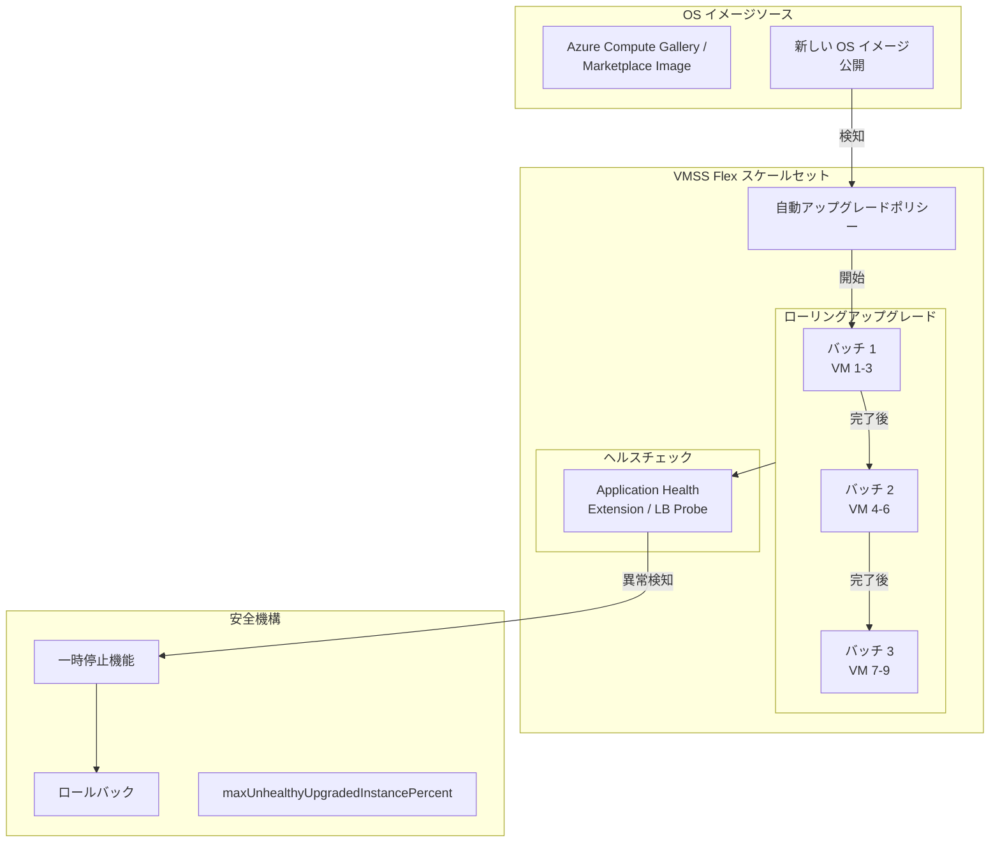

# Azure Virtual Machine Scale Sets (VMSS): VMSS Flex 自動 OS イメージアップグレード

**リリース日**: 2026-06-02

**サービス**: Azure Virtual Machine Scale Sets (VMSS)

**機能**: VMSS Flex 自動 OS イメージアップグレード

**ステータス**: In preview

[このアップデートのインフォグラフィックを見る](https://takech9203.github.io/azure-news-summary/20260602-vmss-flex-os-image-upgrades.html)

## 概要

Azure Virtual Machine Scale Sets (VMSS) の Flexible Orchestration モードにおいて、自動 OS イメージアップグレード機能がパブリックプレビューとして提供開始されました。この機能により、VMSS Flex で一貫性のあるフリートワイドの OS アップデートを手動作業を削減しながら実現できます。

従来、自動 OS イメージアップグレードは VMSS Uniform モードでのみ利用可能でしたが、今回のアップデートで Flexible Orchestration モードにも拡張されました。新しい OS イメージが公開されると、スケールセット内の VM インスタンスに対してローリング方式で自動的にアップグレードが適用されます。

**アップデート前の課題**

- VMSS Flex モードでは自動 OS イメージアップグレードがサポートされておらず、手動でのイメージ更新が必要だった
- 大規模な VMSS Flex デプロイメントでの OS パッチ適用が運用負荷の高い作業だった
- VMSS Uniform から Flex への移行において、自動 OS アップグレード機能の欠如が障壁となっていた

**アップデート後の改善**

- VMSS Flex でも自動 OS イメージアップグレードが利用可能に
- ローリングアップグレードによるダウンタイムの最小化
- 手動介入なしでフリート全体の OS を最新状態に維持
- セキュリティパッチの迅速な適用による攻撃面の縮小

## アーキテクチャ図



この図は、VMSS Flex の自動 OS イメージアップグレードのワークフローを示しています。新しいイメージが公開されると、ポリシーに従いバッチ単位でローリングアップグレードが実行され、ヘルスチェックによる安全機構が動作します。

## サービスアップデートの詳細

### 主要機能

1. **自動 OS イメージアップグレード**
   - 新しい OS イメージがソース（Marketplace / Compute Gallery）に公開されると自動検知
   - VMSS Flex 内のインスタンスに対してローリング方式でアップグレードを適用
   - Flexible Orchestration の柔軟性を維持しながら自動化を実現

2. **ローリングアップグレードポリシー**
   - バッチサイズの制御（一度にアップグレードする VM の割合/数を指定）
   - バッチ間の待機時間の設定
   - 最大異常インスタンス率の指定による安全性の確保

3. **ヘルスベースの保護機能**
   - Application Health Extension または Load Balancer ヘルスプローブとの連携
   - アップグレード後のインスタンスヘルスを確認してから次のバッチに進行
   - 異常検知時の自動一時停止

## 技術仕様

| 項目 | 詳細 |
|------|------|
| 対象 | VMSS Flexible Orchestration モード |
| アップグレード方式 | ローリング（バッチ単位） |
| イメージソース | Azure Marketplace / Azure Compute Gallery |
| ヘルスチェック | Application Health Extension / Load Balancer Probe |
| ステータス | パブリックプレビュー |
| 前提条件 | Application Health Extension の設定が推奨 |

## 設定方法

### 前提条件

1. VMSS Flexible Orchestration モードで作成されたスケールセット
2. Application Health Extension の設定（推奨）
3. OS イメージが Azure Marketplace または Azure Compute Gallery から提供されていること

### Azure CLI

```bash
# VMSS Flex の作成時に自動 OS アップグレードを有効化
az vmss create \
  --resource-group <RESOURCE_GROUP> \
  --name <VMSS_NAME> \
  --orchestration-mode Flexible \
  --image Ubuntu2204 \
  --upgrade-policy-mode Automatic \
  --enable-auto-os-upgrade true \
  --instance-count 5

# 既存の VMSS Flex で自動 OS アップグレードを有効化
az vmss update \
  --resource-group <RESOURCE_GROUP> \
  --name <VMSS_NAME> \
  --set upgradePolicy.automaticOSUpgradePolicy.enableAutomaticOSUpgrade=true

# ローリングアップグレードポリシーの設定
az vmss update \
  --resource-group <RESOURCE_GROUP> \
  --name <VMSS_NAME> \
  --set upgradePolicy.rollingUpgradePolicy.maxBatchInstancePercent=20 \
  --set upgradePolicy.rollingUpgradePolicy.maxUnhealthyUpgradedInstancePercent=20 \
  --set upgradePolicy.rollingUpgradePolicy.pauseTimeBetweenBatches="PT2S"
```

### Azure Portal

1. Azure Portal で対象の VMSS Flex に移動
2. **設定** > **アップグレードポリシー** を選択
3. **OS イメージの自動アップグレード** を **有効** に設定
4. ローリングアップグレードパラメータを設定:
   - 最大バッチサイズ (%)
   - バッチ間の待機時間
   - 最大異常インスタンス率 (%)
5. **保存** をクリック

## メリット

### ビジネス面

- **運用コストの削減**: 手動での OS パッチ適用作業が不要に
- **セキュリティ体制の強化**: OS の脆弱性パッチが自動的かつ迅速に適用
- **コンプライアンス対応**: OS を常に最新状態に維持することでセキュリティ監査要件を満たしやすい
- **可用性の維持**: ローリングアップグレードによるサービス中断の最小化

### 技術面

- **フリートワイドの一貫性**: スケールセット全体で一貫した OS バージョンを維持
- **自動化**: 新しいイメージ公開から適用まで人手の介入が不要
- **柔軟な制御**: バッチサイズ、待機時間、異常率閾値によるきめ細かな制御
- **安全機構**: ヘルスチェック連携による異常時の自動停止

## デメリット・制約事項

- パブリックプレビュー段階のため、本番環境での利用には注意が必要
- Application Health Extension の設定が推奨されるため、初期設定の工数が発生
- アップグレード中は一時的にスケールセットの容量が減少する可能性がある
- カスタムイメージを使用する場合は、Azure Compute Gallery への登録が必要
- ロールバック機能の詳細はプレビュー期間中に変更される可能性がある

## ユースケース

### ユースケース 1: Web アプリケーションのフリート管理

**シナリオ**: 大規模な Web アプリケーションを VMSS Flex で運用しており、OS のセキュリティパッチを可用性を維持しながら自動適用したい場合。

**実装例**:

```bash
# Application Health Extension を設定
az vmss extension set \
  --resource-group rg-webapp \
  --vmss-name vmss-web-prod \
  --name ApplicationHealthLinux \
  --publisher Microsoft.ManagedServices \
  --version 1.0 \
  --settings '{
    "protocol": "http",
    "port": 8080,
    "requestPath": "/health"
  }'

# 自動 OS アップグレードを有効化（バッチ 20%）
az vmss update \
  --resource-group rg-webapp \
  --name vmss-web-prod \
  --set upgradePolicy.automaticOSUpgradePolicy.enableAutomaticOSUpgrade=true \
  --set upgradePolicy.rollingUpgradePolicy.maxBatchInstancePercent=20
```

**効果**: Load Balancer と Health Extension の連携により、エンドユーザーへの影響を最小限に抑えながら自動的に OS パッチを適用。

### ユースケース 2: バッチ処理クラスターの OS 更新

**シナリオ**: 夜間バッチ処理に使用する VMSS Flex クラスターの OS を、処理負荷が低い時間帯に自動更新したい場合。

**効果**: メンテナンスウィンドウの設定と組み合わせることで、ビジネスへの影響を排除しながら OS を最新状態に維持。

## 利用可能リージョン

VMSS Flexible Orchestration モードが利用可能なすべてのリージョンでパブリックプレビューとして提供されます。

## 関連サービス・機能

- **VMSS Uniform モード**: 従来から自動 OS イメージアップグレードをサポートしていた orchestration モード
- **Azure Compute Gallery**: カスタム OS イメージの管理・配布サービス
- **Application Health Extension**: VM インスタンスのアプリケーションレベルのヘルスを報告
- **Azure Update Manager**: VM の更新管理サービス（VMSS 外の VM 向け）

## 参考リンク

- [インフォグラフィック](https://takech9203.github.io/azure-news-summary/20260602-vmss-flex-os-image-upgrades.html)
- [公式アップデート情報](https://azure.microsoft.com/updates?id=564976)
- [VMSS 自動 OS イメージアップグレード ドキュメント](https://learn.microsoft.com/en-us/azure/virtual-machine-scale-sets/virtual-machine-scale-sets-automatic-upgrade)
- [VMSS Flexible Orchestration ドキュメント](https://learn.microsoft.com/en-us/azure/virtual-machine-scale-sets/virtual-machine-scale-sets-orchestration-modes)

## まとめ

VMSS Flex における自動 OS イメージアップグレードのパブリックプレビューは、Flexible Orchestration モードの機能ギャップを埋める重要なアップデートです。

これまで VMSS Uniform でのみ利用可能だった自動 OS アップグレード機能が VMSS Flex にも拡張されたことで、Flexible Orchestration の柔軟性（可用性ゾーンの混在、異なる VM サイズの混在など）を活かしながら、OS パッチ管理の自動化が可能になりました。

ローリングアップグレード方式とヘルスベースの保護機能により、サービスの可用性を維持しながら安全に OS を更新できます。特に大規模なフリートを運用する組織にとって、運用負荷の大幅な削減とセキュリティ体制の強化が期待できます。

プレビュー段階ではありますが、非本番環境での評価を開始し、GA 後の迅速な本番適用に備えることを推奨します。

---

**タグ**: #VMSS #VirtualMachineScaleSets #FlexibleOrchestration #OSUpgrade #AutomaticUpgrade #Preview #Compute #Security #MicrosoftBuild
