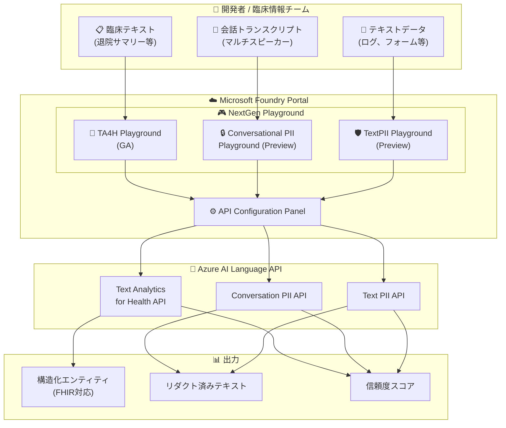

# Azure AI Language: Text Analytics for Health GA & PII NextGen Playground

**リリース日**: 2026-06-03

**サービス**: Azure AI Language

**機能**: Text Analytics for Health NextGen Playground GA / Conversational PII & TextPII NextGen Playground Public Preview

**ステータス**: Launched (GA) / In preview

[このアップデートのインフォグラフィックを見る](https://takech9203.github.io/azure-news-summary/20260603-ai-language-health-pii.html)

## 概要

Microsoft Build 2026 において、Azure AI Language の NextGen Playground に関する 3 つのアップデートが発表された。いずれも Microsoft Foundry ポータル上で提供される次世代プレイグラウンド体験に関するもので、臨床テキスト分析と個人情報保護の両分野で開発者体験が大幅に向上する。

1 つ目は **Text Analytics for Health (TA4H) NextGen Playground の一般提供開始 (GA)** である。臨床情報チームや ISV が退院サマリー、医師のメモ、研究抄録などをペーストするだけで、構造化された医療エンティティ (診断名、薬剤名、症状、バイタルサインなど) を即座に抽出できるようになった。

2 つ目は **Conversational PII NextGen Playground のパブリックプレビュー** である。Microsoft Foundry ポータルにトランスクリプト入力と API Configuration Panel を備えたプレイグラウンドが追加され、マルチスピーカーの対話データに対する PII 検出を API 統合前に検証できるようになった。

3 つ目は **TextPII NextGen Playground のアップデート (パブリックプレビュー)** である。API Configuration Panel が刷新され、Ignite 2025 で紹介されたプレビュー機能 (定義済み PII カテゴリ、リダクションモードなど) をプレイグラウンド上で直接テストできるようになった。

**アップデート前の課題**

- TA4H のプレイグラウンドはプレビュー段階であり、本番利用に向けた SLA が保証されていなかった
- PII 検出の検証には API を直接呼び出す必要があり、開発者がパラメータ設定をテストするためのインタラクティブな UI が限定的だった
- マルチスピーカーの会話データに対する PII 検出を統合前に試す手段が不足していた
- TextPII のプレビュー機能 (カテゴリフィルタ、リダクションモードなど) をプレイグラウンドで試すことができなかった

**アップデート後の改善**

- TA4H NextGen Playground が GA となり、本番利用可能な安定したプレイグラウンド体験が提供される
- Conversational PII 用の専用プレイグラウンドでトランスクリプト入力とマルチスピーカー対話の PII 検出を視覚的に検証可能
- TextPII プレイグラウンドで API Configuration Panel を通じてリダクションモードやエンティティフィルタをインタラクティブに設定・テスト可能
- すべてのプレイグラウンドが Microsoft Foundry ポータルに統合され、一貫した開発者体験を提供

## アーキテクチャ図



Microsoft Foundry ポータル上の NextGen Playground を通じて、3 種類の Azure AI Language 機能 (TA4H、Conversational PII、TextPII) をインタラクティブにテストし、API Configuration Panel で設定を調整してから本番統合に進むワークフローを示している。

## サービスアップデートの詳細

### 1. Text Analytics for Health NextGen Playground (GA)

1. **構造化医療エンティティ抽出**
   - 退院サマリー、医師のメモ、研究抄録から医療エンティティを自動抽出
   - 対応エンティティ: 診断名、薬剤名、症状/徴候、年齢、バイタルサインなど

2. **4 つの主要機能を単一 API で提供**
   - Named Entity Recognition (NER): 医療用語のセマンティック抽出
   - Relation Extraction: エンティティ間の関係性 (例: 薬剤と投与量) を検出
   - Entity Linking: UMLS メタシソーラスの標準コードへの紐付け
   - Assertion Detection: 確実性、条件性、関連性、時間性の修飾子を検出

3. **FHIR 出力対応**
   - Fast Healthcare Interoperability Resources (FHIR) 構造での出力が可能
   - 電子カルテシステムとの連携を容易にする

4. **Social Determinants of Health (SDOH) 対応**
   - 社会的健康決定要因や民族性の言及を抽出可能

### 2. Conversational PII NextGen Playground (Public Preview)

1. **トランスクリプト入力対応**
   - マルチターン会話構造をそのまま入力可能
   - スピーカー別のターン分離を維持した PII 検出

2. **API Configuration Panel**
   - エンティティカテゴリのフィルタリング
   - リダクションポリシーの設定
   - 統合前の動作検証が可能

3. **非同期ジョブ処理**
   - 大量のトランスクリプトデータに対するバッチ処理
   - ジョブステータスのポーリングによる結果取得

### 3. TextPII NextGen Playground アップデート (Public Preview)

1. **刷新された API Configuration Panel**
   - Ignite 2025 で発表されたプレビュー機能をプレイグラウンドで利用可能
   - 定義済み PII カテゴリの選択・テスト
   - リダクションモードの設定と即時プレビュー

2. **同期型リクエスト/レスポンス統合**
   - 低レイテンシのリアルタイム処理向け最適化
   - アプリケーションパイプラインへの直接統合に適した設計

## 技術仕様

| 項目 | Text Analytics for Health | Conversational PII | TextPII |
|------|--------------------------|-------------------|---------|
| ステータス | GA | Public Preview | Public Preview |
| 処理方式 | 同期/非同期 | 非同期 (ジョブベース) | 同期 |
| 入力形式 | 非構造化臨床テキスト | ターンベース会話データ | 生テキスト文字列 |
| 出力形式 | 構造化エンティティ + FHIR | リダクト済み会話 + エンティティ | リダクト済みテキスト + エンティティ |
| 対応言語 | 英語、ドイツ語、フランス語、イタリア語、スペイン語、ポルトガル語、ヘブライ語 | 複数言語対応 | 広範な言語対応 |
| デプロイオプション | API / Docker コンテナ / Foundry Portal | API / Foundry Portal | API / Foundry Portal |

## 設定方法

### 前提条件

1. Azure サブスクリプション
2. Azure AI Language リソースの作成 (キーとエンドポイントの取得)
3. Microsoft Foundry ポータル (ai.azure.com) へのアクセス

### Microsoft Foundry Portal での利用

1. [Microsoft Foundry ポータル](https://ai.azure.com/) にアクセス
2. 既存の Language Studio リソースを使用するか、新しい Foundry リソースを作成
3. 対象のプレイグラウンド (TA4H / Conversational PII / TextPII) を選択
4. テキストまたはトランスクリプトを入力
5. API Configuration Panel でパラメータを設定
6. 結果を確認し、API 統合の設定値を決定

### REST API (Text Analytics for Health)

```bash
# テキスト分析リクエストの送信
curl -X POST "https://<endpoint>/language/analyze-text/jobs?api-version=2024-11-15-preview" \
  -H "Ocp-Apim-Subscription-Key: <key>" \
  -H "Content-Type: application/json" \
  -d '{
    "analysisInput": {
      "documents": [
        {
          "id": "1",
          "language": "en",
          "text": "Patient was prescribed 100mg of ibuprofen for headache."
        }
      ]
    },
    "tasks": [
      {
        "taskId": "1",
        "kind": "Healthcare"
      }
    ]
  }'
```

## メリット

### ビジネス面

- 臨床データの構造化を加速し、ヘルスケア分析の効率を向上
- PII 検出の事前検証により、コンプライアンス対応コストを削減
- プレイグラウンドでの検証により、API 統合の開発サイクルを短縮
- コールセンター、会議録、チャットログなど多様な会話データのプライバシー保護を効率化

### 技術面

- Microsoft Foundry ポータルへの統合により、リソース管理が一元化
- API Configuration Panel によるインタラクティブなパラメータチューニング
- FHIR 準拠出力により電子カルテシステムとのシームレスな連携が可能
- 同期/非同期の両処理モデルに対応し、ユースケースに応じた柔軟な設計が可能

## デメリット・制約事項

- TA4H は医療機器や臨床サポートツールとして使用することを意図していない (Microsoft 免責事項)
- Conversational PII および TextPII のプレイグラウンドはパブリックプレビューであり、SLA 保証なし
- UMLS メタシソーラスの利用には別途ライセンスが必要
- SDOH 抽出は全ての社会的健康決定要因をカバーしているわけではない
- Preview API バージョンと GA API バージョンのリクエストペイロードを混在させないこと

## ユースケース

### ユースケース 1: 臨床データの構造化 (TA4H)

**シナリオ**: 病院の退院サマリーから診断名、投薬情報、バイタルサインを自動抽出し、電子カルテシステムに取り込む。

**効果**: 手動でのデータ入力を大幅に削減し、FHIR 準拠の構造化データとして他システムとの相互運用性を確保。

### ユースケース 2: コールセンター会話のプライバシー保護 (Conversational PII)

**シナリオ**: カスタマーサポートの通話録音をトランスクリプト化した後、顧客の氏名、住所、クレジットカード番号などの PII を自動リダクトしてから品質管理チームに共有。

**効果**: コンプライアンス要件を満たしつつ、会話の文脈を維持した品質分析が可能。

### ユースケース 3: AI ワークフローのプロンプトフィルタリング (TextPII)

**シナリオ**: LLM に送信するプロンプトやレスポンスに含まれる個人情報をリアルタイムでリダクトし、AI パイプラインのプライバシーを確保。

**効果**: 低レイテンシの同期処理により、ユーザー体験を損なわずにプライバシー保護を実現。

## 料金

Azure AI Language の料金体系に基づく。各機能は Azure AI Language の統一料金で課金される。

詳細な料金情報は [Azure AI Language 料金ページ](https://aka.ms/unifiedLanguagePricing) を参照。

## 関連サービス・機能

- **Microsoft Foundry Portal**: すべての NextGen Playground のホスティング基盤。Azure AI サービスの統合管理ポータル
- **Azure AI Speech**: 音声をトランスクリプト化し、Conversational PII と連携して通話データのプライバシー保護を実現
- **Azure Health Data Services**: TA4H の FHIR 出力と連携し、ヘルスケアデータの相互運用を促進
- **Azure AI Document Intelligence**: ドキュメントベース PII と組み合わせてネイティブファイルからの PII 除去に活用

## 参考リンク

- [インフォグラフィック](https://takech9203.github.io/azure-news-summary/20260603-ai-language-health-pii.html)
- [公式アップデート情報 - TA4H NextGen Playground GA](https://azure.microsoft.com/updates?id=563671)
- [公式アップデート情報 - Conversational PII NextGen Playground](https://azure.microsoft.com/updates?id=564246)
- [公式アップデート情報 - TextPII NextGen Playground](https://azure.microsoft.com/updates?id=564241)
- [Microsoft Learn - Text Analytics for Health 概要](https://learn.microsoft.com/en-us/azure/ai-services/language-service/text-analytics-for-health/overview)
- [Microsoft Learn - PII 検出概要](https://learn.microsoft.com/en-us/azure/ai-services/language-service/personally-identifiable-information/overview)
- [Microsoft Learn - Text PII 概要](https://learn.microsoft.com/en-us/azure/ai-services/language-service/personally-identifiable-information/text-pii-overview)
- [Microsoft Learn - Conversation PII 概要](https://learn.microsoft.com/en-us/azure/ai-services/language-service/personally-identifiable-information/conversation-pii-overview)
- [料金ページ](https://aka.ms/unifiedLanguagePricing)

## まとめ

Build 2026 で発表された Azure AI Language の 3 つのアップデートは、Microsoft Foundry ポータル上の NextGen Playground 体験を大幅に強化するものである。TA4H Playground の GA により、臨床テキストからの医療エンティティ抽出が本番利用可能な安定基盤で提供され、Conversational PII と TextPII のプレイグラウンドアップデートにより、PII 検出・リダクションの開発者体験が向上した。

Solutions Architect への推奨アクション:
- ヘルスケア領域のプロジェクトでは TA4H NextGen Playground の GA を活用し、FHIR 連携を含むアーキテクチャ設計に着手する
- コールセンターや会話分析パイプラインを設計中の場合、Conversational PII Playground でリダクション動作を事前検証する
- AI ワークフローにおけるプライバシー保護を検討中であれば、TextPII Playground で最新のリダクションモードやカテゴリフィルタを評価する

---

**タグ**: #AzureAILanguage #TextAnalyticsForHealth #PII #MicrosoftFoundry #Build2026 #NLP #HealthcareAI #プライバシー保護
