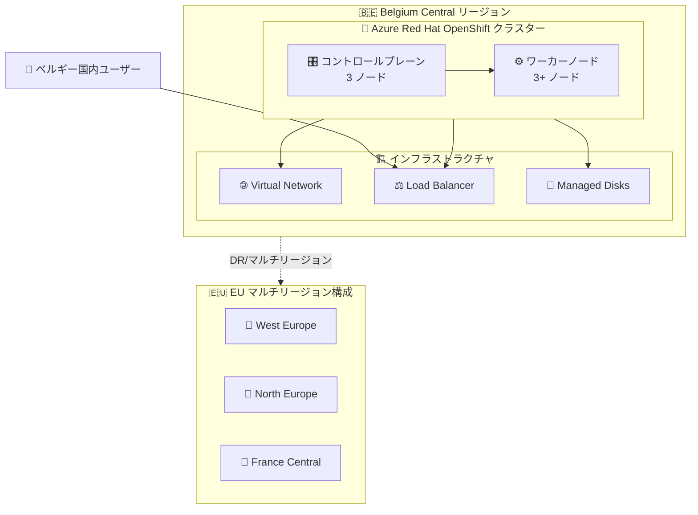

# Azure Red Hat OpenShift: Belgium Central リージョン GA

**リリース日**: 2026-06-03

**サービス**: Azure Red Hat OpenShift (ARO)

**機能**: Belgium Central リージョンサポート

**ステータス**: Launched (GA)

[このアップデートのインフォグラフィックを見る](https://takech9203.github.io/azure-news-summary/20260603-aro-belgium-central.html)

## 概要

Azure Red Hat OpenShift (ARO) が Belgium Central リージョンで一般提供 (GA) を開始した。これは Microsoft がベルギーに初めて開設した Azure リージョンであり、ARO のヨーロッパにおけるリージョン展開がさらに拡大されたことを意味する。

Belgium Central は EU 圏内に位置する新しいリージョンであり、GDPR をはじめとする EU データ居住要件を満たす必要がある組織にとって、OpenShift ワークロードのデプロイ先として新たな選択肢を提供する。完全マネージドの OpenShift クラスターをベルギー国内で運用できるようになり、データ主権要件への対応が容易になる。

ARO は Microsoft と Red Hat が共同で設計・運用・サポートする完全マネージドサービスであり、コントロールプレーン、インフラストラクチャ、アプリケーションノードのパッチ適用・更新・監視がすべて自動的に行われる。

**アップデート前の課題**

- ベルギー国内にデータ居住要件がある組織は、Azure 上で OpenShift クラスターを運用する際に最寄りのリージョン (West Europe/Netherlands など) を利用する必要があった
- ベルギーに Azure リージョンが存在しなかったため、ベルギー国内でのデータ処理・保存を義務付ける規制への対応が困難だった
- ヨーロッパ西部リージョンへの集中により、特定のワークロードでレイテンシの最適化が制限されていた

**アップデート後の改善**

- ベルギー国内で ARO クラスターをデプロイ可能になり、データ居住要件を直接満たせるようになった
- Belgium Central リージョンの利用により、ベルギーおよび周辺地域からのアクセスレイテンシが改善される
- EU 圏内での ARO リージョン選択肢が増え、マルチリージョン DR 構成の柔軟性が向上した

## アーキテクチャ図



Belgium Central リージョンにおける ARO クラスターの基本構成を示す。ARO クラスターはコントロールプレーン 3 ノードとワーカーノード 3 ノード以上で構成され、VNet・Load Balancer・Managed Disks と連携する。他の EU リージョンとの DR 構成も可能。

## サービスアップデートの詳細

### 主要機能

1. **完全マネージド OpenShift クラスター**
   - コントロールプレーン、インフラストラクチャ、アプリケーションノードの自動パッチ適用・更新・監視
   - Microsoft と Red Hat による共同サポート体制

2. **Belgium Central リージョンでの GA 提供**
   - Microsoft 初のベルギー Azure リージョンで ARO が利用可能に
   - 可用性ゾーン対応 (リージョンが対応している場合、ワーカーノードとコントロールプレーンが各ゾーンに分散配置)

3. **Azure エコシステムとの統合**
   - Microsoft Entra ID による認証連携
   - Azure Monitor との統合によるクラスター監視
   - Azure Virtual Network Peering、ExpressRoute によるハイブリッド接続

4. **Red Hat Operator Hub サポート**
   - Red Hat および認定 ISV のオペレーターを利用可能
   - Red Hat Pull Secret 設定によるコンテナレジストリアクセス

## 技術仕様

| 項目 | 詳細 |
|------|------|
| サービス名 | Azure Red Hat OpenShift (ARO) |
| OpenShift バージョン | OpenShift 4.x (最新安定版) |
| コンテナランタイム | CRI-O |
| OS | Red Hat Enterprise Linux CoreOS (RHCOS) |
| コントロールプレーン | 3 ノード (自動管理) |
| ワーカーノード | 3 ノード以上 (スケーリング可能) |
| ネットワーク CNI | OVN (Open Virtual Network) |
| SLA | 99.95% |
| リソースグループ | 2 つ必要 (顧客管理 VNet + ARO 管理リソース) |
| ストレージ | Azure Managed Disks (Premium SSD LRS) |
| 暗号化 | サーバーサイド暗号化 (SSE) - 保存時暗号化 |

## 設定方法

### 前提条件

1. Azure サブスクリプション
2. Azure CLI のインストールと ARO 拡張機能の登録
3. Red Hat Pull Secret (推奨、OperatorHub 利用に必要)
4. サービスプリンシパルへの Network Contributor ロールまたは Azure Red Hat OpenShift First Party Network ロールの割り当て

### Azure CLI

```bash
# ARO リソースプロバイダーの登録
az provider register -n Microsoft.RedHatOpenShift --wait

# 利用可能リージョンの確認 (Belgium Central が含まれることを確認)
az provider show -n Microsoft.RedHatOpenShift --query "resourceTypes[?resourceType == 'OpenShiftClusters'].locations" -o yaml

# リソースグループの作成
az group create --name myResourceGroup --location belgiumcentral

# 仮想ネットワークの作成
az network vnet create \
  --resource-group myResourceGroup \
  --name myVNet \
  --address-prefixes 10.0.0.0/22

# マスターサブネットの作成
az network vnet subnet create \
  --resource-group myResourceGroup \
  --vnet-name myVNet \
  --name master-subnet \
  --address-prefixes 10.0.0.0/23

# ワーカーサブネットの作成
az network vnet subnet create \
  --resource-group myResourceGroup \
  --vnet-name myVNet \
  --name worker-subnet \
  --address-prefixes 10.0.2.0/23

# ARO クラスターの作成 (Belgium Central)
az aro create \
  --resource-group myResourceGroup \
  --name myAROCluster \
  --vnet myVNet \
  --master-subnet master-subnet \
  --worker-subnet worker-subnet \
  --location belgiumcentral \
  --pull-secret @pull-secret.txt
```

### Azure Portal

Azure Portal から「Azure Red Hat OpenShift」を検索し、「作成」を選択。リージョンとして「Belgium Central」を選択し、ウィザードに従ってネットワーク設定、認証情報、ワーカーノード構成を指定する。

## メリット

### ビジネス面

- ベルギー国内のデータ居住要件 (GDPR、国内規制) に直接対応可能
- ベルギーおよびベネルクス地域の顧客に対する低レイテンシサービス提供
- EU 圏内でのマルチリージョン冗長構成の選択肢拡大
- Microsoft と Red Hat による共同サポートで運用負荷を軽減

### 技術面

- 可用性ゾーンを活用した高可用性構成
- OVN ベースのネットワーキングによる柔軟なネットワークポリシー制御
- Azure サービス (Entra ID、Monitor、ExpressRoute) とのネイティブ統合
- OpenShift Operator Hub を通じたエコシステム活用
- 99.95% SLA による高信頼性

## デメリット・制約事項

- Belgium Central は新規リージョンのため、他の成熟したリージョンと比較して利用可能な Azure サービスが限定される可能性がある
- 一度デプロイしたクラスターを別リージョンに移動することは不可
- サブスクリプション間でのクラスター転送は不可
- Windows ワーカーノードは非サポート
- CNI (OVN) の変更は非サポート
- アプリケーションデータのバックアップは自動化されておらず、顧客責任で実施する必要がある
- 共有ストレージ (RWX) は顧客による別途構成が必要

## ユースケース

### ユースケース 1: ベルギー政府機関向けコンテナプラットフォーム

**シナリオ**: ベルギーの政府機関が、国内データ居住要件を満たしつつ、コンテナベースのアプリケーションを運用する必要がある。

**実装例**:

```bash
# Belgium Central に ARO クラスターをデプロイ
az aro create \
  --resource-group gov-rg \
  --name gov-aro-cluster \
  --vnet gov-vnet \
  --master-subnet master-subnet \
  --worker-subnet worker-subnet \
  --location belgiumcentral \
  --api-server-visibility Private \
  --ingress-visibility Private
```

**効果**: データがベルギー国内に保持されることが保証され、プライベートクラスターとして外部公開なしでの運用が可能。

### ユースケース 2: ベネルクス地域向け低レイテンシ SaaS

**シナリオ**: ベネルクス地域 (ベルギー、オランダ、ルクセンブルク) の顧客向けに SaaS アプリケーションを提供する企業が、レイテンシを最小化したい。

**効果**: Belgium Central リージョンを利用することで、ベルギー国内ユーザーへのレイテンシを最小化しつつ、OpenShift のマイクロサービスアーキテクチャで柔軟にスケール可能。

### ユースケース 3: EU マルチリージョン DR 構成

**シナリオ**: EU 圏内でディザスタリカバリ構成を構築する企業が、既存の West Europe / North Europe に加えて Belgium Central を DR サイトとして活用する。

**効果**: 3 リージョンでの冗長構成により、リージョン障害時の業務継続性を確保。ARO クラスターを複数リージョンに配置し、Azure Traffic Manager や Azure Front Door で負荷分散を実現。

## 料金

ARO の料金は以下の要素で構成される:

| 項目 | 説明 |
|------|------|
| コンピュート | Azure Linux VM の料金 (ワーカーノードの VM サイズ・台数に応じた従量課金) |
| ARO ライセンス | アプリケーションノード数とインスタンスタイプに基づく追加コスト |
| ストレージ | Managed Disks (Premium SSD LRS) の使用量に応じた課金 |
| ネットワーク | 送信データ転送量に応じた課金 |

- Azure Reservations および Azure Prepayment による割引が適用可能
- Belgium Central リージョンの料金は他のヨーロッパリージョンと同等と想定されるが、最新料金は公式ページを参照

詳細: [Azure Red Hat OpenShift 料金ページ](https://azure.microsoft.com/pricing/details/openshift/)

## 利用可能リージョン

Belgium Central の追加により、ARO はヨーロッパを含む多数のリージョンで利用可能。以下は主要なヨーロッパリージョン:

| リージョン | 地域 |
|-----------|------|
| **Belgium Central (新規)** | **ベルギー** |
| West Europe | オランダ |
| North Europe | アイルランド |
| France Central | フランス |
| Germany West Central | ドイツ |
| Switzerland North | スイス |
| UK South | イギリス |
| Sweden Central | スウェーデン |
| Italy North | イタリア |
| Poland Central | ポーランド |
| Spain Central | スペイン |
| Norway East | ノルウェー |

全リージョンの最新情報は以下のコマンドで確認可能:

```bash
az provider show -n Microsoft.RedHatOpenShift --query "resourceTypes[?resourceType == 'OpenShiftClusters'].locations" -o yaml
```

または [Azure リージョン別製品提供状況ページ](https://azure.microsoft.com/global-infrastructure/services/?products=openshift&regions=all) を参照。

## 関連サービス・機能

- **Azure Kubernetes Service (AKS)**: Azure のマネージド Kubernetes サービス。ARO は OpenShift の完全な機能セットが必要な場合に選択される
- **Microsoft Entra ID**: ARO クラスターの認証プロバイダーとして統合可能
- **Azure Monitor**: クラスターとアプリケーションの監視・ログ収集
- **Azure Virtual Network**: ARO クラスターのネットワーク基盤。ピアリングや ExpressRoute 接続に対応
- **Azure Container Registry (ACR)**: コンテナイメージの保存・管理
- **Azure Front Door / Traffic Manager**: マルチリージョン構成での負荷分散
- **Azure ExpressRoute**: オンプレミスとのプライベート接続

## 参考リンク

- [インフォグラフィック](https://takech9203.github.io/azure-news-summary/20260603-aro-belgium-central.html)
- [公式アップデート情報](https://azure.microsoft.com/updates?id=564849)
- [Microsoft Learn - Azure Red Hat OpenShift 概要](https://learn.microsoft.com/azure/openshift/intro-openshift)
- [Microsoft Learn - ARO サービス定義](https://learn.microsoft.com/azure/openshift/openshift-service-definitions)
- [料金ページ](https://azure.microsoft.com/pricing/details/openshift/)
- [SLA](https://azure.microsoft.com/support/legal/sla/openshift/v1_0/)
- [リージョン別製品提供状況](https://azure.microsoft.com/global-infrastructure/services/?products=openshift&regions=all)

## まとめ

Azure Red Hat OpenShift が Belgium Central リージョンで一般提供を開始したことにより、ベルギー国内でのデータ居住要件を満たしながら完全マネージドの OpenShift クラスターを運用できるようになった。これは Microsoft がベルギーに初めて開設した Azure リージョンであり、EU 圏内の顧客にとってデータ主権、レイテンシ最適化、マルチリージョン DR 構成の観点で重要な選択肢が追加されたことを意味する。

Solutions Architect としては、ベルギーおよびベネルクス地域にデータ居住要件を持つ顧客案件において、Belgium Central リージョンでの ARO デプロイを検討すべきである。既存の West Europe リージョンからの移行やマルチリージョン構成の設計においても、新たな選択肢として活用できる。

---

**タグ**: #Azure #ARO #OpenShift #BelgiumCentral #EU #コンテナ #GA
