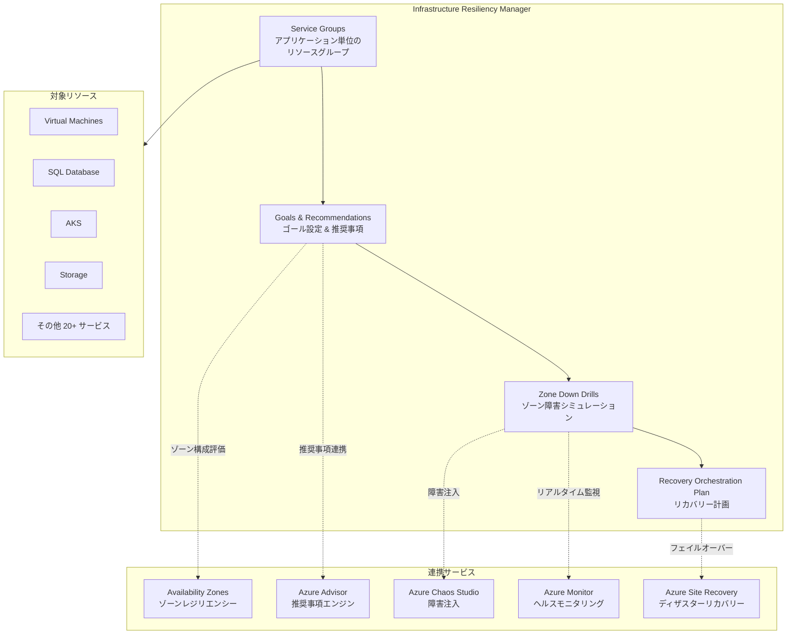

# Azure Infrastructure Resiliency Manager: 統合レジリエンシー管理サービス

**リリース日**: 2026-06-03

**サービス**: Azure Infrastructure Resiliency Manager

**機能**: 統合レジリエンシー管理

**ステータス**: In preview

[このアップデートのインフォグラフィックを見る](https://takech9203.github.io/azure-news-summary/20260603-azure-infrastructure-resiliency-manager.html)

## 概要

Azure Infrastructure Resiliency Manager がパブリックプレビューとして提供開始された。本サービスは、Azure 上のアプリケーションレジリエンシーを設計、評価、改善するための統合的かつゴール駆動型のエクスペリエンスを提供する。Availability Zones、Azure Advisor、Chaos Studio などの既存機能を横断的に統合し、単一のインターフェースからレジリエンシー態勢を管理できる。

本サービスは「Resiliency in Azure」プラットフォームの一部として位置づけられ、従来の Azure Business Continuity Center (ABCC) を拡張・発展させたものである。Infrastructure Resiliency (ゾーンレジリエンシー)、Data Resiliency (バックアップ/DR)、Cyber Recovery (ランサムウェア対策) を包括的にカバーし、アプリケーション全体のレジリエンシーポスチャーを可視化する。

グローバル (非リージョン) サービスとして設計されており、任意の Azure リージョンのリソースを横断的に管理・運用できる点が大きな特徴である。

**アップデート前の課題**

- レジリエンシー管理が Availability Zones、Azure Advisor、Chaos Studio、Azure Site Recovery など複数のサービスに分散しており、統合的な把握が困難だった
- アプリケーション単位でのレジリエンシーゴール設定や達成状況の追跡ができなかった
- ゾーン障害に対する準備状況を検証するためのシミュレーションドリルが体系化されていなかった
- 障害発生時のリカバリー順序を定義し、オーケストレーションする仕組みが不足していた

**アップデート後の改善**

- Service Group によるアプリケーション単位のリソースグループ化とゴール設定が可能になった
- ゾーンレジリエンシーの達成状況を「Zone-resilient / Non zone-resilient / Not evaluated」で一目で把握可能になった
- Availability Zone Down Drill により、ゾーン障害をシミュレートし、フェイルオーバーの準備状況を事前検証できるようになった
- Recovery Orchestration Plan により、複数リソースの復旧順序を定義し、自動化されたフェイルオーバーが実行可能になった

## アーキテクチャ図

Infrastructure Resiliency Manager は Service Group を中心に、ゴール設定から障害ドリル、リカバリー計画までを一貫したワークフローで管理する。各機能は既存の Azure サービスと連携し、統合的なレジリエンシー体験を提供する。

## サービスアップデートの詳細

### 主要機能

1. **Goals and Recommendations (ゴールと推奨事項)**
   - Service Group を作成し、サブスクリプションやリソースグループを横断してリソースをグループ化
   - ゾーンレジリエンシーゴールを設定し、達成状況をリアルタイムで追跡
   - ゴールを満たさないリソースに対して、ステップバイステップの修復ガイダンスを提供
   - Manual Attestation により、自動検出されないカスタムレジリエンシーソリューションの手動登録が可能

2. **Availability Zone Down Drills (ゾーン障害ドリル)**
   - Azure 推奨のフォールトテンプレートによるゾーン障害シミュレーション
   - Azure Runbooks によるカスタムロジックでのフォールトオーバーライド
   - ドリル実行中のリアルタイムヘルスモニタリング
   - フェイルオーバー、リプロテクト、逆フェイルオーバー、逆リプロテクトの完全なライフサイクル管理

3. **Recovery Orchestration Plan (リカバリーオーケストレーション計画)**
   - カスタマイズ可能なグループによるリカバリー順序の定義
   - 自動 Readiness Check による24時間ごとのドリフト検出
   - Azure Automation Runbooks による pre-script / post-script の実行
   - 手動アクション挿入による柔軟なフェイルオーバーワークフロー

4. **Resiliency Posture Dashboard (レジリエンシー態勢ダッシュボード)**
   - Zone-resilient / Non zone-resilient / Not evaluated の3区分でリソース状態を可視化
   - 全 Service Group を横断したスケーラブルなビュー
   - Azure Advisor と連携した推奨事項の統合表示

## 技術仕様

| 項目 | 詳細 |
|------|------|
| サービスタイプ | グローバル (非リージョン) サービス |
| Service Group 上限 | 1 Service Group あたり最大 500 リソース |
| 対応リソースタイプ | 20 以上 (VM、SQL Database、AKS、Storage Account、Cosmos DB 等) |
| Readiness Check 頻度 | 24 時間ごとの自動実行 + オンデマンド実行 |
| ドリル実行ライフサイクル | Fault Injection → Failover → Reprotect → Reverse Failover → Reverse Reprotect |
| RBAC ロール | Azure Resilience Management Recovery Contributor / Administrator |
| ゴール検出方式 | 自動検出 + Manual Attestation |
| Recovery Plan 方式 | ゾーンリカバリーのみ (リージョナルリカバリーは非対応) |

### サポートされるリソースタイプとゾーンレジリエンシーソリューション

| リソースタイプ | 検出されるゾーンレジリエンシーソリューション |
|------|------|
| Azure VM | Azure Site Recovery (ゾーン DR)、ZRS ディスク接続の Zone-pinned VM、多ゾーン VMSS |
| Azure SQL Database | ゾーン冗長デプロイ |
| Azure SQL Managed Instance | ゾーン冗長デプロイ |
| Azure Cosmos DB | ゾーン冗長アカウント構成 |
| Azure Database for PostgreSQL | ゾーン冗長 HA |
| Azure Storage Account | ZRS / GZRS / RA-GZRS |
| Azure Disk | ゾーン冗長マネージドディスク |
| Azure Kubernetes Service (AKS) | ゾーン冗長ノードプール |
| Azure Load Balancer | Standard SKU ゾーン冗長フロントエンド |
| Azure Application Gateway | ゾーン冗長デプロイ |
| Azure Firewall | ゾーン冗長デプロイ |
| Azure Service Bus | Premium ティア ゾーン冗長ネームスペース |
| Azure Container Registry | ゾーン冗長レプリケーション |
| ExpressRoute Gateway | ErGw1AZ / ErGw2AZ / ErGw3AZ |

## 設定方法

### 前提条件

1. Azure サブスクリプション (アクティブ)
2. 適切な RBAC ロール (Service Group Contributor + リソースへの Read 権限以上)
3. 管理対象リソースが Availability Zones 対応リージョンに配置されていること

### Azure Portal

1. Azure Portal にサインイン
2. 検索ボックスで「Resiliency」を検索し、Resiliency ダッシュボードに移動
3. Service Group を作成し、対象リソースを追加
4. ゾーンレジリエンシーゴールを設定
5. 推奨事項を確認し、修復アクションを実施
6. Zone Down Drill を設定し、障害シミュレーションを実行
7. Recovery Orchestration Plan を構成し、リカバリー順序を定義

## メリット

### ビジネス面

- アプリケーション全体のレジリエンシー態勢を経営層にも分かりやすく可視化できる
- ゾーン障害時のダウンタイムを事前検証により最小化し、SLA 遵守を支援
- 複数サブスクリプション・リージョンにまたがる大規模環境でも統合的に管理可能
- コンプライアンス監査向けのレジリエンシーレポーティングが容易になる

### 技術面

- Service Group によるアプリケーション単位のリソース管理で、依存関係を含めた包括的な評価が可能
- 自動 Readiness Check によるドリフト検出で構成変更への迅速な対応が可能
- Azure Advisor との統合により、推奨事項の一元管理と追跡が実現
- Recovery Orchestration Plan によるフェイルオーバー自動化で、RTO の短縮が期待できる
- Manual Attestation でカスタムソリューションも評価対象に含められる柔軟性

## デメリット・制約事項

- パブリックプレビュー段階のため、本番ワークロードでの使用は慎重な検討が必要
- Recovery Orchestration Plan はゾーンリカバリーのみ対応で、リージョナルリカバリーは非対応
- Service Group あたりのリソース上限が 500 であり、大規模アプリケーションでは分割が必要
- 一部のリソースタイプ (ネットワークプリミティブ、ID/アクセス、モニタリング等) は自動的に除外される
- 自動検出されないカスタムレジリエンシーソリューションは Manual Attestation が必要で、管理コストが発生する
- ゾーン障害ドリルの実行には実際のフォールト注入を伴うため、テスト環境での事前検証を推奨

## ユースケース

### ユースケース 1: エンタープライズアプリケーションのゾーンレジリエンシー評価

**シナリオ**: 複数のサブスクリプションにまたがる基幹業務アプリケーション (VM、SQL Database、AKS、Storage) のゾーン障害耐性を包括的に評価したい。

**実装アプローチ**:
1. Service Group を作成し、アプリケーション構成リソースを登録
2. ゾーンレジリエンシーゴールを設定
3. ダッシュボードで Non zone-resilient リソースを特定
4. 推奨事項に従い、ZRS ストレージへの変更や VM のゾーン冗長化を実施

**効果**: アプリケーション全体のゾーンレジリエンシー達成率を定量的に把握し、優先順位を付けた改善計画を策定できる。

### ユースケース 2: 定期的なゾーン障害ドリルによる DR 準備状況検証

**シナリオ**: 四半期ごとにゾーン障害シミュレーションを実施し、フェイルオーバー手順の有効性を検証したい。

**実装アプローチ**:
1. Service Group に対して Zone Down Drill テンプレートを構成
2. テスト環境で Fault Injection を実行し、障害を注入
3. リアルタイムヘルスモニタリングでリソース状態を監視
4. Recovery Plan に基づくフェイルオーバーを実行し、RTO を計測
5. Reprotect 操作で元の構成に復元

**効果**: 実際のゾーン障害発生時の対応手順を事前に検証し、RTO/RPO の実測値に基づく改善が可能。

### ユースケース 3: マルチチーム環境でのレジリエンシーガバナンス

**シナリオ**: 複数の開発チームが独自にリソースをデプロイする環境で、組織全体のレジリエンシー基準を一元的に管理したい。

**実装アプローチ**:
1. チーム/アプリケーションごとに Service Group を作成
2. 組織共通のゾーンレジリエンシーゴールを設定
3. Readiness Check による自動ドリフト検出を活用
4. RBAC ロールを活用し、チームごとの権限を適切に分離
5. 全 Service Group 横断のダッシュボードで経営レベルのレポーティングを実施

**効果**: 組織全体のレジリエンシー基準を強制することなく可視化し、チームの自律性を維持しながらガバナンスを実現。

## 料金

現時点でパブリックプレビューの料金情報は公式に公開されていない。プレビュー期間中は無料で利用可能な可能性が高いが、正式な料金はGA時に発表される見込み。連携サービス (Azure Site Recovery、Azure Chaos Studio 等) の利用料は別途発生する。

詳細は公式料金ページを参照: [Azure Resiliency 料金ページ](https://azure.microsoft.com/pricing/)

## 利用可能リージョン

Infrastructure Resiliency Manager はグローバル (非リージョン) サービスとして提供される。サービス自体は特定の Azure リージョンにデプロイされず、任意のリージョンのリソースを管理・運用できる。ただし、管理対象リソースは Availability Zones をサポートするリージョンに配置されている必要がある。

## 関連サービス・機能

- **Azure Availability Zones**: Infrastructure Resiliency Manager がレジリエンシー評価の基盤として利用するゾーン冗長インフラ
- **Azure Advisor**: レジリエンシー推奨事項のエンジンとして連携。Infrastructure Resiliency Manager で解決された推奨事項は Advisor にも反映される
- **Azure Chaos Studio**: Zone Down Drill における障害注入 (Fault Injection) の実行エンジンとして活用
- **Azure Monitor**: ドリル実行中のリアルタイムヘルスモニタリングおよびリソース状態の追跡に使用
- **Azure Site Recovery**: VM のゾーンディザスターリカバリー保護およびフェイルオーバー操作に活用
- **Azure Automation**: Recovery Plan の pre-script / post-script 実行およびカスタムフォールトロジックに使用
- **Azure Well-Architected Framework (信頼性の柱)**: レジリエンシー設計のベストプラクティスとして参照される基盤フレームワーク

## 参考リンク

- [インフォグラフィック](https://takech9203.github.io/azure-news-summary/20260603-azure-infrastructure-resiliency-manager.html)
- [公式アップデート情報](https://azure.microsoft.com/updates?id=564759)
- [Microsoft Learn - Resiliency in Azure 概要](https://learn.microsoft.com/en-us/azure/resiliency/resiliency-overview)
- [Microsoft Learn - Goals and Recommendations](https://learn.microsoft.com/en-us/azure/resiliency/goals-recommendations-about)
- [Microsoft Learn - Availability Zone Down Drills](https://learn.microsoft.com/en-us/azure/resiliency/availability-zone-down-drills-about)
- [Microsoft Learn - Recovery Orchestration Plan](https://learn.microsoft.com/en-us/azure/resiliency/recovery-orchestration-plan-about)
- [Microsoft Learn - サポートマトリクス](https://learn.microsoft.com/en-us/azure/resiliency/goals-recommendations-support-matrix)
- [Azure Reliability ドキュメント](https://learn.microsoft.com/en-us/azure/reliability/)

## まとめ

Azure Infrastructure Resiliency Manager は、これまで個別のサービスに分散していたレジリエンシー管理機能を統合し、アプリケーション単位でのゴール駆動型のレジリエンシー管理を実現する重要なサービスである。Microsoft Build 2026 で発表されたこのプレビューにより、エンタープライズ組織はゾーンレジリエンシーの設計、評価、改善を一貫したワークフローで実施できるようになる。

Solutions Architect として推奨される次のアクションは、まず既存のアプリケーションを Service Group としてモデリングし、ゾーンレジリエンシーゴールを設定してレジリエンシーポスチャーの現状を把握することである。その後、Zone Down Drill によるシミュレーションテストを実施し、Recovery Orchestration Plan の構成に進むことで、段階的にレジリエンシー態勢を強化していくことを推奨する。

---

**タグ**: #Azure #Resiliency #Management #Build2026 #InfrastructureResiliencyManager #AvailabilityZones #DisasterRecovery
