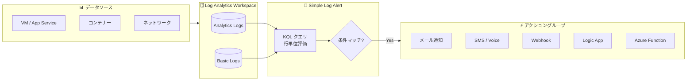

# Azure Monitor: Simple Log Alerts GA

**リリース日**: 2026-06-03

**サービス**: Azure Monitor

**機能**: Simple Log Alerts (シンプルログアラート)

**ステータス**: Launched (GA)

[このアップデートのインフォグラフィックを見る](https://takech9203.github.io/azure-news-summary/20260603-azure-monitor-simple-log-alerts.html)

## 概要

Microsoft は Azure Monitor の Simple Log Alerts (シンプルログアラート) の一般提供 (GA) を発表した。この機能は、従来のログ検索アラートルール (Log Search Alert) に対して、より簡素化された直感的な監視・アラート体験を提供するもので、問題の検出と迅速な対応能力を強化する。

Simple Log Alerts は、従来のログ検索アラートが集計期間内の行を集約して評価するのに対し、各行を個別に評価する仕組みを採用している。これにより、エラーや障害が発生した時点で即座にアラートが発火し、リアルタイムに近い監視が可能になる。Analytics ログと Basic ログの両方のテーブルプランに対応している。

Microsoft Build 2026 のタイミングでの GA 発表であり、Azure Monitor のアラート機能全体の中で「シンプルさ」と「即応性」に特化した新しい選択肢として位置づけられている。

**アップデート前の課題**

- 従来のログ検索アラートでは、集計期間 (Aggregation Granularity) を設定して結果を集約する必要があり、設定が複雑だった
- 行ごとの即時アラートを実現するには、1 分間隔の評価頻度とカスタム KQL クエリの組み合わせが必要で、設計に専門知識を要した
- バックアップジョブの失敗や Windows イベントなど、個別のイベントごとにアラートを発火させるシナリオの設定が直感的でなかった
- Basic ログテーブルに対するアラートの設定方法が限定的だった

**アップデート後の改善**

- クエリ結果の各行を個別に評価し、マッチした行ごとにアラートを発火可能
- 集約設定 (Measure、Aggregation type、Window size) が不要で、設定ステップが大幅に簡素化
- Analytics ログと Basic ログの両テーブルプランをサポート
- 1 分ごとの行単位のイベントマッチングでリアルタイム監視を実現

## アーキテクチャ図



ログデータが Log Analytics Workspace に取り込まれ、Simple Log Alert ルールが各行を個別に KQL クエリで評価する。条件にマッチした行が検出されると、アクショングループを通じて即座に通知が送信される。

## サービスアップデートの詳細

### 主要機能

1. **行単位の個別評価 (Single Event モード)**
   - クエリ結果の各行を個別に評価し、条件にマッチした行ごとにアラートを発火
   - 従来の集約ベースの評価とは異なり、個別イベントの検出に最適化

2. **簡素化された KQL クエリ**
   - Transformation KQL 言語に基づくシンプルなクエリ構文
   - `print`、`datatable`、`let` は非サポートだが、基本的なフィルタリングと射影に特化
   - 最初の 5 カラムが通知出力に表示される

3. **柔軟なトリガー閾値**
   - 「すべてのマッチ行でアラート」(行ごと)
   - 「1 分間に 1 回以上マッチした場合」
   - 「1 分間に N 回以上マッチした場合」(カスタム閾値)

4. **Analytics / Basic ログ両対応**
   - Analytics ログテーブルプランと Basic ログテーブルプランの両方をサポート
   - Basic ログに対するコスト効率の良い監視が可能

## 技術仕様

| 項目 | 詳細 |
|------|------|
| クエリ言語 | KQL (Transformation KQL サブセット) |
| 評価方式 | Single Event (行単位評価) |
| 評価頻度 | 1 分間隔 |
| 対応ログプラン | Analytics Logs, Basic Logs |
| スコープ対象 | 単一リソース、Workspace、リソースグループ、サブスクリプション |
| ディメンション分割 | 非サポート |
| ミュートアクション | 非サポート |
| 通知出力 | クエリの最初の 5 カラムが表示 |
| アラートペイロード | Common Alert Schema 準拠 |
| 非サポート KQL 演算子 | `print`, `datatable`, `let` |

## 従来のログ検索アラートとの比較

| 比較項目 | Simple Log Alert | 従来の Log Search Alert |
|----------|-----------------|----------------------|
| 評価方式 | 行単位 (Single Event) | 集約ベース (Aggregated) |
| 集約設定 | 不要 | 必須 (Measure, Aggregation type, Window size) |
| 評価頻度 | 1 分固定 | 1 分 ~ 24 時間で選択可能 |
| ディメンション分割 | 非対応 | 対応 (最大 6 ディメンション) |
| ミュートアクション | 非対応 | 対応 |
| 動的閾値 | 非対応 | 対応 |
| ステートフル | 非対応 | 対応 |
| Basic ログ対応 | 対応 | 対応 |
| 設定の複雑さ | 低い | 高い |
| ユースケース | 即時検出・個別イベント監視 | 集計分析・トレンド監視 |

## 設定方法

### 前提条件

1. Log Analytics Workspace が構成済みであること
2. 対象リソースの読み取り権限
3. アラートルールを作成するリソースグループへの書き込み権限
4. アクショングループへの読み取り権限 (使用する場合)

### Azure Portal

1. Azure Portal で **Monitor** > **Alerts** > **+ Create** > **Alert rule** を選択
2. スコープ (対象リソースまたは Workspace) を選択
3. **Condition** タブで **Custom log search** を選択
4. **Query type** で **Single event** ラジオボタンを選択
5. KQL クエリを入力 (例: `AzureDiagnostics | where Level == "Error"`)
6. **When to trigger the alert** セクションでトリガー条件を設定:
   - すべてのマッチ行でアラート
   - 1 分間に N 回以上のマッチで発火
7. **Actions** タブでアクショングループを設定
8. **Details** タブでルール名、重大度、リージョンを設定
9. **Review + create** で作成

### KQL クエリ例

```kql
// バックアップジョブの失敗を検出
AzureDiagnostics
| where Category == "BackupJob" and ResultType == "Failed"

// Windows セキュリティイベントの検出
SecurityEvent
| where EventID == 4625

// アプリケーションエラーの検出
AppExceptions
| where SeverityLevel >= 3
```

## メリット

### ビジネス面

- 監視設定の迅速化により、運用チームの生産性が向上
- 個別イベントの即時検出により、障害対応時間 (MTTR) を短縮
- 複雑な集計設定が不要なため、監視設定のヒューマンエラーを低減

### 技術面

- 行単位の評価により、各イベントを見逃さないリアルタイム監視を実現
- KQL のサブセットに限定することで、クエリの予測可能性と安定性を向上
- Basic ログテーブルプランのサポートにより、コスト効率の良い監視パターンが可能
- Common Alert Schema 準拠のペイロードにより、既存の自動化パイプラインとシームレスに統合

## デメリット・制約事項

- ディメンション分割 (Split by dimensions) に非対応のため、リソースごとの個別監視には従来のルールが必要
- ミュートアクション非対応のため、アラートストームの抑制は別途 Alert Processing Rule で対応が必要
- `let`、`print`、`datatable` が使用不可のため、複雑な変数定義やカスタムデータセットとの結合ができない
- 動的閾値 (Dynamic Thresholds) に非対応のため、異常検知には従来のルールを使用する必要がある
- ステートフルアラートに非対応のため、自動解決 (Auto-resolve) は利用できない
- 評価頻度が 1 分固定のため、コスト最適化のために頻度を下げる選択ができない

## ユースケース

### ユースケース 1: バックアップジョブ失敗の即時検出

**シナリオ**: 企業の DR (災害復旧) 要件として、すべてのバックアップジョブの失敗を即座に検知し、運用チームに通知する必要がある。

**実装例**:

```kql
AzureDiagnostics
| where Category == "BackupJob" and ResultType == "Failed"
```

**効果**: 各バックアップ失敗が発生した時点で個別にアラートが発火し、どのジョブがいつ失敗したかを即座に把握可能。従来の集約ベースでは「5 分間に 3 回以上失敗」といった設定が必要だったが、Simple Log Alert では各失敗を個別に検出。

### ユースケース 2: セキュリティイベントのリアルタイム監視

**シナリオ**: セキュリティチームがブルートフォース攻撃の兆候をリアルタイムで検出し、各不正ログイン試行を個別に追跡したい。

**実装例**:

```kql
SecurityEvent
| where EventID == 4625 and AccountType == "User"
```

**効果**: 認証失敗イベントごとにアラートが発火し、攻撃パターンの即座な可視化と対応が可能。カスタム閾値 (例: 1 分間に 5 回以上) を設定することで、ノイズを抑えつつ異常を検出。

### ユースケース 3: アプリケーションエラーの簡易監視

**シナリオ**: 開発チームが新しくデプロイしたアプリケーションのエラーを簡単に監視したいが、複雑なアラートルールの設計に時間をかけたくない。

**実装例**:

```kql
AppExceptions
| where SeverityLevel >= 3
```

**効果**: 最小限の設定で重大なアプリケーション例外を即座に検出。集約設定やディメンション設計が不要なため、デプロイ直後から数分で監視体制を構築可能。

## 料金

Simple Log Alert は、1 分間隔のアラートルールと同等の料金体系で課金される。

| 項目 | 料金 |
|------|------|
| Simple Log Alert ルール | 1 分頻度のログ検索アラートルールと同額 |

詳細な料金については [Azure Monitor 料金ページ](https://azure.microsoft.com/pricing/details/monitor/) を参照。

## 関連サービス・機能

- **Azure Monitor Log Analytics**: ログデータの収集・保存・クエリを提供する基盤サービス。Simple Log Alert のデータソースとなる
- **アクショングループ (Action Groups)**: アラート発火時のアクション (メール、SMS、Webhook、Logic App、Azure Function) を定義
- **Alert Processing Rules**: アラートの抑制、ルーティング、エンリッチメントを管理。Simple Log Alert のミュートアクション非対応を補完
- **従来のログ検索アラート (Log Search Alerts)**: 集約ベースの評価を行う従来のアラートルール。複雑な分析シナリオで引き続き使用
- **メトリックアラート (Metric Alerts)**: メトリクスデータに対するアラート。ログではなく数値メトリクスの監視に適用
- **Application Insights**: アプリケーションパフォーマンス監視。Smart Detection との組み合わせで高度な異常検知を実現

## 参考リンク

- [インフォグラフィック](https://takech9203.github.io/azure-news-summary/20260603-azure-monitor-simple-log-alerts.html)
- [公式アップデート情報](https://azure.microsoft.com/updates?id=561978)
- [Simple Log Alert の作成 - Microsoft Learn](https://learn.microsoft.com/en-us/azure/azure-monitor/alerts/alerts-create-simple-alert)
- [Azure Monitor アラートの種類 - Microsoft Learn](https://learn.microsoft.com/en-us/azure/azure-monitor/alerts/alerts-types)
- [ログ検索アラートルールの作成 - Microsoft Learn](https://learn.microsoft.com/en-us/azure/azure-monitor/alerts/alerts-create-log-alert-rule)
- [Azure Monitor 料金](https://azure.microsoft.com/pricing/details/monitor/)

## まとめ

Azure Monitor の Simple Log Alerts GA は、ログ監視のアラート設定を大幅に簡素化する重要なアップデートである。従来のログ検索アラートが集約ベースの複雑な設定を必要としたのに対し、Simple Log Alert は行単位の個別評価を採用し、各イベントの即時検出を実現する。

Solutions Architect として推奨されるアクション:
1. バックアップ失敗やセキュリティイベントなど、個別イベントの即時検出が必要なシナリオで Simple Log Alert への移行を検討
2. 新規の監視設定では、要件に応じて Simple Log Alert と従来のログ検索アラートを使い分ける
3. ディメンション分割や動的閾値が不要な単純な監視シナリオでは、Simple Log Alert を第一候補として採用し、設定工数を削減

---

**タグ**: #Azure #Monitor #LogAlerts #Observability #Build2026
