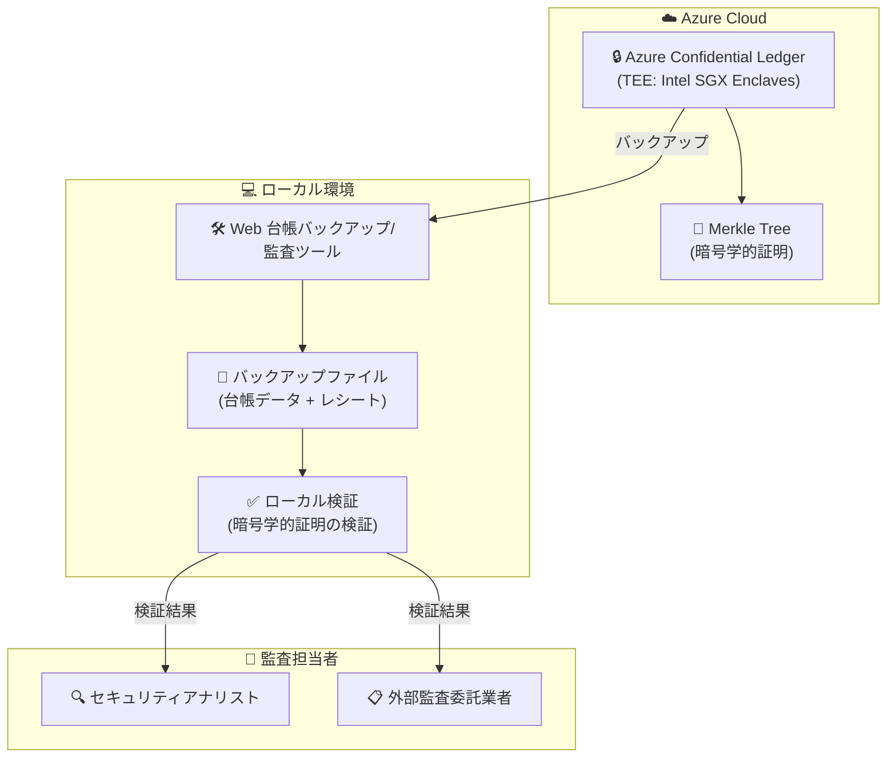

# Azure Confidential Ledger: 監査用台帳ファイルバックアップ・検証ツールの一般提供開始

**リリース日**: 2026-06-03

**サービス**: Azure Confidential Ledger

**機能**: ローカライズド Web 台帳バックアップ/監査ツール

**ステータス**: Launched (GA)

[このアップデートのインフォグラフィックを見る](https://takech9203.github.io/azure-news-summary/20260603-confidential-ledger-backup-audit.html)

## 概要

Azure Confidential Ledger に新しいローカライズド Web 台帳バックアップ/監査ツールが一般提供 (GA) されました。このツールにより、台帳ファイルをローカル環境にバックアップし、暗号学的証明 (Cryptographic Proofs) の検証をローカルで実行できるようになります。

これまで、監査担当者 (組織内のセキュリティアナリストやセキュリティ評価の外部委託業者) が台帳ファイルを閲覧し、暗号学的証明の信頼性を自ら検証することは容易ではありませんでした。新ツールにより、監査ペルソナに対して台帳データへのアクセスと独立した検証能力を提供できるようになります。

**アップデート前の課題**

- 監査担当者が台帳ファイルを閲覧するためには、Azure Confidential Ledger インスタンスへの直接アクセスが必要だった
- 暗号学的証明 (Merkle Tree ベースのトランザクションレシート) の検証にはプログラミングスキルと SDK の利用が必須だった
- 外部の監査委託業者に対して、Azure 環境へのアクセス権を付与する必要があり、セキュリティ上の懸念があった
- オフラインでの監査やエアギャップ環境での検証が困難だった

**アップデート後の改善**

- Web ベースのツールにより、ローカル環境で台帳ファイルのバックアップと検証が可能に
- プログラミング不要で暗号学的証明の検証を実行可能
- Azure 環境へのアクセス権を付与せずに、監査担当者に台帳データを共有可能
- オフライン環境での独立した監査・検証ワークフローを実現

## アーキテクチャ図

Azure Confidential Ledger の台帳データをローカル環境にバックアップし、監査担当者が暗号学的証明を独立して検証するワークフローを示しています。ツールは Web ベースで動作し、Azure 環境へのアクセスなしに台帳の整合性を確認できます。

## サービスアップデートの詳細

### 主要機能

1. **ローカル台帳バックアップ**
   - Azure Confidential Ledger インスタンスから台帳ファイルをローカル環境にバックアップ
   - トランザクションレシート (暗号学的証明) を含む完全なデータセットを取得

2. **ローカル暗号学的証明検証**
   - Merkle Tree ベースのトランザクションレシートをローカルで検証
   - ノード証明書チェーンの検証 (サービス証明書 → 署名ノード証明書)
   - ECDSA 署名の検証

3. **Web ベースインターフェース**
   - ブラウザ上で動作するローカライズドツール
   - プログラミング不要で監査担当者が利用可能
   - オフライン環境での動作に対応

4. **監査ペルソナのサポート**
   - 組織内セキュリティアナリスト向けの台帳閲覧機能
   - 外部セキュリティ評価委託業者向けの信頼性検証機能
   - Azure 環境へのアクセス権なしで監査を実行可能

## 技術仕様

| 項目 | 詳細 |
|------|------|
| サービス基盤 | Azure Confidential Computing (Intel SGX Enclaves) |
| フレームワーク | Confidential Consortium Framework (CCF) |
| 暗号学的証明 | Merkle Tree ベースのトランザクションレシート |
| 署名アルゴリズム | ECDSA (Elliptic Curve Digital Signature Algorithm) |
| 通信プロトコル | TLS 1.3 |
| 認証方式 | Microsoft Entra ID / 証明書ベース |
| 台帳タイプ | Public (平文) / Private (暗号化) |
| スケーラビリティ | 3 つ以上の可用性ゾーンに分散デプロイ |

## メリット

### ビジネス面

- **コンプライアンス強化**: 規制要件に対応した独立監査プロセスを実現
- **信頼性の確立**: 第三者監査人が暗号学的証明を自ら検証し、データ整合性を確認可能
- **アクセス制御の改善**: Azure 環境へのアクセス権を付与せずに監査データを共有
- **監査コスト削減**: オフラインでの自律的な監査ワークフローにより、監査プロセスを効率化

### 技術面

- **オフライン検証**: エアギャップ環境やインターネット接続なしでの検証が可能
- **暗号学的完全性**: Merkle Tree + ECDSA による数学的な改ざん証明
- **ゼロトラストアプローチ**: クラウドプロバイダー (Microsoft) を含め、誰も台帳を改ざんできない設計
- **SDK 不要**: Web ベースツールによりプログラミングなしで検証可能

## デメリット・制約事項

- Azure Confidential Ledger のサブスクリプションあたりの台帳数制限: Standard SKU で 2 台帳まで
- コレクション ID の上限: 台帳あたり 50,000
- 台帳インスタンス作成後のタイプ変更 (Public/Private) は不可
- 台帳削除はハードデリートであり、データの復旧は不可能
- 台帳名はグローバルで一意でなければならない

## ユースケース

### ユースケース 1: 外部セキュリティ監査

**シナリオ**: 金融機関が年次セキュリティ評価のため、外部監査法人にトランザクション台帳の整合性証明を提供する必要がある。

**効果**: Azure 環境へのアクセス権を外部監査法人に付与せず、バックアップファイルとローカル検証ツールを提供するだけで、暗号学的に証明された監査が可能になる。

### ユースケース 2: 規制コンプライアンス対応

**シナリオ**: 医療データを扱う組織が、データの改ざんがないことを規制当局に証明する必要がある。Azure SQL Database の台帳機能と連携し、Confidential Ledger にダイジェストを保存している。

**効果**: 規制当局の監査担当者がオフライン環境でもトランザクションの暗号学的証明を独立して検証でき、データ整合性を客観的に証明可能。

### ユースケース 3: サプライチェーンの信頼性検証

**シナリオ**: 製造業企業がサプライチェーン上の重要な契約変更履歴を Confidential Ledger に記録し、取引先に対して改ざんのない履歴を証明したい。

**効果**: 取引先のセキュリティ担当者がローカルツールを使用して台帳バックアップを検証し、契約履歴の信頼性を自ら確認できる。

## 料金

Azure Confidential Ledger の料金情報については、公式料金ページを参照してください。

- [Azure Confidential Ledger 料金ページ](https://azure.microsoft.com/pricing/details/confidential-ledger/)

## 利用可能リージョン

Azure Confidential Ledger の利用可能リージョンについては、公式ドキュメントを参照してください。

- [Azure Confidential Ledger リージョン情報](https://azure.microsoft.com/explore/global-infrastructure/products-by-region/?products=confidential-ledger)

## 関連サービス・機能

- **Azure SQL Database 台帳機能**: SQL Database のテーブルダイジェストを Confidential Ledger に保存し、データ整合性を保護
- **Azure Blob Storage**: Confidential Ledger と連携して BLOB データのエンドツーエンド整合性を実現
- **Azure Confidential Computing**: Intel SGX エンクレーブによるハードウェアベースのセキュリティ基盤
- **Microsoft Defender for Cloud**: セキュリティイベントの記録先として Confidential Ledger を活用
- **Microsoft Entra ID**: Confidential Ledger へのアクセス認証

## 参考リンク

- [インフォグラフィック](https://takech9203.github.io/azure-news-summary/20260603-confidential-ledger-backup-audit.html)
- [公式アップデート情報](https://azure.microsoft.com/updates?id=560810)
- [Azure Confidential Ledger 概要 - Microsoft Learn](https://learn.microsoft.com/azure/confidential-ledger/overview)
- [トランザクションレシートの検証 - Microsoft Learn](https://learn.microsoft.com/azure/confidential-ledger/verify-write-transaction-receipts)
- [書き込みトランザクションレシート - Microsoft Learn](https://learn.microsoft.com/azure/confidential-ledger/write-transaction-receipts)
- [料金ページ](https://azure.microsoft.com/pricing/details/confidential-ledger/)

## まとめ

Azure Confidential Ledger の新しいローカライズド Web バックアップ/監査ツールの GA により、組織は監査プロセスを大幅に改善できます。特に、外部監査担当者に Azure 環境へのアクセス権を付与せずに台帳の暗号学的証明を独立検証させることが可能になった点は、セキュリティとコンプライアンスの両面で重要な進歩です。

Solutions Architect として推奨されるアクション:
- 既に Azure Confidential Ledger を利用している場合は、新ツールを活用した監査ワークフローの設計を検討
- 規制コンプライアンス要件がある環境では、オフライン検証プロセスの導入を評価
- Azure SQL Database 台帳機能との連携で、リレーショナルデータのエンドツーエンド整合性保護を検討

---

**タグ**: #AzureConfidentialLedger #Security #Audit #Compliance #ConfidentialComputing #Blockchain #MerkleTree #DataIntegrity
