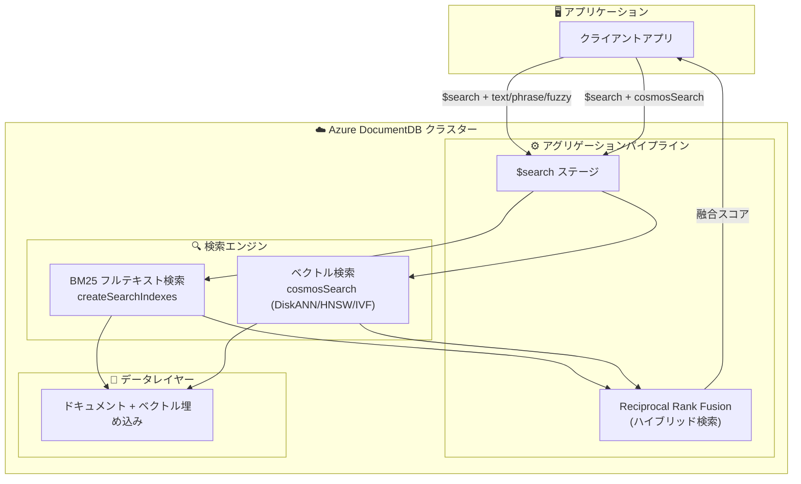

# Azure DocumentDB: 高度なフルテキスト検索 (Public Preview)

**リリース日**: 2026-06-03

**サービス**: Azure DocumentDB

**機能**: 高度なフルテキスト検索

**ステータス**: In preview

[このアップデートのインフォグラフィックを見る](https://takech9203.github.io/azure-news-summary/20260603-documentdb-advanced-full-text-search.html)

## 概要

Azure DocumentDB に高度なフルテキスト検索機能が Public Preview として追加された。ファジー検索、近接検索、多言語サポート、BM25 ランキングが新たに利用可能となり、ベクトル検索と高度なテキスト検索を単一のデータベース内で統合して実行できるようになった。

この機能は、従来の MongoDB 互換の `$text` 演算子と `{ field: "text" }` インデックスタイプ (PostgreSQL TSVector 実装ベース) を置き換える新しい検索エンジンとして提供される。`$search` アグリゲーションパイプラインステージを通じて MongoDB 互換のプリミティブとして公開され、別途検索クラスターを立てることなく BM25 スコアによる関連性ランキングを実現する。

Microsoft Build 2026 において発表されたこのアップデートにより、検索操作を単一のデータベースに統合することが可能となり、外部の検索サービスを別途管理する必要性が軽減される。

**アップデート前の課題**

- フルテキスト検索にはレガシーの `$text` 演算子しか利用できず、ファジー検索や近接検索には非対応だった
- ベクトル検索とテキスト検索を組み合わせるには外部の検索サービス (Azure AI Search など) を別途構築・管理する必要があった
- タイプミスへの耐性がなく、正確なキーワード一致のみに依存していた
- 単語の順序や近接性を考慮した検索ができなかった

**アップデート後の改善**

- BM25 ランキングによる関連性スコア付きのキーワード検索が可能になった
- ファジー検索 (Levenshtein 編集距離ベース) でタイプミスに対応した検索が実現
- フレーズ検索と近接マッチング (`slop` パラメータ) で語順を考慮した検索が可能に
- ベクトル検索と BM25 テキスト検索を同一コレクション上で統合し、Reciprocal Rank Fusion (RRF) で結果を融合可能に

## アーキテクチャ図



Azure DocumentDB は同一クラスター・同一コレクション上に BM25 検索インデックスとベクトルインデックスの両方を保持し、書き込み一度で両方のインデックスが更新される。ハイブリッド検索では RRF アルゴリズムにより両方の結果リストを統合する。

## サービスアップデートの詳細

### 主要機能

1. **BM25 キーワード検索**
   - `$search` + `text` オペレーターによるスコア付き関連性検索
   - `{ $meta: "searchScore" }` で BM25 スコアを取得可能
   - レガシー `$text` 演算子を完全に置き換え

2. **ファジー検索 (タイプミス耐性)**
   - Levenshtein 編集距離に基づくマッチング
   - `fuzzy.maxEdits` パラメータで許容する編集距離を制御 (1 または 2)
   - 挿入・削除・置換の 1 文字操作でマッチ判定
   - 例: `bracXet` で `bracket` にマッチ

3. **フレーズ検索と近接マッチング**
   - `$search` + `phrase` オペレーターで語順を保持した検索
   - `slop` パラメータで許容する介在トークン数を指定
   - `slop: 0` で厳密な隣接、`slop: 3` で 3 トークンまで許容
   - 複合語の製品名、引用テキスト、エラー文字列の検索に最適

4. **ハイブリッド検索 (BM25 + ベクトル)**
   - 同一コレクションで BM25 検索とベクトル類似検索を並行実行
   - Reciprocal Rank Fusion (RRF) で結果を融合
   - サーバーサイド (`$unionWith`) またはクライアントサイドで RRF を実行可能
   - 追加コストなしでクラスターに含まれる

## 技術仕様

| 項目 | 詳細 |
|------|------|
| 検索エンジン | BM25 スコアリング、アナライザー駆動 |
| インデックス作成 | `createSearchIndexes` コマンド (専用の検索インデックス) |
| クエリ構文 | `$search` アグリゲーションパイプラインステージ |
| ファジー検索 maxEdits | 1 または 2 (Levenshtein 編集距離) |
| 近接検索 slop | 0 以上の整数 (介在トークン数) |
| ベクトルインデックス種類 | DiskANN (推奨)、HNSW、IVF |
| ベクトル次元数 | 最大 16,000 (Product Quantization 使用時) |
| 類似度メトリクス | コサイン (COS)、L2 (ユークリッド)、内積 (IP) |
| RRF 定数 (k) | デフォルト 60 (調整可能) |
| ステータス | Gated Preview (有効化には mongodb-feedback@microsoft.com への連絡が必要) |

## 設定方法

### 前提条件

1. Azure DocumentDB クラスター (M30 以上推奨、DiskANN ベクトルインデックスを使用する場合)
2. Gated Preview の有効化 (mongodb-feedback@microsoft.com への連絡が必要)
3. MongoDB 互換ドライバーまたは mongosh

### 検索インデックスの作成

```javascript
// BM25 フルテキスト検索インデックスを作成
db.runCommand({
  createSearchIndexes: "products",
  indexes: [
    {
      name: "idx_description_fts",
      definition: {
        mappings: {
          dynamic: false,
          fields: {
            description: { type: "string" }
          }
        }
      }
    }
  ]
});
```

### ファジー検索の実行

```javascript
// maxEdits: 1 でタイプミス耐性のある検索を実行
db.products.aggregate([
  {
    $search: {
      index: "idx_description_fts",
      text: {
        query: "bracXet",
        path: "description",
        fuzzy: { maxEdits: 1 }
      }
    }
  },
  { $limit: 20 },
  { $project: { title: 1, score: { $meta: "searchScore" } } }
]);
```

### ハイブリッド検索 (BM25 + ベクトル)

```javascript
// サーバーサイド RRF によるハイブリッド検索
const k = 60;
db.products.aggregate([
  { $search: { cosmosSearch: { path: "embedding", query: queryVector, k: 50 } } },
  { $group: { _id: null, hits: { $push: "$$ROOT" } } },
  { $unwind: { path: "$hits", includeArrayIndex: "rank" } },
  { $project: { _id: "$hits._id", rrf: { $divide: [1, { $add: ["$rank", k, 1] }] } } },
  { $unionWith: {
      coll: "products",
      pipeline: [
        { $search: { index: "idx_description_fts", text: { query: userQuery, path: "description" } } },
        { $limit: 50 },
        { $group: { _id: null, hits: { $push: "$$ROOT" } } },
        { $unwind: { path: "$hits", includeArrayIndex: "rank" } },
        { $project: { _id: "$hits._id", rrf: { $divide: [1, { $add: ["$rank", k, 1] }] } } }
      ]
  }},
  { $group: { _id: "$_id", score: { $sum: "$rrf" } } },
  { $sort: { score: -1 } },
  { $limit: 10 }
]);
```

## メリット

### ビジネス面

- 外部検索サービスの運用コスト・管理コストを削減 (検索クラスターの別途管理が不要)
- フルテキスト検索とベクトル検索がクラスター料金に含まれ、追加コストなし
- データ同期レイヤーが不要になり、アーキテクチャの複雑性を低減
- タイプミス耐性により、ユーザー体験とコンバージョン率を向上

### 技術面

- 単一コレクションでドキュメント・ベクトル・検索インデックスを統合管理
- MongoDB 互換 API によりドライバー変更不要で利用可能
- BM25 スコアリングによる高品質な関連性ランキング
- RRF による異なる検索モダリティの結果融合が標準サポート
- DiskANN により数百万ベクトルでも高スループット・低レイテンシを実現

## デメリット・制約事項

- Gated Preview のため利用には事前申請が必要 (mongodb-feedback@microsoft.com)
- `$search` + `phrase` と `fuzzy` を同一 `$search` 句内で組み合わせることはできない (別途クエリ実行後にクライアントサイドで RRF 融合が必要)
- `$search` は常にアグリゲーションパイプラインの最初のステージでなければならない
- 等価・範囲フィルターは `$search` 内部ではなく、下流の `$match` ステージに配置する必要がある
- カスタムアナライザー (大文字小文字無視、edgeGram プレフィックスマッチング) は「Coming Soon」で未提供
- マルチフィールド検索インデックス (1 インデックスで複数フィールド) は開発中
- `dynamic: true` を設定するとすべての文字列フィールドがインデックス化され、サイズが予測不能に膨張するリスク

## ユースケース

### ユースケース 1: EC サイトの商品検索 (ハイブリッド検索)

**シナリオ**: ユーザーが自然言語で商品を検索する際、SKU 番号やブランド名の正確なマッチングと、説明文の意味的な類似検索を両立したい。

**実装例**:

```javascript
// 「防水 ジャケット SKU-4821」のようなクエリを処理
// BM25 で SKU を正確にマッチ + ベクトルで「防水ジャケット」の類義語も捕捉
const results = rrf([bm25Hits, vectorHits]);
```

**効果**: BM25 が正確な識別子 (SKU) を捕捉し、ベクトル検索が「防水」と「ウォータープルーフ」の類義語を捕捉。単独の検索方式より高い再現率と精度を実現。

### ユースケース 2: ナレッジベース・RAG パイプライン

**シナリオ**: 社内ドキュメントの検索で、パラフレーズされた質問でも正しいパッセージを見つけつつ、固有名詞やエンティティ名は正確にマッチさせたい。

**実装例**:

```javascript
// RAG: 質問をベクトル化して意味検索 + キーワードで固有名詞をマッチ
db.docs.aggregate([
  { $search: { index: "idx_content_fts", text: { query: "Azure DocumentDB 設定手順", path: "content" } } },
  { $limit: 50 },
  { $project: { _id: 1, content: 1, score: { $meta: "searchScore" } } }
]);
```

**効果**: ベクトル検索のみでは失われやすい固有名詞・エンティティ名をBM25 が補完し、RAG の回答品質を向上。

### ユースケース 3: 多言語カタログのタイプミス耐性検索

**シナリオ**: グローバルな EC プラットフォームで、ユーザーのタイプミスや入力ミスに対応しつつ、複数言語の商品説明を検索したい。

**実装例**:

```javascript
// ファジー検索でタイプミスに対応
db.products.aggregate([
  { $search: {
      index: "idx_multilang",
      text: { query: "recieve", path: "description", fuzzy: { maxEdits: 2 } }
  }},
  { $limit: 20 }
]);
```

**効果**: `maxEdits: 2` により「recieve」で「receive」を含むドキュメントがマッチ。ユーザー体験を損なうことなく検索結果を提供。

## 独立検索サービスとの比較

| 観点 | Azure DocumentDB フルテキスト検索 | Azure AI Search (独立) |
|------|------|------|
| インフラ管理 | 単一クラスター (追加管理不要) | 別途検索サービスのプロビジョニングが必要 |
| データ同期 | 不要 (同一コレクション) | インデクサーによるデータ同期が必要 |
| コスト | クラスター料金に含まれる | 検索ユニット単位の追加課金 |
| ベクトル検索 | ネイティブサポート (DiskANN/HNSW/IVF) | ネイティブサポート |
| BM25 | サポート | サポート |
| ファジー検索 | maxEdits: 1 or 2 | サポート |
| ファセット・フィルター | `$match` で実現 | ネイティブファセット |
| カスタムアナライザー | Coming Soon (未提供) | 豊富なカスタムアナライザー |
| スケーラビリティ | DocumentDB クラスターに依存 | 検索ユニットで独立スケール |
| 適用シナリオ | DocumentDB をプライマリ DB とするアプリ | 複数データソースの統合検索、高度な検索要件 |

## 関連サービス・機能

- **Azure DocumentDB ベクトルストア**: 同一クラスター上のベクトルインデックス (DiskANN/HNSW/IVF) によるネイティブベクトル検索
- **Azure AI Search**: エンタープライズ向けフルマネージド検索サービス (より高度なアナライザー・ファセット機能が必要な場合に選択)
- **Azure OpenAI Service**: ベクトル埋め込み生成のための Embeddings API を提供
- **Semantic Kernel / LangChain**: DocumentDB をベクトルストアとして利用する LLM オーケストレーションフレームワーク
- **DocumentDB OSS プロジェクト**: Linux Foundation 傘下のオープンソース DocumentDB (PostgreSQL ベース)

## 参考リンク

- [インフォグラフィック](https://takech9203.github.io/azure-news-summary/20260603-documentdb-advanced-full-text-search.html)
- [公式アップデート情報](https://azure.microsoft.com/updates?id=563077)
- [Full-Text Search Overview - Microsoft Learn](https://learn.microsoft.com/azure/documentdb/full-text-search-overview)
- [Fuzzy Search - Microsoft Learn](https://learn.microsoft.com/azure/documentdb/full-text-search-fuzzy)
- [Phrase Search and Proximity Matching - Microsoft Learn](https://learn.microsoft.com/azure/documentdb/full-text-search-phrase-proximity)
- [Hybrid Search (BM25 + Vector) - Microsoft Learn](https://learn.microsoft.com/azure/documentdb/full-text-search-hybrid)
- [Integrated Vector Store - Microsoft Learn](https://learn.microsoft.com/azure/documentdb/vector-search)
- [Azure DocumentDB ドキュメント](https://learn.microsoft.com/azure/documentdb/)

## まとめ

Azure DocumentDB の高度なフルテキスト検索機能は、ベクトル検索とテキスト検索を単一のデータベース内で統合するという重要な進化である。ファジー検索・近接検索・BM25 ランキングの追加により、従来は外部の検索サービスが必要だったユースケースの多くを DocumentDB 単体でカバーできるようになる。

特に RAG パイプラインや EC サイトのハイブリッド検索において、データ同期レイヤーの排除と運用コストの削減が期待される。ただし、現時点では Gated Preview であること、カスタムアナライザーが未提供であることに注意が必要。

**推奨アクション**: DocumentDB を既に利用しているプロジェクトでは、Gated Preview への参加申請を行い、ハイブリッド検索のユースケースを検証することを推奨する。外部検索サービスとの統合を検討中のプロジェクトでは、DocumentDB 内蔵の検索機能が要件を満たすか評価することで、アーキテクチャの簡素化が可能になる。

---

**タグ**: #Azure #DocumentDB #FullTextSearch #VectorSearch #HybridSearch #BM25 #Build2026
