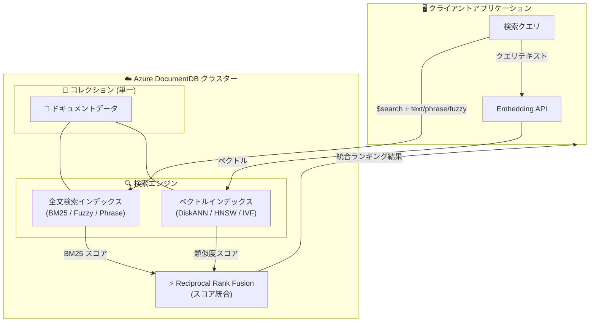

# Azure DocumentDB: 高度な全文検索 (ファジー検索、近接検索、BM25) プレビュー

**リリース日**: 2026-06-03

**サービス**: Azure DocumentDB

**機能**: 高度な全文検索 (ファジー検索、近接検索、BM25)

**ステータス**: In preview

[このアップデートのインフォグラフィックを見る](https://takech9203.github.io/azure-news-summary/20260603-documentdb-advanced-full-text-search.html)

## 概要

Microsoft Build 2026 にて、Azure DocumentDB に高度な全文検索機能がパブリックプレビューとして発表された。これにより、ファジー検索 (タイポ耐性)、近接検索 (フレーズ検索)、多言語サポートの拡充、BM25 ランキングアルゴリズムによる関連性スコアリングが単一のデータベース内で利用可能になる。

この機能の最大のポイントは、ベクトル検索と高度なテキスト検索を同一データベース・同一コレクション上で統合できることである。従来は全文検索のために別途検索サービス (Azure AI Search など) を立ち上げる必要があったが、DocumentDB 単体でベクトル検索とキーワード検索の両方を実行し、Reciprocal Rank Fusion (RRF) によるハイブリッド検索が可能になった。

新しい全文検索エンジンは `$search` 演算子を使用し、レガシーの `$text` 演算子や `{ field: "text" }` インデックスタイプを置き換える。検索インデックスは `createSearchIndexes` コマンドで作成され、BM25 スコアリングにより関連性の高い結果を返す。

**アップデート前の課題**

- 全文検索のために Azure AI Search などの別サービスの構築・管理が必要だった
- レガシーの `$text` 演算子ではファジー検索 (タイポ耐性) が利用できなかった
- レガシーの `$text` 演算子では近接検索 (フレーズの語順・距離指定) が利用できなかった
- ベクトル検索とキーワード検索を組み合わせたハイブリッド検索には複雑なアーキテクチャが必要だった

**アップデート後の改善**

- 単一データベース内でベクトル検索と全文検索を統合実行可能
- BM25 ランキングによる関連性ベースの検索結果が取得可能
- ファジー検索により、タイポや誤入力があっても適切な結果を返却
- フレーズ検索と近接検索 (slop パラメータ) により、語順を考慮した精密な検索が可能
- 別途検索クラスターの管理が不要に

## アーキテクチャ図



Azure DocumentDB では同一コレクション上に全文検索インデックスとベクトルインデックスの両方を構築し、RRF によるハイブリッド検索を単一クラスター内で完結できるアーキテクチャとなっている。

## サービスアップデートの詳細

### 主要機能

1. **BM25 キーワード検索**
   - 関連性ランキングアルゴリズム BM25 による検索結果のスコアリング
   - 用語頻度 (TF)、逆文書頻度 (IDF)、文書長正規化の3要素でランキング
   - `$search` + `text` 演算子で利用

2. **ファジー検索 (タイポ耐性)**
   - レーベンシュタイン編集距離に基づくタイポ許容検索
   - `fuzzy.maxEdits` パラメータで許容する編集距離を指定 (1 または 2)
   - 例: `bracXet` で `bracket` にマッチ (1文字置換)

3. **フレーズ検索と近接検索**
   - `$search` + `phrase` 演算子で語順を考慮した検索
   - `slop` パラメータで許容する介在トークン数を指定
   - slop: 0 で完全一致、slop: 3 で3トークンの介在を許容

4. **ハイブリッド検索 (BM25 + ベクトル)**
   - キーワード検索とベクトル類似検索を並列実行
   - Reciprocal Rank Fusion (RRF) でスコアを統合
   - `$unionWith` を使ったサーバーサイド RRF もサポート

## 技術仕様

| 項目 | 詳細 |
|------|------|
| 検索エンジン | BM25 スコアリング、アナライザー駆動 |
| クエリ演算子 | `$search` (集約パイプラインの最初のステージ) |
| インデックス作成 | `createSearchIndexes` コマンド |
| ファジー検索 maxEdits | 1 または 2 (デフォルト: 2) |
| 近接検索 slop | 0 以上の整数 |
| ベクトルインデックス種類 | DiskANN (推奨)、HNSW、IVF |
| ベクトル最大次元数 | 16,000 (Product Quantization 使用時) |
| 類似度メトリック | Cosine (COS)、L2 (Euclidean)、Inner Product (IP) |
| ステータス | Gated Preview |

## 設定方法

### 前提条件

1. Azure DocumentDB クラスターが作成済みであること
2. Gated Preview への参加申請 (mongodb-feedback@microsoft.com に連絡)

### 全文検索インデックスの作成

```javascript
// 全文検索インデックスの作成
db.runCommand({
  createSearchIndexes: "products",
  indexes: [
    {
      name: "idx_description_fts",
      definition: {
        mappings: {
          dynamic: false,
          fields: {
            description: { type: "string" }
          }
        }
      }
    }
  ]
});
```

### ハイブリッド検索のための両インデックス作成

```javascript
// ベクトルインデックスの追加作成 (DiskANN)
db.products.createIndex(
  { embedding: "cosmosSearch" },
  {
    name: "desc_diskann",
    cosmosSearchOptions: {
      kind: "vector-diskann",
      dimensions: 1536,
      similarity: "COS"
    }
  }
);
```

### クエリ例: ファジー検索

```javascript
db.products.aggregate([
  {
    $search: {
      index: "idx_description_fts",
      text: {
        query: "bracXet",
        path: "description",
        fuzzy: { maxEdits: 1 }
      }
    }
  },
  { $limit: 20 },
  { $project: { title: 1, score: { $meta: "searchScore" } } }
]);
```

### クエリ例: フレーズ検索 (近接検索)

```javascript
db.products.aggregate([
  {
    $search: {
      index: "idx_description_fts",
      phrase: {
        query: "water resistant jacket",
        path: "description",
        slop: 3
      }
    }
  },
  { $limit: 20 },
  { $project: { title: 1, score: { $meta: "searchScore" } } }
]);
```

## メリット

### ビジネス面

- 別途検索サービスを管理する運用負荷とコストの削減
- 単一データベースでの検索運用によるアーキテクチャの簡素化
- RAG (Retrieval-Augmented Generation) パイプラインの構築が容易に

### 技術面

- 同一コレクション上でベクトル検索と全文検索を統合し、データ同期が不要
- BM25 による高精度な関連性ランキング
- ファジー検索によるユーザー体験の向上 (タイポ耐性)
- RRF によるハイブリッド検索で、キーワードの正確性とセマンティックな柔軟性を両立
- MongoDB 互換 API により、既存の MongoDB ドライバーやツールからそのまま利用可能

## デメリット・制約事項

- 現時点では Gated Preview のため、利用には申請が必要 (mongodb-feedback@microsoft.com)
- `$search` + `phrase` と `fuzzy` を同一 `$search` 句内で組み合わせることはできない (別クエリ + RRF で対応)
- `dynamic: true` のインデックス定義はすべての文字列フィールドをインデックス化し、サイズが予測不能に膨らむため推奨されない
- カスタムアナライザー (大文字小文字区別なし検索、edgeGram プレフィックスマッチ) は今後のリリースで対応予定
- マルチフィールド検索インデックス (1インデックスで複数フィールド) は今後のリリースで対応予定
- `$search` + `compound` (should/must/minimumShouldMatch) は今後のリリースで対応予定

## ユースケース

### ユースケース 1: EC サイトの商品検索

**シナリオ**: ユーザーがタイポを含む検索クエリで商品を検索する場合、ファジー検索により正しい商品を返却し、ベクトル検索で意味的に関連する商品も推薦する。

**実装例**:

```javascript
// ファジー検索 + ベクトル検索のハイブリッド
// 1. キーワード検索 (ファジー)
const kwHits = await db.products.aggregate([
  { $search: {
      index: "idx_description_fts",
      text: { query: "wireles headphons", path: "description", fuzzy: { maxEdits: 1 } }
  }},
  { $limit: 50 },
  { $project: { _id: 1, score: { $meta: "searchScore" } } }
]).toArray();

// 2. ベクトル検索
const qv = await embed("wireless headphones");
const vecHits = await db.products.aggregate([
  { $search: { cosmosSearch: { path: "embedding", vector: qv, k: 50 } } },
  { $project: { _id: 1, score: { $meta: "searchScore" } } }
]).toArray();

// 3. RRF で統合
const results = rrf([kwHits, vecHits]);
```

**効果**: タイポがあっても正確な商品にヒットし、さらに類似商品も提示できる。

### ユースケース 2: RAG パイプラインのリトリーバル

**シナリオ**: ナレッジベースから LLM に渡すコンテキストを取得する際、ハイブリッド検索により固有名詞 (BM25) と意味的類似性 (ベクトル) の両方をカバーする。

**効果**: 固有名詞やエンティティ名のような正確なマッチと、言い換えや類義語を含むセマンティック検索を1回のクエリで実現できる。

## 関連サービス・機能

- **Azure DocumentDB ベクトル検索**: 同一クラスター上でネイティブに統合されるベクトルデータベース。DiskANN、HNSW、IVF をサポート
- **Azure AI Search**: 独立した検索サービス。より高度なカスタムアナライザーやスキルセットが必要な場合に選択
- **Azure OpenAI Service**: Embedding API を使用してベクトルを生成し、DocumentDB に格納して検索に利用
- **LangChain / Semantic Kernel**: DocumentDB をベクトルストアとして統合し、RAG パイプラインを構築可能

## 参考リンク

- [インフォグラフィック](https://takech9203.github.io/azure-news-summary/20260603-documentdb-advanced-full-text-search.html)
- [公式アップデート情報](https://azure.microsoft.com/updates?id=563077)
- [Azure Blog - Microsoft Build 2026: Building agentic apps with Microsoft Fabric and Microsoft Databases](https://azure.microsoft.com/en-us/blog/microsoft-build-2026-building-agentic-apps-with-microsoft-fabric-and-microsoft-databases/)
- [Full-Text Search Overview - Microsoft Learn](https://learn.microsoft.com/en-us/azure/documentdb/full-text-search-overview)
- [BM25 Keyword Search - Microsoft Learn](https://learn.microsoft.com/en-us/azure/documentdb/full-text-search-keyword)
- [Fuzzy Search - Microsoft Learn](https://learn.microsoft.com/en-us/azure/documentdb/full-text-search-fuzzy)
- [Phrase Search and Proximity Matching - Microsoft Learn](https://learn.microsoft.com/en-us/azure/documentdb/full-text-search-phrase-proximity)
- [Hybrid Search (BM25 + Vector) - Microsoft Learn](https://learn.microsoft.com/en-us/azure/documentdb/full-text-search-hybrid)
- [Vector Search - Microsoft Learn](https://learn.microsoft.com/en-us/azure/documentdb/vector-search)

## まとめ

Azure DocumentDB の高度な全文検索機能は、単一のデータベースでベクトル検索とテキスト検索を統合するという重要な一歩である。BM25 ランキング、ファジー検索、フレーズ/近接検索の追加により、従来は別途検索サービスが必要だったユースケースを DocumentDB 単体でカバーできるようになる。

特に RAG パイプラインやハイブリッド検索を構築する Solutions Architect にとって、アーキテクチャの簡素化とコスト削減の機会となる。現時点では Gated Preview であるため本番利用には申請が必要だが、Build 2026 での発表を踏まえ GA に向けた早期検証を推奨する。

**推奨アクション**:
1. Gated Preview への参加申請 (mongodb-feedback@microsoft.com)
2. 開発環境での全文検索インデックス作成とクエリ動作の検証
3. 既存の `$text` 演算子を使用している場合は、新しい `$search` エンジンへの移行計画を策定

---

**タグ**: #Azure #DocumentDB #FullTextSearch #BM25 #FuzzySearch #VectorSearch #HybridSearch #Build2026 #Preview #Database
