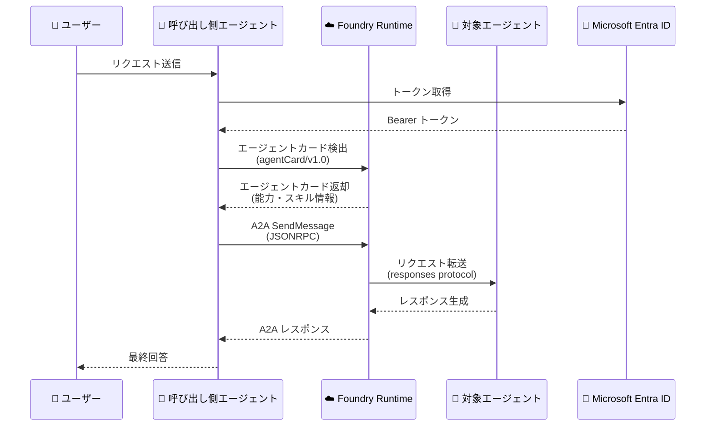

# Microsoft Foundry Agent Service: Agent-to-Agent (A2A) 通信サポート

**リリース日**: 2026-06-03

**サービス**: Microsoft Foundry Agent Service

**機能**: Agent-to-Agent (A2A) 通信サポート

**ステータス**: In preview

[このアップデートのインフォグラフィックを見る](https://takech9203.github.io/azure-news-summary/20260603-foundry-agent-service-a2a.html)

## 概要

Microsoft Foundry Agent Service に Agent-to-Agent (A2A) 通信機能がパブリックプレビューとして追加された。これにより、Foundry 上の Prompt agent および Hosted agent が、A2A プロトコルを通じて他のエージェントを名前で呼び出し、マネージドエンドポイント経由で連携できるようになる。

A2A プロトコルはオープンな標準仕様 (a2a-protocol.org) に準拠しており、バージョン 1.0 および 0.3 がサポートされている。エージェントは「エージェントカード」を公開することで自身の能力を他のエージェントに宣言し、呼び出し側のエージェントはそのカードを検出して通信を開始する。Microsoft Entra ID による認証、コンテンツセーフティ、エンドツーエンドのトレーシングが組み込まれている。

**アップデート前の課題**

- エージェント同士が連携するには、独自のインテグレーションコードや中間レイヤーを構築する必要があった
- マルチエージェントシステムにおける認証・認可の管理が複雑だった
- エージェント間通信の可観測性（トレーシング、メトリクス）を個別に実装する必要があった

**アップデート後の改善**

- A2A プロトコルに準拠した標準的な方法でエージェント間通信が可能になった
- Microsoft Entra ID ベースの認証が組み込みで提供され、RBAC によるアクセス制御が利用できる
- Foundry プラットフォームの観測性機能（Application Insights 連携、トレーシング）が A2A 通信にも適用される

## アーキテクチャ図



呼び出し側エージェントが対象エージェントの A2A エンドポイントを発見し、Microsoft Entra ID 認証を経て JSONRPC ベースの A2A プロトコルでメッセージを送信するフロー。Foundry Runtime がエンドポイント管理、認証検証、コンテンツフィルタリング、トレーシングを担う。

## サービスアップデートの詳細

### 主要機能

1. **エージェントカードによる能力宣言**
   - エージェントの説明、バージョン、スキル（能力）を JSON 形式で定義
   - 他のエージェントがカードを検出（discovery）して呼び出し可能なスキルを把握
   - v1.0 カードと v0.3 カードの両方を同一ベースパスから提供

2. **A2A プロトコルによる標準通信**
   - オープン標準の A2A プロトコル (a2a-protocol.org) に準拠
   - バージョン 1.0 (JSONRPC) およびバージョン 0.3 (HTTP+JSON / JSONRPC) をサポート
   - バージョンネゴシエーションはエージェントカード、HTTP ヘッダー、クエリ文字列で指定可能

3. **Microsoft Entra ID による認証**
   - 全ての A2A リクエストに Microsoft Entra ID 認証が必須
   - On-Behalf-Of (OBO) パターンによるエンドユーザー ID のパススルーに対応
   - サービス ID（エージェント ID、サービスプリンシパル、マネージド ID）による認証に対応

4. **A2APreviewTool による簡易連携**
   - Foundry エージェントから他の A2A エージェントを呼び出すためのツールが SDK で提供
   - 接続（Connection）リソースを作成し、ツールとしてエージェントに追加するだけで連携可能

## 技術仕様

| 項目 | 詳細 |
|------|------|
| プロトコルバージョン | A2A v1.0 (推奨)、v0.3 (既存統合向け) |
| トランスポート (v1.0) | JSONRPC のみ |
| トランスポート (v0.3) | HTTP+JSON、JSONRPC |
| 対応モダリティ | テキストのみ (ファイルデータ非対応) |
| ストリーミング | 非対応 (SSE 非対応) |
| 認証方式 | Microsoft Entra ID 必須 (キーベース・匿名アクセス非対応) |
| 必要ロール | Foundry User 以上 |
| エージェントカード URL | `…/agents/{agent}/endpoint/protocols/a2a/agentCard/v1.0` |
| A2A ベースパス | `…/agents/{agent}/endpoint/protocols/a2a` |

## 設定方法

### 前提条件

1. アクティブな Foundry プロジェクトを持つ Azure サブスクリプション
2. Responses protocol を使用するデプロイ済みエージェント (Prompt agent または対応する Hosted agent)
3. Foundry User 以上の Azure ロール

### REST API (Bash)

```bash
# 変数設定
BASE_URL="https://{account}.services.ai.azure.com/api/projects/{project}"
AGENT_NAME="your-agent-name"
TOKEN=$(az account get-access-token --resource https://ai.azure.com \
  --query accessToken -o tsv)

# A2A エンドポイントの有効化とエージェントカードの設定
curl -X PATCH "$BASE_URL/agents/$AGENT_NAME?api-version=v1" \
  -H "Authorization: Bearer $TOKEN" \
  -H "Content-Type: application/json" \
  -d '{
    "agent_card": {
      "description": "A helpful assistant that answers questions",
      "version": "1.0",
      "skills": [
        {
          "id": "general-qa",
          "name": "General Q&A",
          "description": "Answers general questions"
        }
      ]
    },
    "agent_endpoint": {
      "protocols": ["responses", "a2a"]
    }
  }'
```

### Python SDK

```python
from azure.identity import DefaultAzureCredential
from azure.ai.projects import AIProjectClient
from azure.ai.projects.models import (
    AgentEndpoint,
    AgentEndpointProtocol,
)

PROJECT_ENDPOINT = "https://{account}.ai.azure.com/api/projects/{project}"
AGENT_NAME = "your_agent_name"

project_client = AIProjectClient(
    endpoint=PROJECT_ENDPOINT,
    credential=DefaultAzureCredential(),
)

endpoint_config = AgentEndpoint(
    protocols=[
        AgentEndpointProtocol.RESPONSES,
        AgentEndpointProtocol.A2A,
    ],
)

patched_agent = project_client.beta.agents.patch_agent_details(
    agent_name=AGENT_NAME,
    agent_endpoint=endpoint_config,
)
```

## メリット

### ビジネス面

- マルチエージェントシステムの構築が標準化され、開発コストと時間を削減できる
- エージェント間の責務分離により、専門化されたエージェントを組み合わせた柔軟なワークフロー構築が可能
- オープン標準 (A2A プロトコル) 準拠により、ベンダーロックインを回避しやすい

### 技術面

- 認証・認可がプラットフォームレベルで組み込み済みのため、セキュリティ実装の負担が軽減
- エンドツーエンドのトレーシングにより、マルチエージェント間のデバッグと監視が容易
- コンテンツセーフティフィルターが A2A 通信にも適用され、安全性が担保される
- エージェントカードによるディスカバリで、疎結合なマルチエージェントアーキテクチャを実現

## デメリット・制約事項

- テキストモダリティのみ対応（ファイルデータや画像などの非テキストモダリティは非対応）
- ストリーミングレスポンス（Server-Sent Events）は非対応
- A2A v1.0 では JSONRPC トランスポートのみサポート（HTTP+JSON は v0.3 のみ）
- Responses protocol を使用しないエージェントは A2A エンドポイントとして公開不可
- Foundry ポータルからの A2A 有効化は未対応（REST API または SDK が必要）
- エージェントカードの Python SDK からの設定は未対応
- パブリックプレビューのため、本番ワークロードへの使用は非推奨

## ユースケース

### ユースケース 1: 専門エージェントへのタスク委譲

**シナリオ**: フロントエンドの汎用アシスタントエージェントが、ユーザーのリクエスト内容に応じて専門エージェント（データ分析、ドキュメント検索、コード生成など）に処理を委譲する。

**実装例**:

```python
from azure.ai.projects.models import (
    PromptAgentDefinition,
    A2APreviewTool,
)

# A2A 接続を通じて対象エージェントのツールを追加
a2a_connection = project.connections.get("data-analyst-agent")
tool = A2APreviewTool(project_connection_id=a2a_connection.id)

# 呼び出し側エージェントにツールとして追加
agent = project.agents.create_version(
    agent_name="orchestrator-agent",
    definition=PromptAgentDefinition(
        model="gpt-4.1-mini",
        instructions="タスクの内容に応じて適切な専門エージェントに委譲してください。",
        tools=[tool],
    ),
)
```

**効果**: 個々のエージェントを専門分野に特化させることで精度が向上し、新しい専門エージェントの追加も既存システムに影響を与えずに行える。

### ユースケース 2: クロスプロジェクト・クロス組織連携

**シナリオ**: 異なる Foundry プロジェクトや組織にデプロイされたエージェント同士が、A2A プロトコルを通じてセキュアに連携する。

**効果**: Microsoft Entra ID による認証と RBAC を活用し、組織境界を越えたエージェント連携をゼロトラストの原則で実現できる。

## 関連サービス・機能

- **Microsoft Foundry Agent Service (Responses API)**: A2A の基盤となる統合 API エンドポイント。全エージェントタイプへのモデル推論・ツールアクセスを提供
- **Microsoft Entra ID**: A2A 通信の認証基盤。OBO パターンやサービス ID による認証をサポート
- **Azure Application Insights**: エージェント間通信のトレーシング・メトリクス収集
- **Foundry Content Safety**: A2A 通信にも適用されるコンテンツフィルタリング
- **Entra Agent Registry**: エージェントの発行・共有基盤

## 参考リンク

- [インフォグラフィック](https://takech9203.github.io/azure-news-summary/20260603-foundry-agent-service-a2a.html)
- [公式アップデート情報](https://azure.microsoft.com/updates?id=563716)
- [Microsoft Blog - AI alone won't change your business. The system running it will.](https://blogs.microsoft.com/blog/2026/06/02/ai-alone-wont-change-your-business-the-system-running-it-will/)
- [Microsoft Learn - Enable incoming A2A on a Foundry agent](https://learn.microsoft.com/en-us/azure/foundry/agents/how-to/enable-agent-to-agent-endpoint)
- [Microsoft Learn - What is Microsoft Foundry Agent Service?](https://learn.microsoft.com/en-us/azure/foundry/agents/overview)
- [A2A Protocol 仕様](https://a2a-protocol.org/latest/)

## まとめ

Microsoft Foundry Agent Service の A2A 通信サポートは、マルチエージェントシステムの構築を標準化するための重要なステップである。オープン標準の A2A プロトコルに準拠しつつ、Microsoft Entra ID 認証、コンテンツセーフティ、観測性といったエンタープライズ要件がプラットフォームレベルで組み込まれている点が特徴的だ。

現時点ではテキストモダリティのみ対応でストリーミング非対応という制約があるが、パブリックプレビュー段階としては十分な機能を備えている。Solutions Architect としては、マルチエージェントアーキテクチャの設計パターンを検討し、A2A プロトコルの仕様理解とエージェントカードの設計方針を早期に固めておくことを推奨する。

---

**タグ**: #MicrosoftFoundry #AgentService #A2A #AgentToAgent #MultiAgent #AI #MachineLearning #PublicPreview #Build2026
