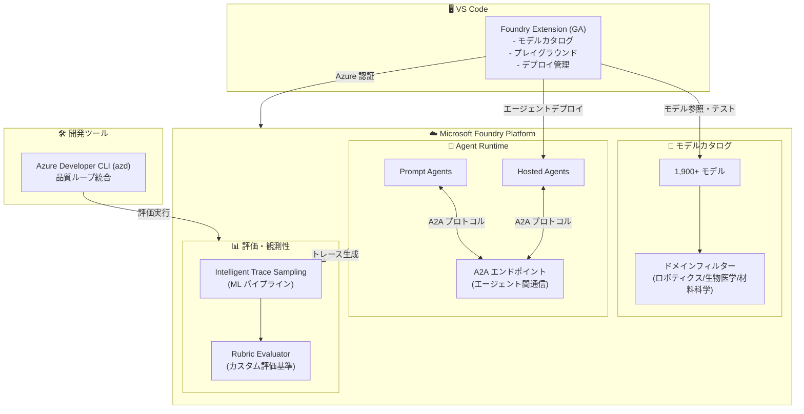

# Microsoft Foundry: VS Code 拡張機能 GA と Build 2026 Day 2 プラットフォームアップデート

**リリース日**: 2026-06-03

**サービス**: Microsoft Foundry

**機能**: VS Code 拡張機能 GA、A2A サポート、評価機能強化

**ステータス**: Launched (GA) / In preview

[このアップデートのインフォグラフィックを見る](https://takech9203.github.io/azure-news-summary/20260603-foundry-build-day2-platform.html)

## 概要

Microsoft Build 2026 Day 2 において、Microsoft Foundry プラットフォームに関する 6 件のアップデートが発表された。GA（一般提供開始）として 1 件、パブリックプレビューとして 5 件のアップデートが含まれる。本アップデート群は、開発者体験（VS Code 拡張機能）、エージェント間連携（A2A）、品質保証・評価機能（Intelligent Trace Sampling、Rubric evaluator、azd CLI 統合）、モデル発見性（ドメインフィルター）を横断的に強化するものである。

中心となるのは Microsoft Foundry for VS Code 拡張機能の GA である。開発者は VS Code エディタ内から直接、1,900 以上のモデルカタログへのアクセス、モデルプレイグラウンドでのプロンプトテスト、Hosted Agent のデプロイまでを完結できるようになった。Azure アカウントでサインインするだけで、Microsoft、OpenAI、Anthropic、Mistral、Meta、DeepSeek など主要プロバイダーのモデルを探索・評価・デプロイできる統合開発環境が実現された。

加えて、Agent-to-Agent（A2A）通信のプレビュー、評価パイプラインの自動化（Intelligent Trace Sampling、Rubric evaluator）、Azure Developer CLI（azd）による品質ループの統合など、エージェント開発のライフサイクル全体をカバーする機能強化が行われている。

**アップデート前の課題**

- Foundry のモデルカタログやエージェントデプロイにはポータルやCLIへの切り替えが必要で、開発フローが中断されていた
- エージェント間の連携には独自のルーティングロジック、認証管理、エラーハンドリングの実装が必要だった
- 評価実行時のトレースが大量に生成され、どのトレースを分析すべきか人手で選別する必要があった
- 評価基準の定義が標準化されておらず、チームごとに異なる評価方法が使われていた
- 1,900 以上のモデルカタログから目的に合ったモデルを見つけるには汎用的なキーワード検索しかなかった

**アップデート後の改善**

- VS Code 内でモデル探索からデプロイまで完結し、開発者のコンテキスト切り替えコストが大幅に削減
- A2A プロトコルにより、エージェントが名前で他のエージェントを呼び出し可能となり、マルチエージェント構成が標準化
- Intelligent Trace Sampling が ML パイプラインで代表的なトレースを自動選別し、評価効率が向上
- Rubric evaluator によりコンテキスト固有の評価基準をプロンプトとスコアリングルーブリックで定義可能に
- ドメインフィルターにより、ロボティクス・生物医学・材料科学などの専門分野でのモデル発見が容易に

## アーキテクチャ図



VS Code 拡張機能を起点とした Foundry プラットフォームの開発者体験を示す。エディタからモデルカタログ参照・エージェントデプロイ・A2A 連携・評価パイプラインまでが統合されている。

## サービスアップデートの詳細

### GA（一般提供開始）- 1 件

#### 1. Microsoft Foundry for Visual Studio Code（Build 2026 refresh）

**ステータス**: Launched (GA)

Microsoft Foundry の VS Code 拡張機能が Build 2026 リフレッシュとして GA を迎えた。本拡張機能により、開発者はエディタを離れることなく Foundry プラットフォームの主要機能にアクセスできる。

**主要機能:**

- **モデルカタログブラウジング**: 1,900 以上のモデルを VS Code 内で検索・フィルタリング。Microsoft、OpenAI、Anthropic、Mistral、xAI、Meta、DeepSeek、Hugging Face などのプロバイダーをカバー
- **モデルプレイグラウンド**: エディタ内でプロンプトをテストし、モデルの応答品質を即座に確認。パラメータ調整も GUI で実行可能
- **Hosted Agent デプロイ**: エージェントのコンテナ化・デプロイ・管理をエディタ内のワークフローで完結
- **Azure アカウント統合**: Azure アカウントでサインインするだけで、サブスクリプション配下の Foundry リソースに即座にアクセス
- **プロジェクト管理**: Foundry プロジェクトの作成・切り替え・リソース管理をサイドバーから実行

**前提条件:**
- Visual Studio Code（最新版推奨）
- Azure アカウント（Azure サブスクリプション）
- Microsoft Foundry リソース（プロジェクト）

---

### Preview（パブリックプレビュー）- 5 件

#### 2. Agent-to-agent（A2A）support for Prompt agents and Hosted agents

**ステータス**: In preview

Foundry の Prompt Agents および Hosted Agents に Agent-to-Agent（A2A）通信のサポートが追加された。エージェントがマネージドエンドポイントを通じて名前で他のエージェントを呼び出せるようになり、マルチエージェントアーキテクチャの構築が標準化される。

**主要な特徴:**

- **名前ベースの呼び出し**: エージェントが他のエージェントをサービス名で発見・呼び出し可能
- **マネージドエンドポイント**: Foundry がエンドポイントのルーティング・負荷分散を管理
- **ID ベースの認証**: Microsoft Entra ID による相互認証でセキュアな通信を保証
- **コンテンツセーフティ統合**: エージェント間のメッセージにコンテンツフィルタリングを自動適用
- **オブザーバビリティ**: A2A 呼び出しのトレース・レイテンシ・エラー率を自動記録

**ユースケース例:**
- 専門エージェント（検索、計算、データ変換）を組み合わせたオーケストレーション
- 部門別エージェントの連携（営業エージェント → 在庫確認エージェント → 配送エージェント）
- レビュー・承認ワークフローでのエージェント間ハンドオフ

#### 3. Evaluations with Intelligent Trace Sampling

**ステータス**: In preview

Foundry のオブザーバビリティ機能に Intelligent Trace Sampling が追加された。多段階の ML パイプラインにより、大量の実行トレースから代表的なサブセットを自動選別し、評価の効率と精度を両立する。

**動作の仕組み:**

- **多段階 ML パイプライン**: トレースの特徴量（レイテンシ、トークン数、エラー有無、ユーザーフィードバックなど）を分析し、代表的なサンプルを選出
- **インテリジェントフィルタリング**: ノイズの多い正常系トレースを間引きつつ、エッジケースや異常パターンは優先的にサンプリング
- **評価コスト最適化**: 全トレースに対して評価を実行する必要がなくなり、LLM ベースの評価コストを大幅に削減

**メリット:**
- 大規模本番環境のトレースから品質評価に必要な最小限のサンプルを自動抽出
- 評価実行時間とコスト（LLM-as-judge のトークン消費）を最適化
- バイアスの少ない代表サンプルにより、評価結果の信頼性を維持

#### 4. Rubric evaluator in Microsoft Foundry

**ステータス**: In preview

Foundry に Rubric evaluator が追加された。エージェントプロンプト、プロダクションデータ、スコアリングルーブリックを使用して、コンテキスト固有の評価基準を定義し、シングルターンおよびマルチターンのエージェントフローを定量的に評価できる。

**主要な特徴:**

- **カスタム評価基準の定義**: ドメイン固有の品質基準をルーブリック形式（スコアと説明のマッピング）で記述
- **エージェントプロンプトベース**: 評価者自体が AI エージェントとして動作し、プロンプトで評価ロジックを制御
- **プロダクションデータ活用**: 実際の本番トレースデータを評価対象として直接使用可能
- **マルチターン対応**: 複数ターンにわたる会話フローの一貫性・品質を評価

**ルーブリック例:**

| スコア | 基準 |
|--------|------|
| 5 | 回答が完全に正確で、ユーザーの意図を正しく理解し、適切な行動を実行 |
| 4 | 回答は概ね正確だが、軽微な情報の欠落あり |
| 3 | 回答は部分的に正確だが、重要な情報が不足 |
| 2 | 回答が不正確で、ユーザーの意図を誤解 |
| 1 | 回答が全く関連性がない、またはエラーで応答不可 |

#### 5. Observability developer experience in Azure Developer CLI（azd）

**ステータス**: In preview

Azure Developer CLI（azd）に評価体験が統合され、Foundry で作成したエージェントに対して測定可能な品質ループを追加できるようになった。

**主要な特徴:**

- **azd CLI からの評価実行**: `azd` コマンドラインから直接、エージェントの品質評価を実行
- **CI/CD パイプライン統合**: GitHub Actions や Azure DevOps パイプラインに評価ステップを組み込み可能
- **品質ゲート**: 評価スコアが閾値を下回った場合にデプロイを自動ブロック
- **開発者フレンドリー**: ローカル開発環境で即座に評価を実行し、コード変更の影響を確認

**ワークフロー例:**
```
コード変更 → azd evaluate → スコア確認 → デプロイ判断
```

#### 6. Domain filter for specialized model discovery in Foundry model catalog

**ステータス**: In preview

Foundry モデルカタログにドメインフィルターが追加された。1,900 以上のモデルを業界・ユースケース別に絞り込むことが可能になり、専門分野向けモデルの発見性が大幅に向上する。

**対応ドメイン:**

- ロボティクス
- 生物医学（Biomedical Sciences）
- 材料科学（Materials Science）
- その他の産業固有ドメイン

**メリット:**
- 汎用的なキーワード検索では見つけにくい専門モデルを迅速に発見
- ドメイン知識がなくても、適切なモデル候補を絞り込み可能
- 組織のユースケースに最適なモデルの選定を加速

## 技術仕様

| 項目 | 詳細 |
|------|------|
| VS Code 拡張機能 | GA（Build 2026 refresh） |
| 対応モデル数 | 1,900 以上 |
| 認証方式 | Azure アカウント（Microsoft Entra ID） |
| A2A プロトコル | マネージドエンドポイント経由の名前ベース呼び出し |
| A2A セキュリティ | Microsoft Entra ID 相互認証 + コンテンツセーフティ |
| Trace Sampling | 多段階 ML パイプラインによる自動サンプリング |
| Rubric evaluator | シングルターン / マルチターン対応 |
| azd 統合 | CLI ベースの評価実行・品質ゲート |
| ドメインフィルター | ロボティクス、生物医学、材料科学ほか |
| 対応言語（SDK） | Python、C#、TypeScript (preview)、Java (preview) |

## メリット

### ビジネス面

- VS Code 拡張機能 GA により、開発者がポータルへの切り替え不要でモデル評価・デプロイが可能となり、開発速度が向上
- A2A サポートにより、専門エージェントの組み合わせで複雑なビジネスプロセスを自動化可能
- Intelligent Trace Sampling により、大規模環境での評価コスト（LLM-as-judge のトークン消費）を大幅に削減
- ドメインフィルターにより、専門分野でのモデル選定時間を短縮し、PoC の立ち上げを加速

### 技術面

- エディタ内完結のワークフローにより、開発者のコンテキストスイッチが最小化され、生産性が向上
- A2A のマネージドエンドポイントにより、エージェント間通信のルーティング・認証・監視が自動化
- Rubric evaluator のカスタム評価基準により、ドメイン固有の品質要件を定量的に管理可能
- azd CLI 統合により、評価を CI/CD パイプラインに組み込み、品質の継続的モニタリングが実現

## デメリット・制約事項

- VS Code 拡張機能は VS Code 環境に限定されるため、JetBrains IDE ユーザーは利用不可
- A2A サポートはパブリックプレビューのため、API や動作が変更される可能性あり
- Intelligent Trace Sampling の ML パイプラインはブラックボックス的であり、サンプリング結果のカスタマイズには制約がある
- Rubric evaluator の品質は評価プロンプトの設計に大きく依存し、適切なルーブリック設計にはドメイン知識が必要
- ドメインフィルターの対応分野は限定的であり、すべての産業ドメインをカバーしているわけではない
- プレビュー機能全般について、SLA の保証はなく本番環境での利用は推奨されない

## ユースケース

### ユースケース 1: エディタ内完結のエージェント開発サイクル

**シナリオ**: 開発者が VS Code 内でエージェントの設計・テスト・デプロイ・評価を一気通貫で実行する。

**ワークフロー**:
1. VS Code Foundry 拡張機能でモデルカタログからドメインフィルターで適切なモデルを選択
2. プレイグラウンドでプロンプトをテストし、最適なパラメータを決定
3. エージェントコードを実装し、Hosted Agent としてデプロイ
4. azd CLI で評価を実行し、品質スコアを確認
5. A2A エンドポイントを有効化し、他のエージェントから呼び出し可能に

**効果**: 開発者がエディタを離れることなく、エージェント開発の全ライフサイクルをカバー

### ユースケース 2: マルチエージェントによるカスタマーサポート自動化

**シナリオ**: 複数の専門エージェントを A2A で連携させ、カスタマーサポートの問い合わせを自動処理する。

**構成例**:
- フロントエージェント: ユーザーの意図を分類
- FAQ エージェント: 一般的な質問に回答
- テクニカルサポートエージェント: 技術的な問題を診断
- エスカレーションエージェント: 人間のオペレーターにハンドオフ

**評価パイプライン**:
- Intelligent Trace Sampling で代表的な会話を自動抽出
- Rubric evaluator でエージェント間のハンドオフ品質を評価
- azd CLI で日次評価を自動実行し、品質の低下を早期検知

**効果**: エージェント間の連携品質を定量的に管理しながら、サポート業務を段階的に自動化

### ユースケース 3: 専門分野でのモデル選定と評価

**シナリオ**: 製薬企業の研究者が、生物医学分野に特化したモデルを選定し、薬物相互作用の予測精度を評価する。

**ワークフロー**:
1. ドメインフィルター（Biomedical Sciences）で候補モデルを絞り込み
2. VS Code プレイグラウンドで各モデルの応答品質を比較
3. Rubric evaluator で専門家が定義した評価基準（正確性、根拠の提示、安全性）に基づきスコアリング
4. 最適なモデルを Hosted Agent としてデプロイ

**効果**: ドメイン固有の品質基準に基づく客観的なモデル選定プロセスの実現

## 関連サービス・機能

- **Hosted Agents（GA - 2026-06-02）**: A2A エンドポイントの実行基盤。コンテナ化エージェントのマネージドホスティング
- **Foundry Memory（Preview refresh - 2026-06-02）**: エージェントの長期記憶。A2A で連携するエージェント間でのコンテキスト共有に活用可能
- **Model Router**: 複数モデルへのリクエストルーティング。ドメインフィルターで選定したモデルへの自動振り分け
- **Foundry Agent Service**: Prompt Agents / Hosted Agents の統合管理基盤
- **Application Insights**: エージェントの実行トレース収集。Intelligent Trace Sampling のデータソース
- **Azure Developer CLI（azd）**: インフラのプロビジョニングからデプロイ、評価までを統合する CLI ツール

## 参考リンク

- [インフォグラフィック](https://takech9203.github.io/azure-news-summary/20260603-foundry-build-day2-platform.html)
- [Microsoft Foundry for VS Code - GA](https://azure.microsoft.com/updates?id=563721)
- [A2A support for Prompt agents and Hosted agents](https://azure.microsoft.com/updates?id=563716)
- [Evaluations with Intelligent Trace Sampling](https://azure.microsoft.com/updates?id=563696)
- [Rubric evaluator in Microsoft Foundry](https://azure.microsoft.com/updates?id=563656)
- [Observability in Azure Developer CLI](https://azure.microsoft.com/updates?id=563736)
- [Domain filter for model catalog](https://azure.microsoft.com/updates?id=563731)
- [Microsoft Foundry ドキュメント](https://learn.microsoft.com/azure/ai-foundry/what-is-ai-foundry)
- [Foundry for VS Code](https://learn.microsoft.com/azure/ai-foundry/how-to/develop/get-started-projects-vs-code)
- [A2A agent endpoints](https://learn.microsoft.com/azure/ai-foundry/agents/how-to/enable-agent-to-agent-endpoint)

## まとめ

Build 2026 Day 2 における Microsoft Foundry のアップデートは、開発者体験の統合と品質保証の自動化という 2 つの軸で構成されている。VS Code 拡張機能の GA により、モデル探索からエージェントデプロイまでをエディタ内で完結する開発ワークフローが確立された。同時に、A2A プロトコル、Intelligent Trace Sampling、Rubric evaluator、azd CLI 統合により、マルチエージェント構成の品質を継続的に測定・改善するパイプラインの構築が可能になった。

Solutions Architect として推奨される次のアクション:
- VS Code Foundry 拡張機能をインストールし、チームの標準開発環境に組み込む
- 既存のエージェントに A2A エンドポイントを設定し、マルチエージェント連携の検証を開始する
- Rubric evaluator でドメイン固有の評価基準を定義し、品質の定量管理を開始する
- azd CLI の評価機能を CI/CD パイプラインに組み込み、デプロイ前の品質ゲートを自動化する
- ドメインフィルターを活用して、自社の業界に特化したモデルの評価を実施する

---

**タグ**: #Microsoft-Foundry #VS-Code #A2A #Evaluations #Build2026 #IntelligentTraceSampling #RubricEvaluator #AzureDeveloperCLI #ModelCatalog
