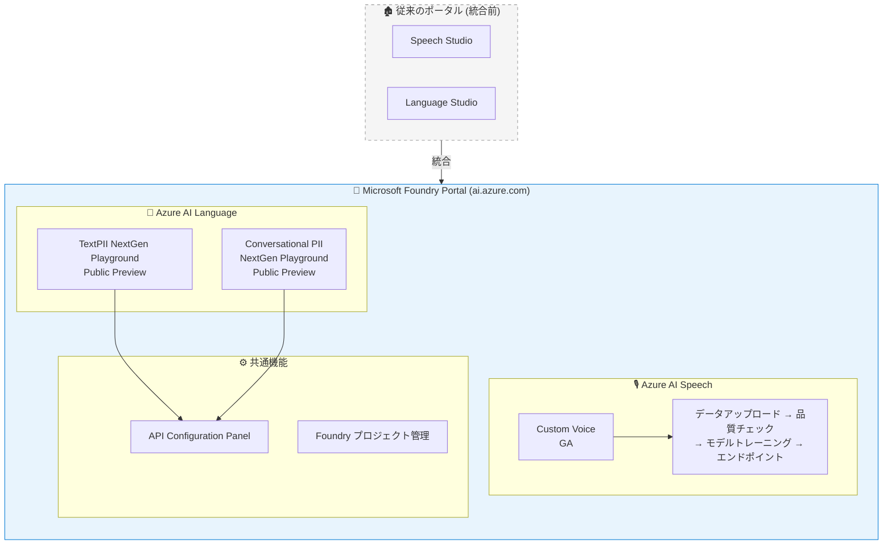

# Microsoft Foundry: Custom Voice ポータル GA と PII プレイグラウンド更新

**リリース日**: 2026-06-03

**サービス**: Microsoft Foundry / Azure AI Speech / Azure AI Language

**機能**: Custom Voice ポータル統合、Conversational PII NextGen Playground、TextPII NextGen Playground

**ステータス**: Launched (GA) / In preview

[このアップデートのインフォグラフィックを見る](https://takech9203.github.io/azure-news-summary/20260603-foundry-custom-voice-pii-playground.html)

## 概要

Microsoft Foundry ポータルにおいて、Azure AI Speech の Custom Voice オーサリング体験が一般提供 (GA) となり、同時に Azure AI Language の PII (個人情報) 検出機能の NextGen Playground が Public Preview として更新された。これら 3 つのアップデートは、従来 Speech Studio や Language Studio など個別のポータルに分散していた AI サービスの管理・テスト体験を、Microsoft Foundry ポータルに統合する動きの一環である。

Custom Voice については、承認済み顧客がボイスタレントの録音データと同意書をアップロードし、データ品質チェックを実行し、ニューラル音声モデルをトレーニングし、エンドポイントを管理する一連のワークフローが Foundry ポータル内で完結するようになった。PII Playground については、TextPII と Conversational PII の両方で NextGen Playground が更新され、API Configuration Panel の刷新や Ignite 2025 で発表されたプレビュー機能へのアクセスが可能になった。

**アップデート前の課題**

- Custom Voice のオーサリングは Speech Studio (speech.microsoft.com) で行う必要があり、他の AI サービスとポータルが分離していた
- PII 検出のテストには個別の Language Studio を使用する必要があり、API 構成の検証が煩雑だった
- 会話形式の PII 検出を本番統合前にテストする専用のプレイグラウンドが存在しなかった
- 開発者は複数のポータル間を行き来する必要があり、プロジェクト管理が分散していた

**アップデート後の改善**

- Custom Voice の全ワークフロー (データアップロード、品質チェック、トレーニング、デプロイ) が Microsoft Foundry ポータルで完結
- Conversational PII NextGen Playground でトランスクリプト入力による PII 検出テストが可能に
- TextPII NextGen Playground で Ignite 2025 のプレビュー機能を含む API Configuration Panel が利用可能
- すべての AI サービス (Speech、Language、Vision 等) を単一ポータルで管理・テストできる統合体験

## アーキテクチャ図



Microsoft Foundry ポータルが、従来 Speech Studio と Language Studio に分散していた Custom Voice オーサリングと PII テスト機能を統合的に提供する。開発者は単一のポータルから AI Speech と AI Language の機能にアクセスし、共通の API Configuration Panel とプロジェクト管理機能を活用できる。

## サービスアップデートの詳細

### 1. Custom Voice ポータル体験 (GA)

Custom Voice は、テキスト読み上げ (TTS) 機能の一つで、アプリケーション向けに独自のカスタマイズされた合成音声を作成できる。今回、この機能のオーサリング体験が Microsoft Foundry ポータルで一般提供 (GA) となった。

**主要機能:**

1. **ボイスタレント管理**
   - 音声タレントの同意声明の録音をアップロード
   - 限定アクセス (Limited Access) ポリシーに基づく承認プロセス

2. **データ準備と品質チェック**
   - 録音データと対応スクリプトのアップロード
   - 自動データ品質チェック (信号対雑音比、一貫性など)
   - 最低 300 発話以上のファインチューニングデータ

3. **モデルトレーニング**
   - ニューラル TTS 技術と多言語・多話者ユニバーサルモデルに基づくトレーニング
   - 発話スタイル (感情表現) のカスタマイズ
   - 多言語対応の音声生成

4. **エンドポイント管理**
   - カスタムエンドポイントへのデプロイ
   - REST API および Speech SDK での利用
   - SSML (Speech Synthesis Markup Language) による音声調整

### 2. Conversational PII NextGen Playground (Public Preview)

会話形式の PII 検出を視覚的にテストできる新しいプレイグラウンドが追加された。

**主要機能:**

1. **トランスクリプト入力**
   - マルチスピーカーの対話形式でテキストを入力
   - ターンベースの会話構造に対応
   - コールセンタートランスクリプトなどのテスト

2. **API Configuration Panel**
   - API パラメータの設定と検証
   - エンティティカテゴリの選択
   - マスキングスタイルの構成
   - 非同期ジョブ処理のテスト

3. **検出結果の可視化**
   - 検出エンティティのカテゴリ、サブカテゴリ、信頼度スコア表示
   - 墨消し済み会話出力のプレビュー
   - 複数話者にわたる PII 検出の確認

### 3. TextPII NextGen Playground 更新 (Public Preview)

既存の TextPII Playground が更新され、新しい API Configuration Panel と Ignite 2025 プレビュー機能が追加された。

**主要機能:**

1. **刷新された API Configuration Panel**
   - Ignite 2025 で発表されたプレビュー機能へのアクセス
   - 定義済み PII カテゴリの選択
   - 墨消しモード (Redaction mode) の設定

2. **テスト機能の強化**
   - 事前定義された PII カテゴリでのテスト
   - 複数の墨消しモード検証
   - API 統合前の検出精度検証

## 技術仕様

| 項目 | 詳細 |
|------|------|
| Custom Voice - 最小データ量 | 300 発話以上 |
| Custom Voice - アクセス制限 | Limited Access (申請フォームによる承認制) |
| Custom Voice - 音声技術 | ニューラル TTS、多言語・多話者ユニバーサルモデル |
| Custom Voice - 調整方法 | SSML (ピッチ、速度、イントネーション、発音) |
| Conversational PII - 処理方式 | 非同期ジョブベース |
| Conversational PII - API バージョン | 2026-11-15-preview |
| Conversational PII - モデルバージョン | 2026-04-15-preview |
| TextPII - API バージョン | 2026-05-15-preview |
| TextPII - 処理方式 | 同期 (リアルタイム) |
| PII 検出出力 | エンティティカテゴリ、信頼度スコア、墨消し結果 |

## メリット

### ビジネス面

- **統合ポータル体験**: 複数のスタジオを切り替える必要がなくなり、開発者の生産性が向上
- **ブランドボイスの構築**: 企業固有の合成音声を作成し、カスタマーエクスペリエンスの一貫性を確保
- **コンプライアンス対応の迅速化**: PII 検出の事前テストにより、プライバシー要件への適合を本番統合前に確認可能
- **開発サイクルの短縮**: プレイグラウンドでの即時テストにより、API 統合の試行錯誤を削減

### 技術面

- **エンドツーエンドのワークフロー統合**: データ準備からデプロイまでを単一ポータルで完結
- **API 構成の事前検証**: プレイグラウンドで API パラメータを検証し、実装時の不具合を早期発見
- **会話コンテキストの考慮**: Conversational PII は話者境界と会話文脈を考慮した検出が可能
- **REST API / SDK との一貫性**: プレイグラウンドでの検証結果がそのまま API 実装に適用可能

## デメリット・制約事項

- **Custom Voice のアクセス制限**: Limited Access ポリシーにより、利用には事前承認が必要 (申請フォーム: https://aka.ms/customneural)
- **PII Playground はプレビュー段階**: Conversational PII NextGen Playground および TextPII NextGen Playground はまだ Public Preview であり、本番利用には注意が必要
- **プレビュー API バージョンの制約**: プレビュー機能は Microsoft Product Terms の「Previews」条件が適用され、GA 時に仕様変更の可能性がある
- **Custom Voice のデータ要件**: 高品質モデル作成にはプロフェッショナル品質の録音スタジオ環境が推奨される
- **Speech Studio からの移行**: 既存の Speech Studio ユーザーは Foundry ポータルへの移行が必要になる可能性がある

## ユースケース

### ユースケース 1: ブランドボイスによる顧客対応自動化

**シナリオ**: 大手小売企業が自社ブランドの合成音声を作成し、IVR (対話型音声応答) システムや音声アシスタントに統合する。

**実装フロー**:
1. Foundry ポータルでプロジェクト作成
2. ボイスタレントの同意声明と録音データをアップロード
3. 自動品質チェックでデータの信号対雑音比と一貫性を検証
4. ニューラル音声モデルをトレーニング (最低 300 発話)
5. カスタムエンドポイントにデプロイ
6. Speech SDK / REST API で IVR システムに統合

**効果**: 一貫したブランドイメージの音声体験を提供し、顧客満足度とブランド認知を向上

### ユースケース 2: コールセンタートランスクリプトの PII 除去

**シナリオ**: コールセンターの通話記録から個人情報を自動的に検出・墨消しし、品質分析チームが安全にレビューできるようにする。

**実装フロー**:
1. Foundry ポータルの Conversational PII NextGen Playground でサンプルトランスクリプトをテスト
2. API Configuration Panel でエンティティカテゴリ (氏名、電話番号、住所、クレジットカード番号等) を設定
3. 墨消しモードとマスキングスタイルを選択
4. テスト結果を確認し、検出精度を検証
5. Conversation PII API を非同期ジョブとして本番パイプラインに統合

```json
{
  "kind": "ConversationPIIResults",
  "results": {
    "conversations": [{
      "id": "1",
      "conversationItems": [{
        "id": "1",
        "redactedContent": {
          "text": "はい、***と申します。電話番号は***です。"
        },
        "entities": [
          {"category": "Person", "confidenceScore": 0.98},
          {"category": "PhoneNumber", "confidenceScore": 0.95}
        ]
      }]
    }]
  }
}
```

**効果**: GDPR やプライバシー規制への準拠を確保しつつ、通話品質分析ワークフローを実現

### ユースケース 3: アプリケーションログの PII 事前検証

**シナリオ**: SaaS アプリケーションのログ出力に個人情報が含まれていないことを、TextPII Playground で事前に検証する。

**実装フロー**:
1. Foundry ポータルの TextPII NextGen Playground を開く
2. API Configuration Panel で対象 PII カテゴリを選択
3. サンプルログデータを入力し、検出結果を確認
4. 墨消しモード (文字置換、カテゴリラベル置換等) を比較テスト
5. 検証済みの設定で Text PII API を本番統合

**効果**: ログ収集パイプラインにおける個人情報漏洩リスクを最小化

## 料金

Custom Voice および PII 検出の料金は以下のページを参照:

- Custom Voice: [Azure AI Speech 料金](https://azure.microsoft.com/pricing/details/cognitive-services/speech-services/)
- PII 検出: [Azure AI Language 料金](https://aka.ms/unifiedLanguagePricing)

## 関連サービス・機能

- **Azure AI Speech (Text-to-Speech)**: Custom Voice の基盤となる TTS サービス。標準音声とカスタム音声を提供
- **Azure AI Language**: PII 検出の基盤サービス。Text PII、Conversation PII、Document-based PII を提供
- **Microsoft Foundry ポータル**: AI サービスの統合管理ポータル。プロジェクト管理、モデル管理、エンドポイント管理を提供
- **Azure AI Speech SDK**: Custom Voice エンドポイントをアプリケーションに統合するための SDK
- **SSML (Speech Synthesis Markup Language)**: Custom Voice モデルのピッチ、速度、イントネーションを制御するマークアップ言語

## 参考リンク

- [インフォグラフィック](https://takech9203.github.io/azure-news-summary/20260603-foundry-custom-voice-pii-playground.html)
- [公式アップデート: Custom Voice portal experience in Microsoft Foundry (GA)](https://azure.microsoft.com/updates?id=563691)
- [公式アップデート: Conversational PII NextGen Playground (Preview)](https://azure.microsoft.com/updates?id=564246)
- [公式アップデート: TextPII NextGen Playground updates (Preview)](https://azure.microsoft.com/updates?id=564241)
- [Microsoft Learn: Custom Neural Voice 概要](https://learn.microsoft.com/azure/ai-services/speech-service/custom-neural-voice)
- [Microsoft Learn: PII 検出概要](https://learn.microsoft.com/azure/ai-services/language-service/personally-identifiable-information/overview)
- [Microsoft Learn: Conversation PII 概要](https://learn.microsoft.com/azure/ai-services/language-service/personally-identifiable-information/conversation-pii-overview)
- [Microsoft Foundry ポータル](https://ai.azure.com/)
- [Custom Voice アクセス申請フォーム](https://aka.ms/customneural)

## まとめ

今回の 3 つのアップデートは、Microsoft が推進する「Foundry ポータルへの AI サービス統合」戦略の重要なマイルストーンである。Custom Voice のオーサリング体験が GA となったことで、ブランドボイスの構築ワークフローが Foundry ポータルで完結するようになった。同時に、PII 検出の NextGen Playground 更新により、開発者は会話形式・テキスト形式の両方で PII 検出の動作を API 統合前に検証できるようになった。

Solutions Architect としての推奨アクション:
1. Custom Voice を利用中の場合、Foundry ポータルでの新しいオーサリング体験を確認する
2. コールセンターや会話分析を扱うプロジェクトでは、Conversational PII NextGen Playground で検出精度を事前検証する
3. プライバシー要件のあるアプリケーションでは、TextPII Playground で墨消しモードとカテゴリ設定を検証する

---

**タグ**: #Microsoft-Foundry #CustomVoice #PII #Speech #Azure-AI-Language #Build2026
