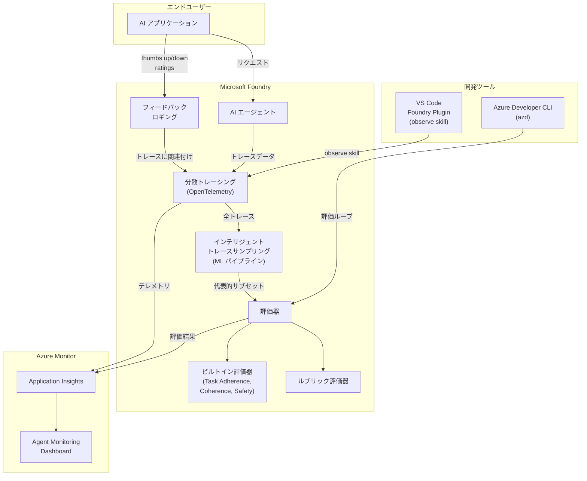

# Microsoft Foundry: エージェント Observability & 評価ツールスイート

**リリース日**: 2026-06-02 / 2026-06-03

**サービス**: Microsoft Foundry

**機能**: エージェント Observability & 評価ツールスイート

**ステータス**: In preview

[このアップデートのインフォグラフィックを見る](https://takech9203.github.io/azure-news-summary/20260603-foundry-observability-evaluation.html)

## 概要

Microsoft Build 2026 において、Microsoft Foundry の Observability（可観測性）および評価機能に関する 5 つの新しいパブリックプレビューが発表された。これらのアップデートは、AI エージェントの品質測定・改善サイクルを開発者のワークフロー全体に統合し、本番環境での継続的な品質保証を実現するものである。

具体的には、エンドユーザーからのフィードバックをトレースに関連付けて記録する機能、ML パイプラインによるインテリジェントなトレースサンプリング、コンテキスト固有の評価基準を定義できるルブリック評価器、VS Code 内でのコードファースト Observability、Azure Developer CLI（azd）での評価体験の 5 つが含まれる。

これらの機能は OpenTelemetry 標準に基づいた分散トレーシング基盤の上に構築され、Azure Monitor Application Insights と統合されている。開発からデプロイ、本番運用までの AI エージェントライフサイクル全体をカバーする包括的な可観測性プラットフォームとして設計されている。

**アップデート前の課題**

- AI エージェントの品質評価は手動で行う必要があり、本番環境の全トレースに対して評価を実行するとコストとレイテンシが大きかった
- エンドユーザーのフィードバック（満足/不満など）を構造化して収集し、特定のトレースに紐付ける標準的な方法がなかった
- 評価基準がビルトイン指標に限定され、ドメイン固有のコンテキストに応じた柔軟な品質基準を定義しにくかった
- Observability のセットアップや評価ループの実行にはポータルへの切り替えが必要で、開発者のエディタ内ワークフローが分断されていた

**アップデート後の改善**

- インテリジェントトレースサンプリングにより、代表的なサブセットに対してのみ評価を実行し、コストを抑えつつ品質を監視可能に
- 構造化されたフィードバックシグナル（thumbs up/down、レーティング、カスタムアノテーション）をトレースに自動関連付けして記録
- ルブリック評価器によりドメイン固有の評価基準をカスタム定義し、シングルターンおよびマルチターンのエージェントフローに適用可能に
- VS Code および azd CLI から直接、評価駆動の最適化ループを実行可能に

## アーキテクチャ図



この図は Microsoft Foundry の Observability パイプライン全体を示している。エンドユーザーからのリクエストとフィードバックがトレースとして記録され、インテリジェントサンプリングを経て評価器で品質が測定される。開発者は VS Code や azd CLI から直接このループにアクセスできる。

## サービスアップデートの詳細

### 1. ユーザーフィードバックロギング

- **概要**: エンドユーザーからの構造化フィードバックシグナルを自動的にトレースに関連付けて記録する機能
- **対応フィードバック形式**: thumbs up/down、レーティング（数値スケール）、カスタムアノテーション
- **動作原理**: フィードバック API を通じて送信されたデータが OpenTelemetry トレーススパンとして保存され、W3C Trace Context による分散トレース相関により、元のリクエストのトレースと紐付けられる
- **保存先**: Azure Monitor Application Insights に統合保存

### 2. インテリジェントトレースサンプリングによる評価

- **概要**: 本番トレース全量ではなく、マルチステージ ML パイプラインで代表的なサブセットを選択して評価を実行
- **目的**: 評価コスト（LLM ジャッジモデルのトークン消費）を削減しながら、品質の全体像を正確に把握
- **活用場面**: 継続的評価（Continuous Evaluation）で、本番トラフィックに対するサンプルレートベースの品質監視に利用

### 3. ルブリック評価器

- **概要**: 開発者がコンテキスト固有の評価基準を定義できるカスタム評価器
- **対応フロー**: シングルターンおよびマルチターンのエージェントフロー
- **位置づけ**: ビルトイン評価器（Task Adherence、Coherence、Violence など）を補完し、ドメイン固有の品質基準を表現
- **利用方法**: 評価定義の `testing_criteria` でルブリック評価器を指定し、カスタム基準を設定

### 4. VS Code でのコードファースト Observability

- **概要**: Foundry Plugin for VS Code Copilot Chat 内の "observe skill" として提供
- **機能**: エディタ内から完全な評価駆動最適化ループ（トレース確認 → 評価実行 → 改善 → 再評価）を実行
- **対象**: Foundry Agents の開発者
- **メリット**: ポータルへの画面切り替えなしに、開発ワークフロー内で Observability を活用可能

### 5. Azure Developer CLI（azd）での Observability 体験

- **概要**: azd CLI に評価体験を追加し、ホステッドエージェントのライフサイクルに品質計測ループを統合
- **対象**: Microsoft Foundry で作成されたエージェント
- **目的**: CLI ベースの開発ワークフローにおいて、コード → デプロイ → 評価 → 改善のサイクルを一気通貫で実行

## 技術仕様

| 項目 | 詳細 |
|------|------|
| トレーシング標準 | OpenTelemetry (OTel) セマンティック規約準拠 |
| トレース伝播 | W3C Trace Context |
| テレメトリ保存先 | Azure Monitor Application Insights |
| 対応フレームワーク | LangChain、LangGraph、OpenAI Agents SDK、Microsoft Agent Framework |
| 評価 SDK | azure-ai-projects >= 2.0.0 (Python)、Azure.AI.Projects (C#) |
| 継続的評価 | 最大 100 回/時間（max_hourly_runs で設定可能） |
| マルチエージェント対応 | Cisco Outshift と共同策定した OpenTelemetry セマンティック規約 |
| エージェントトレーシング | プロンプトエージェント: GA / ホステッド・ワークフロー・外部エージェント: プレビュー |

## 設定方法

### 前提条件

1. Microsoft Foundry プロジェクトの作成
2. Application Insights リソースの接続
3. Azure OpenAI デプロイメント（GPT-4o または GPT-4o-mini）- AI ジャッジモデルとして使用
4. Python 3.9 以降（Python SDK 使用時）
5. Foundry User ロールの割り当て

### Python SDK による継続的評価の設定

```python
# SDK のインストール
# pip install "azure-ai-projects>=2.0.0"

import os
from azure.identity import DefaultAzureCredential
from azure.ai.projects import AIProjectClient

endpoint = os.environ["AZURE_AI_PROJECT_ENDPOINT"]
model_deployment = os.environ["AZURE_AI_MODEL_DEPLOYMENT_NAME"]

credential = DefaultAzureCredential()
project_client = AIProjectClient(endpoint=endpoint, credential=credential)
client = project_client.get_openai_client()

# 評価定義の作成
data_source_config = {"type": "azure_ai_source", "scenario": "responses"}
testing_criteria = [
    {
        "type": "azure_ai_evaluator",
        "name": "Task Adherence",
        "evaluator_name": "builtin.task_adherence",
        "data_mapping": {
            "query": "{{item.query}}",
            "response": "{{sample.output_items}}",
        },
        "initialization_parameters": {"deployment_name": model_deployment},
    },
]

eval_object = client.evals.create(
    name="Continuous Evaluation",
    data_source_config=data_source_config,
    testing_criteria=testing_criteria,
)
```

### Azure Portal（Foundry ポータル）

1. [Microsoft Foundry](https://ai.azure.com) にサインイン
2. **Build** > 対象エージェントを選択
3. **Monitor** タブでダッシュボードを確認
4. 歯車アイコンから **Settings** を開く
5. **Continuous evaluation** を有効化し、評価器とサンプルレートを設定

## メリット

### ビジネス面

- 本番環境での AI エージェント品質を継続的に可視化し、ユーザー体験の劣化を早期に検知
- エンドユーザーフィードバックと客観的評価指標の組み合わせにより、改善優先度を的確に判断
- インテリジェントサンプリングにより評価コストを抑えながら包括的な品質モニタリングを維持

### 技術面

- OpenTelemetry 標準準拠により、既存の Observability ツールチェーンとの統合が容易
- VS Code / azd CLI との統合により、開発者のコンテキストスイッチを最小化
- マルチエージェントシステムの協調動作をトレース可能（Cisco Outshift との共同セマンティック規約）
- ルブリック評価器により、ドメイン固有の品質基準を CI/CD パイプラインの品質ゲートとして活用可能

## デメリット・制約事項

- 全 5 機能がパブリックプレビューであり、SLA は提供されない（本番ワークロードでの利用は非推奨）
- AI ジャッジモデル（GPT-4o 等）を使用する評価器は追加のトークン消費が発生する
- 一部の評価機能にはリージョン制限がある
- トレースデータは Application Insights に保存されるため、データ量とリテンション設定に応じたコストが発生
- 継続的評価は max_hourly_runs のデフォルト上限（100 回/時間）がある
- ホステッドエージェント、ワークフローエージェント、外部エージェントのトレーシングはプレビュー段階

## ユースケース

### ユースケース 1: カスタマーサポートエージェントの品質モニタリング

**シナリオ**: 本番デプロイされたカスタマーサポート AI エージェントの応答品質を継続的に監視し、ユーザー満足度と品質スコアの相関を分析する。

**実装例**:

```python
from azure.ai.projects.models import (
    EvaluationRule,
    ContinuousEvaluationRuleAction,
    EvaluationRuleFilter,
    EvaluationRuleEventType,
)

# ルブリック評価器でドメイン固有の品質基準を定義
testing_criteria = [
    {
        "type": "azure_ai_evaluator",
        "name": "Task Adherence",
        "evaluator_name": "builtin.task_adherence",
        "data_mapping": {
            "query": "{{item.query}}",
            "response": "{{sample.output_items}}",
        },
        "initialization_parameters": {"deployment_name": model_deployment},
    },
    {
        "type": "azure_ai_evaluator",
        "name": "Violence",
        "evaluator_name": "builtin.violence",
        "data_mapping": {
            "query": "{{item.query}}",
            "response": "{{sample.output_text}}",
        },
    },
]

# 継続的評価ルールの作成
continuous_eval_rule = project_client.evaluation_rules.create_or_update(
    id="support-agent-quality-rule",
    evaluation_rule=EvaluationRule(
        display_name="Support Agent Quality Monitor",
        description="Monitor customer support agent quality continuously",
        action=ContinuousEvaluationRuleAction(
            eval_id=eval_object.id, max_hourly_runs=100
        ),
        event_type=EvaluationRuleEventType.RESPONSE_COMPLETED,
        filter=EvaluationRuleFilter(agent_name="support-agent"),
        enabled=True,
    ),
)
```

**効果**: 品質スコアの低下をリアルタイムに検知し、Azure Monitor アラートと連携して即座に対応可能。ユーザーフィードバックとの相関分析により、改善すべき領域を特定。

### ユースケース 2: CI/CD パイプラインでの評価駆動デプロイ

**シナリオ**: エージェントの変更をデプロイする前に、azd CLI を使用して自動評価を実行し、品質閾値（例: Task Adherence 85% 以上）を満たさない場合はデプロイをブロックする。

**効果**: 品質劣化を本番環境にリリースする前に検知し、安全なデプロイサイクルを確立。GitHub Actions との統合により、PR マージ時の品質ゲートとして機能。

## 料金

Observability 機能（リスク・安全性評価、エージェントプレイグラウンドでの評価を含む）は従量課金制で請求される。

| 項目 | 料金 |
|------|------|
| 評価実行 | 従量課金（消費ベース） |
| トレースデータ保存 | Application Insights の料金体系に準拠 |
| AI ジャッジモデル利用 | Azure OpenAI の通常のトークン料金 |

詳細は [Azure Foundry Observability 料金ページ](https://azure.microsoft.com/pricing/details/foundryobservability/) を参照。

注意: エージェントプレイグラウンドでの評価はデフォルトで有効化されており、従量課金に含まれる。無効化するにはプレイグラウンドの metrics メニューから全評価器の選択を解除する。

## 利用可能リージョン

トレーシングは Foundry がサポートされている全リージョンで利用可能。AI 支援評価器のリージョン制限については [リージョンサポートドキュメント](https://learn.microsoft.com/en-us/azure/ai-foundry/concepts/evaluation-regions-limits-virtual-network) を参照。トレースデータのリテンションとサンプリングは Application Insights の設定に従う。

## 関連サービス・機能

- **Azure Monitor Application Insights**: トレースデータ・評価結果の保存およびリアルタイム監視ダッシュボード
- **Foundry Agent Service**: 評価対象となる AI エージェントのホスティング・実行基盤
- **Azure OpenAI Service**: AI ジャッジモデル（GPT-4o / GPT-4o-mini）として評価器のバックエンドで使用
- **GitHub Actions**: 評価を CI/CD パイプラインの品質ゲートとして統合
- **OpenTelemetry**: トレーシングの基盤となるオープン標準
- **VS Code Copilot Chat**: Foundry Plugin による開発者向け Observability インターフェース

## 参考リンク

- [インフォグラフィック](https://takech9203.github.io/azure-news-summary/20260603-foundry-observability-evaluation.html)
- [User feedback logging](https://azure.microsoft.com/updates?id=563431)
- [Evaluations with Intelligent Trace Sampling](https://azure.microsoft.com/updates?id=563696)
- [Rubric evaluator](https://azure.microsoft.com/updates?id=563656)
- [Code-first observability for Foundry Agents in VS Code](https://azure.microsoft.com/updates?id=563197)
- [Observability developer experience in Azure Developer CLI](https://azure.microsoft.com/updates?id=563736)
- [Microsoft Learn - Observability in Generative AI](https://learn.microsoft.com/en-us/azure/ai-foundry/concepts/evaluation-approach-gen-ai)
- [Microsoft Learn - Agent tracing in Microsoft Foundry](https://learn.microsoft.com/en-us/azure/ai-foundry/observability/concepts/trace-agent-concept)
- [Microsoft Learn - Evaluate your AI agents](https://learn.microsoft.com/en-us/azure/ai-foundry/observability/how-to/evaluate-agent)
- [Microsoft Learn - Monitor agents with the Agent Monitoring Dashboard](https://learn.microsoft.com/en-us/azure/ai-foundry/observability/how-to/how-to-monitor-agents-dashboard)
- [料金ページ](https://azure.microsoft.com/pricing/details/foundryobservability/)

## まとめ

Microsoft Foundry の Observability & 評価ツールスイートは、AI エージェントの品質保証を開発ライフサイクル全体に浸透させる包括的なプラットフォームアップデートである。特にインテリジェントトレースサンプリングによるコスト効率の高い継続的評価、ルブリック評価器によるドメイン固有の品質基準定義、そして VS Code / azd CLI への統合による開発者体験の向上は、AI エージェントを本番運用する上での実践的な課題に直接対応している。

Solutions Architect への推奨アクション:

1. 既存の AI エージェントプロジェクトで Foundry Observability のトレーシングを有効化し、Application Insights との接続を確認する
2. ルブリック評価器を使用して、自社ドメインに特化した評価基準を定義する
3. 継続的評価ルールを設定し、本番エージェントの品質モニタリングを開始する
4. CI/CD パイプラインに評価を品質ゲートとして組み込み、安全なデプロイサイクルを確立する

---

**タグ**: #MicrosoftFoundry #Observability #AIAgent #Evaluation #OpenTelemetry #Build2026 #PublicPreview #TraceSampling #RubricEvaluator #FeedbackLogging #VSCode #AzureDeveloperCLI
