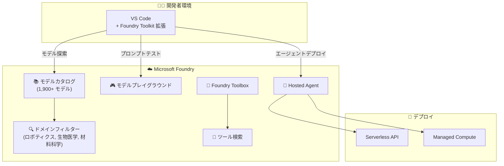

# Microsoft Foundry: VS Code 拡張 GA、ツール検索、ドメインフィルター

**リリース日**: 2026-06-03 / 2026-06-04

**サービス**: Microsoft Foundry

**機能**: VS Code 拡張 GA、ツール検索、ドメインフィルター

**ステータス**: Launched (GA) / In preview

[このアップデートのインフォグラフィックを見る](https://takech9203.github.io/azure-news-summary/20260603-foundry-vscode-developer-tools.html)

## 概要

Microsoft Build 2026 にて、Microsoft Foundry の開発者向けツールに関する 3 つのアップデートが発表された。VS Code 拡張機能の一般提供開始 (GA)、Foundry Toolbox におけるツール検索機能のパブリックプレビュー、およびモデルカタログにおけるドメインフィルターのパブリックプレビューである。

これらのアップデートは、AI アプリケーション開発者のワークフローを改善し、エディター内でのモデル探索・デプロイからエージェント開発時のツール管理まで、開発体験全体を効率化することを目的としている。1,900 以上のモデルを擁する Foundry モデルカタログの規模拡大に伴い、適切なモデルやツールを素早く見つけるための機能強化が進められている。

**アップデート前の課題**

- VS Code 拡張機能はプレビュー段階であり、モデルカタログ全体へのアクセスや Hosted Agent デプロイなどの機能が制限されていた
- Foundry Toolbox 内のツール数が増加した場合、全ツール定義を毎ターン送信するとコストが高く、目的のツールを見つけるのが困難だった
- 1,900 以上のモデルカタログから特定の業界・ユースケースに適したモデルを絞り込む手段が限定的だった

**アップデート後の改善**

- VS Code 内からフルモデルカタログ、モデルプレイグラウンド、Hosted Agent デプロイが利用可能 (GA)
- ツール検索により、大規模なマルチチームカタログ内から適切なツールを高速に発見可能
- ドメインフィルターにより、ロボティクス、生物医学、材料科学などの分野に特化したモデルを効率的に発見可能

## アーキテクチャ図



VS Code 拡張から Foundry のモデルカタログ、プレイグラウンド、Hosted Agent デプロイへ直接アクセスする構成を示す。ツール検索とドメインフィルターが大規模カタログ内のナビゲーションを効率化する。

## サービスアップデートの詳細

### 1. Microsoft Foundry for Visual Studio Code (GA)

**ステータス**: 一般提供 (Launched)
**発表日**: 2026-06-03

Build 2026 リフレッシュにより、Microsoft Foundry Toolkit for Visual Studio Code 拡張機能が一般提供に到達した。

#### 主要機能

1. **フルモデルカタログへのアクセス**
   - VS Code 内から 1,900 以上のモデルを閲覧・検索可能
   - Publisher、Feature、Model type、Hosted by によるフィルタリング
   - モデルカードでの詳細確認 (ベンチマーク、デプロイ情報、ライセンス)

2. **モデルプレイグラウンド**
   - デプロイ済みモデルとの対話的チャット
   - システムプロンプトの調整
   - View Code 機能によるプログラマティックアクセスのコード生成

3. **Hosted Agent デプロイ**
   - VS Code から直接エージェントをデプロイ可能
   - デプロイ名、デプロイタイプ、モデルバージョンの選択
   - Tokens per minute のスライダーによるレート制限調整

4. **プロジェクト管理**
   - 新規 Foundry プロジェクトの作成
   - リソースグループの作成・選択
   - デフォルトプロジェクトの切り替え

5. **コード生成**
   - デプロイ済みモデルに対するサンプルコードの自動生成
   - SDK 選択 (Python など)、言語選択、認証方式の選択が可能

#### 拡張機能のインターフェース構成

| セクション | 内容 | 用途 |
|-----------|------|------|
| My Resources | デプロイ済みモデル、宣言型エージェント、Hosted Agent、接続、ベクトルストア | プロジェクトリソースの管理 |
| Developer Tools | Model Catalog、Model Playground、Agent Playgrounds、Local Visualizer、Deploy Hosted Agents | モデルデプロイ、テスト、エージェント操作 |
| Help and Feedback | ドキュメント、GitHub リポジトリ、コミュニティリンク | サポート・フィードバック |

### 2. Tool Search in Foundry Toolboxes (Public Preview)

**ステータス**: パブリックプレビュー (In preview)
**発表日**: 2026-06-04

Foundry Toolbox にツール検索機能が追加された。

#### 主要機能

1. **高速ツール検索**
   - 大規模なマルチチームカタログ内から目的のツールを素早く検索
   - Toolbox が成長するにつれ、全ツール定義を毎ターン送信するコストを削減

2. **コスト最適化**
   - 必要なツールのみをエージェントに渡すことで、トークン消費を抑制
   - 大規模チームでのツール管理を効率化

#### 背景

エージェント開発において、Toolbox に登録されるツールの数が増加すると、毎回のエージェント呼び出し時に全ツール定義を送信する必要があり、トークンコストが増大する問題があった。ツール検索により、関連するツールのみを動的に選択することが可能になる。

### 3. Domain Filter for Model Catalog (Public Preview)

**ステータス**: パブリックプレビュー (In preview)
**発表日**: 2026-06-03

Foundry モデルカタログにドメインフィルターが追加された。

#### 主要機能

1. **ドメイン別モデル絞り込み**
   - 1,900 以上のモデルから特定の業界・ユースケースに特化したモデルを発見
   - 対応ドメイン: ロボティクス、生物医学 (Biomedical Sciences)、材料科学 (Materials) など

2. **既存フィルターとの組み合わせ**
   - Collection (モデルプロバイダー)
   - Industry (業界特化データセットで学習済み)
   - Capabilities (推論、ツール呼び出しなど)
   - Inference tasks (推論タスクタイプ)

## 技術仕様

| 項目 | 詳細 |
|------|------|
| VS Code 拡張名 | Microsoft Foundry Toolkit for Visual Studio Code |
| インストール方法 | VS Code Marketplace または VS Code 拡張機能ビューから検索 |
| 認証方式 | Azure アカウントでのサインイン (Microsoft Entra 認証) |
| 対応モデル数 | 1,900 以上 |
| モデルプロバイダー | Microsoft, OpenAI, DeepSeek, Meta, Hugging Face 他 |
| デプロイオプション | Serverless API / Managed Compute |
| ツール検索ステータス | Public Preview |
| ドメインフィルターステータス | Public Preview |

## 設定方法

### 前提条件

1. Azure サブスクリプション
2. Visual Studio Code がインストール済み
3. サブスクリプションのクォータ制限内であること
4. Foundry リソースの作成・管理に必要な RBAC 権限

### VS Code 拡張のインストール

```bash
# VS Code Marketplace からインストール
# https://aka.ms/foundrytk にアクセスし Install をクリック

# または VS Code 内から:
# 1. Extensions ビューを開く (Ctrl+Shift+X)
# 2. "Foundry Toolkit for VS Code" を検索
# 3. Install をクリック
```

### Azure リソースへの接続

1. VS Code ナビゲーションバーの Azure アイコンを選択
2. **Sign in to Azure...** を選択
3. **Resources** セクションで Azure サブスクリプションとリソースグループを選択
4. **Foundry** を展開し、プロジェクトを右クリック
5. **Open in Foundry Toolkit Extension** を選択

## メリット

### ビジネス面

- エディターから離れずに AI モデルの探索・デプロイ・テストが完結し、開発サイクルが短縮
- ツール検索によるトークンコスト削減で、大規模エージェント開発のランニングコストを最適化
- ドメインフィルターにより業界特化モデルの発見が高速化し、PoC 開始までの時間を短縮

### 技術面

- VS Code のコマンドパレット (F1) から Foundry Toolkit の全コマンドにアクセス可能
- サンプルコード自動生成により、SDK 統合の立ち上げが容易
- モデルカードでベンチマーク結果を直接比較可能

## デメリット・制約事項

- ツール検索およびドメインフィルターはパブリックプレビューであり、GA 前に仕様が変更される可能性がある
- VS Code 拡張からのモデルデプロイにはサブスクリプションのクォータ制限が適用される
- Managed Compute でのデプロイには対応する VM クォータが必要
- Hugging Face モデルなど Managed Compute 対応モデルの利用にはハブベースプロジェクトが必要

## ユースケース

### ユースケース 1: VS Code 内でのエンドツーエンド AI アプリ開発

**シナリオ**: 開発者が VS Code から離れることなく、モデルの探索からデプロイ、プロンプトテスト、コード統合までを完結させる。

**ワークフロー**:
1. Model Catalog でユースケースに適したモデルを検索
2. ドメインフィルターで業界特化モデルに絞り込み
3. モデルプレイグラウンドでプロンプトをテスト
4. デプロイしサンプルコードを生成
5. アプリケーションコードに統合

**効果**: ポータル切り替えのオーバーヘッドがなくなり、開発者の生産性が向上する。

### ユースケース 2: 大規模マルチチーム環境でのエージェントツール管理

**シナリオ**: 複数チームが共有する Toolbox に数百のツールが登録されている環境で、特定のタスクに必要なツールのみをエージェントに提供する。

**ワークフロー**:
1. エージェント呼び出し時にツール検索で関連ツールを動的に選択
2. 全ツール定義の送信を回避し、トークン消費を最小化
3. エージェントの応答精度を向上

**効果**: トークンコストの削減と、ツール選択精度の向上により、エージェントのパフォーマンスが改善する。

### ユースケース 3: 専門分野向けモデル選定

**シナリオ**: 生物医学研究チームが、論文解析や分子構造予測に適した専門モデルを探す。

**ワークフロー**:
1. モデルカタログでドメインフィルターを「Biomedical Sciences」に設定
2. 候補モデルのベンチマークを比較
3. VS Code プレイグラウンドで実際のデータでテスト
4. 最適なモデルをデプロイ

**効果**: 1,900 以上のモデルから専門分野に特化したモデルを効率的に発見し、評価時間を大幅に短縮する。

## 料金

VS Code 拡張機能自体は無料で利用可能。モデルのデプロイ・推論に関する料金はデプロイ方式に依存する。

| デプロイ方式 | 課金モデル |
|-------------|-----------|
| Serverless API | 入出力トークン単位の従量課金 |
| Managed Compute | VM コア時間の従量課金 |

詳細は [Microsoft Foundry 料金ページ](https://azure.microsoft.com/pricing/details/ai-foundry/) を参照。

## 関連サービス・機能

- **Microsoft Foundry Portal**: クラウド上のフル機能ポータル。VS Code 拡張はエディター内で同等の機能を提供
- **Azure AI Content Safety**: デプロイ済みモデルのコンテンツフィルタリングに使用
- **Azure Machine Learning**: Managed Compute デプロイの基盤インフラ
- **Microsoft Entra ID**: VS Code 拡張からの認証に使用
- **GitHub Copilot**: VS Code 内でのコーディング支援との併用が可能

## 参考リンク

- [インフォグラフィック](https://takech9203.github.io/azure-news-summary/20260603-foundry-vscode-developer-tools.html)
- [公式アップデート情報: VS Code 拡張 GA](https://azure.microsoft.com/updates?id=563721)
- [公式アップデート情報: ツール検索](https://azure.microsoft.com/updates?id=563506)
- [公式アップデート情報: ドメインフィルター](https://azure.microsoft.com/updates?id=563731)
- [Microsoft Learn: Foundry Toolkit for VS Code](https://learn.microsoft.com/azure/ai-foundry/how-to/develop/get-started-projects-vs-code)
- [Microsoft Learn: Foundry Models 概要](https://learn.microsoft.com/azure/ai-foundry/concepts/foundry-models-overview)
- [VS Code Marketplace: Foundry Toolkit](https://aka.ms/foundrytk)

## まとめ

Build 2026 で発表されたこれら 3 つのアップデートは、Microsoft Foundry を利用する開発者の日常的なワークフローを大幅に改善する。VS Code 拡張の GA により、エディターを離れることなくモデルの探索からデプロイまでが完結し、ツール検索とドメインフィルターはカタログの規模拡大に対応した発見性向上の施策である。

Solutions Architect としては、以下のアクションを推奨する:
- VS Code 拡張を GA 版に更新し、チーム内での AI 開発ワークフローの標準化を検討
- エージェント開発においてツール検索のプレビューを試用し、トークンコスト削減効果を評価
- 専門分野向けプロジェクトではドメインフィルターを活用し、モデル選定プロセスの効率化を図る

---

**タグ**: #MicrosoftFoundry #VSCode #ModelCatalog #AITooling #Build2026 #AgentDevelopment #DeveloperTools
