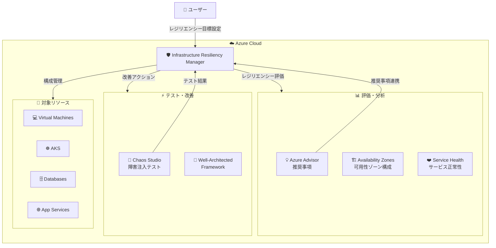

# Azure Infrastructure Resiliency Manager: Infrastructure Resiliency Manager パブリックプレビュー

**リリース日**: 2026-06-03

**サービス**: Azure Infrastructure Resiliency Manager

**機能**: Infrastructure Resiliency Manager パブリックプレビュー

**ステータス**: In preview

[このアップデートのインフォグラフィックを見る](https://takech9203.github.io/azure-news-summary/20260603-infrastructure-resiliency-manager.html)

## 概要

Azure Infrastructure Resiliency Manager がパブリックプレビューとして公開された。本サービスは、Azure 上のアプリケーションのレジリエンシー (回復性) を設計・評価・改善するための統合的かつゴール駆動型のエクスペリエンスを提供する。Microsoft Build 2026 で発表された本機能は、これまで個別に利用されていた Availability Zones、Azure Advisor、Chaos Studio などのレジリエンシー関連機能を一元管理する統合プラットフォームとして位置づけられている。

従来、Azure でアプリケーションのレジリエンシーを確保するためには、複数のサービスやツールを個別に設定・管理する必要があった。Infrastructure Resiliency Manager は、これらを統合し、ゴール (目標) ベースのアプローチでレジリエンシーの現状評価から改善アクションまでを一貫して管理できるようにするものである。

**アップデート前の課題**

- レジリエンシー関連の機能 (Availability Zones、Advisor、Chaos Studio、Service Health) が個別のサービスとして分散しており、統合的な管理が困難だった
- アプリケーション全体のレジリエンシー目標に対する達成状況を一元的に可視化する手段がなかった
- レジリエンシーの評価・改善において、どのサービスをどの順番で活用すべきか判断が難しかった
- 複数のリソースにまたがるレジリエンシー設定の整合性確認に手作業が必要だった

**アップデート後の改善**

- 統合ダッシュボードにより、アプリケーション全体のレジリエンシー状態を一元的に可視化できるようになった
- ゴール駆動型のアプローチにより、ビジネス要件に基づいたレジリエンシー目標を設定し、達成に向けたガイダンスを受けられるようになった
- Availability Zones、Azure Advisor、Chaos Studio などの機能が統合され、一貫したワークフローでレジリエンシーの設計・評価・改善が可能になった
- レジリエンシーに関する推奨事項と改善アクションが優先度付きで提示されるようになった

## アーキテクチャ図

Infrastructure Resiliency Manager は、Azure の各レジリエンシー関連サービスを統合するハブとして機能し、ユーザーが設定したレジリエンシー目標に基づいて評価・テスト・改善のサイクルを一元管理する。

## サービスアップデートの詳細

### 主要機能

1. **統合レジリエンシーダッシュボード**
   - アプリケーション全体のレジリエンシー状態を一元的に可視化
   - Availability Zones の活用状況、Advisor の推奨事項、Chaos Studio のテスト結果を統合表示

2. **ゴール駆動型のレジリエンシー設計**
   - ビジネス要件に基づいたレジリエンシー目標 (RTO/RPO など) を設定
   - 目標達成に向けた具体的なアクションプランを自動生成

3. **レジリエンシー評価**
   - Azure Advisor の信頼性推奨事項との連携
   - Availability Zones の構成状況の評価
   - リソース間の依存関係を考慮した包括的な評価

4. **改善アクションの優先順位付け**
   - 影響度と実装コストに基づく推奨事項の優先度付け
   - ステップバイステップの改善ガイダンス

5. **Chaos Studio 連携によるレジリエンシー検証**
   - 設計されたレジリエンシーが実際に機能するかを障害注入テストで検証
   - テスト結果に基づくフィードバックループ

## 技術仕様

| 項目 | 詳細 |
|------|------|
| ステータス | パブリックプレビュー |
| 発表日 | 2026-06-03 (Microsoft Build 2026) |
| 統合サービス | Availability Zones、Azure Advisor、Chaos Studio、Service Health |
| アプローチ | ゴール駆動型 (Goal-driven) |
| 対象 | Azure 上のアプリケーションリソース全般 |
| アクセス方法 | Azure Portal |

## メリット

### ビジネス面

- レジリエンシー目標の達成状況を経営層に可視化しやすくなる
- SLA 違反リスクの事前検知と対策が容易になる
- レジリエンシー設計にかかる時間とコストの削減

### 技術面

- 複数のレジリエンシーツールを横断的に管理する統合プラットフォーム
- ゴール駆動型アプローチにより、必要な設定漏れを防止
- Chaos Studio との連携でレジリエンシー設計の実効性を検証可能
- Azure Well-Architected Framework のベストプラクティスに基づいたガイダンス

## デメリット・制約事項

- パブリックプレビューのため、本番環境での利用は評価目的に限定される
- プレビュー期間中は SLA が提供されない
- 統合されるサービスの一部は別途個別の設定が必要な場合がある

## ユースケース

### ユースケース 1: ミッションクリティカルアプリケーションのレジリエンシー評価

**シナリオ**: 金融系のミッションクリティカルなアプリケーションを Azure 上で運用しており、現状のレジリエンシー構成が事業継続要件を満たしているか確認したい。

**効果**: Infrastructure Resiliency Manager により、Availability Zones の活用状況、冗長性の確認、Advisor の推奨事項の遵守状況を一元的に評価し、改善すべきポイントを優先度付きで把握できる。

### ユースケース 2: 新規アプリケーションのレジリエンシー設計

**シナリオ**: 新しいクラウドネイティブアプリケーションを Azure に構築する際、目標 RTO/RPO を満たすレジリエンシー設計を効率的に行いたい。

**効果**: ゴール駆動型のアプローチにより、ビジネス要件から逆算した推奨構成を提案してもらい、設計段階から適切なレジリエンシーを組み込める。

### ユースケース 3: 定期的なレジリエンシー検証

**シナリオ**: 定期的にアプリケーションの障害耐性を検証し、新たに発生した脆弱性を早期に発見したい。

**効果**: Chaos Studio との連携により、レジリエンシー目標に基づいた障害注入テストを実施し、結果を統合ダッシュボードで確認できる。

## 料金

パブリックプレビュー期間中の料金情報は公式には公開されていない。プレビュー期間中は無料で利用できる可能性があるが、統合先の各サービス (Chaos Studio など) の利用料金は別途発生する場合がある。

詳細は公式料金ページを参照: [Azure 料金ページ](https://azure.microsoft.com/pricing/)

## 関連サービス・機能

- **Azure Advisor**: Azure リソースの信頼性に関する推奨事項を提供。Infrastructure Resiliency Manager と統合され、レジリエンシー評価の基盤となる
- **Azure Chaos Studio**: 障害注入テストにより、アプリケーションのレジリエンシーを検証するサービス。Infrastructure Resiliency Manager からテストの計画・実行・結果確認が可能
- **Availability Zones**: リージョン内の物理的に分離されたデータセンター群。Infrastructure Resiliency Manager がゾーン構成の適切性を評価
- **Azure Service Health**: Azure サービスの正常性情報を提供。Infrastructure Resiliency Manager と連携し、影響を受ける可能性のあるリソースを特定
- **Azure Well-Architected Framework**: Microsoft のクラウドアーキテクチャのベストプラクティスフレームワーク。信頼性の柱がレジリエンシー設計の基準として活用される

## 参考リンク

- [インフォグラフィック](https://takech9203.github.io/azure-news-summary/20260603-infrastructure-resiliency-manager.html)
- [公式アップデート情報](https://azure.microsoft.com/updates?id=564759)
- [Azure 信頼性ドキュメント](https://learn.microsoft.com/azure/reliability/overview)
- [Azure Advisor レジリエンシーレビュー](https://learn.microsoft.com/azure/advisor/advisor-resiliency-reviews)
- [Azure Chaos Studio 概要](https://learn.microsoft.com/azure/chaos-studio/chaos-studio-overview)

## まとめ

Azure Infrastructure Resiliency Manager のパブリックプレビューは、Azure におけるレジリエンシー管理を大きく前進させるアップデートである。これまで Availability Zones、Azure Advisor、Chaos Studio、Service Health などを個別に活用してレジリエンシーを確保していた運用から、統合的かつゴール駆動型のアプローチへと移行できる。

Solutions Architect への推奨アクションとしては、まずプレビューへのアクセスを確認し、既存のミッションクリティカルワークロードに対してレジリエンシー評価を実施することを推奨する。パブリックプレビューの段階で機能を理解し、GA 時にスムーズに本番導入できるよう準備を進めることが望ましい。

---

**タグ**: #Azure #InfrastructureResiliencyManager #Resiliency #AvailabilityZones #AzureAdvisor #ChaosStudio #Build2026 #PublicPreview #Management
