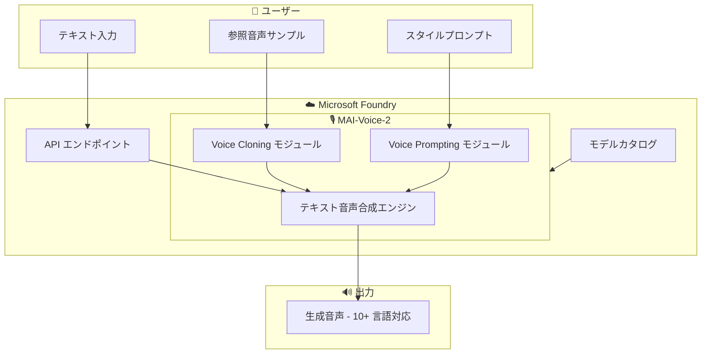

# Microsoft Foundry: MAI-Voice-2 パブリックプレビュー

**リリース日**: 2026-06-03

**サービス**: Microsoft Foundry

**機能**: MAI-Voice-2 (音声生成モデル)

**ステータス**: In preview

[このアップデートのインフォグラフィックを見る](https://takech9203.github.io/azure-news-summary/20260603-mai-voice-2-preview.html)

## 概要

Microsoft Foundry において、Microsoft AI チームが開発したファーストパーティ音声モデル「MAI-Voice-2」がパブリックプレビューとして提供開始された。MAI-Voice-2 は、10 以上の言語で自然な音声を生成する能力を持ち、短い参照サンプルからの音声クローニング (Voice Cloning) と、スタイル制御のための音声プロンプティング (Voice Prompting) をサポートする。

これは Microsoft AI チームによるファーストパーティモデルであり、Microsoft Foundry のモデルカタログを通じて利用可能になる。従来の Azure AI Speech サービス (Custom Voice) が事前録音データとトレーニングプロセスを必要としていたのに対し、MAI-Voice-2 は短い参照サンプルのみで音声クローニングが可能であり、より迅速かつ柔軟な音声生成ワークフローを実現する。

**アップデート前の課題**

- カスタム音声の作成には大量の録音データと長時間のモデルトレーニングが必要だった
- 音声のスタイル (感情、トーン) を動的に制御する標準的な手段が限られていた
- 多言語対応の音声生成には言語ごとに個別のモデルやデータセットの準備が必要だった
- Microsoft Foundry のモデルカタログに Microsoft AI チーム製のファーストパーティ音声モデルが存在しなかった

**アップデート後の改善**

- 短い参照サンプルから音声クローニングが可能になり、カスタム音声作成のハードルが大幅に低下
- Voice Prompting によるスタイル制御で、感情やトーンを動的に指定可能に
- 単一モデルで 10 以上の言語に対応し、多言語音声生成が容易に
- Microsoft Foundry のモデルカタログから直接デプロイ・利用可能

## アーキテクチャ図

MAI-Voice-2 は Microsoft Foundry のモデルカタログからデプロイされ、テキスト入力に加えて参照音声サンプルやスタイルプロンプトを組み合わせることで、自然でカスタマイズされた音声を生成する。

## サービスアップデートの詳細

### 主要機能

1. **多言語音声生成 (10+ 言語)**
   - 単一モデルで 10 以上の言語に対応した自然な音声合成が可能
   - テキストから高品質な音声を生成

2. **Voice Cloning (音声クローニング)**
   - 短い参照音声サンプルから話者の声を再現
   - 大量の録音データやモデルトレーニングなしにカスタム音声を生成可能
   - パーソナライズされた音声体験の迅速な構築を実現

3. **Voice Prompting (スタイル制御)**
   - プロンプトによる音声スタイル (感情、トーン、話し方) の制御
   - 動的なスタイル変更により、コンテキストに応じた音声表現が可能

### Microsoft Foundry との統合

MAI-Voice-2 は Microsoft Foundry のモデルカタログに統合されており、他の AI モデル (LLM、画像生成モデルなど) と同様のワークフローでデプロイ・管理できる。Microsoft AI チームによるファーストパーティモデルとして、Azure プラットフォームとのネイティブな統合が提供される。

## 技術仕様

| 項目 | 詳細 |
|------|------|
| モデル名 | MAI-Voice-2 |
| 提供元 | Microsoft AI チーム (ファーストパーティ) |
| ステータス | パブリックプレビュー |
| 対応言語数 | 10 以上 |
| Voice Cloning | 短い参照サンプルから対応 |
| Voice Prompting | スタイル制御対応 |
| プラットフォーム | Microsoft Foundry |
| 発表日 | 2026 年 6 月 3 日 (Microsoft Build) |

## メリット

### ビジネス面

- カスタム音声の作成コストと時間を大幅に削減 (大量の録音データ不要)
- 多言語コンテンツのローカライゼーションを単一モデルで効率化
- ブランドボイスやキャラクターボイスの迅速なプロトタイピングが可能

### 技術面

- Microsoft Foundry のモデルカタログからの統一的なデプロイメント
- 短い参照サンプルのみで Voice Cloning が可能 (従来の大量データ + トレーニング不要)
- プロンプトベースのスタイル制御で、アプリケーションロジックからの動的な音声調整が容易
- ファーストパーティモデルとして Azure エコシステムとのネイティブ統合

## デメリット・制約事項

- パブリックプレビュー段階であり、本番ワークロードへの利用は推奨されない可能性がある
- 対応言語の具体的なリストは公式ドキュメントでの確認が必要
- Voice Cloning に関する利用ポリシー (同意要件、不正利用防止) の詳細は公式ドキュメントを参照
- プレビュー期間中の SLA については Microsoft Foundry の利用規約を確認する必要がある

## ユースケース

### ユースケース 1: 多言語カスタマーサポート音声アシスタント

**シナリオ**: グローバル企業がカスタマーサポート向けに、ブランドの一貫した声で 10 以上の言語に対応する音声アシスタントを構築する。

**効果**: 従来は言語ごとに声優の録音と個別のモデルトレーニングが必要だったが、MAI-Voice-2 により短い参照サンプルからブランドボイスをクローニングし、単一モデルで多言語展開が可能。

### ユースケース 2: e-ラーニングコンテンツの動的音声生成

**シナリオ**: 教育プラットフォームが講師の声をクローニングし、新しいコース教材の音声を自動生成する。Voice Prompting で説明パート (落ち着いたトーン) とクイズパート (活発なトーン) のスタイルを切り替える。

**効果**: コンテンツ制作の時間を大幅に短縮しつつ、講師のパーソナリティを維持した一貫性のある音声体験を提供。

### ユースケース 3: アクセシビリティ向上のためのパーソナライズド音声

**シナリオ**: 音声を失った方のために、以前の音声サンプルから個人の声を再現し、テキスト読み上げデバイスで使用する。

**効果**: 短い参照サンプルから個人の音声特性を再現し、より自然で個人に寄り添ったコミュニケーション支援を実現。

## 料金

パブリックプレビュー段階での料金体系の詳細は公式に確認できていない。最新の料金情報は以下のページを参照:

- [Microsoft Foundry 料金ページ](https://azure.microsoft.com/pricing/details/ai-foundry/)
- [Azure AI Speech 料金ページ](https://azure.microsoft.com/pricing/details/cognitive-services/speech-services/)

## 利用可能リージョン

パブリックプレビュー段階での対応リージョンは公式ドキュメントでの確認が必要。Microsoft Foundry ポータルのモデルカタログから利用可能なリージョンを確認できる:

- [Microsoft Foundry ポータル](https://ai.azure.com/)

## 関連サービス・機能

- **Azure AI Speech (Custom Voice)**: 従来型の音声カスタマイズサービス。大量の録音データとトレーニングプロセスによるカスタム音声作成。MAI-Voice-2 はより手軽な Voice Cloning アプローチを提供
- **Microsoft Foundry モデルカタログ**: MAI-Voice-2 のデプロイ基盤。OpenAI、Meta、Mistral などのサードパーティモデルに加え、Microsoft ファーストパーティモデルをホスト
- **Azure AI Speech Text-to-Speech**: 標準的なテキスト音声合成サービス。MAI-Voice-2 はこれに高度な Voice Cloning と Style Control 機能を追加するポジション
- **Microsoft Foundry Custom Voice ポータル (GA)**: 同日に GA となった Custom Voice オーサリング体験。MAI-Voice-2 と併せて音声関連機能が強化

## 参考リンク

- [インフォグラフィック](https://takech9203.github.io/azure-news-summary/20260603-mai-voice-2-preview.html)
- [公式アップデート情報](https://azure.microsoft.com/updates?id=563217)
- [Microsoft Foundry ドキュメント](https://learn.microsoft.com/azure/ai-foundry/)
- [Microsoft Foundry ポータル](https://ai.azure.com/)
- [Azure AI Speech ドキュメント](https://learn.microsoft.com/azure/ai-services/speech-service/)

## まとめ

MAI-Voice-2 は Microsoft AI チームによるファーストパーティ音声生成モデルとして、Microsoft Foundry のモデルカタログに追加された重要なアップデートである。短い参照サンプルからの Voice Cloning、プロンプトによるスタイル制御、10 以上の言語対応という 3 つの主要機能により、従来の Custom Voice よりも低い導入障壁でカスタム音声を実現できる。

Solutions Architect として注目すべき点は、これが Microsoft Foundry のモデルカタログとして提供されることで、LLM と音声モデルを同一プラットフォームで管理し、マルチモーダルな AI アプリケーションを構築しやすくなることである。パブリックプレビュー段階のため本番利用には慎重な評価が必要だが、音声を活用するアプリケーションの設計において、MAI-Voice-2 を候補として検討することを推奨する。

---

**タグ**: #Microsoft-Foundry #MAI-Voice-2 #音声合成 #VoiceCloning #AI #パブリックプレビュー #MicrosoftBuild
