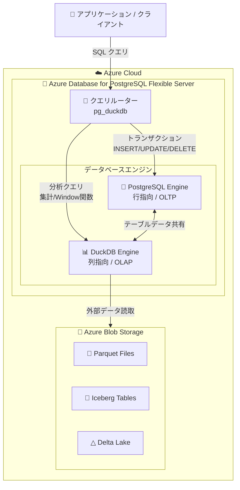

# Azure Database for PostgreSQL: DuckDB 拡張機能 GA

**リリース日**: 2026-06-03

**サービス**: Azure Database for PostgreSQL - Flexible Server

**機能**: DuckDB 拡張機能

**ステータス**: Launched (GA)

[このアップデートのインフォグラフィックを見る](https://takech9203.github.io/azure-news-summary/20260603-postgresql-duckdb-extension.html)

## 概要

Azure Database for PostgreSQL - Flexible Server において、DuckDB 拡張機能 (pg_duckdb) が一般提供 (GA) となった。これにより、PostgreSQL のトランザクション処理 (OLTP) 環境内に DuckDB の列指向ベクトル化分析エンジンを統合し、単一データベースインスタンス上で OLTP と OLAP (分析処理) の両方を実行できるようになる。

DuckDB は高速な分析クエリに特化したインメモリ列指向データベースエンジンであり、pg_duckdb 拡張機能を通じて PostgreSQL 内から直接利用可能になる。従来、分析処理のために別途データウェアハウスや分析基盤を構築・データ同期する必要があったが、この拡張機能により同一の PostgreSQL インスタンス上でトランザクションデータに対する高速分析クエリを即座に実行できる。

本機能は Microsoft Build 2026 にて発表され、Azure のデータプラットフォーム戦略における「データレイクハウス」アーキテクチャの一環として位置付けられる。

**アップデート前の課題**

- PostgreSQL 上で大規模集計・分析クエリを実行すると、行指向ストレージ起因でパフォーマンスが低かった
- 分析ワークロードのために別途 Azure Synapse Analytics やデータウェアハウスを構築し、ETL パイプラインでデータを複製する必要があった
- Parquet や Iceberg 等のデータレイク形式ファイルに PostgreSQL から直接アクセスする手段がなかった
- OLTP と OLAP を単一システムで処理する HTAP アーキテクチャの構築が困難だった

**アップデート後の改善**

- DuckDB の列指向ベクトル化エンジンにより、分析クエリが大幅に高速化された
- 同一 PostgreSQL インスタンス内で OLTP と OLAP を同時処理でき、データ複製が不要になった
- `read_parquet()` 等の関数により Azure Blob Storage 上の Parquet/CSV/JSON ファイルを直接クエリ可能になった
- Apache Iceberg、Delta Lake 形式のテーブルにも対応し、データレイクハウスアーキテクチャを実現できるようになった

## アーキテクチャ図



PostgreSQL のクエリプランナーを拡張し、分析クエリを自動的に DuckDB エンジンにルーティングする。トランザクション操作は従来通り PostgreSQL エンジンが処理し、両エンジンが同一インスタンス内でデータを共有する。

## サービスアップデートの詳細

### 主要機能

1. **透過的クエリアクセラレーション**
   - `duckdb.force_execution=true` の設定により、分析クエリが自動的に DuckDB エンジンを経由して実行される
   - 特別な SQL 構文の変更は不要で、既存のクエリがそのまま高速化される

2. **データレイク読み書き**
   - Parquet、CSV、JSON、Apache Iceberg、Delta Lake 形式のファイルに対応
   - Azure Blob Storage、S3、GCS 上のファイルを直接クエリ可能
   - `read_parquet()` 関数でファイルをテーブルのように扱える

3. **PostgreSQL テーブルとの統合クエリ**
   - ローカル PostgreSQL テーブルと外部データレイクファイルを単一クエリで JOIN 可能
   - データの移動やコピーなしにリアルタイム分析を実現

4. **DuckDB 内部拡張機能のサポート**
   - `duckdb.install_extension('iceberg')` 等で DuckDB 自体の拡張機能をインストール可能
   - Iceberg テーブルのタイムトラベル (バージョンスナップショット) にも対応

## 技術仕様

| 項目 | 詳細 |
|------|------|
| 拡張機能名 | pg_duckdb |
| DuckDB エンジン | 列指向ベクトル化実行エンジン |
| 対応 PostgreSQL バージョン | PostgreSQL 14, 15, 16, 17, 18 |
| 対応データ形式 | Parquet, CSV, JSON, Iceberg, Delta Lake |
| 対応外部ストレージ | Azure Blob Storage, S3, GCS, R2 |
| クエリルーティング | `duckdb.force_execution` パラメータで制御 |
| ライセンス | MIT License |
| ステータス | GA (一般提供) |

## 設定方法

### 前提条件

1. Azure Database for PostgreSQL - Flexible Server インスタンスが作成済みであること
2. PostgreSQL バージョン 14 以上であること
3. `azure.extensions` パラメータで `pg_duckdb` が許可リストに追加されていること

### Azure CLI

```bash
# pg_duckdb 拡張機能を許可リストに追加
az postgres flexible-server parameter set \
  --resource-group <resource_group> \
  --server-name <server_name> \
  --subscription <subscription_id> \
  --name azure.extensions \
  --value pg_duckdb

# データベースに接続して拡張機能を作成
psql "host=<server_name>.postgres.database.azure.com dbname=<database> user=<user> sslmode=require"
```

```sql
-- 拡張機能のインストール
CREATE EXTENSION pg_duckdb;

-- DuckDB エンジンの有効化
SET duckdb.force_execution = true;

-- 分析クエリの実行例 (自動的に DuckDB エンジンで処理)
SELECT
    date_trunc('month', order_date) AS month,
    COUNT(*) AS order_count,
    SUM(amount) AS total_amount
FROM orders
GROUP BY 1
ORDER BY 1;

-- Azure Blob Storage 上の Parquet ファイルをクエリ
SELECT * FROM read_parquet('az://<container>/<path>/data.parquet');
```

### Azure Portal

1. Azure Portal で Azure Database for PostgreSQL Flexible Server のリソースに移動
2. 左メニューの「設定」>「パラメーター」を選択
3. `azure.extensions` パラメータを検索
4. 利用可能な拡張機能一覧から `pg_duckdb` を選択して許可リストに追加
5. 「保存」をクリック
6. psql または任意のクライアントから `CREATE EXTENSION pg_duckdb;` を実行

## メリット

### ビジネス面

- 分析基盤の別途構築が不要になり、インフラコストと運用コストを削減できる
- データの移動・複製が不要なため、リアルタイムに近い分析が可能になる
- 既存の PostgreSQL スキルセットで分析ワークロードに対応でき、追加の学習コストが低い
- データレイクハウスアーキテクチャをシンプルに実現し、アーキテクチャ全体の複雑性を低減

### 技術面

- 列指向ベクトル化エンジンにより、集計・分析クエリが行指向比で大幅に高速化される
- 既存 SQL クエリの変更なしに DuckDB エンジンへの透過的ルーティングが可能
- Parquet/Iceberg/Delta Lake への直接アクセスにより、ETL パイプラインを排除できる
- ACID トランザクションを維持しながら分析処理を同一インスタンスで実行可能

## デメリット・制約事項

- DuckDB の高度な型 (STRUCT, MAP, UNION) は `duckdb.query()` コンテキスト内でのみ使用可能で、通常の SQL から直接操作できない
- `duckdb.force_execution=true` の設定が必要であり、すべてのクエリが自動ルーティングされるわけではない (設定による明示的な有効化が必要)
- 書き込み操作 (INSERT/UPDATE/DELETE) は引き続き PostgreSQL エンジンで処理されるため、分析用一時テーブルへの書き込みには TEMP テーブルの使用が推奨される
- 一部のクエリパターンで PostgreSQL 標準と異なる挙動を示す可能性がある
- DuckDB エンジンはインメモリ処理のため、利用可能メモリに応じてパフォーマンスが変動する

## ユースケース

### ユースケース 1: トランザクションデータのリアルタイム分析

**シナリオ**: EC サイトの注文データ (PostgreSQL に OLTP で格納) に対して、リアルタイムの売上集計・傾向分析を実行したい

**実装例**:

```sql
-- DuckDB エンジンで高速に集計
SET duckdb.force_execution = true;

-- 直近 30 日の売上トレンドを集計
SELECT
    date_trunc('day', created_at) AS day,
    product_category,
    COUNT(*) AS orders,
    SUM(total_price) AS revenue,
    AVG(total_price) AS avg_order_value
FROM orders
WHERE created_at >= NOW() - INTERVAL '30 days'
GROUP BY 1, 2
ORDER BY 1, 4 DESC;
```

**効果**: 別途分析基盤を構築せず、トランザクションデータベース上で直接集計クエリを高速実行。データ鮮度がリアルタイムであり、ETL 遅延がゼロ。

### ユースケース 2: データレイクハウスクエリ

**シナリオ**: Azure Blob Storage に蓄積された過去の履歴データ (Parquet 形式) と現行の PostgreSQL テーブルを結合して分析したい

**実装例**:

```sql
-- Parquet ファイルと PostgreSQL テーブルの結合クエリ
SELECT
    c.customer_name,
    c.segment,
    h.total_orders AS historical_orders,
    COUNT(o.id) AS recent_orders
FROM customers c
JOIN read_parquet('az://datalake/history/orders_2020_2024.parquet') h
    ON c.customer_id = h.customer_id
LEFT JOIN orders o
    ON c.customer_id = o.customer_id
    AND o.created_at >= '2025-01-01'
GROUP BY 1, 2, 3;
```

**効果**: 過去データをデータレイクに低コスト保存しつつ、現行データとシームレスに結合分析可能。データウェアハウスの構築が不要。

### ユースケース 3: Iceberg テーブルによるタイムトラベル分析

**シナリオ**: データレイク上の Apache Iceberg テーブルに対して、特定時点のスナップショットをクエリし、データの変遷を追跡したい

**実装例**:

```sql
-- Iceberg 拡張機能のインストール
SELECT duckdb.install_extension('iceberg');

-- 特定スナップショットの Iceberg テーブルをクエリ
SELECT *
FROM iceberg_scan('az://datalake/iceberg/inventory/',
    allow_moved_paths => true);
```

**効果**: PostgreSQL からデータレイクの Iceberg テーブルに直接アクセスし、タイムトラベル機能を活用した監査・分析が可能。

## 料金

DuckDB 拡張機能自体に追加料金は発生しない。Azure Database for PostgreSQL - Flexible Server の通常の料金体系が適用される。

| 項目 | 料金の考慮事項 |
|------|---------------|
| 拡張機能ライセンス | 無料 (MIT License) |
| コンピュート | Flexible Server のコンピュートティア料金 (分析ワークロードには上位 SKU 推奨) |
| ストレージ | Flexible Server のストレージ料金 |
| 外部データアクセス | Azure Blob Storage の読取トランザクション料金 + データ転送料金 |

分析ワークロードの特性上、メモリ最適化 SKU (E シリーズ) の選択が推奨される。DuckDB はインメモリ処理のため、利用可能メモリが多いほどパフォーマンスが向上する。

詳細は [Azure Database for PostgreSQL 料金ページ](https://azure.microsoft.com/pricing/details/postgresql/flexible-server/) を参照。

## 関連サービス・機能

- **Azure Synapse Analytics**: 大規模データウェアハウス / 分析サービス。DuckDB 拡張機能は Synapse を代替するものではなく、小〜中規模の分析ワークロードを PostgreSQL 内で完結させるケースに適している
- **Azure Blob Storage**: DuckDB から Parquet/Iceberg/Delta Lake ファイルを読み取る外部ストレージとして利用
- **Microsoft Fabric**: エンタープライズ分析プラットフォーム。PostgreSQL のデータを Fabric にミラーリングする機能と補完的に利用可能
- **pg_ivm 拡張機能**: 増分マテリアライズドビューによる分析ビューの効率的更新。DuckDB と組み合わせることで分析パフォーマンスをさらに向上
- **Azure Data Lake Storage Gen2**: データレイクハウスの基盤ストレージ。DuckDB から直接クエリ可能

## 参考リンク

- [インフォグラフィック](https://takech9203.github.io/azure-news-summary/20260603-postgresql-duckdb-extension.html)
- [公式アップデート情報](https://azure.microsoft.com/updates?id=563766)
- [Azure Blog - Microsoft Build 2026: Building agentic apps with Microsoft Fabric and Microsoft Databases](https://azure.microsoft.com/en-us/blog/microsoft-build-2026-building-agentic-apps-with-microsoft-fabric-and-microsoft-databases/)
- [Microsoft Learn - 拡張機能の許可方法](https://learn.microsoft.com/azure/postgresql/extensions/how-to-allow-extensions)
- [pg_duckdb GitHub リポジトリ](https://github.com/duckdb/pg_duckdb)
- [Azure Database for PostgreSQL 料金ページ](https://azure.microsoft.com/pricing/details/postgresql/flexible-server/)

## まとめ

Azure Database for PostgreSQL - Flexible Server における DuckDB 拡張機能の GA は、PostgreSQL ユーザーにとって大きな転換点となるアップデートである。これまで分析ワークロードのために別途構築していたデータウェアハウスや ETL パイプラインを、多くのケースで不要にする可能性がある。

Solutions Architect として推奨するアクションは以下の通り:

1. **既存の分析パイプライン見直し**: PostgreSQL から別システムへのデータ複製が発生している場合、DuckDB 拡張機能で代替可能か評価する
2. **PoC の実施**: 代表的な分析クエリのパフォーマンスを DuckDB エンジン有効/無効で比較検証する
3. **データレイクハウス設計**: Azure Blob Storage 上の Parquet/Iceberg ファイルを DuckDB で直接クエリする構成を検討する
4. **SKU の最適化**: 分析ワークロードを同一インスタンスで処理する場合、メモリ最適化 SKU への変更を検討する

特に、小〜中規模のデータ (数百 GB まで) で OLTP と OLAP を同一システムで処理したいユースケースにおいて、アーキテクチャのシンプル化とコスト削減に大きく貢献する機能である。

---

**タグ**: #Azure #PostgreSQL #DuckDB #Analytics #OLAP #DataLakehouse #Build2026
