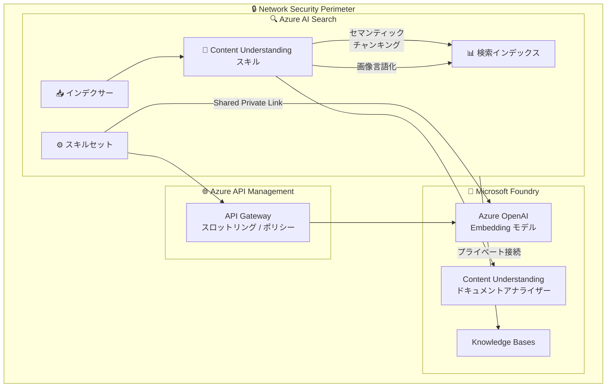

# Azure AI Search: プライベート接続 GA、APIM 統合、Content Understanding チャンキング

**リリース日**: 2026-06-04

**サービス**: Azure AI Search

**機能**: プライベート接続 GA、APIM 統合、Content Understanding チャンキング

**ステータス**: Launched (GA) / In preview

[このアップデートのインフォグラフィックを見る](https://takech9203.github.io/azure-news-summary/20260604-ai-search-private-connectivity-apim-content.html)

## 概要

Microsoft Build 2026 において、Azure AI Search に関する 3 つの重要なアップデートが発表された。これらはいずれも、エンタープライズ向け RAG (Retrieval-Augmented Generation) パイプラインのセキュリティ、ガバナンス、およびドキュメント処理能力を大幅に強化するものである。

第一に、Azure AI Search と Foundry Knowledge Bases 間のプライベート接続が一般提供 (GA) となった。Shared Private Link または Network Security Perimeter を使用して、インジェスト、エンリッチメント、検索、エージェントトラフィックをプライベートネットワーク経由でルーティングできるようになった。

第二に、Azure AI Search における Foundry モデル統合に Azure API Management (APIM) サポートがパブリックプレビューとして追加された。大規模 RAG パイプラインを運用するプラットフォームエンジニアや AI ソリューションチームが、Foundry および Azure OpenAI モデルを APIM の背後に配置できるようになる。

第三に、Content Understanding スキルにセマンティックチャンキングと画像言語化 (image verbalization) 機能がパブリックプレビューとして追加された。インデクサーがドキュメントを意味的に意味のあるチャンクに分割し、画像のテキスト記述を生成できるようになった。

**アップデート前の課題**

- Azure AI Search と Foundry サービス間の通信がパブリックネットワークを経由する場合があり、規制の厳しい業界ではコンプライアンス要件を満たせないケースがあった
- 大規模 RAG パイプラインにおいて、モデルエンドポイントへのアクセス制御やレート制限、使用量の監視が困難だった
- ドキュメントのチャンキングは固定サイズベースであり、段落境界やセマンティクスを考慮しない分割が行われていた。また、ドキュメント内の画像はテキストとして検索できなかった

**アップデート後の改善**

- Shared Private Link と Network Security Perimeter により、検索リソースと Foundry サービス間の全トラフィックをプライベートチャネルで保護可能
- APIM を経由することで、モデルへのアクセスにスロットリング、認証、監視、ポリシー適用を一元的に実施可能
- セマンティックチャンキングにより段落境界を尊重した分割が可能になり、画像言語化により画像の AI 記述がチャンク内に埋め込まれるようになった

## アーキテクチャ図



Azure AI Search の主要コンポーネントが Network Security Perimeter 内でプライベートに接続される構成を示す。APIM Gateway を経由したモデルアクセスと、Content Understanding スキルによるセマンティックチャンキング・画像言語化のデータフローを表現している。

## サービスアップデートの詳細

### 1. プライベート接続の一般提供 (GA)

Azure AI Search と Foundry Knowledge Bases 間のプライベートなエンドツーエンドネットワーク接続が GA となった。

**接続方式:**

| 方式 | 特徴 |
|------|------|
| Shared Private Link | 特定のリソースに対する 1 対 1 のプライベートエンドポイント接続。リソースオーナーの承認が必要 |
| Network Security Perimeter (NSP) | 論理的なネットワーク境界内のリソース間で暗黙的にプライベート通信を許可。マネージド ID 使用時は追加設定不要 |

**サポートされるトラフィック種別:**

- インジェスト (データ取り込み)
- エンリッチメント (AI スキル実行)
- 検索 (リトリーバル)
- エージェントトラフィック (Agentic Retrieval)

**Shared Private Link でサポートされる Group ID:**

| リソースタイプ | Group ID |
|---------------|----------|
| Microsoft.CognitiveServices/accounts (Azure OpenAI) | `openai_account` |
| Microsoft.CognitiveServices/accounts (Foundry) | `foundry_account` |
| Microsoft.CognitiveServices/accounts (Cognitive Services) | `cognitiveservices_account` |
| Microsoft.ApiManagement/service | `Gateway` |

### 2. APIM サポート (パブリックプレビュー)

Microsoft Foundry が Azure AI Search のすべての Foundry モデル統合に Azure API Management サポートを提供する。

**主要機能:**

1. **統合ゲートウェイ管理**
   - Foundry モデルおよび Azure OpenAI モデルを APIM の背後に配置
   - 統一されたエンドポイント管理

2. **エンタープライズガバナンス**
   - レート制限とスロットリングポリシー
   - 認証・認可の集中管理
   - 使用量の監視とログ記録

3. **プライベート接続との統合**
   - Shared Private Link の Group ID `Gateway` により APIM Gateway へのプライベート接続をサポート
   - インデクサーの `executionEnvironment` を `private` に設定することで完全プライベート実行が可能

### 3. Content Understanding チャンキングと画像言語化 (パブリックプレビュー)

`2026-05-01-preview` REST API で利用可能な新機能として、セマンティックチャンキングと画像言語化が追加された。

**セマンティックチャンキング:**

| パラメータ | 値 | 説明 |
|-----------|-----|------|
| `method` | `semantic` | レイアウト認識型チャンキング。段落境界を尊重 |
| `unit` | `tokens` | トークン単位で長さを計測 |
| `maximumLength` | 100 - 8,000 | 最大チャンク長 (トークン) |
| `overlapLength` | 0 (固定) | セマンティックモードではオーバーラップ不可 |

**画像言語化 (Image Verbalization):**

| パラメータ | 説明 |
|-----------|------|
| `modelName` | Azure OpenAI チャット補完モデル名 (例: `gpt-4.1`) |
| `modelDeployment` | Foundry リソース内のモデルデプロイメント名 |

画像言語化により、ドキュメント内の画像・チャート・図が AI によるテキスト記述に変換され、`<figure>` タグとしてチャンクのコンテンツに埋め込まれる。

## 技術仕様

| 項目 | 詳細 |
|------|------|
| プライベート接続 API バージョン | Management REST API 2025-05-01 |
| Content Understanding スキル (GA) | Search REST API 2026-04-01 |
| セマンティックチャンキング・画像言語化 | Search REST API 2026-05-01-preview |
| Content Understanding スキルの odata.type | `Microsoft.Skills.Util.ContentUnderstandingSkill` |
| APIM Shared Private Link Group ID | `Gateway` |
| Foundry Shared Private Link Group ID | `foundry_account` |
| サポートファイル形式 | PDF, JPEG, PNG, BMP, HEIF, TIFF, DOCX, XLSX, PPTX, HTML, TXT, MD, RTF, EML |
| 画像サイズ制限 | 50x50 ~ 10,000x10,000 ピクセル |
| ドキュメント処理タイムアウト | 5 分 |

## 設定方法

### 前提条件

1. Azure AI Search サービス (Basic 以上のティア)
2. Microsoft Foundry リソース (AIServices 種類)
3. プライベート接続を使用する場合: 2024 年 4 月 3 日以降に作成されたサービス

### Shared Private Link の作成 (Azure CLI)

```bash
# Foundry リソースへの Shared Private Link を作成
az search shared-private-link-resource create \
  --name "foundry-private-link" \
  --service-name "my-search-service" \
  --resource-group "my-resource-group" \
  --group-id "foundry_account" \
  --resource-id "/subscriptions/{sub-id}/resourceGroups/{rg}/providers/Microsoft.CognitiveServices/accounts/{foundry-resource}"
```

### Content Understanding スキル定義 (セマンティックチャンキング + 画像言語化)

```json
{
  "skills": [
    {
      "@odata.type": "#Microsoft.Skills.Util.ContentUnderstandingSkill",
      "context": "/document",
      "modelName": "gpt-4.1",
      "modelDeployment": "myGpt41Deployment",
      "extractionOptions": ["images", "locationMetadata"],
      "chunkingProperties": {
        "method": "semantic",
        "unit": "tokens",
        "maximumLength": 500
      },
      "inputs": [
        {
          "name": "file_data",
          "source": "/document/file_data"
        }
      ],
      "outputs": [
        { "name": "text_sections", "targetName": "text_sections" },
        { "name": "normalized_images", "targetName": "normalized_images" }
      ]
    }
  ]
}
```

### Network Security Perimeter の設定

```bash
# NSP の構成を確認
az rest --method get \
  --url "https://management.azure.com/subscriptions/{sub-id}/resourceGroups/{rg}/providers/Microsoft.Search/searchServices/{service}/networkSecurityPerimeterConfigurations?api-version=2025-05-01"
```

## メリット

### ビジネス面

- 規制の厳しい業界 (金融、医療、政府機関) でも RAG パイプラインをコンプライアンスに準拠して構築可能
- APIM による集中管理で、モデル利用コストの可視化と制御が可能
- セマンティックチャンキングにより検索品質が向上し、RAG アプリケーションの回答精度が改善

### 技術面

- Network Security Perimeter を使用すると、マネージド ID 認証時に追加の接続設定が不要で運用負荷を軽減
- Content Understanding スキルは Text Split スキルを不要にし、スキルセット構成を簡素化
- 画像言語化により、マルチモーダルドキュメント (PDF 内の図表など) もテキスト検索の対象に

## デメリット・制約事項

- Shared Private Link はティアごとにリソース数の上限がある
- Content Understanding スキルは 5 分以上の処理が必要な大規模ドキュメントには不向き (タイムアウトしても課金される)
- セマンティックチャンキングと画像言語化は 2026-05-01-preview API でのみ利用可能 (安定版未提供)
- Network Security Perimeter でサポートされるインデクサーデータソースは Azure Blob Storage、Azure Cosmos DB for NoSQL、Azure SQL Database に限定
- APIM サポートはパブリックプレビュー段階であり、本番環境での利用には注意が必要
- Content Understanding スキルには無料枠 (20 ドキュメント/日) がなく、すべての処理が課金対象

## ユースケース

### ユースケース 1: 規制業界での RAG パイプライン

**シナリオ**: 金融機関が社内ドキュメントを用いた AI アシスタントを構築する際、すべてのデータ通信をプライベートネットワーク内に閉じる必要がある。

**実装例**:

```bash
# 1. Search と Foundry リソースを同一 NSP に追加
# 2. マネージド ID を設定 (暗黙的なプライベート通信)
# 3. インデクサーの実行環境をプライベートに設定

az rest --method put \
  --url "https://{service}.search.windows.net/indexers/{indexer}?api-version=2026-04-01" \
  --body '{
    "name": "secure-indexer",
    "dataSourceName": "blob-datasource",
    "targetIndexName": "secure-index",
    "parameters": {
      "configuration": {
        "executionEnvironment": "private"
      }
    }
  }'
```

**効果**: パブリックインターネットを経由せずに、インジェストからリトリーバルまでの全フローをプライベートに実行可能。

### ユースケース 2: 大規模マルチモーダルドキュメント検索

**シナリオ**: 製造業の企業が、図面や写真を含む技術文書を AI 検索の対象としたい。

**実装例**:

```json
{
  "@odata.type": "#Microsoft.Skills.Util.ContentUnderstandingSkill",
  "context": "/document",
  "modelName": "gpt-4.1",
  "modelDeployment": "gpt41-deployment",
  "chunkingProperties": {
    "method": "semantic",
    "unit": "tokens",
    "maximumLength": 1000
  },
  "inputs": [{"name": "file_data", "source": "/document/file_data"}],
  "outputs": [{"name": "text_sections", "targetName": "text_sections"}]
}
```

**効果**: 技術文書内の図面やチャートが自動的にテキスト記述に変換され、「配管図に3つのバルブが描かれている資料」のような自然言語クエリで検索可能になる。

## 料金

Content Understanding スキルは [Azure Content Understanding 料金](https://azure.microsoft.com/pricing/details/content-understanding/) に基づいて課金される。他のビルトインスキルと異なり、無料枠 (20 ドキュメント/日) は適用されない。

Shared Private Link は [Azure Private Link 料金](https://azure.microsoft.com/pricing/details/private-link/) に基づいて課金される。

APIM については [Azure API Management 料金](https://azure.microsoft.com/pricing/details/api-management/) を参照。

## 利用可能リージョン

- プライベート接続 (Shared Private Link / NSP): Azure AI Search が利用可能な全リージョン
- Content Understanding スキル: Foundry リソースが [Azure Content Understanding のリージョンサポート](https://learn.microsoft.com/azure/ai-services/content-understanding/language-region-support) に記載されたリージョンに存在する必要がある
- APIM サポート: パブリックプレビューのリージョン制限については公式ドキュメントを参照

## 関連サービス・機能

- **Microsoft Foundry**: AI モデルのホスティングと Azure AI Search との統合基盤
- **Azure API Management**: モデルエンドポイントのガバナンスとアクセス制御
- **Azure Content Understanding**: ドキュメント解析とチャンキングの基盤サービス
- **Azure Private Link**: Shared Private Link によるプライベートエンドポイント接続
- **Network Security Perimeter**: リソース間のネットワークレベルの論理的境界
- **Agentic Retrieval**: Knowledge Agent から Foundry モデルへのプライベートな検索呼び出し

## 参考リンク

- [インフォグラフィック](https://takech9203.github.io/azure-news-summary/20260604-ai-search-private-connectivity-apim-content.html)
- [公式アップデート: Private Connectivity GA](https://azure.microsoft.com/updates?id=563516)
- [公式アップデート: APIM Support](https://azure.microsoft.com/updates?id=563451)
- [公式アップデート: Content Understanding chunking](https://azure.microsoft.com/updates?id=563661)
- [Microsoft Learn: Shared Private Link](https://learn.microsoft.com/azure/search/search-indexer-howto-access-private)
- [Microsoft Learn: Network Security Perimeter](https://learn.microsoft.com/azure/search/search-security-network-security-perimeter)
- [Microsoft Learn: Content Understanding スキル](https://learn.microsoft.com/azure/search/cognitive-search-skill-content-understanding)
- [Microsoft Learn: 統合ベクトル化](https://learn.microsoft.com/azure/search/vector-search-integrated-vectorization)
- [料金: Azure Content Understanding](https://azure.microsoft.com/pricing/details/content-understanding/)
- [料金: Azure Private Link](https://azure.microsoft.com/pricing/details/private-link/)

## まとめ

Build 2026 で発表された Azure AI Search の 3 つのアップデートは、エンタープライズ RAG ソリューションの成熟度を大幅に引き上げるものである。プライベート接続の GA により、規制の厳しい環境でも安心して AI 検索パイプラインを構築できるようになった。APIM 統合はモデルアクセスのガバナンスを実現し、Content Understanding のセマンティックチャンキングと画像言語化は検索品質の向上に直結する。

**推奨される次のアクション:**

1. 既存の Azure AI Search パイプラインで Foundry リソースとの通信がパブリックネットワーク経由の場合、Network Security Perimeter または Shared Private Link への移行を検討する
2. 大規模 RAG パイプラインを運用している場合、APIM によるモデルアクセスの集中管理を評価する
3. ドキュメント内に画像・図表が含まれるユースケースでは、Content Understanding スキルのセマンティックチャンキングと画像言語化のプレビュー機能を試す

---

**タグ**: #AzureAISearch #PrivateConnectivity #APIM #ContentUnderstanding #SemanticChunking #NetworkSecurityPerimeter #SharedPrivateLink #RAG #Build2026 #Microsoft Foundry
