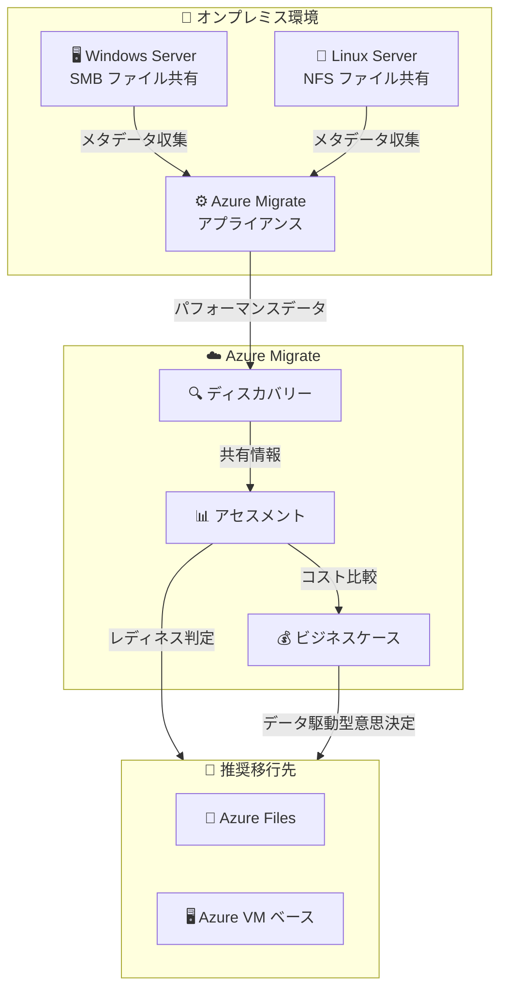

# Azure Migrate: ファイル共有アセスメント ワールドワイド GA

**リリース日**: 2026-06-04

**サービス**: Azure Migrate

**機能**: ファイル共有アセスメント ワールドワイド GA

**ステータス**: Launched (GA)

[このアップデートのインフォグラフィックを見る](https://takech9203.github.io/azure-news-summary/20260604-azure-migrate-files-worldwide.html)

## 概要

Azure Migrate が、Windows および Linux サーバー上でホストされている SMB および NFS ファイル共有のディスカバリーとアセスメントをワールドワイドで一般提供 (GA) 開始した。これにより、オンプレミスのファイル共有環境を包括的かつデータ駆動型で可視化し、Azure への明確な移行パスを提供する。

従来、Azure Migrate はサーバー (VM)、SQL データベース、Web アプリケーションのアセスメントに対応していたが、ファイル共有に特化したアセスメント機能が加わったことで、ストレージ移行の計画フェーズが大幅に効率化される。Azure Migrate アプライアンスを既にデプロイしている環境では、追加セットアップなしでファイル共有のディスカバリーが可能である。

**アップデート前の課題**

- ファイル共有の移行評価には手動でのインベントリ収集が必要であり、特に大規模・分散環境では時間がかかっていた
- SMB/NFS ファイル共有の IOPS、スループット、容量を包括的に評価する標準的なツールがなかった
- ファイル共有の移行先 (Azure Files vs. Azure VM ベース) の選定に、データに基づいた判断材料が不足していた
- 限定リージョンでのプレビュー提供であり、全リージョンの顧客が利用できなかった

**アップデート後の改善**

- Azure Migrate アプライアンスが自動的に Windows/Linux サーバー上の SMB・NFS 共有を検出する
- IOPS、スループット、サイズ、容量、リージョン可用性を評価し、レディネス状態を判定する
- Azure Files への移行を優先推奨し、不適切な場合は Azure VM ベースのパスを提案する
- ワールドワイドで GA となり、すべてのリージョンの顧客が利用可能になった

## アーキテクチャ図

Azure Migrate アプライアンスがオンプレミスのファイルサーバーからメタデータとパフォーマンスデータを収集し、クラウド上でアセスメントを実行して最適な移行先を推奨するワークフローを示す。

## サービスアップデートの詳細

### 主要機能

1. **ファイル共有ディスカバリー**
   - Azure Migrate アプライアンスが Windows/Linux サーバー上の既存 SMB・NFS 共有を自動検出
   - サーバーごとのビュー: 特定サーバーのすべてのファイル共有を表示
   - インフラストラクチャビュー: 全サーバーのファイル共有を階層的インベントリとして一覧表示
   - 各共有のボリューム、ファイルシステムパス、概算サイズなどの詳細を確認可能

2. **ファイル共有アセスメント**
   - 検出された共有を選択してアセスメントを作成
   - IOPS、スループット、サイズ、容量、リージョン可用性を評価
   - レディネス状態を判定: Ready / Ready with conditions / Not ready
   - Azure Files を優先的な移行先として推奨し、不適切な場合は Azure VM ベースのパスにフォールバック

3. **ビジネスケース作成**
   - アセスメントからビジネスケースを生成
   - オンプレミスでの運用コストと Azure Files への移行コストを比較
   - データ駆動型の移行意思決定を支援

### 対応プロトコルとプラットフォーム

| プロトコル | プラットフォーム | サポート状況 |
|-----------|---------------|-------------|
| SMB | Windows Server | サポート |
| SMB | Linux | サポート |
| NFS | Linux | サポート |
| NFS | Windows Server | サポート |

## 技術仕様

| 項目 | 詳細 |
|------|------|
| ディスカバリー方式 | Azure Migrate アプライアンス (エージェントレス) |
| 対応ファイル共有 | SMB、NFS |
| 対応 OS | Windows Server、Linux |
| アセスメント評価項目 | IOPS、スループット、サイズ、容量、リージョン可用性 |
| レディネス判定 | Ready / Ready with conditions / Not ready |
| 推奨移行先 | Azure Files (優先)、Azure VM ベース (フォールバック) |
| 追加セットアップ | Azure Migrate アプライアンス展開済みの場合は不要 |

## 設定方法

### 前提条件

1. Azure サブスクリプションに Contributor または Owner 権限を持つアカウント
2. Azure Migrate プロジェクトの作成済み
3. Azure Migrate アプライアンスのデプロイと構成済み
4. ファイル共有をホストする Windows/Linux サーバーへのネットワーク接続

### Azure Portal

1. Azure Migrate プロジェクトに移動
2. ディスカバリーが完了すると、自動的にファイル共有が検出される
3. インフラストラクチャビューまたはサーバーごとのビューでファイル共有を確認
4. 移行評価したいファイル共有を選択し、アセスメントを作成
5. アセスメント結果でレディネス状態と推奨構成を確認
6. 必要に応じてビジネスケースを作成し、コスト比較を実施

## メリット

### ビジネス面

- 移行計画のための手動インベントリ収集が不要になり、プロジェクト期間を短縮
- データ駆動型のコスト比較により、移行の ROI を定量的に示せる
- ファイル共有環境の全体像を可視化し、移行の優先順位付けが容易に

### 技術面

- エージェントレスのディスカバリーにより、既存環境への影響を最小限に抑制
- パフォーマンスデータに基づいたサイジング推奨で、移行後の性能問題を回避
- SMB・NFS 両方のプロトコルに対応し、異種環境でも一元的に評価可能
- 既存の Azure Migrate アプライアンスを活用でき、追加インフラ不要

## デメリット・制約事項

- Azure Migrate アプライアンスの初期デプロイが必要 (既存環境で未導入の場合)
- パフォーマンスベースのアセスメントには十分なデータ収集期間が必要
- 100 TiB を超える大規模ファイルデータの場合、サードパーティツール (Komprise など) の併用が推奨される場合がある

## ユースケース

### ユースケース 1: 大規模ファイルサーバー統合

**シナリオ**: 複数拠点に分散した Windows ファイルサーバー (SMB) を Azure Files に統合移行する計画を立てる。

**効果**: 全拠点のファイル共有を自動検出し、各共有のパフォーマンス特性に基づいて Azure Files の適切な SKU (Standard HDD/SSD/Premium) を推奨。移行前後のコスト比較も自動生成される。

### ユースケース 2: Linux NFS 環境のクラウド移行評価

**シナリオ**: Linux サーバー上の NFS ファイル共有をクラウドに移行する際、Azure Files NFS と Azure VM ベースのどちらが適切かを評価する。

**効果**: ワークロードの IOPS・スループット要件に基づき、Azure Files NFS への移行が可能か自動判定。要件を満たさない場合は Azure VM ベースの代替パスを提示する。

## 料金

Azure Migrate の Discovery and Assessment ツール自体は無料で利用可能。ファイル共有のディスカバリーとアセスメントに追加料金は発生しない。

移行先の Azure Files のコストは、選択する SKU (Standard/Premium) と容量・パフォーマンスに応じて発生する。

詳細は [Azure Migrate の料金ページ](https://azure.microsoft.com/pricing/details/azure-migrate/) および [Azure Files の料金ページ](https://azure.microsoft.com/pricing/details/storage/files/) を参照。

## 利用可能リージョン

本アップデートにより、Azure Migrate のファイル共有アセスメントがワールドワイドで利用可能になった。Azure Migrate プロジェクトを作成可能なすべてのリージョンでこの機能を利用できる。

## 関連サービス・機能

- **Azure Files**: ファイル共有の主要な移行先。SMB・NFS プロトコルに対応したフルマネージドファイル共有サービス
- **Azure Storage Mover**: ファイル共有の実際のデータ移行に使用するフルマネージド移行サービス
- **Azure File Sync**: オンプレミスとクラウドのハイブリッドデプロイメントを実現するサービス
- **Azure NetApp Files**: 高パフォーマンス要件のワークロード向けのエンタープライズグレードファイルストレージ

## 参考リンク

- [インフォグラフィック](https://takech9203.github.io/azure-news-summary/20260604-azure-migrate-files-worldwide.html)
- [公式アップデート情報](https://azure.microsoft.com/updates?id=564563)
- [Microsoft Learn - Azure Files 移行の概要](https://learn.microsoft.com/azure/storage/files/storage-files-migration-overview)
- [Microsoft Learn - Azure Migrate サポートマトリックス](https://learn.microsoft.com/azure/migrate/migrate-support-matrix)
- [Azure Files 料金ページ](https://azure.microsoft.com/pricing/details/storage/files/)

## まとめ

Azure Migrate のファイル共有アセスメントがワールドワイドで GA となったことで、あらゆるリージョンの顧客が SMB/NFS ファイル共有の包括的な移行評価を利用可能になった。既に Azure Migrate アプライアンスを展開済みの環境では追加設定なしにファイル共有の自動検出が開始され、パフォーマンスベースのアセスメントにより最適な移行先の推奨とコスト比較が得られる。

Solutions Architect としての推奨アクション:
- 既存の Azure Migrate プロジェクトでファイル共有のディスカバリー結果を確認する
- ファイルサーバー移行プロジェクトにおいて、手動のインベントリ収集からこの機能への移行を検討する
- ビジネスケース機能を活用し、ファイル共有移行の経済的メリットを定量化する

---

**タグ**: #AzureMigrate #AzureFiles #FileShare #SMB #NFS #Migration #Assessment #GA
