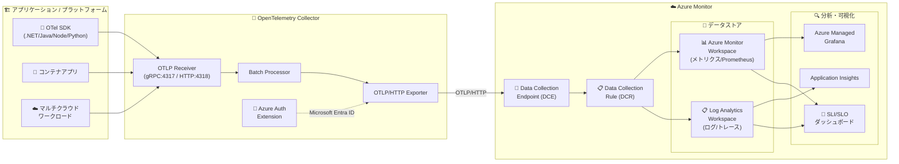

# Azure Monitor: OTLP シグナルの OpenTelemetry Collector 経由インジェストと Service Level Indicators (SLI)

**リリース日**: 2026-06-04

**サービス**: Azure Monitor

**機能**: OTLP ネイティブインジェスト (OpenTelemetry Collector 経由) および Service Level Indicators (SLI) / Service Level Objectives (SLO)

**ステータス**: Launched (GA)

[このアップデートのインフォグラフィックを見る](https://takech9203.github.io/azure-news-summary/20260604-azure-monitor-otlp-sli.html)

## 概要

Microsoft Build 2026 において、Azure Monitor の観測性基盤を強化する 2 つの重要な GA (一般提供) が発表された。1 つ目は OpenTelemetry Collector を使用した OTLP (OpenTelemetry Protocol) シグナルの Azure Monitor へのネイティブインジェスト、2 つ目は Service Level Indicators (SLI) と Service Level Objectives (SLO) 機能である。

OTLP ネイティブインジェストにより、OpenTelemetry で計装されたアプリケーションやプラットフォームから、メトリクス・トレース・ログの 3 種類のテレメトリデータを、オープンソースの OpenTelemetry Collector を経由して Azure Monitor のクラウドインジェストエンドポイントに直接送信できるようになった。これはベンダーニュートラルなテレメトリパイプラインを維持しながら Azure Monitor の分析・可視化機能を活用したいチームに最適なアプローチである。

SLI/SLO 機能は、CPU やメモリなどのインフラストラクチャシグナルだけに頼るのではなく、顧客がアプリケーションをどのように体験しているかを測定するための複合インジケータを定義できる機能である。チームはサービスレベルをより明確に計測し、目標に対する達成状況を継続的に追跡できるようになる。

**アップデート前の課題**

- OpenTelemetry Collector から Azure Monitor にデータを送信するには、サードパーティ製エクスポーターやカスタム設定が必要であり、公式にサポートされたネイティブ OTLP パスが存在しなかった
- ベンダーニュートラルな OpenTelemetry パイプラインを採用するチームは、Azure Monitor の分析機能を十分に活用するために追加の統合作業が必要だった
- アプリケーションの可用性やパフォーマンスを顧客体験の視点から計測するには、複数のメトリクスを手動で組み合わせて分析する必要があり、SLI/SLO の体系的な管理が困難だった
- インフラストラクチャメトリクス (CPU、メモリ等) と顧客体験メトリクスの間にギャップがあり、ビジネス視点でのサービス品質の可視化が難しかった

**アップデート後の改善**

- OpenTelemetry Collector から Azure Monitor クラウドインジェストエンドポイントへ OTLP シグナル (メトリクス、トレース、ログ) を直接送信可能になった
- Microsoft Entra ID による認証と Data Collection Rules (DCR) による制御で、セキュアかつ宣言的なテレメトリパイプラインが構築できる
- SLI/SLO 機能により、複合インジケータを定義して顧客体験に基づくサービスレベルの継続的な計測と追跡が可能になった
- Application Insights、Log Analytics、Azure Managed Grafana などの既存の Azure Monitor エクスペリエンスで OTLP データを分析・可視化できる

## アーキテクチャ図



OpenTelemetry で計装されたアプリケーションからのテレメトリデータが、OpenTelemetry Collector の OTLP Receiver で受信され、Batch Processor で処理された後、Azure Auth Extension による Microsoft Entra ID 認証を経て OTLP/HTTP Exporter から Azure Monitor の Data Collection Endpoint (DCE) に送信される。DCR のルールに基づき、メトリクスは Azure Monitor Workspace に、ログとトレースは Log Analytics Workspace に格納され、Application Insights や Grafana、SLI/SLO ダッシュボードで分析・可視化される。

## サービスアップデートの詳細

### 1. OTLP シグナルの OpenTelemetry Collector 経由インジェスト

**ステータス**: Launched (GA)

Azure Monitor が OpenTelemetry Protocol (OTLP) シグナルのネイティブインジェストをサポートし、オープンソースの OpenTelemetry Collector から直接 Azure Monitor のクラウドインジェストエンドポイントにテレメトリデータを送信できるようになった。

**主な特徴:**

1. **3 種類のシグナルすべてに対応**
   - メトリクス: Azure Monitor Workspace (Prometheus データストア) に格納され、PromQL でクエリ可能
   - ログ: Log Analytics Workspace に OpenTelemetry セマンティック規約で格納
   - トレース: Log Analytics Workspace に分散トレースとして格納

2. **3 つのインジェストメカニズム**
   - OpenTelemetry Collector: あらゆる環境から Azure Monitor クラウドエンドポイントに直接送信 (本 GA の主対象)
   - Azure Monitor Agent (AMA): Azure VM、Virtual Machine Scale Sets、Azure Arc サーバーからのインジェスト (プレビュー)
   - AKS アドオン: AKS クラスターのコンテナアプリケーションからの収集

3. **セキュアな認証基盤**
   - Microsoft Entra ID による認証 (Azure Authentication Extension)
   - マネージド ID、ワークロード ID、サービスプリンシパルに対応
   - Data Collection Rule (DCR) による RBAC 制御 (Monitoring Metrics Publisher ロール)

4. **Application Insights との統合**
   - OTLP サポートを有効化した Application Insights リソースの作成が可能
   - DCR リソース ID とエンドポイント URL が自動プロビジョニング
   - 既存の Application Insights エクスペリエンス (分散トレース、障害分析等) で OTLP データを分析

### 2. Azure Monitor Service Level Indicators (SLI) / Service Level Objectives (SLO)

**ステータス**: Launched (GA)

Azure Monitor に Service Level Indicators (SLI) と Service Level Objectives (SLO) が追加され、チームが顧客体験に基づいてアプリケーションのサービスレベルを計測・追跡できるようになった。

**主な特徴:**

1. **複合インジケータの定義**
   - CPU やメモリなどの単一インフラストラクチャシグナルではなく、複数の指標を組み合わせた複合的な SLI を定義可能
   - 顧客がアプリケーションをどのように体験しているかを反映する指標の構築

2. **SLO によるサービスレベル管理**
   - SLI に対して目標値 (SLO) を設定し、達成状況を継続的に追跡
   - エラーバジェットの消費状況の可視化
   - SLO 違反のリスクに対する早期警告

3. **顧客体験の可視化**
   - インフラストラクチャメトリクスだけでなく、アプリケーションの可用性・レイテンシ・エラー率など顧客視点の指標を統合
   - チーム間で共通の品質指標を共有可能

## 技術仕様

### OTLP インジェスト

| 項目 | 詳細 |
|------|------|
| 対応 Collector バージョン | 0.132.0 以上 (Azure Authentication Extension 必須) |
| プロトコル | OTLP/HTTP |
| 認証方式 | Microsoft Entra ID (マネージド ID / ワークロード ID / サービスプリンシパル) |
| 必要ロール | Monitoring Metrics Publisher |
| メトリクスの時間性 | Delta Temporality 推奨 (Application Insights 互換) |
| ヒストグラム形式 | Exponential Histogram 推奨 |
| メトリクス格納先 | Azure Monitor Workspace (Prometheus データストア) |
| ログ・トレース格納先 | Log Analytics Workspace |
| メトリクスエンドポイント形式 | `https://<metrics-dce>/datacollectionRules/<dcr-id>/streams/Custom-Metrics-Otel/otlp/v1/metrics` |
| ログエンドポイント形式 | `https://<logs-dce>/datacollectionRules/<dcr-id>/streams/Microsoft-OTLP-Logs/otlp/v1/logs` |
| トレースエンドポイント形式 | `https://<logs-dce>/datacollectionRules/<dcr-id>/streams/Microsoft-OTLP-Traces/otlp/v1/traces` |
| OTLP Receiver ポート | gRPC: 4317, HTTP: 4318 |

### SLI/SLO

| 項目 | 詳細 |
|------|------|
| インジケータタイプ | 複合インジケータ (Composite Indicators) |
| 対象メトリクス | 可用性、レイテンシ、エラー率、カスタムメトリクス |
| 統合先 | Azure Monitor ダッシュボード |

## 設定方法

### 前提条件 (OTLP インジェスト)

1. Azure サブスクリプション
2. OpenTelemetry SDK で計装されたアプリケーション
3. OpenTelemetry Collector (バージョン 0.132.0 以上) + Azure Authentication Extension
4. Application Insights リソースまたは Log Analytics / Azure Monitor Workspace

### OpenTelemetry Collector の設定

```yaml
# OpenTelemetry Collector 設定例
receivers:
  otlp:
    protocols:
      grpc:
        endpoint: localhost:4317
      http:
        endpoint: localhost:4318

processors:
  batch:

extensions:
  azure_auth:
    managed_identity: {}
    scopes:
      - https://monitor.azure.com/.default

exporters:
  otlphttp/azuremonitor:
    traces_endpoint: "https://<logs-dce-domain>/datacollectionRules/<dcr-immutable-id>/streams/Microsoft-OTLP-Traces/otlp/v1/traces"
    logs_endpoint: "https://<logs-dce-domain>/datacollectionRules/<dcr-immutable-id>/streams/Microsoft-OTLP-Logs/otlp/v1/logs"
    metrics_endpoint: "https://<metrics-dce-domain>/datacollectionRules/<dcr-immutable-id>/streams/Custom-Metrics-Otel/otlp/v1/metrics"
    auth:
      authenticator: azure_auth

service:
  extensions:
    - azure_auth
  pipelines:
    traces:
      receivers: [otlp]
      processors: [batch]
      exporters: [otlphttp/azuremonitor]
    metrics:
      receivers: [otlp]
      processors: [batch]
      exporters: [otlphttp/azuremonitor]
    logs:
      receivers: [otlp]
      processors: [batch]
      exporters: [otlphttp/azuremonitor]
```

### Azure Portal - Application Insights (OTLP 対応) の作成

1. Azure Portal で **Application Insights** リソースの新規作成を開始
2. **[基本]** タブで **[OTLP support]** を **[On]** に設定
3. リソース作成を完了
4. **[概要]** ページの **[OTLP Connection Info]** セクションから以下を取得:
   - Data Collection Rule (DCR) のリソース ID
   - トレース、ログ、メトリクスのエンドポイント URL
5. 取得した情報を OpenTelemetry Collector の設定に反映

### DCR へのアクセス権限の付与

```bash
# マネージド ID に Monitoring Metrics Publisher ロールを付与
az role assignment create \
  --assignee <MANAGED_IDENTITY_PRINCIPAL_ID> \
  --role "Monitoring Metrics Publisher" \
  --scope <DCR_RESOURCE_ID>
```

## メリット

### ビジネス面

- ベンダーニュートラルな OpenTelemetry パイプラインを維持しながら Azure Monitor の豊富な分析・可視化機能を活用でき、マルチクラウド戦略との整合性が保てる
- SLI/SLO により顧客体験に直結するサービス品質指標を一元管理でき、SLA に対する達成状況をステークホルダーに明確に報告できる
- エラーバジェットの可視化により、新機能リリースのリスク判断と信頼性投資のバランスを定量的に管理できる
- 既存の OpenTelemetry 投資 (計装、Collector インフラ) をそのまま活用でき、Azure Monitor への移行コストが最小化される

### 技術面

- OTLP 標準プロトコルによるインジェストで、言語・フレームワーク非依存のテレメトリ収集が実現する
- Data Collection Rules による宣言的な設定管理で、Infrastructure as Code との親和性が高い
- メトリクスは PromQL でクエリ可能な Prometheus データストアに格納され、Grafana との統合が容易
- Microsoft Entra ID 認証とマネージド ID により、キーレスでセキュアなテレメトリパイプラインが構築できる
- 複合 SLI により、アプリケーション全体のヘルスを単一の指標で表現でき、アラートルールの簡素化に寄与する

## デメリット・制約事項

- OpenTelemetry Collector バージョン 0.132.0 以上が必要であり、古いバージョンからのアップグレードが必要な場合がある
- Azure Authentication Extension (azure_auth) の設定構文はバージョン 0.148.0 以降で変更されており、後方互換性がない
- Application Insights エクスペリエンスでは OTLP メトリクスに Delta Temporality と Exponential Histogram が必要であり、Cumulative Temporality の場合は Collector に cumulativetodelta プロセッサの追加が必要
- AMA および AKS パスによるインジェストはまだプレビュー段階であり、本番ワークロードには推奨されない (OpenTelemetry Collector パスのみ GA)
- SLI/SLO 機能の詳細な構成オプションや制約事項については、公式ドキュメントの公開を確認する必要がある

## ユースケース

### ユースケース 1: マルチクラウド環境の統一オブザーバビリティ

**シナリオ**: AWS、GCP、Azure にまたがるマイクロサービスアーキテクチャを運用するチームが、ベンダーニュートラルな計装を維持しつつ Azure Monitor で一元的に監視したい。

**実装アプローチ**:
- 各クラウドのワークロードを OpenTelemetry SDK で計装
- 各環境に OpenTelemetry Collector をデプロイし、OTLP Receiver で全テレメトリを受信
- Azure Auth Extension でセキュアに認証し、Azure Monitor エンドポイントに送信
- Application Insights で分散トレースを横断的に分析

**効果**: 計装コードはベンダー非依存のまま維持でき、将来的な監視バックエンドの変更にも柔軟に対応可能。全環境のテレメトリが Azure Monitor に集約され、end-to-end の可視性を実現。

### ユースケース 2: SLI/SLO によるサービス品質の継続的管理

**シナリオ**: 顧客向け Web アプリケーションの SLA を 99.9% で契約しているチームが、顧客体験を反映した正確なサービスレベル計測と、エラーバジェットの管理を行いたい。

**実装アプローチ**:
- 可用性、レスポンスタイム (P95)、エラー率を組み合わせた複合 SLI を定義
- SLO を 99.9% に設定し、エラーバジェットの消費状況をダッシュボードで可視化
- エラーバジェット消費率が閾値を超えた場合にアラートを設定

**効果**: インフラメトリクスだけでは捉えきれない顧客体験の劣化を早期に検出。エラーバジェットに基づくデプロイメント判断で、信頼性とイノベーション速度のバランスを定量的に管理。

### ユースケース 3: 既存 OpenTelemetry Collector インフラの Azure Monitor 統合

**シナリオ**: 既に OpenTelemetry Collector を Kubernetes クラスタにデプロイして自社 Prometheus/Jaeger に送信しているチームが、Azure Monitor のトラブルシューティング機能も活用したい。

**実装アプローチ**:

```yaml
# 既存のエクスポーターに Azure Monitor を追加
exporters:
  otlphttp/azuremonitor:
    traces_endpoint: "https://<endpoint>/otlp/v1/traces"
    logs_endpoint: "https://<endpoint>/otlp/v1/logs"
    metrics_endpoint: "https://<endpoint>/otlp/v1/metrics"
    auth:
      authenticator: azure_auth
  otlphttp/existing:
    endpoint: "http://existing-backend:4318"

service:
  pipelines:
    traces:
      receivers: [otlp]
      processors: [batch]
      exporters: [otlphttp/azuremonitor, otlphttp/existing]
```

**効果**: 既存のオブザーバビリティスタックを維持しながら、Azure Monitor の Application Insights (障害分析、パフォーマンス分析) を追加のバックエンドとして活用。段階的な移行パスを確保。

## 料金

OTLP インジェストの料金は Azure Monitor の標準料金体系に準拠する。

- メトリクス: Azure Monitor Workspace (Prometheus) の料金に基づき、インジェスト量とクエリ量で課金
- ログ・トレース: Log Analytics Workspace のデータインジェストおよびリテンション料金に基づく

詳細は公式料金ページを参照:
- [Azure Monitor 料金](https://azure.microsoft.com/pricing/details/monitor/)

## 利用可能リージョン

Azure Monitor がサポートするすべてのパブリックリージョンで利用可能。

詳細なリージョン可用性:
- [Azure Monitor のリージョン可用性](https://azure.microsoft.com/explore/global-infrastructure/products-by-region/?products=monitor)

## 関連サービス・機能

- **Application Insights**: アプリケーションパフォーマンスモニタリング (APM) 機能。OTLP データの分散トレース分析、障害診断に活用
- **Azure Monitor Workspace**: Prometheus 互換のメトリクスストア。OTLP メトリクスの格納先
- **Log Analytics Workspace**: ログおよびトレースデータの格納・クエリ基盤
- **Azure Managed Grafana**: Prometheus メトリクスの可視化。PromQL によるダッシュボード作成
- **Data Collection Rules (DCR)**: テレメトリデータの収集ルールを宣言的に定義。RBAC による制御
- **Data Collection Endpoints (DCE)**: テレメトリデータのインジェストエンドポイント
- **Microsoft Entra ID**: OpenTelemetry Collector の認証基盤
- **Azure Monitor Agent (AMA)**: VM / Arc サーバーからの OTLP インジェスト (プレビュー)

## 参考リンク

- [インフォグラフィック](https://takech9203.github.io/azure-news-summary/20260604-azure-monitor-otlp-sli.html)
- [公式アップデート: Ingest OTLP signals into Azure Monitor with the OpenTelemetry Collector](https://azure.microsoft.com/updates?id=565090)
- [公式アップデート: Azure Monitor Service Level Indicators (SLI)](https://azure.microsoft.com/updates?id=565159)
- [Microsoft Learn - Ingest OTLP Data into Azure Monitor with OTel Collector](https://learn.microsoft.com/azure/azure-monitor/containers/opentelemetry-protocol-ingestion)
- [Microsoft Learn - OpenTelemetry with Azure Monitor](https://learn.microsoft.com/azure/azure-monitor/containers/opentelemetry-options)
- [Microsoft Learn - Application Insights OpenTelemetry overview](https://learn.microsoft.com/azure/azure-monitor/app/app-insights-overview)
- [Microsoft Learn - Enable OpenTelemetry in Application Insights](https://learn.microsoft.com/azure/azure-monitor/app/opentelemetry-enable)
- [Azure Monitor 料金](https://azure.microsoft.com/pricing/details/monitor/)

## まとめ

本アップデートは Azure Monitor のオブザーバビリティ戦略において重要な前進を示すものである。OTLP ネイティブインジェストの GA により、オープンソースの OpenTelemetry Collector から Azure Monitor への直接的なテレメトリ送信が正式にサポートされ、ベンダーニュートラルな計装を維持しながら Azure Monitor の豊富な分析・可視化機能を活用する道が開かれた。SLI/SLO 機能の GA により、インフラメトリクスだけでは不十分だった顧客体験ベースのサービス品質管理が Azure Monitor 内で完結するようになった。

**推奨される次のアクション:**

1. 既存の OpenTelemetry Collector 環境がある場合、Azure Monitor エンドポイントへの OTLP エクスポートを追加設定し、Azure Monitor の分析機能を評価する
2. Application Insights リソースを OTLP サポート有効で新規作成し、自動プロビジョニングされるエンドポイント情報を活用して設定を簡素化する
3. Cumulative Temporality でメトリクスを送信している場合は、cumulativetodelta プロセッサの追加を検討する
4. SLI/SLO 機能を使用して、主要アプリケーションの顧客体験に基づくサービスレベル指標を定義し、エラーバジェットによる品質管理を開始する
5. 既存の静的アラートルールの一部を SLI ベースに置き換え、ビジネスインパクトに直結するアラート体制を構築する

---

**タグ**: #AzureMonitor #OpenTelemetry #OTLP #OpenTelemetryCollector #SLI #SLO #ServiceLevelIndicators #Observability #ApplicationInsights #MicrosoftBuild2026 #Prometheus #Grafana #DataCollectionRules
