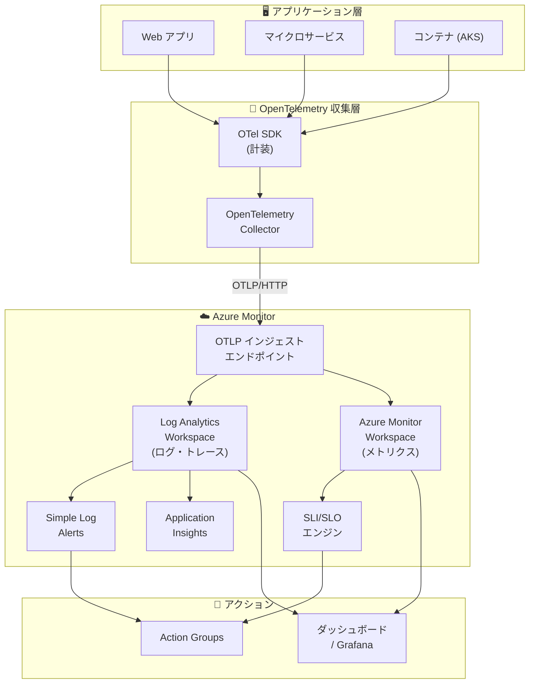

# Azure Monitor: SLI/SLO、OTLP ネイティブ取り込み、シンプルログアラート GA

**リリース日**: 2026-06-04

**サービス**: Azure Monitor

**機能**: SLI/SLO、OTLP ネイティブ取り込み、シンプルログアラート GA

**ステータス**: Launched (GA)

[このアップデートのインフォグラフィックを見る](https://takech9203.github.io/azure-news-summary/20260604-azure-monitor-sli-otlp-simple-alerts.html)

## 概要

Microsoft Build 2026 にて、Azure Monitor のオブザーバビリティ機能に関する 3 つの重要なアップデートが一般提供 (GA) として発表された。これらはいずれも、クラウドネイティブアプリケーションの監視・運用をより実用的かつ標準化されたものにする機能強化である。

1. **Service Level Indicators (SLI) / Service Level Objectives (SLO)** - アプリケーションのユーザー体験を可用性、レイテンシー、スループットの観点から定量的に測定する機能
2. **OTLP ネイティブインジェスト (OpenTelemetry Collector 経由)** - OpenTelemetry Protocol (OTLP) シグナルを Azure Monitor に直接送信するベンダーニュートラルなテレメトリパイプライン
3. **Simple Log Alerts** - ログアラートの作成・管理を簡素化し、個々のログイベントに対するリアルタイム監視を実現する機能

これら 3 機能は、SRE (Site Reliability Engineering) プラクティスの導入から OpenTelemetry 標準への準拠、そしてアラート運用の効率化まで、Azure Monitor を包括的なオブザーバビリティプラットフォームとして強化する一連のアップデートとなっている。

**アップデート前の課題**

- インフラストラクチャメトリクス (CPU、メモリなど) に依存した監視では、実際のユーザー体験を正確に把握できなかった
- OpenTelemetry 計装済みアプリケーションから Azure Monitor へテレメトリを送信するには、Microsoft 固有の SDK やエクスポーターが必要だった
- 従来のログアラートは集約ベースの評価が必要であり、個々のイベントに即座に反応するシンプルなアラート設定が困難だった

**アップデート後の改善**

- SLI/SLO により可用性・レイテンシー・スループットのターゲットを定義し、顧客体験に基づいた SRE プラクティスを Azure 上で実践可能に
- OpenTelemetry Collector から直接 Azure Monitor のクラウドインジェストエンドポイントへ OTLP シグナルを送信でき、ベンダーロックインなしの監視パイプラインを構築可能に
- Simple Log Alerts により、各ログ行を個別に評価してイベント駆動型のアラートを即座に発火可能に

## アーキテクチャ図



OpenTelemetry SDK で計装されたアプリケーションから OpenTelemetry Collector を経由して Azure Monitor へテレメトリを送信し、SLI/SLO によるサービスレベル監視と Simple Log Alerts によるイベント駆動型アラートを実現する統合オブザーバビリティアーキテクチャ。

## サービスアップデートの詳細

### 1. Service Level Indicators (SLI) / Service Level Objectives (SLO)

Azure Monitor に SLI と SLO の機能が追加され、チームはアプリケーションの顧客体験を定量的に測定できるようになった。CPU 使用率やメモリなどのインフラストラクチャシグナルだけに頼るのではなく、以下のターゲットを追跡できる。

- **可用性 (Availability)**: サービスが正常に応答している割合
- **レイテンシー (Latency)**: リクエスト処理の応答時間目標
- **スループット (Throughput)**: 単位時間あたりの処理量目標

これにより、SRE プラクティスの中核である「エラーバジェット」の概念を Azure 上で直接活用でき、リリース判断やインシデント対応の優先度付けに客観的な指標を提供する。

### 2. OTLP ネイティブインジェスト (OpenTelemetry Collector 経由)

Azure Monitor が OpenTelemetry Protocol (OTLP) シグナルのネイティブインジェストを一般提供開始した。これにより、OpenTelemetry Collector から Azure Monitor のクラウドインジェストエンドポイントへ直接テレメトリデータを送信できる。

**サポートされるシグナル:**
- **メトリクス** - Azure Monitor Workspace (Prometheus データストア) に保存、PromQL でクエリ可能
- **ログ** - Log Analytics Workspace に OpenTelemetry セマンティック規約で保存
- **トレース** - Log Analytics Workspace に分散トレースとして保存

**インジェスト方式:**
- OpenTelemetry Collector (本アップデートで GA)
- Azure Monitor Agent (AMA) - VM / Arc 対応サーバー向け (プレビュー)
- AKS アドオン (プレビュー)

### 3. Simple Log Alerts

Simple Log Alerts は、従来のログ検索アラートとは異なり、各ログ行を個別に評価するアラート機能である。集約期間にわたる行数のカウントではなく、条件に一致する個々のイベントに対してアラートを発火する。

**主な特徴:**
- 各ログ行を個別に評価 (非集約型)
- Analytics ログと Basic ログの両テーブルプランに対応
- Transformation KQL 言語に基づくシンプルなクエリ構文
- 1 分間あたりの条件一致回数でトリガー閾値を設定可能
- 単一リソース、ワークスペース、リソースグループ、サブスクリプションをターゲットに設定可能

## 技術仕様

| 項目 | 詳細 |
|------|------|
| SLI 対応指標 | 可用性、レイテンシー、スループット |
| OTLP Collector バージョン要件 | 0.132.0 以上 (Azure Authentication Extension 必須) |
| OTLP 認証方式 | Microsoft Entra ID (マネージド ID / サービスプリンシパル / ワークロード ID) |
| OTLP プロトコル | OTLP/HTTP (gRPC: Collector ローカル受信、HTTP: Azure エンドポイント送信) |
| OTLP メトリクス要件 | Delta テンポラリティ + Exponential Histogram 集約 |
| Simple Log Alerts クエリ制約 | print、datatable、let ステートメント非対応 |
| Simple Log Alerts 課金 | 1 分間隔アラートと同等の課金 |
| Simple Log Alerts 分割 | ディメンションによる分割非対応 |

## 設定方法

### OTLP インジェスト: 前提条件

1. Azure サブスクリプション
2. OpenTelemetry SDK で計装されたアプリケーション
3. OpenTelemetry Collector (バージョン 0.132.0 以上)
4. Application Insights リソース (OTLP サポート有効)

### OTLP インジェスト: OpenTelemetry Collector 設定例

```yaml
receivers:
  otlp:
    protocols:
      grpc:
        endpoint: localhost:4317
      http:
        endpoint: localhost:4318

processors:
  batch:

extensions:
  azure_auth:
    managed_identity: {}
    scopes:
      - https://monitor.azure.com/.default

exporters:
  otlphttp/azuremonitor:
    traces_endpoint: "https://<logs-dce-domain>/dataCollectionRules/<dcr-immutable-id>/streams/Microsoft-OTLP-Traces/otlp/v1/traces"
    logs_endpoint: "https://<logs-dce-domain>/dataCollectionRules/<dcr-immutable-id>/streams/Microsoft-OTLP-Logs/otlp/v1/logs"
    metrics_endpoint: "https://<metrics-dce-domain>/dataCollectionRules/<dcr-immutable-id>/streams/Custom-Metrics-Otel/otlp/v1/metrics"
    auth:
      authenticator: azure_auth

service:
  extensions:
    - azure_auth
  pipelines:
    traces:
      receivers: [otlp]
      processors: [batch]
      exporters: [otlphttp/azuremonitor]
    metrics:
      receivers: [otlp]
      processors: [batch]
      exporters: [otlphttp/azuremonitor]
    logs:
      receivers: [otlp]
      processors: [batch]
      exporters: [otlphttp/azuremonitor]
```

### Simple Log Alerts: Azure Portal での設定

1. Azure Portal で **Monitor** > **Alerts** > **+ Create** > **Alert rule** を選択
2. **Condition** タブで **Custom log search** を選択
3. **Query type** で **Single event** を選択
4. Transformation KQL でフィルタ条件を記述
5. **When to trigger the alert** セクションで閾値を設定 (例: 1 分間に 1 行以上一致で発火)
6. Action Group を紐付けて完了

## メリット

### ビジネス面

- SLI/SLO によりサービスレベルの定量的なコミュニケーションが可能になり、ビジネスステークホルダーとの合意形成が容易に
- エラーバジェットを活用したリリース判断により、信頼性とイノベーション速度のバランスを最適化
- ベンダーニュートラルな OpenTelemetry 採用により、マルチクラウド・ハイブリッド環境の統一監視コストを削減

### 技術面

- OpenTelemetry 標準に準拠したテレメトリパイプラインにより、既存の OSS ツールチェーンをそのまま活用可能
- OTLP ネイティブインジェストにより、Microsoft 固有 SDK への依存なしに Azure Monitor を利用可能
- Simple Log Alerts により、バックアップ失敗や Windows セキュリティイベントなど、個々の重要イベントへの即時対応が可能
- メトリクスは PromQL でクエリ可能、Grafana ダッシュボードとネイティブ連携

## デメリット・制約事項

- OTLP インジェストの OpenTelemetry Collector パスのみ GA。AMA および AKS パスはプレビューのため本番ワークロードには SLA なし
- OTLP メトリクスは Delta テンポラリティが必須。Cumulative テンポラリティの場合は cumulativetodelta プロセッサーの追加が必要
- Simple Log Alerts はディメンションによる分割 (splitting) やミュートアクションに非対応
- Simple Log Alerts のクエリで `print`、`datatable`、`let` ステートメントは使用不可
- OpenTelemetry Collector の OSS コンポーネントに対する Azure サポートはコミュニティチャネル経由のみ (Azure サービス・リソース自体はサポート対象)
- Collector バージョン 0.148.0 以降で `azure_auth` 構文が変更されており、旧バージョンとの後方互換性なし

## ユースケース

### ユースケース 1: SRE チームによる SLO ベースの運用

**シナリオ**: E コマースプラットフォームの SRE チームが、可用性 99.9%、P95 レイテンシー 200ms 以下という SLO を定義し、エラーバジェットの消費率に基づいてリリース判断を行う。

**効果**: インフラメトリクスではなく顧客体験に基づいた意思決定により、過剰なアラートを削減しつつサービス品質を維持。エラーバジェット残量に応じて、機能リリースの加速やフリーズの判断を客観的に実施可能。

### ユースケース 2: マルチクラウド環境の統一オブザーバビリティ

**シナリオ**: AWS と Azure のハイブリッド環境で稼働するマイクロサービス群を、OpenTelemetry SDK で計装し、OpenTelemetry Collector から Azure Monitor へ OTLP シグナルを送信。

**効果**: ベンダー固有 SDK への依存なしに全環境のテレメトリを Azure Monitor に集約。Application Insights の分散トレースや Log Analytics による統合分析が可能。将来的な送信先変更も Collector 設定のみで対応。

### ユースケース 3: バックアップジョブ失敗の即時検知

**シナリオ**: Azure Backup のジョブ失敗ログを Simple Log Alerts で監視し、各失敗イベント発生時に即座に運用チームへ通知。

**効果**: 従来の集約ベースアラート (5 分間で N 件以上) では検知が遅れる可能性があった重要イベントに対して、個々の発生をリアルタイムで検知・対応可能。

## 料金

各機能の料金は Azure Monitor の既存料金体系に準拠する。

| 項目 | 料金モデル |
|------|-----------|
| SLI/SLO | Azure Monitor メトリクスの料金に準拠 |
| OTLP インジェスト (メトリクス) | Azure Monitor Workspace へのインジェスト量 + クエリ量ベース |
| OTLP インジェスト (ログ・トレース) | Log Analytics Workspace へのインジェスト量ベース |
| Simple Log Alerts | 1 分間隔のログ検索アラートと同等の課金 |

詳細な料金は [Azure Monitor 料金ページ](https://azure.microsoft.com/pricing/details/monitor/) を参照。

## 関連サービス・機能

- **Application Insights**: OTLP インジェストと連携し、APM (アプリケーションパフォーマンス監視) ワークフローを提供
- **Azure Monitor managed service for Prometheus**: OTLP メトリクスの保存先として Azure Monitor Workspace を共有
- **Azure Managed Grafana**: PromQL メトリクスの可視化、ダッシュボード作成に利用
- **Log Analytics Workspace**: OTLP ログ・トレースの保存・クエリ先
- **Azure Kubernetes Service (AKS)**: AKS アドオンによる OTLP 収集 (プレビュー)
- **Azure Arc**: Arc 対応サーバーからの AMA 経由テレメトリ収集 (プレビュー)
- **Action Groups**: SLI/SLO アラートおよび Simple Log Alerts からの通知配信

## 参考リンク

- [インフォグラフィック](https://takech9203.github.io/azure-news-summary/20260604-azure-monitor-sli-otlp-simple-alerts.html)
- [Azure Monitor SLI 公式アップデート](https://azure.microsoft.com/updates?id=565159)
- [OTLP インジェスト公式アップデート](https://azure.microsoft.com/updates?id=565090)
- [Simple Log Alerts 公式アップデート](https://azure.microsoft.com/updates?id=561978)
- [OpenTelemetry with Azure Monitor - Microsoft Learn](https://learn.microsoft.com/en-us/azure/azure-monitor/containers/opentelemetry-options)
- [Ingest OTLP Data with OTel Collector - Microsoft Learn](https://learn.microsoft.com/en-us/azure/azure-monitor/containers/opentelemetry-protocol-ingestion)
- [Simple Log Alerts の作成 - Microsoft Learn](https://learn.microsoft.com/en-us/azure/azure-monitor/alerts/alerts-create-simple-alert)
- [Azure Monitor アラートの種類 - Microsoft Learn](https://learn.microsoft.com/en-us/azure/azure-monitor/alerts/alerts-types)
- [料金ページ](https://azure.microsoft.com/pricing/details/monitor/)

## まとめ

Build 2026 で発表されたこれら 3 つの Azure Monitor GA アップデートは、クラウドネイティブなオブザーバビリティ戦略を Azure 上で実現するための重要な基盤を提供する。SLI/SLO による顧客体験中心の SRE プラクティス導入、OTLP ネイティブインジェストによるベンダーニュートラルな計装パイプラインの構築、そして Simple Log Alerts によるイベント駆動型アラートの簡素化は、いずれも運用の成熟度を高める方向で相互に補完する機能である。

**推奨される次のアクション:**
- 既存の Azure Monitor 利用者は、SLI/SLO 機能を評価し、重要サービスに対する SLO 定義を開始する
- OpenTelemetry を既に採用しているチームは、OTLP ネイティブインジェストへの移行を検討し、Microsoft 固有 SDK への依存を削減する
- 個々の重要イベント (バックアップ失敗、セキュリティイベントなど) に対するアラート要件がある場合は、Simple Log Alerts への移行を検討する

---

**タグ**: #AzureMonitor #SLI #SLO #OpenTelemetry #OTLP #SimpleLogAlerts #Observability #SRE #MicrosoftBuild2026 #GA
