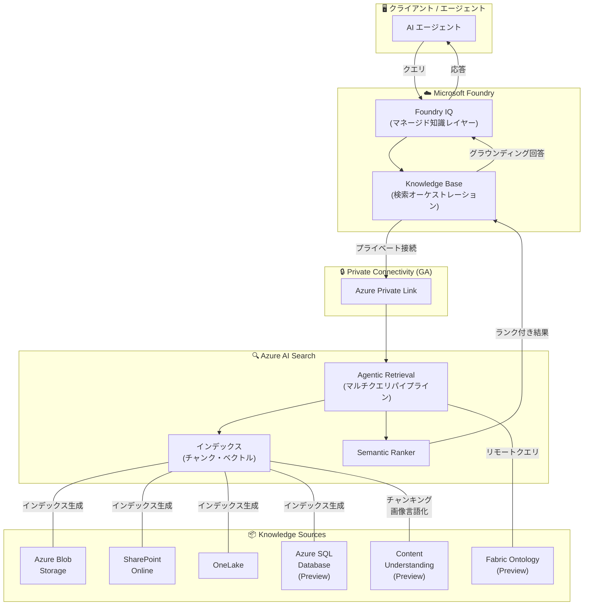

# Microsoft Foundry IQ: GA 到達と Knowledge Source の拡充

**リリース日**: 2026-06-04

**サービス**: Microsoft Foundry / Azure AI Search

**機能**: Foundry IQ GA、Private Connectivity、Fabric IQ Ontology / Azure SQL / Content Understanding Knowledge Source

**ステータス**: Launched (GA) / In preview (mixed)

[このアップデートのインフォグラフィックを見る](https://takech9203.github.io/azure-news-summary/20260604-foundry-iq-ga.html)

## 概要

Microsoft Build 2026 に合わせて、Microsoft Foundry IQ が一般提供 (GA) に到達した。Foundry IQ は、エンタープライズデータに対してエージェントをグラウンディングするためのマネージド知識レイヤーであり、プロジェクトごとに検索パイプラインを再構築する必要がなくなる。チームは SharePoint、OneLake、Azure Blob などのソースを接続するだけで、Foundry IQ がインデックス作成、チャンキング、エンベディング、クエリ時の回答提供を自動的に処理する。

同時に、Azure AI Search と Foundry Knowledge Bases 間のプライベート接続が GA となり、エンドツーエンドのネットワーク分離が実現された。加えて、パブリックプレビューとして 3 つの新しい Knowledge Source が追加された。Microsoft Fabric IQ Ontology (セマンティックレイヤーへのフェデレーテッドクエリ)、Azure SQL Database (ファーストクラスの Knowledge Source)、Content Understanding によるチャンキングと画像言語化である。

これらのアップデートにより、Foundry IQ を中核としたエージェント型 RAG (Retrieval-Augmented Generation) アーキテクチャの構築が大幅に簡素化され、対応データソースの幅が広がった。

**アップデート前の課題**

- エージェントごとに検索パイプライン (インデックス作成、チャンキング、エンベディング) を個別に構築・管理する必要があった
- Azure AI Search と Foundry サービス間の通信がパブリックエンドポイント経由に限定され、規制産業のセキュリティ要件を満たしにくかった
- Microsoft Fabric のセマンティックレイヤー (Ontology) にエージェントから直接アクセスする手段がなかった
- Azure SQL Database のデータを Knowledge Source として利用するには、カスタムの ETL パイプラインが必要だった
- 画像を含むドキュメントの検索では、画像コンテンツがテキスト検索に含まれず、情報の欠落が生じていた

**アップデート後の改善**

- Foundry IQ が GA となり、マネージド Knowledge Base を通じて複数データソースの統合検索が即座に利用可能に
- Private Link によるエンドツーエンドのプライベート接続が GA し、閉域ネットワーク内でのエージェント運用が実現
- Fabric IQ Ontology を Remote Knowledge Source として接続し、セマンティックレイヤーへのクエリが可能に
- Azure SQL Database が First-class Knowledge Source としてインデクサーパイプラインを自動生成
- Content Understanding による画像の言語化 (verbalization) により、画像内容がテキストとして検索可能に

## アーキテクチャ図

Foundry IQ は Azure AI Search の Agentic Retrieval をバックエンドとして使用し、複数の Knowledge Source からのデータを統合的に検索・取得する。Private Link による閉域接続が Search リソースと Foundry サービス間で GA となり、エンタープライズのネットワーク要件に対応している。

## サービスアップデートの詳細

### 1. Microsoft Foundry IQ - 一般提供 (GA)

Foundry IQ は Microsoft Foundry ポータル上で提供されるマネージド知識レイヤーである。Azure AI Search の Agentic Retrieval 機能を基盤としており、Knowledge Base と Knowledge Source のオーケストレーションを自動化する。

**主要機能:**
- **マルチソース統合**: SharePoint、OneLake、Azure Blob Storage など複数のデータソースを単一の Knowledge Base に統合
- **自動パイプライン生成**: データソースの接続設定だけでインデクサー、スキルセット、インデックスを自動生成
- **Agentic Retrieval**: LLM を活用したクエリ分解・並列実行・セマンティック再ランキングによる高精度検索
- **会話コンテキスト対応**: チャット履歴を入力として受け取り、文脈を考慮したサブクエリを生成

**技術的背景:**

Foundry IQ は Azure AI Search の Knowledge Base / Knowledge Source API (2026-04-01 GA REST API) を使用する。エージェントは Knowledge Base に対して Retrieve アクションを呼び出し、以下の 3 部構成の応答を受け取る:
1. グラウンディングデータ (マージされたコンテンツ)
2. ソース参照 (引用情報)
3. 実行詳細 (クエリプランと実行ステップ)

### 2. Private Connectivity for Azure AI Search and Foundry Knowledge Bases - 一般提供 (GA)

Azure AI Search と Foundry Knowledge Bases 間でエンドツーエンドのプライベートネットワーク接続がサポートされた。

**主要機能:**
- **Azure Private Link**: Search リソースと Foundry サービス間の通信をパブリックインターネットから完全に分離
- **エンドツーエンドの暗号化**: TLS 1.2/1.3 によるデータ保護に加え、Microsoft バックボーンネットワーク上での通信
- **コンプライアンス対応**: 規制産業 (金融、医療、官公庁) のデータ主権要件を満たすネットワーク構成が可能

### 3. Fabric IQ Ontology Knowledge Source - パブリックプレビュー

Microsoft Fabric の Ontology を Remote Knowledge Source としてフェデレーテッドクエリが可能になった。

**主要機能:**
- **セマンティックレイヤーへの直接アクセス**: Fabric Ontology で定義されたエンティティや関係性をエージェントがクエリ時に参照
- **Remote Knowledge Source**: データのインデックス化不要。Fabric 側のメタデータ・定義をリアルタイムでクエリ
- **エンティティベースの回答**: ビジネス用語やメトリクスの定義をセマンティックレイヤーから取得し、一貫性のある回答を生成

**API**: `fabricOntology` (2026-05-01-preview REST API)

### 4. Azure SQL Database as Knowledge Source - パブリックプレビュー

Azure SQL Database が Azure AI Search の First-class Knowledge Source として追加された。

**主要機能:**
- **自動インデクサーパイプライン生成**: Azure SQL のテーブルまたはビューからデータを取得し、チャンキング・インデックス化を自動実行
- **Indexed Knowledge Source**: SQL データが検索インデックスに取り込まれ、Full-text / Vector / Hybrid 検索に対応
- **スキーマ活用**: テーブル・ビューの構造を活かした効率的なデータ抽出

**API**: `indexedSql` (2026-05-01-preview REST API)

### 5. Content Understanding Chunking and Image Verbalization - パブリックプレビュー

Azure AI Search に Content Understanding によるチャンキングと画像言語化 (Image Verbalization) が追加された。

**主要機能:**
- **Content Understanding チャンキング**: ドキュメントの構造を理解した上で適切な粒度にチャンク分割
- **画像言語化 (Image Verbalization)**: ドキュメント内の画像をテキスト記述に変換し、テキスト検索やベクトル検索で発見可能に
- **マルチモーダル検索の強化**: テキストと画像を統合的に扱い、情報の欠落を防止

## 技術仕様

| 項目 | 詳細 |
|------|------|
| GA REST API | 2026-04-01 (Knowledge Base / Knowledge Source の基本機能) |
| Preview REST API | 2026-05-01-preview (Fabric Ontology, Azure SQL, Content Understanding 等) |
| Foundry IQ ステータス | 一般提供 (GA) |
| Private Connectivity | 一般提供 (GA) - Azure Private Link 使用 |
| Fabric Ontology | パブリックプレビュー (Remote Knowledge Source) |
| Azure SQL | パブリックプレビュー (Indexed Knowledge Source) |
| Content Understanding | パブリックプレビュー |
| 暗号化 | TLS 1.2/1.3、AES-256 保存時暗号化 |
| 認証 | Microsoft Entra ID、API キー |

## メリット

### ビジネス面

- **開発期間の短縮**: プロジェクトごとに RAG パイプラインを構築する必要がなくなり、エージェント開発のリードタイムが大幅に短縮
- **データ活用範囲の拡大**: SQL Database、Fabric Ontology など既存のエンタープライズデータ資産をそのままエージェントの知識源として活用可能
- **コンプライアンス対応の容易化**: Private Link による閉域接続が GA したことで、規制産業での導入障壁が低下
- **運用コスト削減**: マネージドサービスとしてのインデクサーパイプライン自動生成により、インフラ管理負荷を削減

### 技術面

- **マルチソース統合検索**: 単一の Knowledge Base に対するクエリで、Blob、SharePoint、SQL、Fabric など異なるソースの情報を横断的に取得
- **LLM によるクエリ最適化**: Agentic Retrieval のクエリ分解・並列実行により、複合的な質問に対する検索精度が向上
- **セマンティックレイヤー活用**: Fabric Ontology 接続により、ビジネスメトリクスの定義やエンティティ関係をエージェントが直接参照可能
- **画像コンテンツの検索可能化**: Content Understanding による画像言語化で、図表やダイアグラムの内容もテキスト検索の対象に

## デメリット・制約事項

- **プレビュー機能の SLA 制限**: Fabric Ontology、Azure SQL、Content Understanding は パブリックプレビューのため、SLA の提供なし。本番ワークロードへの適用は非推奨
- **リージョン制限**: Agentic Retrieval は対応リージョンが限定されている (詳細は[リージョンサポートページ](https://learn.microsoft.com/azure/search/search-region-support)を参照)
- **LLM 依存のコスト**: Agentic Retrieval はクエリプランニングに LLM (Azure OpenAI) を使用するため、検索コストに加え Azure OpenAI のトークンコストが発生
- **Preview API の変更リスク**: 2026-05-01-preview API の仕様は GA までに変更される可能性がある

## ユースケース

### ユースケース 1: 企業内ナレッジエージェント

**シナリオ**: 大企業で社内ドキュメント (SharePoint)、データウェアハウス (Fabric)、業務データベース (Azure SQL) に分散した情報をエージェントが統合的に検索し、従業員の質問に回答する。

**構成**:
- Foundry IQ Knowledge Base に以下の Knowledge Source を登録:
  - SharePoint (Indexed): 社内ドキュメント
  - Fabric Ontology (Remote): ビジネスメトリクスの定義
  - Azure SQL (Indexed): 業務データ
- Private Link で閉域接続を確保

**効果**: 従業員は単一のチャットインターフェースから、分散した全社データへ安全にアクセス可能。Agentic Retrieval のクエリ分解により、「先月の売上が目標を下回った部門の改善提案書を探して」のような複合的な質問にも正確に対応。

### ユースケース 2: 規制産業向けマルチモーダル文書検索

**シナリオ**: 製薬企業で研究レポート (PDF、図表含む) を Azure Blob Storage に格納し、Content Understanding による画像言語化を活用して図表の内容も含めた包括的な検索を実現する。

**構成**:
- Blob Storage Knowledge Source + Content Understanding チャンキング
- 画像言語化により、グラフや構造式の内容をテキストとしてインデックス
- Private Connectivity で GxP 準拠のネットワーク構成

**効果**: 研究者が「Phase III 試験の有効性グラフで 95% 信頼区間が狭い結果」のようなクエリを実行すると、図表の内容を含むドキュメントも検索結果に含まれる。

## 料金

Foundry IQ / Agentic Retrieval の料金は以下の 2 つのサービスから構成される:

| 課金対象 | 課金方式 | 備考 |
|---------|---------|------|
| Azure AI Search (Agentic Retrieval) | トークンベース (サブクエリ実行 + セマンティックランキング) | 無料枠あり (月次トークン割当)。超過分は従量課金 |
| Azure OpenAI (クエリプランニング) | 入出力トークン従量課金 | 使用モデルに依存 (例: gpt-4o-mini) |

**コスト見積例** (Microsoft Learn ドキュメントに基づく):
- 2,000 回の Agentic Retrieval 実行 (平均 3 サブクエリ/回):
  - Azure AI Search: 約 $3.30 (リランキング)
  - Azure OpenAI 入力: 約 $0.60 (クエリプランニング)
  - Azure OpenAI 出力: 約 $0.42
  - **合計: 約 $4.32**

詳細な料金は以下を参照:
- [Azure AI Search 料金](https://azure.microsoft.com/pricing/details/search)
- [Azure OpenAI 料金](https://azure.microsoft.com/pricing/details/cognitive-services/openai-service/#pricing)

## 利用可能リージョン

Agentic Retrieval (Foundry IQ のバックエンド) は対応リージョンが限定されている。最新のリージョンサポート状況は以下を参照:

- [Azure AI Search リージョンサポート](https://learn.microsoft.com/azure/search/search-region-support)

## 関連サービス・機能

- **Azure AI Search**: Foundry IQ のバックエンドとして Agentic Retrieval エンジンを提供。Knowledge Base / Knowledge Source の管理を担当
- **Microsoft Foundry Agent Service**: Foundry IQ と連携してエージェントにグラウンディングデータを提供。Hosted Agents (GA) との組み合わせでエンドツーエンドのエージェントソリューションを構築
- **Microsoft Fabric**: Ontology Knowledge Source により、Fabric のセマンティックレイヤーをエージェントの知識源として活用
- **Azure OpenAI**: Agentic Retrieval のクエリプランニングと回答合成に使用される LLM を提供
- **Azure Private Link**: Search リソースと Foundry サービス間のプライベート接続を実現

## 参考リンク

- [インフォグラフィック](https://takech9203.github.io/azure-news-summary/20260604-foundry-iq-ga.html)
- [公式アップデート: Foundry IQ GA](https://azure.microsoft.com/updates?id=563222)
- [公式アップデート: Private Connectivity](https://azure.microsoft.com/updates?id=563516)
- [公式アップデート: Fabric IQ Ontology](https://azure.microsoft.com/updates?id=563416)
- [公式アップデート: Azure SQL Knowledge Source](https://azure.microsoft.com/updates?id=563446)
- [公式アップデート: Content Understanding Chunking](https://azure.microsoft.com/updates?id=563661)
- [Microsoft Learn - Azure AI Search 概要](https://learn.microsoft.com/azure/search/search-what-is-azure-search)
- [Microsoft Learn - Agentic Retrieval 概要](https://learn.microsoft.com/azure/search/agentic-retrieval-overview)
- [Microsoft Learn - Knowledge Source 概要](https://learn.microsoft.com/azure/search/agentic-knowledge-source-overview)
- [Azure AI Search 料金](https://azure.microsoft.com/pricing/details/search)

## まとめ

Microsoft Foundry IQ の GA 到達は、エージェント型 AI アプリケーション開発における大きなマイルストーンである。これまでプロジェクトごとに構築が必要だった RAG パイプラインがマネージドサービスとして提供されることで、開発チームはデータの接続設定に集中でき、インフラの構築・運用から解放される。

Private Connectivity の GA は、金融・医療・官公庁などの規制産業にとって特に重要であり、閉域ネットワーク内でのエージェント運用を正式にサポートする。

新たにプレビューで追加された 3 つの Knowledge Source (Fabric Ontology、Azure SQL、Content Understanding) は、エージェントがアクセスできるデータの幅を大幅に広げる。特に Fabric Ontology によるセマンティックレイヤーへのアクセスは、ビジネスインテリジェンスと AI エージェントの融合を加速する可能性がある。

**推奨アクション:**
1. 既存の RAG パイプラインを Foundry IQ への移行を検討する (特に複数データソースを扱うプロジェクト)
2. セキュリティ要件の厳しい環境では Private Connectivity の GA を活用して閉域構成を構築する
3. Fabric Ontology や Azure SQL の Knowledge Source はプレビュー段階のため、開発・検証環境での評価を開始する

---

**タグ**: #Microsoft-Foundry #Foundry-IQ #Azure-AI-Search #Agentic-Retrieval #Knowledge-Base #Private-Link #Fabric-Ontology #Azure-SQL #Content-Understanding #GA #Build2026
