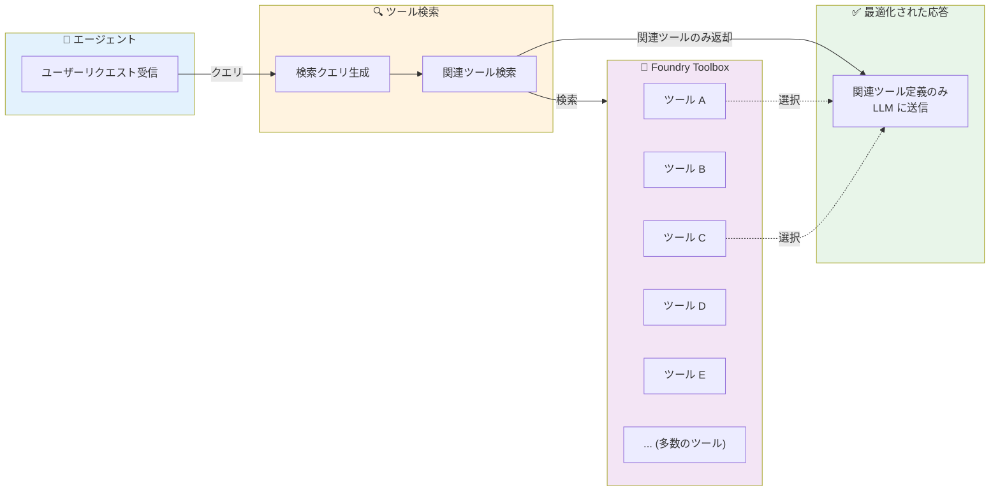

# Microsoft Foundry: Toolbox におけるツール検索機能 (パブリックプレビュー)

**リリース日**: 2026-06-04

**サービス**: Microsoft Foundry

**機能**: Tool search in Foundry toolboxes

**ステータス**: In preview

[このアップデートのインフォグラフィックを見る](https://takech9203.github.io/azure-news-summary/20260604-foundry-toolbox-tool-search.html)

## 概要

Microsoft Foundry の Toolbox にツール検索機能がパブリックプレビューとして追加された。この機能により、開発者や管理者は大規模なマルチチームカタログ内から適切なツールを迅速に検索・発見できるようになる。

従来、エージェントが LLM にリクエストを送信する際、Toolbox に登録されたすべてのツール定義を毎ターン送信する必要があった。Toolbox の規模が大きくなるにつれ、このアプローチはトークンコストの増大とエージェントパフォーマンスの低下を招いていた。ツール検索機能は、クエリに関連するツールのみを選択的に取得することで、この問題を解決する。

**アップデート前の課題**

- Toolbox に登録されたすべてのツール定義が毎ターン LLM に送信され、トークンコストが増大していた
- マルチチーム環境でカタログが肥大化すると、関連性の低いツール定義がコンテキストを圧迫し、モデルのパフォーマンスが低下していた
- 大規模カタログ内で適切なツールを見つけるのに時間がかかっていた
- 開発者や管理者がプロジェクト横断で利用可能なツールを効率的に発見する手段が限定的だった

**アップデート後の改善**

- ツール検索により、エージェントのクエリに関連するツールのみを選択的に取得可能になった
- 毎ターンすべてのツール定義を送信する必要がなくなり、トークンコストが大幅に削減された
- 大規模マルチチームカタログでも適切なツールを高速に発見できるようになった
- エージェントのコンテキストウィンドウが効率的に活用され、モデルのパフォーマンスが向上した

## アーキテクチャ図

エージェントがリクエストを処理する際、従来はすべてのツール定義を LLM に送信していたが、ツール検索機能によりクエリに関連するツールのみが選択的に返却される。これにより、トークン使用量の最適化とエージェントの応答精度向上が実現される。

## サービスアップデートの詳細

### 主要機能

1. **Toolbox 内ツール検索**
   - 大規模カタログ内から関連ツールを検索・発見する機能
   - 開発者およびエージェントの両方が利用可能
   - マルチチーム環境での効率的なツール発見を支援

2. **トークンコスト最適化**
   - すべてのツール定義を毎ターン送信する代わりに、関連ツールのみを選択的に取得
   - Toolbox の規模に関係なく、効率的なトークン使用を維持

3. **マルチチームカタログ対応**
   - 複数チームが共有する大規模 Toolbox での利用を想定
   - プロジェクト横断でのツール検索・発見が可能

## 技術仕様

| 項目 | 詳細 |
|------|------|
| ステータス | パブリックプレビュー |
| 対象サービス | Microsoft Foundry Toolbox |
| 主な目的 | トークンコスト最適化・ツール発見の効率化 |
| 対象ユーザー | 開発者、管理者 |
| 環境要件 | Microsoft Foundry プロジェクト |

## 設定方法

### 前提条件

1. アクティブな Azure サブスクリプション
2. Microsoft Foundry プロジェクトの作成済み環境
3. Toolbox にツールが登録されていること

### アクセス方法

ツール検索機能は Microsoft Foundry ポータル (https://ai.azure.com) から利用可能。Foundry Control Plane の Assets ペインから、サブスクリプション内のすべてのプロジェクトにわたるツールの統合的な検索・管理が可能。

## メリット

### ビジネス面

- **コスト削減**: 不要なツール定義の送信を削減し、トークン消費コストを抑制
- **運用効率向上**: マルチチーム環境でのツール管理・発見のオーバーヘッドを削減
- **スケーラビリティ**: Toolbox の規模が拡大しても効率的な運用を維持可能

### 技術面

- **トークン使用量の最適化**: 関連ツールのみを LLM コンテキストに含めることで、トークン消費を大幅に削減
- **エージェントパフォーマンス向上**: コンテキストウィンドウに不要な情報を含めないことで、モデルの応答精度が向上
- **レイテンシ改善**: 送信するツール定義の数が減少することで、プロンプト処理時間が短縮

## デメリット・制約事項

- パブリックプレビュー段階であり、本番ワークロードでの利用は推奨されない
- プレビュー機能には SLA が適用されない
- 検索精度はツールの定義情報 (名前、説明) の品質に依存すると考えられる
- 具体的な検索アルゴリズムや技術的詳細は現時点で公開されていない

## ユースケース

### ユースケース 1: 大規模エンタープライズのマルチチーム AI エージェント

**シナリオ**: 100 以上のツールが登録された Toolbox を持つ大企業で、複数チームが共有エージェントプラットフォームを運用するケース。

**効果**: エージェントが各ターンで関連ツールのみを使用することで、トークンコストの大幅削減とエージェント応答品質の向上が期待される。

### ユースケース 2: コスト最適化が求められる高頻度エージェント実行

**シナリオ**: 大量のビジネスプロセスを自動化するエージェントが高頻度で実行される環境。各リクエストでのトークン消費削減が累積的に大きなコスト削減につながる。

**効果**: ツール検索により、1 ターンあたりのトークン使用量を最適化し、月間の API コストを抑制。

### ユースケース 3: 段階的なツール拡張

**シナリオ**: 新しいチームや機能が追加されるたびに Toolbox のツール数が増加する成長期の組織。

**効果**: ツール数の増加がエージェントパフォーマンスやコストに直接影響しないため、スケーラブルなツール管理が可能。

## 料金

ツール検索機能自体の個別料金は現時点で公開されていない。Microsoft Foundry の全般的な料金については公式ドキュメントを参照。

- [Microsoft Foundry 料金ページ](https://azure.microsoft.com/pricing/details/ai-foundry/)

## 利用可能リージョン

パブリックプレビュー段階での利用可能リージョンの詳細は公式ドキュメントを参照。

- [Microsoft Foundry ドキュメント](https://learn.microsoft.com/azure/foundry/)

## 関連サービス・機能

- **Microsoft Foundry Agent Service**: ビジネスプロセスを自動化する AI エージェントのオーケストレーションとホスティングを提供。ツール検索はエージェントがツールを効率的に使用するために不可欠
- **Foundry Control Plane**: サブスクリプション内のすべてのエージェント、モデル、ツールの統合的な可視性とガバナンスを提供。Assets ペインでプロジェクト横断のツール管理が可能
- **Foundry IQ**: エージェント向けのナレッジレイヤー。ツールとともにエージェントの能力を構成する
- **Azure API Management**: Foundry モデルへのアクセスをゲートし、高度なガバナンス機能を有効化

## 参考リンク

- [インフォグラフィック](https://takech9203.github.io/azure-news-summary/20260604-foundry-toolbox-tool-search.html)
- [公式アップデート情報](https://azure.microsoft.com/updates?id=563506)
- [Microsoft Foundry ドキュメント](https://learn.microsoft.com/azure/foundry/)
- [Foundry Control Plane 概要](https://learn.microsoft.com/azure/foundry/control-plane/overview)
- [Foundry Agent Service 概要](https://learn.microsoft.com/azure/foundry/agents/overview)

## まとめ

Microsoft Foundry Toolbox のツール検索機能は、エージェントのトークンコスト最適化とパフォーマンス向上を両立するための重要な機能である。特にマルチチーム環境で多数のツールが登録された大規模カタログにおいて、その効果は顕著となる。

Solutions Architect として推奨されるアクションは以下の通り:

1. 現在の Foundry Toolbox のツール数とトークン消費量を確認し、ツール検索による最適化効果を見積もる
2. マルチチーム環境でのツール命名規則・説明の品質を見直し、検索精度の向上に備える
3. パブリックプレビューの段階で検証環境にてツール検索の動作を確認し、GA 時のスムーズな導入を計画する

---

**タグ**: #Microsoft-Foundry #AI #Agent #Toolbox #Tool-Search #コスト最適化 #パブリックプレビュー #Build2026
