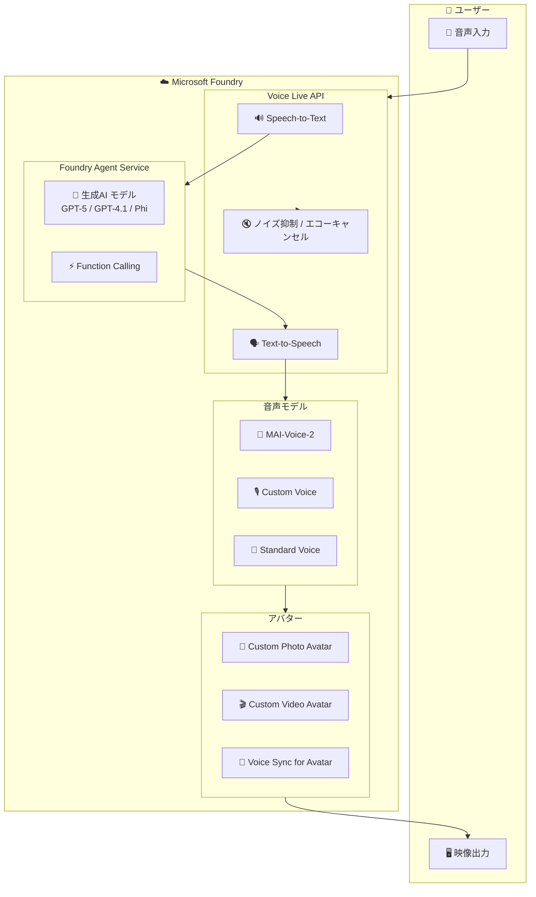

# Microsoft Foundry (Voice & Avatar): Voice Live GA、MAI-Voice-2、カスタムアバター & ボイス

**リリース日**: 2026-06-02 ~ 2026-06-04

**サービス**: Microsoft Foundry (Voice & Avatar)

**機能**: Voice Live GA、MAI-Voice-2、カスタムアバター & ボイス

**ステータス**: Launched (GA) / In preview

[このアップデートのインフォグラフィックを見る](https://takech9203.github.io/azure-news-summary/20260604-foundry-voice-avatar-mai-voice-2.html)

## 概要

Microsoft Build 2026 において、Microsoft Foundry の音声およびアバター機能に関する 5 つのアップデートが発表された。Voice Live API と Foundry Agent Service の統合が GA となり、開発者は独自のオーディオパイプラインを構築することなく、リアルタイム音声エージェントを構築できるようになった。

加えて、Microsoft AI チームによるファーストパーティ音声モデル MAI-Voice-2 がパブリックプレビューとして提供開始され、10 以上の言語での自然な音声合成とボイスクローニングが可能になった。アバター関連では、Voice Live API でのカスタムボイスを使ったアバター音声同期がプレビュー開始、セルフサーブ型のカスタムフォトアバター作成とカスタムボイスポータルが GA に昇格している。

これらの機能群により、企業はブランド固有の音声とビジュアルを持つリアルタイム対話型エージェントを統合的に構築できるプラットフォームが整った。

**アップデート前の課題**

- リアルタイム音声エージェント構築には、音声認識・生成AI・音声合成を個別に統合する複雑なオーケストレーションが必要だった
- カスタムボイスの作成・管理は Speech Studio で行い、Foundry ポータルとは別のワークフローだった
- カスタムフォトアバターの作成には手動のオフラインプロセスが必要で、セルフサーブでは利用できなかった
- Voice Live API でカスタムボイスとアバターの音声同期を組み合わせることができなかった
- 高品質な音声合成モデルは外部ベンダーに依存するか、Azure の標準音声に限られていた

**アップデート後の改善**

- Voice Live API が Foundry Agent Service と直接統合され、単一のインターフェースでリアルタイム音声エージェントを構築可能に
- カスタムボイスのオーサリング体験が Microsoft Foundry ポータルに統合され、一元管理が実現
- セルフサーブでカスタムフォトアバターを作成できるようになり、企業独自のブランドアバターを迅速に展開可能に
- Voice Live API でカスタムボイスとアバターの音声同期がサポートされ、ペルソナ一貫性のあるリアルタイム体験が可能に
- MAI-Voice-2 により Microsoft ファーストパーティの高品質音声モデルが利用可能に

## アーキテクチャ図

Voice Live API を中心に、Foundry Agent Service、音声モデル (MAI-Voice-2 / Custom Voice)、アバター (Photo / Video) が統合され、音声入力からアバター映像出力までの end-to-end パイプラインを提供する。

## サービスアップデートの詳細

### 1. Voice Live と Foundry Agent Service の統合 (GA)

- **ステータス**: 一般提供 (2026-06-02)
- Voice Live API が Foundry Agent Service と直接接続され、開発者は独自のオーディオパイプラインを構築する必要がなくなった
- WebSocket ベースのサーバー間統合で、音声入力を受け取りリアルタイムに音声出力を返す
- ノイズ抑制、エコーキャンセル、高度な割り込み検出、発話終了検出を内蔵
- GPT-5、GPT-4.1、GPT-4o、Phi など複数の生成 AI モデルに対応
- すべてのモデルはフルマネージドで、デプロイやキャパシティプランニングが不要

### 2. MAI-Voice-2 (パブリックプレビュー)

- **ステータス**: パブリックプレビュー (2026-06-03)
- Microsoft AI チームが開発したファーストパーティ音声モデル
- 10 以上の言語で自然な音声を生成
- 短い参照サンプルからのボイスクローニングをサポート
- Voice Prompting 機能により、音声スタイルや特徴を指示テキストで制御可能

### 3. Voice Live API でのアバター音声同期 (パブリックプレビュー)

- **ステータス**: パブリックプレビュー (2026-06-04)
- Voice Live API でカスタムボイスとリアルタイムアバター体験を組み合わせ可能に
- ブランド固有またはペルソナ固有の TTS 音声をアバターに同期
- カスタムビデオアバターの Voice Sync for Avatar と連携
- リアルタイムストリーミング合成で低レイテンシーの対話を実現

### 4. セルフサーブ カスタムフォトアバター作成 (GA)

- **ステータス**: 一般提供 (2026-06-03)
- Foundry NextGen ファインチューニングポータルでセルフサーブによるカスタムフォトアバター作成が GA
- 1 枚の写真から VASA-1 モデルベースのフォトアバターを作成
- 企業がブランド専用のアバターを、ストックアバターに頼らず迅速に展開可能
- バッチ合成とリアルタイム合成の両方に対応 (解像度 512x512、25 FPS)

### 5. Custom Voice ポータル体験 (GA)

- **ステータス**: 一般提供 (2026-06-03)
- Azure AI Speech の Custom Voice オーサリング体験が Microsoft Foundry ポータルに移行・統合
- 承認済みの Custom Voice 顧客は、Foundry ポータル内で以下を実行可能:
  - 音声タレントの録音データアップロード
  - 同意声明 (consent statement) のアップロード
  - データ品質チェックの実行
  - ニューラルボイスのトレーニング

## 技術仕様

| 項目 | 詳細 |
|------|------|
| Voice Live API プロトコル | WebSocket (サーバー間統合) |
| 対応 AI モデル | GPT-5 系列、GPT-4.1 系列、GPT-4o 系列、Phi-4 系列、Azure Realtime |
| MAI-Voice-2 対応言語 | 10 以上の言語 |
| フォトアバター解像度 | 512 x 512 (バッチ / リアルタイム) |
| ビデオアバター解像度 | 1920 x 1080 / 3840 x 2160 (4K 対応) |
| フレームレート | 25 FPS |
| リアルタイム合成コーデック | H264 |
| バッチ合成コーデック | H264 / HEVC / VP9 / AV1 |
| カスタムボイス学習データ | 最低 300 発話 |
| カスタムビデオアバター学習データ | 最低 10 分のビデオ録画 |
| カスタムフォトアバター学習データ | 1 枚の写真 |

## 設定方法

### 前提条件

1. Microsoft Foundry リソースの作成
2. Custom Voice / Custom Avatar の利用には Limited Access の承認が必要 ([申請フォーム](https://aka.ms/customneural))
3. 音声タレントの同意声明ビデオの取得
4. Voice Live API 利用にはサポートされるリージョンでのリソース作成

### Microsoft Foundry ポータル

**カスタムボイス作成:**
1. Microsoft Foundry ポータル ([ai.azure.com](https://ai.azure.com)) にアクセス
2. プロジェクトを作成 (国/地域と言語を指定)
3. 音声タレントの同意声明をアップロード
4. ファインチューニングデータ (録音 + スクリプト) をアップロード
5. データ品質チェックを実行
6. ニューラルボイスモデルをトレーニング
7. テスト後にエンドポイントにデプロイ

**カスタムフォトアバター作成:**
1. Foundry NextGen ファインチューニングポータルにアクセス
2. 実在の人物の場合は同意を取得
3. 写真をアップロード
4. モデルのトレーニングとデプロイ

**Voice Live API + Agent 統合:**
1. Foundry Agent Service でエージェントを構成
2. Voice Live API の WebSocket エンドポイントに接続
3. 使用する生成 AI モデルを選択
4. TTS ボイス (MAI-Voice-2 / Custom Voice / Standard Voice) を設定
5. アバターを有効化する場合は avatar 設定を追加

## メリット

### ビジネス面

- ブランド固有の音声とビジュアルで差別化された顧客体験を構築可能
- セルフサーブのフォトアバター作成により、カスタムアバター導入の時間とコストを大幅に削減
- Foundry ポータルへの統合により、音声・アバター・エージェントの管理を一元化
- コンタクトセンター、教育、HR、公共サービスなど幅広い業種で活用可能

### 技術面

- Voice Live API のフルマネージドアーキテクチャにより、オーディオパイプラインの構築・運用負荷を削減
- WebSocket ベースの統合で既存アーキテクチャへの組み込みが容易
- ノイズ抑制、エコーキャンセル、割り込み検出などの高度な会話機能が標準搭載
- 複数の生成 AI モデルから用途に応じて選択可能
- MAI-Voice-2 のボイスクローニングにより、少量のサンプルで高品質なカスタム音声を生成

## デメリット・制約事項

- Custom Voice と Custom Avatar は Limited Access (制限付きアクセス) で、利用には申請・承認が必要
- Voice Sync for Avatar はカスタムビデオアバター専用で、フォトアバターでは利用不可
- フォトアバターの解像度は 512x512 に制限されており、ビデオアバター (1920x1080) より低い
- MAI-Voice-2 はプレビュー段階であり、SLA は提供されない
- カスタムボイスとカスタムアバターを組み合わせる場合、同一の Foundry リソース内にデプロイする必要がある
- Voice Live API のアバター音声同期はプレビュー段階

## ユースケース

### ユースケース 1: ブランド専用の音声エージェント (コンタクトセンター)

**シナリオ**: 企業がブランドのペルソナを持つリアルタイム音声カスタマーサポートエージェントを構築する

**構成例**:
- Voice Live API (Pro tier) + GPT-4.1
- Custom Voice (Professional Voice) でブランド固有の音声を作成
- Custom Photo Avatar でブランドキャラクターを表示
- Function Calling で CRM や注文システムと連携

**効果**: 一貫したブランド体験を音声・ビジュアルの両面で提供し、顧客満足度を向上

### ユースケース 2: 多言語対応の教育アシスタント

**シナリオ**: 教育機関が多言語で学習者と対話するバーチャルチューターを構築する

**構成例**:
- Voice Live API + GPT-5
- MAI-Voice-2 で 10 以上の言語に対応した自然な音声出力
- Standard Avatar で視覚的なエンゲージメントを提供

**効果**: 多言語環境での学習体験を向上させ、自然な対話型の教育コンテンツを配信

### ユースケース 3: 企業内 HR バーチャルアシスタント

**シナリオ**: 企業が従業員向けの HR 問い合わせ対応エージェントを構築する

**構成例**:
- Voice Live API (Basic tier) + GPT-4.1-mini
- Standard Voice または MAI-Voice-2
- Custom Photo Avatar で企業キャラクターを表示

**効果**: HR 部門の問い合わせ対応負荷を軽減しつつ、従業員にフレンドリーなインターフェースを提供

## 料金

Voice Live API の料金は生成 AI モデルに基づく 3 つのティアで課金される (2025 年 7 月 1 日より有効):

| ティア | 対象モデル |
|--------|-----------|
| Pro | gpt-realtime, gpt-4o, gpt-4.1, gpt-5, gpt-5-chat |
| Basic | gpt-realtime-mini, gpt-4o-mini, gpt-4.1-mini, gpt-5-mini |
| Lite | gpt-5-nano, phi4-mm-realtime, phi4-mini |

**トークン消費目安:**

| モデルファミリー | 入力音声 (トークン/秒) | 出力音声 (トークン/秒) |
|----------------|----------------------|----------------------|
| Azure OpenAI モデル | 約 10 | 約 20 |
| Phi モデル | 約 12.5 | 約 20 |

- カスタムボイス、カスタムアバターのトレーニングとホスティングは別途課金
- Voice Sync for Avatar は Personal Voice と同等の料金 (ストレージは無料)
- 詳細は [Speech Services 料金ページ](https://azure.microsoft.com/pricing/details/cognitive-services/speech-services/) を参照

## 利用可能リージョン

Voice Live API およびアバター機能のサポートリージョンについては、[Speech service regions table](https://learn.microsoft.com/en-us/azure/ai-services/speech-service/regions) を参照。

## 関連サービス・機能

- **Microsoft Foundry Agent Service**: Voice Live API と直接統合し、音声エージェントの AI バックエンドを提供
- **Azure OpenAI Service**: Voice Live API のバックエンドで使用される GPT 系列モデルを提供
- **Azure AI Speech**: Custom Voice、Text-to-Speech、Speech-to-Text の基盤サービス
- **Personal Voice**: 短い音声サンプルからカスタムボイスを作成する機能 (Voice Sync for Avatar と同等品質)
- **VASA-1**: カスタムフォトアバターの生成に使用される Microsoft Research の基盤モデル

## 参考リンク

- [インフォグラフィック](https://takech9203.github.io/azure-news-summary/20260604-foundry-voice-avatar-mai-voice-2.html)
- [Voice Live と Foundry Agent Service 統合 (GA)](https://azure.microsoft.com/updates?id=563601)
- [MAI-Voice-2 パブリックプレビュー](https://azure.microsoft.com/updates?id=563217)
- [Voice Live API アバター音声同期 (プレビュー)](https://azure.microsoft.com/updates?id=564176)
- [セルフサーブ カスタムフォトアバター (GA)](https://azure.microsoft.com/updates?id=563491)
- [Custom Voice ポータル体験 (GA)](https://azure.microsoft.com/updates?id=563691)
- [Voice Live API ドキュメント](https://learn.microsoft.com/en-us/azure/ai-services/speech-service/voice-live)
- [Text to Speech Avatar 概要](https://learn.microsoft.com/en-us/azure/ai-services/speech-service/text-to-speech-avatar/what-is-text-to-speech-avatar)
- [Custom Voice 概要](https://learn.microsoft.com/en-us/azure/ai-services/speech-service/custom-neural-voice)
- [Custom Text to Speech Avatar 概要](https://learn.microsoft.com/en-us/azure/ai-services/speech-service/text-to-speech-avatar/what-is-custom-text-to-speech-avatar)
- [Voice Sync for Avatar](https://learn.microsoft.com/en-us/azure/ai-services/speech-service/text-to-speech-avatar/voice-sync-for-avatar)
- [Voice Live サンプルコード (GitHub)](https://github.com/microsoft-foundry/voicelive-samples/tree/main/javascript/voice-live-avatar)
- [料金ページ](https://azure.microsoft.com/pricing/details/cognitive-services/speech-services/)

## まとめ

Build 2026 で発表されたこれら 5 つのアップデートにより、Microsoft Foundry は音声エージェント構築のための統合プラットフォームとしてのポジションを確立した。Voice Live API の GA と Foundry Agent Service 統合により、開発者はオーディオパイプラインの複雑さから解放され、ビジネスロジックに集中できる。MAI-Voice-2 は Microsoft ファーストパーティの高品質音声モデルとして、多言語対応とボイスクローニングを提供する。

Solutions Architect としての推奨アクションは以下の通り:

1. 音声エージェントを検討中のプロジェクトでは、Voice Live API + Foundry Agent Service の統合を第一選択肢として評価する
2. ブランド固有の音声が必要な場合は、Custom Voice の Limited Access 申請を早期に行う
3. MAI-Voice-2 のプレビューを評価し、多言語対応やボイスクローニングの要件を検証する
4. カスタムフォトアバターのセルフサーブ機能を活用し、PoC の迅速な立ち上げを検討する

---

**タグ**: #Microsoft-Foundry #Voice-Live-API #MAI-Voice-2 #Custom-Avatar #Custom-Voice #Text-to-Speech #Speech-to-Speech #Build2026 #AI #GA #Preview
