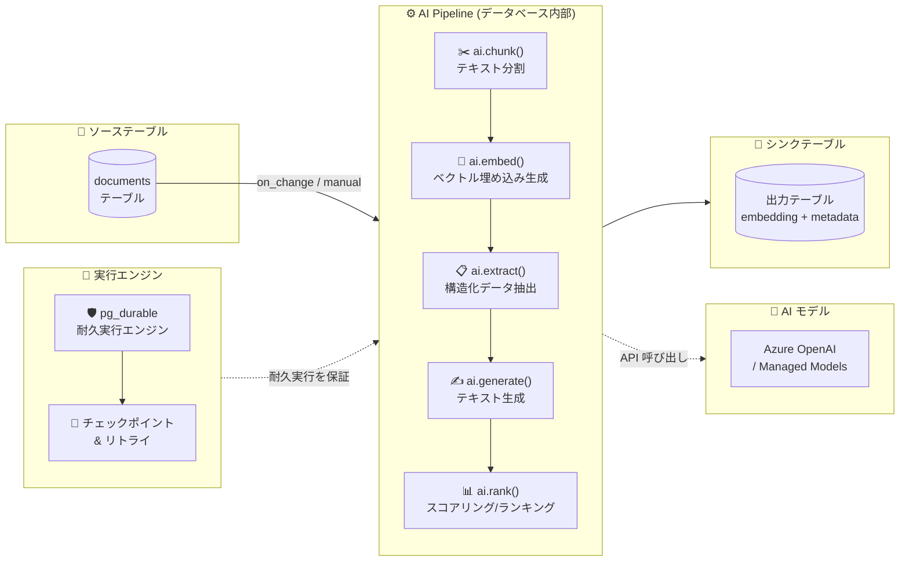

# Azure HorizonDB: AI Pipelines (Public Preview)

**リリース日**: 2026-06-04

**サービス**: Azure HorizonDB

**機能**: AI Pipelines (AI パイプライン)

**ステータス**: In preview

[このアップデートのインフォグラフィックを見る](https://takech9203.github.io/azure-news-summary/20260604-horizondb-ai-pipelines.html)

## 概要

Azure HorizonDB の新機能「AI Pipelines」が Public Preview として発表された。AI Pipelines は、AI データ取り込みワークフロー (チャンキング、埋め込み生成、抽出、生成、ランキング) を SQL で宣言的に定義し、データベースエンジン内部でフォールトトレラントなパイプラインとして実行する機能である。

従来、ベクトルストアへのデータ取り込みは、アプリケーション層のサービスがソース行を読み取り、Embedding API を呼び出し、チャンクを PostgreSQL に書き戻すパターンが一般的だった。AI Pipelines はこのロジックをデータベース内部に移動し、ソース、ステップ、シンク、実行履歴をすべて SQL で管理する。パイプライン定義はシステムカタログの行であり、実行は耐久性があり、クラッシュからの復旧、失敗ステップのリトライ、インクリメンタルなチェックポイント、最後に完了したステップからの再開が可能である。

本機能は `azure_ai` 拡張の一部として提供され、内部的には `pg_durable` (耐久実行エンジン) 上に構築されている。Microsoft Build 2026 で発表された Azure HorizonDB の AI ネイティブ機能群をさらに拡充するものである。

**アップデート前の課題**

- Embedding パイプラインがアプリケーション層にあるため、API の一時障害でバッチ処理が中断した際に「どの行が完了済みか」の共有チェックポイントがなかった
- ワーカーがチャンク書き込み後・親行の処理済みフラグコミット前にクラッシュすると、インデックスが不整合状態になる可能性があった
- Embedding モデルの変更時に、再処理が必要な行だけを正確に再 Embed する手段がなかった
- 外部オーケストレーター (Azure Functions、Airflow 等) の追加運用コストが発生していた

**アップデート後の改善**

- パイプライン定義、実行状態、結果がすべてデータベース内の SQL で管理され、単一システムで完結する
- `pg_durable` による耐久実行で、クラッシュ復旧・リトライ・チェックポイントが自動的に行われる
- `ai.backfill()` によるモデル変更時の一括再処理が、チェックポイント付きで安全に実行可能
- `incremental_column` 指定で新規・変更行のみを効率的に処理する差分パイプラインを実現

## アーキテクチャ図



AI Pipelines は、ソーステーブルの変更を検知し (または手動トリガーで)、宣言的に定義されたステップ群 (チャンキング、埋め込み、抽出、生成、ランキング) を `pg_durable` 耐久実行エンジン上でフォールトトレラントに実行し、結果をシンクテーブルに書き込む。

## サービスアップデートの詳細

### 主要機能

1. **宣言的パイプライン定義**
   - `ai.create_pipeline()` で SQL によりパイプラインを定義
   - ソース、ステップ (配列)、シンク、トリガーを宣言的に指定
   - パイプライン定義はシステムカタログに行として保存される

2. **5 種類の AI ステップ**
   - `ai.chunk()`: テキストをオーバーラップ付きチャンクに分割
   - `ai.embed()`: ベクトル埋め込みを生成
   - `ai.extract()`: LLM を使用して構造化フィールドを抽出
   - `ai.generate()`: プロンプトテンプレートからテキストを生成
   - `ai.rank()`: ドキュメントをクエリに対してスコアリング/ランキング

3. **耐久実行 (pg_durable ベース)**
   - クラッシュ復旧: データベース再起動後も最後のチェックポイントから再開
   - リトライ: 失敗ステップの自動リトライ (全体の再実行は不要)
   - チェックポイント: インクリメンタルな処理状態の永続化

4. **トリガーモード**
   - `on_change`: ソーステーブルの変更を検知して自動実行
   - `manual`: `ai.run()` の明示的呼び出しで実行

5. **モデル変更への対応**
   - `ai.backfill()` で全行の再処理を安全に実行
   - チェックポイント付きで実行されるため、中断しても再開可能

## 技術仕様

| 項目 | 詳細 |
|------|------|
| 拡張機能 | `azure_ai` (AI Pipelines API)、`pg_durable` (耐久実行エンジン) |
| パイプラインコンポーネント | Source、Steps、Sink、Trigger |
| ステップタイプ | chunk、embed、extract、generate、rank |
| トリガーモード | on_change (自動)、manual (手動) |
| インクリメンタル処理 | `incremental_column` による差分検知 |
| チャンクサイズ (デフォルト) | 512 トークン (オーバーラップ 64) |
| 実行場所 | Primary レプリカ上のみ |
| 監視 | `ai.status()`、`ai.list_pipelines()`、`df.instances` から SQL で照会可能 |
| モデル連携 | AI Model Management (限定プレビュー) または手動モデルレジストリ登録 |

## 設定方法

### 前提条件

1. Azure HorizonDB インスタンス (Public Preview)
2. 必要な拡張機能の有効化
3. Embedding モデルへのアクセス (AI Model Management または Azure OpenAI)

### 拡張機能のセットアップ

```sql
-- 必要な拡張機能を有効化
CREATE EXTENSION IF NOT EXISTS pg_durable;
CREATE EXTENSION IF NOT EXISTS azure_ai;
CREATE EXTENSION IF NOT EXISTS vector;
```

### パイプラインの定義と実行

```sql
-- シンクテーブルを作成 (必須カラム: doc_id, chunk_index, chunk_text, embedding, metadata)
CREATE TABLE rag_pipeline_output (
    doc_id      INT,
    chunk_index INT,
    chunk_text  TEXT,
    embedding   vector(1536),
    metadata    JSONB
);

-- ソーステーブル
CREATE TABLE documents (
    id          SERIAL PRIMARY KEY,
    title       TEXT NOT NULL,
    content     TEXT NOT NULL,
    updated_at  TIMESTAMPTZ NOT NULL DEFAULT now()
);

-- パイプラインを定義
SELECT ai.create_pipeline(
    name   => 'rag_pipeline',
    source => ai.table_source(
        table_name => 'documents'
    ),
    steps  => ARRAY[
        ai.chunk(input      => 'content',
                 chunk_size => 512,
                 overlap    => 64),
        ai.embed(model      => 'default-embedding',
                 input      => 'chunk_text',
                 dimensions => 1536)
    ],
    trigger => 'on_change',
    sink   => ai.table_sink('rag_pipeline_output')
);

-- パイプラインを実行
SELECT ai.run('rag_pipeline');

-- ステータス確認
SELECT * FROM ai.status('rag_pipeline');
```

### パイプラインの運用管理

```sql
-- パイプラインの一時停止と再開
SELECT ai.pause('rag_pipeline');
SELECT ai.resume('rag_pipeline');

-- モデル変更後の一括再処理
TRUNCATE rag_pipeline_output;
SELECT ai.backfill('rag_pipeline');

-- 実行計画の確認
SELECT ai.explain('rag_pipeline');
```

## メリット

### ビジネス面

- 外部オーケストレーター (Azure Functions、Airflow、Step Functions 等) の構築・運用コストが不要
- パイプライン障害時の手動介入が大幅に減少し、運用負荷を削減
- Embedding モデル変更時のマイグレーション作業を `ai.backfill()` 一発で完了
- SQL ベースの宣言的定義により、データエンジニアの学習コストが低い

### 技術面

- データとパイプラインが同一データベース内にあるため、アプリケーション - データベース間のネットワーク障害による不整合が発生しない
- `pg_durable` のチェックポイント機構により、大規模バッチ処理が途中からの再開で安全に実行可能
- `incremental_column` による差分処理で、変更行のみを効率的に Embed
- パイプライン状態の監視が SQL クエリのみで完結 (追加の監視ツール不要)
- HorizonDB のバックアップ・PITR・HA がパイプラインの実行状態にも適用される

## デメリット・制約事項

- **Preview 段階**: 本番ワークロードでの利用には注意が必要。`pg_durable` のメジャーバージョン間で実行状態のポータビリティが保証されない
- **ソースの制約**: 現時点では HorizonDB テーブルのみがソース。Blob Storage や外部システムからの直接取り込みには、ステージングテーブルへの事前ロードが必要
- **実行場所の制限**: パイプラインは Primary レプリカ上でのみ実行される。Read Replica では `ai.*` ビューの照会のみ可能
- **外部 API の冪等性**: `ai.embed()` や `ai.generate()` が呼び出す外部 API のコスト管理は利用者の責任。リトライ時に API 呼び出しが重複する可能性がある
- **シンクテーブルのスキーマ制約**: 出力テーブルには `doc_id`、`chunk_index`、`chunk_text`、`embedding`、`metadata` の 5 カラムが必要

## ユースケース

### ユースケース 1: RAG パイプラインの構築

**シナリオ**: ドキュメント管理システムに新規文書がアップロードされるたびに、自動的にチャンキング・埋め込み生成を行い、ベクトル検索に対応させる。

**実装例**:

```sql
-- ドキュメント追加時に自動実行されるパイプライン
SELECT ai.create_pipeline(
    name   => 'doc_rag_pipeline',
    source => ai.table_source(
        table_name         => 'documents',
        incremental_column => 'updated_at'
    ),
    steps  => ARRAY[
        ai.chunk(input => 'content', chunk_size => 512, overlap => 64),
        ai.embed(model => 'default-embedding', input => 'chunk_text', dimensions => 1536)
    ],
    trigger => 'on_change',
    sink   => ai.table_sink('doc_chunks')
);
```

**効果**: 新規ドキュメントが追加されると自動的にチャンキングと Embedding 生成が実行され、障害時もチェックポイントから安全に再開される。外部サービスの構築が不要。

### ユースケース 2: 構造化データ抽出 + Embedding

**シナリオ**: 非構造化テキスト (契約書、レポート) から構造化情報を LLM で抽出し、同時に検索用の Embedding も生成する複合パイプライン。

**実装例**:

```sql
SELECT ai.create_pipeline(
    name   => 'contract_processing',
    source => ai.table_source(table_name => 'contracts'),
    steps  => ARRAY[
        ai.chunk(input => 'body', chunk_size => 1024, overlap => 128),
        ai.extract(input => 'chunk_text'),
        ai.embed(model => 'default-embedding', input => 'chunk_text', dimensions => 1536)
    ],
    trigger => 'manual',
    sink   => ai.table_sink('contract_chunks')
);

-- バッチ実行
SELECT ai.run('contract_processing');
```

**効果**: 抽出と Embedding 生成を単一パイプラインで実行。LLM API の一時障害があっても、完了済みのチャンキングステップは再実行されない。

## 料金

AI Pipelines 固有の追加料金体系は、Public Preview 時点で公式に確認できていない。以下のコスト要素が関係する:

- **Azure HorizonDB コンピュートコスト**: パイプライン実行は Primary レプリカの CPU/メモリを使用
- **AI モデル呼び出しコスト**: `ai.embed()`、`ai.generate()`、`ai.extract()` は Azure OpenAI 等のモデル API を呼び出すため、そのトークン/リクエスト課金が発生
- **ストレージコスト**: パイプライン出力 (Embedding ベクトル等) のストレージ使用量

コスト管理のための機能:
- `incremental_column` で新規/変更行のみを処理し、不要な API 呼び出しを回避
- `ai.pause()` でパイプラインを一時停止し、チューニング中のコスト発生を防止
- `ai.backfill()` は明示的に呼び出した場合のみ実行

最新の料金情報は [Azure HorizonDB の料金ページ](https://azure.microsoft.com/pricing/details/horizondb/) を参照のこと。

## 利用可能リージョン

Azure HorizonDB が利用可能なリージョン (既報の情報に基づく):

| 地域 | リージョン |
|------|-----------|
| Americas | Central US, West US 2, West US 3 |
| Europe | Sweden Central |
| Asia Pacific | Australia East |

> **注意**: AI Pipelines は Azure HorizonDB の機能であるため、HorizonDB が利用可能なリージョンで使用可能と考えられる。最新のリージョン可用性は [Azure Portal](https://portal.azure.com) で確認のこと。

## 関連サービス・機能

- **Azure HorizonDB (本体)**: AI Pipelines のホストとなるデータベースサービス。コンピュート・ストレージ分離アーキテクチャ上で動作
- **pg_durable**: AI Pipelines の実行基盤となる耐久実行エンジン。クラッシュ復旧、リトライ、チェックポイントを提供
- **DiskANN ベクトル検索**: パイプラインで生成した Embedding に対してスケーラブルなベクトルインデックスを構築可能
- **pg_fts (BM25 全文検索)**: パイプライン出力とハイブリッド検索を組み合わせた RAG アプリケーションに活用
- **Azure AI Foundry**: AI Pipelines が呼び出す Embedding/LLM モデルの管理・デプロイ基盤
- **Azure AI Search**: 従来の AI データ取り込みパイプラインの代表的サービス。AI Pipelines はデータベース内で同等の機能を実現

## 参考リンク

- [インフォグラフィック](https://takech9203.github.io/azure-news-summary/20260604-horizondb-ai-pipelines.html)
- [公式アップデート情報](https://azure.microsoft.com/updates?id=565182)
- [Microsoft Learn - AI Pipelines ドキュメント](https://learn.microsoft.com/en-us/azure/horizondb/ai/ai-pipelines)
- [Microsoft Learn - pg_durable (耐久実行エンジン)](https://learn.microsoft.com/en-us/azure/horizondb/development/durable-functions)
- [Microsoft Learn - Azure HorizonDB ドキュメント](https://learn.microsoft.com/en-us/azure/horizondb/)
- [Azure HorizonDB 全体レポート (2026-06-02)](./2026-06-02-azure-horizondb.md)

## まとめ

Azure HorizonDB の AI Pipelines は、AI データ取り込みワークフローをアプリケーション層から データベース内部に移動するという設計思想を具現化した機能である。SQL による宣言的定義、`pg_durable` による耐久実行、`incremental_column` による差分処理、`ai.backfill()` によるモデル変更対応など、RAG パイプラインの運用で発生する典型的な課題に対して包括的なソリューションを提供する。

従来は外部オーケストレーター + アプリケーションコード + 状態管理が必要だった Embedding パイプラインが、データベース内の SQL 定義のみで完結するため、アーキテクチャの簡素化と運用コストの削減が期待できる。

**推奨される次のアクション:**

1. Azure HorizonDB の Preview インスタンスで `pg_durable` と `azure_ai` 拡張を有効化し、サンプルパイプラインを構築して動作を検証する
2. 既存の外部 Embedding パイプライン (Azure Functions、Airflow 等) との機能比較を行い、移行可能性を評価する
3. `on_change` トリガーによるリアルタイム Embedding 生成のレイテンシとコストを測定する
4. Preview の制約事項 (Primary のみでの実行、ソースがテーブル限定) が要件に影響するか確認する

---

**タグ**: #AzureHorizonDB #AIPipelines #RAG #Embedding #pgDurable #DurableExecution #SQL #Build2026 #PublicPreview
