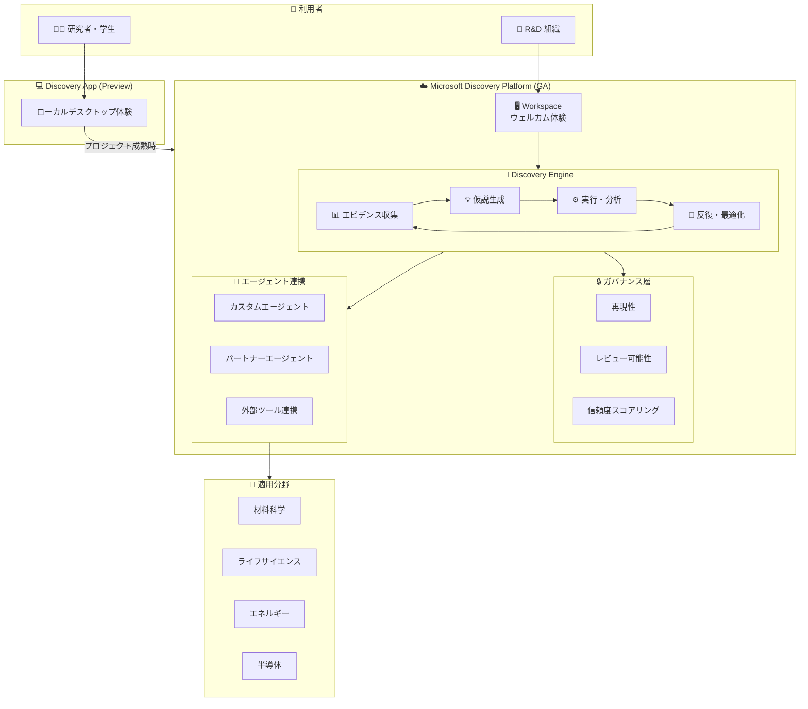

# Microsoft Discovery: Microsoft Discovery GA (科学・エンジニアリング向け AI プラットフォーム)

**リリース日**: 2026-06-04

**サービス**: Microsoft Discovery

**機能**: Microsoft Discovery GA (科学・エンジニアリング向け AI プラットフォーム)

**ステータス**: Launched (GA)

[このアップデートのインフォグラフィックを見る](https://takech9203.github.io/azure-news-summary/20260604-microsoft-discovery-ga.html)

## 概要

Microsoft Build 2026 にて、Microsoft Discovery の一般提供 (GA) が発表された。Microsoft Discovery は、研究開発 (R&D) 組織向けのエンタープライズプラットフォームであり、科学および工学分野にわたるエージェント型 AI ワークフローの構築とガバナンスを提供する。昨年の Microsoft Build でプライベートプレビューとして導入されて以降、複雑な R&D ワークフローに AI を適用する組織と密接に協力し、フィードバックを基に本番環境対応のプラットフォームとして完成させた。

同時に、Microsoft Discovery app がプレビューとして発表された。Discovery app はローカルデスクトップ体験を提供し、研究者、学生、科学チームが大規模なエンタープライズデプロイメントなしで Microsoft Discovery の機能を利用開始できる。GitHub 上で提供され、GitHub Copilot アカウントで利用可能である。

**アップデート前の課題**

- 科学・工学の R&D ワークフローでは、仮説生成・実験・分析・検証のサイクルが複数のツール・チーム・データにまたがり分断されていた
- エージェント型 AI を研究に適用する際、再現性・レビュー可能性・ガバナンスの確保が困難だった
- 機関固有の知識、ドメイン専門知識、専門ツール (モデリング・シミュレーション・分析) を AI ワークフローに統合する標準的な方法がなかった
- 個人の AI アシスタントでは、科学的ワークフローに必要な反復ループ、エビデンス保存、ツール連携をサポートできなかった

**アップデート後の改善**

- エンタープライズグレードのプラットフォームで、エージェント型 AI ワークフローを統合的に構築・実行・ガバナンス可能に
- Discovery Engine により、エビデンスから仮説、実行と分析、次の反復へと移行する科学的作業のコアループを支援
- 再現可能なワークフロー、レビュー可能なアウトプット、信頼度スコアリング・引用付き出力を実現
- Microsoft Discovery app (プレビュー) により、個人研究者や小チームも低い障壁で利用を開始可能に

## アーキテクチャ図

Microsoft Discovery は Discovery Engine を中核として、エビデンス収集から仮説生成、実行・分析、反復最適化の科学的コアループを支援する。ガバナンス層が再現性とレビュー可能性を担保し、カスタムエージェントやパートナーエージェントが各ドメインの専門ツールと連携する。Discovery App (プレビュー) は個人・小チーム向けのローカルエントリーポイントとして機能し、プロジェクト成熟後にプラットフォームへ移行できる。

## サービスアップデートの詳細

### 主要機能

1. **Discovery Engine**
   - 科学的作業のコアループ (エビデンス → 仮説 → 実行 → 分析 → 次の反復) を支援
   - 孤立した分析から再現可能かつエビデンス駆動型の探索へ移行を実現
   - トレードオフの比較、仮説の検証、探索空間の絞り込みをレビュー可能な形で実行
   - 信頼度スコアリングと引用付きの研究結果出力

2. **エージェント型ワークフローの構築・オーケストレーション**
   - 専門エージェントの作成と連携
   - 機関固有の知識や外部の科学情報への接続
   - モデリング・シミュレーション・分析・検証ツール間の作業オーケストレーション
   - 人間の判断を科学的・工学的意思決定の中心に維持

3. **エンタープライズガバナンス**
   - ワークフローの再現性の確保
   - アウトプットのレビュー可能性
   - プロプライエタリな知識の適切な接続・管理
   - R&D 組織の運用モデルへの適合

4. **Microsoft Discovery app (プレビュー)**
   - ローカルデスクトップ体験による研究者向けエントリーポイント
   - 文献探索、仮説生成、科学的推論、反復実験をローカル環境で実行
   - GitHub で提供、GitHub Copilot アカウントで利用開始可能
   - プロジェクト成熟後にフルプラットフォームへの移行パスあり

### パートナーエコシステム

| パートナー | 適用分野 | 活用内容 |
|-----------|---------|---------|
| Yale Engineering | エネルギー貯蔵 (有機レドックスフロー電池) | Discovery Engine で小分子設計を加速、in-silico 探索と実験結果解釈 |
| Georgia Institute of Technology | 生命起源研究 | マルチエージェント AI システムでヒスチジンの前生物的妥当性を評価 |
| Pacific Northwest National Laboratory (PNNL) | エネルギー・バイオシステム | ロボティクスと Discovery による自律的科学ワークフロー |
| Ginkgo Bioworks | バイオテクノロジー | エージェント型 AI と自律実験室で生物学的発見を加速 |
| Causaly | 創薬 | 生物医学エビデンスの機構的推論とプロベナンス |
| Cambridge Consultants | R&D 全般 | AI エージェント・シミュレーション・物理実験のクローズドループ |
| Wiley | ライフサイエンス | 100 万以上の権威ある論文を検索・統合する Life Sciences Research Agent |
| BHP | 鉱業 (銅浸出) | 年単位を月単位に短縮する高度な銅浸出ソリューション発見 |
| Syensqo | 化学 (半導体製造用熱媒体) | エージェント型 AI で研究・営業・マーケティング全体のスケーリング |
| GSK | 創薬 | 候補分子の迅速な反復と意思決定の加速 |

## 技術仕様

| 項目 | 詳細 |
|------|------|
| プラットフォームステータス | 一般提供 (GA) |
| Discovery app ステータス | プレビュー |
| コアコンポーネント | Discovery Engine |
| 発表イベント | Microsoft Build 2026 |
| 関連 Azure サービス | Azure AI, Azure Machine Learning, Azure OpenAI, Foundry Agent Service, Microsoft Foundry |
| Discovery app 配布 | GitHub |
| Discovery app 認証 | GitHub Copilot アカウント |

## メリット

### ビジネス面

- R&D サイクルの大幅な短縮 (BHP の事例: 年単位 → 月単位)
- エンタープライズガバナンスによる組織全体でのコンプライアンス対応
- パートナーエコシステムにより、既存の R&D ツール・プロセスとの統合が容易
- 再現可能なワークフローによる研究成果の品質向上

### 技術面

- Discovery Engine による科学的コアループの体系的なサポート
- 信頼度スコアリングと引用による出力の透明性・検証可能性
- マルチエージェント連携によるドメイン横断的な問題解決
- ローカル (Discovery app) からエンタープライズまでのスケーラブルなアーキテクチャ
- 人間の判断を中心に据えた設計思想

## デメリット・制約事項

- Microsoft Discovery app は現時点でプレビュー段階であり、機能・仕様は変更される可能性がある
- 詳細な料金体系・クォータ情報は公式ドキュメントでの公開を確認する必要あり
- プラットフォームの効果を最大化するには、ドメイン固有のエージェント設計とデータ接続の設計が必要

## ユースケース

### ユースケース 1: エネルギー貯蔵材料の発見 (Yale Engineering / PNNL)

**シナリオ**: 次世代有機レドックスフロー電池 (ORFB) の電解質材料を探索する。電解質はレドックス電位、水溶性、合成容易性、電気化学的可逆性など複雑な分子特性のバランスが求められる。

**Discovery Engine の役割**:
- エージェント型ループで in-silico 探索と候補の収束を推進
- 実験結果の解釈と診断実験の提案
- 長期的な科学的推論と全プロセスの信頼性確保

**効果**: バナジウムなどの希少鉱物への依存を減らし、より安価でスケーラブルなエネルギー貯蔵技術の開発を加速。

### ユースケース 2: 創薬・ライフサイエンス (Ginkgo Bioworks / GSK / Causaly)

**シナリオ**: 生物学的発見においてエージェント型 AI を活用し、データセット分析、仮説生成、実験設計を自動化する。Ginkgo Cloud Lab との連携で実験実行まで自動化。

**Discovery Engine の役割**:
- 専門エージェントによるデータセット分析と仮説生成
- 文献・実験データ・コホートレベルのエビデンスの統合
- Wiley Life Sciences Research Agent による 100 万以上の権威ある論文の検索・統合

**効果**: 反復サイクルの高速化、実験の手作業削減、計算分析の体系的・網羅的な実行。

### ユースケース 3: 鉱業における探索最適化 (BHP)

**シナリオ**: 世界最大の鉱業会社 BHP が、既存鉱石からの銅回収率向上のため、先進的な銅浸出ソリューションを探索する。

**Discovery Engine の役割**:
- ほぼ無限の可能性のフィールドから少数のオプションへの絞り込み
- 鉱体や操業制約の現実に対するテスト
- 技術と人間の専門知識の組み合わせ

**効果**: 年単位の探索プロセスを月単位に短縮。実際に展開可能なソリューションの発見を加速。

## 料金

料金情報は現時点で公式に公開されていない。詳細は公式ドキュメントを参照。

- [Azure 料金ページ](https://azure.microsoft.com/pricing/)

## 利用可能リージョン

利用可能リージョンの詳細は公式ドキュメントを参照。

- [Azure リージョン別製品提供状況](https://azure.microsoft.com/explore/global-infrastructure/products-by-region/)

## 関連サービス・機能

- **Azure AI**: AI モデルの構築・デプロイ基盤として Discovery と連携
- **Azure Machine Learning**: 機械学習モデルのトレーニング・管理を補完
- **Azure OpenAI**: 大規模言語モデルの推論基盤
- **Foundry Agent Service**: エージェント構築・実行のインフラストラクチャ
- **Microsoft Foundry**: AI アプリケーション開発プラットフォーム
- **GitHub Copilot**: Discovery app の認証・利用基盤

## 参考リンク

- [インフォグラフィック](https://takech9203.github.io/azure-news-summary/20260604-microsoft-discovery-ga.html)
- [公式アップデート情報](https://azure.microsoft.com/updates?id=562733)
- [Azure Blog - Announcing Microsoft Discovery general availability and Microsoft Discovery app preview](https://azure.microsoft.com/en-us/blog/announcing-microsoft-discovery-general-availability-and-microsoft-discovery-app-preview/)
- [Microsoft Discovery ドキュメント](https://learn.microsoft.com/azure/)

## まとめ

Microsoft Discovery の GA は、科学・工学分野の R&D にエージェント型 AI を本番環境で適用するための重要なマイルストーンである。Discovery Engine を中核として、エビデンス駆動型の科学的コアループを体系的にサポートし、ガバナンス・再現性・透明性を組み込んだ設計が特徴的である。

Yale、Georgia Tech、PNNL、BHP、GSK など世界的な研究機関・企業との協業事例が示すように、材料科学、エネルギー貯蔵、創薬、鉱業など幅広い分野で実証されている。特に BHP の「年単位を月単位に短縮」という事例は、本プラットフォームのビジネスインパクトを端的に示している。

Solutions Architect は以下のアクションを推奨する:

1. 自組織の R&D ワークフローにおけるエージェント型 AI の適用可能性を評価
2. Discovery app (プレビュー) を利用して小規模な概念実証を開始
3. 既存の Azure AI / Foundry 基盤との統合ポイントを検討
4. パートナーエコシステム (Wiley、Causaly など) のドメイン特化エージェントの活用を検討

---

**タグ**: #Microsoft-Discovery #AI #Agentic-AI #R&D #科学研究 #工学 #GA #Microsoft-Build #Discovery-Engine #Discovery-App
