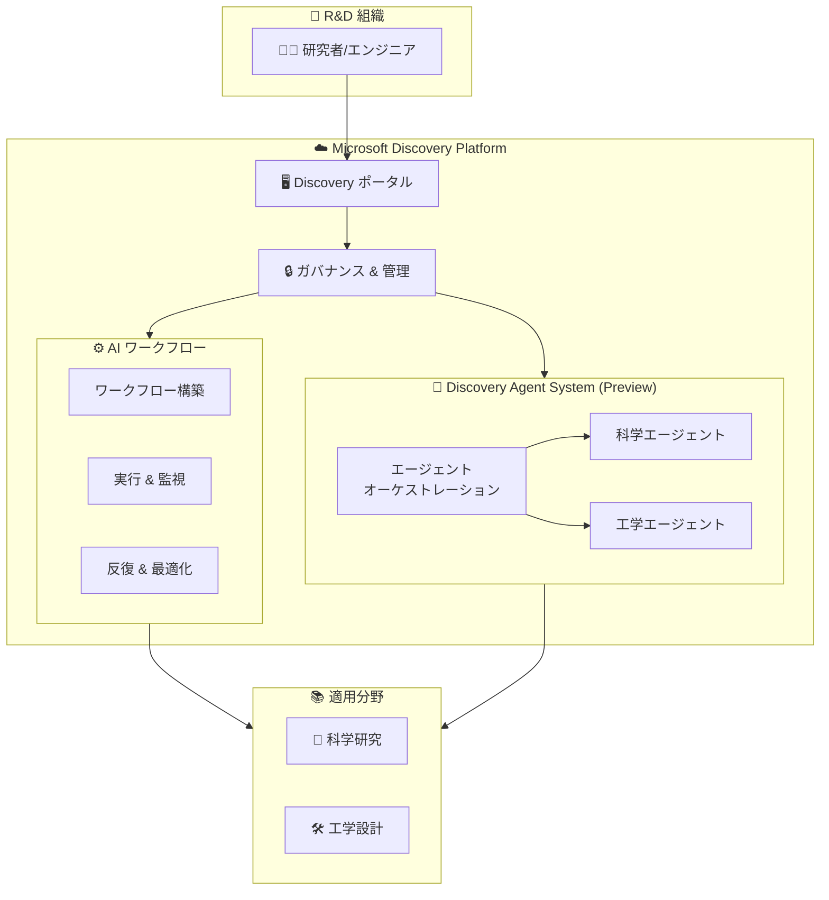

# Microsoft Discovery: 一般提供開始 (GA)

**リリース日**: 2026-06-04

**サービス**: Microsoft Discovery

**機能**: エンタープライズ向け科学・工学 R&D プラットフォームの一般提供開始

**ステータス**: Launched (GA)

[このアップデートのインフォグラフィックを見る](https://takech9203.github.io/azure-news-summary/20260604-microsoft-discovery-ga.html)

## 概要

Microsoft Discovery が一般提供 (GA) となった。Microsoft Discovery は、研究開発 (R&D) 組織向けのエンタープライズプラットフォームであり、科学および工学分野にわたるエージェント型 AI ワークフローの構築とガバナンスを実現する。

本発表は Microsoft Build で行われ、同時に Microsoft Discovery Agent System のプレビュー提供も開始された。Discovery Agent System により、研究者やエンジニアはエージェント型 AI を活用した科学的発見や技術開発のワークフローを構築できるようになる。

**アップデート前の課題**

- 科学・工学分野の R&D 組織において、AI ワークフローの構築・管理が統一されたプラットフォーム上で行えなかった
- エージェント型 AI を研究開発プロセスに組み込む際のガバナンス (管理・監査・制御) が困難だった
- 科学的発見や工学設計における複雑な AI ワークフローの自動化・連携が個別対応となっていた

**アップデート後の改善**

- エンタープライズグレードのプラットフォームで、科学・工学分野のエージェント型 AI ワークフローを統合的に構築可能に
- ワークフローのガバナンス機能により、組織全体での AI 活用の管理・監査が実現
- Discovery Agent System (プレビュー) により、エージェント型 AI の科学的発見への適用が加速

## アーキテクチャ図

Microsoft Discovery は、R&D 組織がエージェント型 AI ワークフローを構築・実行するためのエンタープライズプラットフォームであり、ガバナンス層を通じて組織全体の管理・監査を実現する。Discovery Agent System はエージェントのオーケストレーションを担い、科学・工学の各分野に特化したエージェントを連携させる。

## サービスアップデートの詳細

### 主要機能

1. **エージェント型 AI ワークフローの構築**
   - 科学および工学分野に特化した AI ワークフローを構築するためのエンタープライズプラットフォーム
   - 研究開発プロセス全体をカバーするワークフロー設計が可能

2. **ガバナンス機能**
   - エンタープライズレベルでの AI ワークフローの管理・監査・制御
   - 組織全体でのポリシー適用とコンプライアンス対応

3. **Microsoft Discovery Agent System (プレビュー)**
   - エージェント型 AI システムによる科学的発見の加速
   - 複数のエージェントを連携させた複雑な研究タスクの自動化

### 対象分野

- 科学研究 (創薬、材料科学、ゲノミクスなど)
- 工学分野 (設計最適化、シミュレーション、品質管理など)

## メリット

### ビジネス面

- R&D 組織の研究開発サイクルの短縮
- エンタープライズグレードのガバナンスによるコンプライアンス対応
- 科学的発見から製品化までのプロセス加速

### 技術面

- エージェント型 AI ワークフローの統合プラットフォームによる一元管理
- 科学・工学分野に特化したエージェントシステムの活用
- スケーラブルなワークフロー実行基盤

## デメリット・制約事項

- Discovery Agent System は現時点でプレビュー段階であり、GA ではない
- 詳細な制限事項・クォータについては公式ドキュメントを参照のこと

## ユースケース

### ユースケース 1: 科学研究における発見の加速

**シナリオ**: 創薬研究チームが、候補化合物の探索・評価プロセスにエージェント型 AI を導入し、実験サイクルを短縮する。

**効果**: エージェントが文献調査、分子シミュレーション、実験設計を連携して自動化し、研究者は高付加価値な意思決定に集中できる。

### ユースケース 2: 工学設計の最適化

**シナリオ**: 製造業の設計チームが、複数の設計パラメータを同時に最適化するためのワークフローを構築する。

**効果**: エージェント型 AI がシミュレーション結果の分析と設計案の反復改善を自動化し、設計サイクルの大幅な短縮を実現。

## 料金

料金情報は現時点で公式に確認できていない。詳細は以下の公式ページを参照。

- [Azure 料金ページ](https://azure.microsoft.com/pricing/)

## 利用可能リージョン

利用可能リージョンの詳細は公式ドキュメントを参照。

- [Azure リージョン別製品提供状況](https://azure.microsoft.com/explore/global-infrastructure/products-by-region/)

## 関連サービス・機能

- **Azure AI Services**: AI モデルの構築・デプロイ基盤として Discovery と連携
- **Azure Machine Learning**: 機械学習モデルのトレーニング・管理を補完
- **Microsoft Discovery Agent System (プレビュー)**: Discovery プラットフォーム上でエージェント型 AI を実現するサブシステム

## 参考リンク

- [インフォグラフィック](https://takech9203.github.io/azure-news-summary/20260604-microsoft-discovery-ga.html)
- [公式アップデート情報](https://azure.microsoft.com/updates?id=562733)
- [Microsoft Learn ドキュメント](https://learn.microsoft.com/azure/)

## まとめ

Microsoft Discovery の GA は、科学・工学分野の R&D 組織にとって重要なマイルストーンである。エージェント型 AI ワークフローを構築・管理するためのエンタープライズプラットフォームが正式に提供開始されたことで、研究開発の加速が期待される。特に、同時にプレビュー提供が開始された Discovery Agent System は、複数のエージェントを連携させた複雑な研究タスクの自動化を実現し、科学的発見のペースを変革する可能性がある。

R&D 組織の Solutions Architect は、自組織の研究開発プロセスにおける AI 活用の現状を評価し、Microsoft Discovery の導入による効率化・自動化の可能性を検討することを推奨する。

---

**タグ**: #Microsoft-Discovery #AI #Agentic-AI #R&D #科学研究 #工学 #GA #Microsoft-Build
