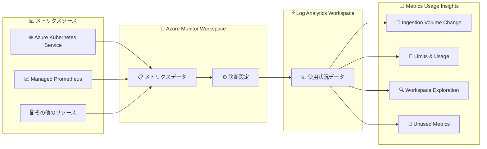

# Azure Monitor: Ingestion Volume Change ダッシュボード (Metrics Usage Insights)

**リリース日**: 2026-06-05

**サービス**: Azure Monitor

**機能**: Ingestion Volume Change dashboard in Metrics Usage Insights

**ステータス**: In preview

[このアップデートのインフォグラフィックを見る](https://takech9203.github.io/azure-news-summary/20260605-azure-monitor-ingestion-volume-dashboard.html)

## 概要

Azure Monitor の Metrics Usage Insights に、新たに「Ingestion Volume Change」ダッシュボードがパブリックプレビューとして追加された。このダッシュボードは、メトリクスのインジェスト量を 2 つの時点間で比較し、タイムシリーズ数やイベントインジェストレートの変化を視覚的に把握することを可能にする。

これにより、Azure Monitor Workspace に取り込まれるメトリクスデータの変動を定量的に追跡でき、コスト変動の調査やキャパシティプランニングを迅速に行えるようになる。比較期間は「Comparison dates」ドロップダウンで自由に設定でき、60 日や 90 日の長期トレンドから、直近の変化まで柔軟に分析できる。

**アップデート前の課題**

- Azure Monitor のメトリクスインジェスト量の変動を調査する際、手動での調査が必要だった
- 請求額が予期せず増減した際に、どのメトリクスが変化したかを特定するのに時間がかかった
- インジェスト量の時系列比較を行う簡便な手段がなかった

**アップデート後の改善**

- 2 つの日付間のインジェスト量を並列比較し、変化率を正確に把握できるようになった
- メトリクスごとのイベントレートやタイムシリーズ数の差分をテーブル形式で即座に確認可能
- コスト変動の原因特定とキャパシティプランニングが大幅に効率化された

## アーキテクチャ図

Azure Monitor Workspace に取り込まれたメトリクスデータは、診断設定を通じて Log Analytics Workspace に使用状況データとして送信される。Ingestion Volume Change ダッシュボードは、この使用状況データを基に 2 時点間のインジェスト量比較を提供する。

## サービスアップデートの詳細

### 主要機能

1. **時点間比較 (Comparison dates)**
   - ドロップダウンで開始日と終了日を選択し、比較期間を定義
   - 選択期間の最初の日 (Initial) と最後の日 (Final) のメトリクスデータを比較
   - 60 日や 90 日の長期レンジで長期トレンドを把握、短期レンジで直近の変化を追跡

2. **メトリクス比較テーブル**
   - Namespace、Metric、Dimensions ごとの詳細な比較データ
   - イベントレートの差分と変化率 (正の値 = 増加、負の値 = 減少)
   - タイムシリーズ数の差分と変化率
   - 新規メトリクスは変化率 100 として表示

3. **スパイク・ドロップ検出**
   - タイムシリーズ数やイベントインジェストレートの急激な変動を迅速に検出
   - コスト変動の原因特定を加速

## 技術仕様

| 項目 | 詳細 |
|------|------|
| 機能名 | Ingestion Volume Change dashboard |
| 所属機能 | Metrics Usage Insights |
| データソース | Azure Monitor Workspace (診断設定経由) |
| データ保存先 | Log Analytics Workspace |
| データ反映までの時間 | 診断設定有効化後 約 24 時間 |
| ステータス | パブリックプレビュー |

### メトリクス比較テーブルのカラム

| カラム名 | 説明 |
|----------|------|
| Namespace | Azure Monitor Workspace 内の Namespace |
| Metric | メトリクス名 |
| Dimensions | ラベル/ディメンション |
| Initial Event Rate | 開始日のイベントインジェストレート |
| Final Event Rate | 終了日のイベントインジェストレート |
| Event Rate Difference | 開始日と終了日の差分 |
| Event Rate Change % | イベントレートの変化率 |
| Initial Timeseries | 開始日のアクティブなタイムシリーズ数 |
| Final Timeseries | 終了日のアクティブなタイムシリーズ数 |
| Timeseries Difference | タイムシリーズ数の差分 |
| Timeseries Change % | タイムシリーズ数の変化率 |

## 設定方法

### 前提条件

1. Azure Monitor Workspace (AMW) が作成済みであること
2. Log Analytics Workspace (LAW) が利用可能であること
3. AMW の診断設定が有効化されていること

### Azure Portal

1. Azure Monitor Workspace に移動する
2. 診断設定 (Diagnostic settings) を有効化し、使用状況データを Log Analytics Workspace に送信するよう構成する
3. 約 24 時間待機してデータが流入するのを確認する
4. Metrics Usage Insights を開き、「Ingestion Volume Change」ダッシュボードを選択する
5. 「Comparison dates」ドロップダウンで比較したい期間の開始日と終了日を設定する

## メリット

### ビジネス面

- コスト変動の原因を迅速に特定でき、予算管理の精度が向上する
- キャパシティプランニングのためのデータが即座に入手可能
- 不要なメトリクスの増加を早期に検出し、コスト最適化につなげられる

### 技術面

- メトリクスごとの詳細な変化率をテーブル形式で一覧できる
- 長期トレンドと短期変化の両方を柔軟に分析可能
- 新規メトリクスの追加も自動的に検出される (変化率 100 として表示)

## デメリット・制約事項

- 現時点ではパブリックプレビューであり、GA 前に仕様が変更される可能性がある
- 診断設定を有効化してからデータが反映されるまで約 24 時間かかる
- 比較対象は選択期間の最初の日と最後の日のみであり、期間中の日次推移は別途確認が必要

## ユースケース

### ユースケース 1: 月次コストレビュー

**シナリオ**: 月次の Azure 請求額が前月比で大幅に増加した。原因がメトリクスインジェスト量の増加にあるか調査したい。

**実装例**:
1. Comparison dates で前月の初日と末日を選択
2. Event Rate Difference が大きいメトリクスを特定
3. 該当メトリクスの Namespace と Dimensions から発生元を絞り込む

**効果**: 手動調査に比べ、コスト増加の原因メトリクスを数分で特定可能。

### ユースケース 2: AKS クラスタースケール後の影響確認

**シナリオ**: AKS クラスターのノード数を増加させた後、Prometheus メトリクスのインジェスト量がどの程度増えたか確認したい。

**実装例**:
1. Comparison dates でスケールアウト前の日付とスケールアウト後の日付を選択
2. Timeseries Difference でタイムシリーズ数の増加量を確認
3. 増加率が想定範囲内か評価する

**効果**: インフラ変更によるメトリクス増加量を定量的に把握し、キャパシティプランニングに活用。

### ユースケース 3: 長期トレンドの分析

**シナリオ**: 過去 90 日間でメトリクスインジェスト量がどのように変化しているか、長期トレンドを把握したい。

**実装例**:
1. Comparison dates で 90 日間のレンジを設定
2. Event Rate Change % で増加傾向にあるメトリクスを特定
3. 将来のコスト予測とリソース計画に反映する

**効果**: 成長率に基づいた将来コスト予測とプロアクティブなキャパシティプランニングが可能。

## 料金

Metrics Usage Insights 機能自体は無料で利用可能。

| 項目 | 料金 |
|------|------|
| Log Analytics Workspace への使用状況データ送信 | 無料 (追加コストなし) |
| 使用状況データへのクエリ | 無料 (追加コストなし) |
| 使用状況データのストレージ | 無料 (追加コストなし) |

※ Azure Monitor Workspace 自体のメトリクスインジェストには通常の料金が適用される。

## 利用可能リージョン

プレビュー期間中、以下の主要リージョンで利用可能:

- **米国**: Central US, East US, East US 2 ほか
- **ヨーロッパ**: North Europe, West Europe
- **英国**: UK South, UK West
- **日本**: Japan East, Japan West
- **オーストラリア**: Australia East ほか
- **カナダ**: Canada Central ほか
- **ブラジル**: Brazil South
- **インド**: Central India ほか

## 関連サービス・機能

- **Azure Monitor Workspace (AMW)**: メトリクスデータの取り込み元。Ingestion Volume Change ダッシュボードが分析するデータソース
- **Log Analytics Workspace (LAW)**: Metrics Usage Insights の使用状況データが保存される先
- **Azure Monitor Managed Service for Prometheus**: AMW にメトリクスを送信する一般的なソース。AKS ワークロードのメトリクス収集に使用
- **Azure Kubernetes Service (AKS)**: Prometheus メトリクスを生成する代表的なワークロード。スケーリングに伴うインジェスト量変化の主要因
- **Metrics Usage Insights - その他のダッシュボード**: Limits & Usage (制限と使用量)、Workspace Exploration (ワークスペース探索)、Unused Metrics (未使用メトリクス)

## 参考リンク

- [インフォグラフィック](https://takech9203.github.io/azure-news-summary/20260605-azure-monitor-ingestion-volume-dashboard.html)
- [公式アップデート情報](https://azure.microsoft.com/updates?id=565286)
- [Microsoft Learn - Metrics Usage Insights](https://learn.microsoft.com/en-us/azure/azure-monitor/essentials/metrics-usage-insights)

## まとめ

Ingestion Volume Change ダッシュボードは、Azure Monitor のメトリクスコスト管理において重要なギャップを埋める機能である。これまで手動で行っていたインジェスト量の変動調査が、2 つの時点間の比較テーブルにより大幅に効率化される。

Solutions Architect としては、以下のアクションを推奨する:

1. Azure Monitor Workspace の診断設定を有効化し、Metrics Usage Insights を利用可能な状態にする
2. 月次のコストレビュープロセスに本ダッシュボードの確認を組み込む
3. AKS クラスターのスケーリングやアプリケーションデプロイ後にインジェスト量の変化を確認する運用フローを整備する

パブリックプレビュー段階のため、GA に向けた機能追加や仕様変更の可能性があることに留意しつつ、早期に評価を開始することを推奨する。

---

**タグ**: #Azure #AzureMonitor #MetricsUsageInsights #IngestionVolume #コスト最適化 #Preview #MicrosoftBuild #DevOps #管理とガバナンス
