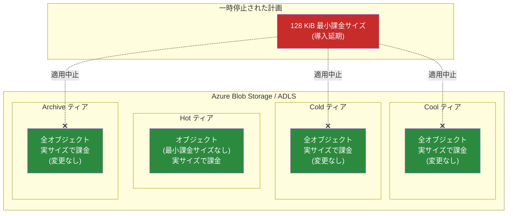

# Azure Blob Storage: クーラーティアにおける最小課金オブジェクトサイズ変更の一時停止

**リリース日**: 2026-06-08

**サービス**: Azure Blob Storage / Azure Data Lake Storage

**機能**: Cool、Cold、Archive ティアの最小課金オブジェクトサイズ導入の一時停止

**ステータス**: Launched (GA)

[このアップデートのインフォグラフィックを見る](https://takech9203.github.io/azure-news-summary/20260608-blob-storage-minimum-billable-object-size-pause.html)

## 概要

Microsoft は、Cool、Cold、Archive アクセスティアに対する最小課金オブジェクトサイズ (128 KiB) の導入を **一時停止** することを発表した。これにより、当初予定されていた **2026 年 7 月 1 日** の課金動作の変更は、新規・既存いずれのストレージアカウントに対しても実施されない。

2026 年 4 月 14 日に発表された当初の計画では、128 KiB 未満のオブジェクトをクーラーティアに格納した場合に 128 KiB として課金する変更が、2 段階で導入される予定であった (第 1 段階: 2026 年 7 月 1 日に新規アカウント、第 2 段階: 2027 年 7 月 1 日に全アカウント)。今回の発表により、この計画全体が一時停止となり、改訂されたタイムラインは今後別途通知される。

現時点では、クーラーティアに格納されたオブジェクトは引き続き実際のサイズで課金されるため、小さなオブジェクトを多数格納しているユーザーは当面の対応を急ぐ必要がなくなった。

**アップデート前の課題**

- 2026 年 7 月 1 日の課金変更に備えて、小さなオブジェクトのパッキングやティア変更などの対策を急ぐ必要があった
- 新規ストレージアカウントの作成計画に影響を与える可能性があり、設計判断が困難だった
- 対策のための運用変更や開発作業のコスト・工数が発生する見込みだった

**アップデート後の改善**

- 2026 年 7 月 1 日に課金変更は実施されないため、緊急の対応は不要となった
- 新規・既存いずれのストレージアカウントも現行の課金方法が維持される
- 改訂タイムラインが発表されるまで、対策の検討に十分な時間を確保できるようになった

## アーキテクチャ図

すべてのアクセスティアにおいて、オブジェクトは引き続き実サイズで課金される。当初計画されていた 128 KiB 最小課金サイズの導入は一時停止となった。

## サービスアップデートの詳細

### 主要ポイント

1. **最小課金オブジェクトサイズ導入の一時停止**
   - 2026 年 4 月 14 日に発表された 128 KiB 最小課金サイズの導入計画が一時停止された
   - 2026 年 7 月 1 日に予定されていた第 1 段階 (新規ストレージアカウントへの適用) は実施されない
   - 新規・既存いずれのストレージアカウントも影響を受けない

2. **現行の課金動作の維持**
   - Cool、Cold、Archive ティアに格納されたオブジェクトは、サイズに関係なく実サイズで課金が継続される
   - Block Blob および Append Blob のいずれも現行の課金方法が維持される
   - Hot ティアは元々影響がなく、引き続き変更なし

3. **今後のスケジュール**
   - Microsoft は改訂されたタイムラインを今後発表する予定
   - 具体的な新しい適用日は未定

## 技術仕様

| 項目 | 詳細 |
|------|------|
| 対象変更 | 128 KiB 最小課金オブジェクトサイズの導入 |
| ステータス | 一時停止 (Paused) |
| 当初の第 1 段階適用日 | 2026 年 7 月 1 日 (新規アカウント) → **実施せず** |
| 当初の第 2 段階適用日 | 2027 年 7 月 1 日 (全アカウント) → **未定** |
| 対象ティア | Cool、Cold、Archive |
| 対象ストレージ | Azure Blob Storage、Azure Data Lake Storage |
| 対象 Blob タイプ | Block Blob、Append Blob |
| 現行の課金方法 | 全ティアで実サイズによる課金を継続 |
| 改訂タイムライン | 今後発表予定 |

## メリット

### ビジネス面

- **緊急対応のコスト回避**: 2026 年 7 月 1 日までに対策を講じる必要がなくなり、パッキング処理の開発やアーキテクチャ変更の工数が当面不要
- **予算計画への影響回避**: クーラーティアの課金額が変わらないため、現行のコスト見積もりをそのまま維持できる
- **計画的な対応が可能**: 改訂タイムラインが発表されるまで、最適な対策を十分に検討する時間が確保された

### 技術面

- **既存アーキテクチャの維持**: 小さなオブジェクトをクーラーティアに格納する既存の設計を変更する緊急性がなくなった
- **ライフサイクルポリシーの継続利用**: 現行のライフサイクル管理ポリシーをそのまま運用できる
- **運用の安定性**: パッキング処理の導入による複雑性の追加を先送りできる

## デメリット・制約事項

- **将来的な変更の不確実性**: 一時停止であり撤回ではないため、将来的に再び導入される可能性がある。改訂タイムラインが未定のため、計画を完全に中止することはできない
- **対策検討の先送りリスク**: 猶予期間が生まれたことで対策の検討が後回しになり、再発表時に急な対応を迫られる可能性がある
- **新メトリクスの提供状況が不明**: 当初計画されていた BlockBlobSmall / Data Lake Storage Small メトリクスの提供時期が不明確

## ユースケース

### ユースケース 1: クーラーティアに小さなオブジェクトを大量に格納しているワークロード

**シナリオ**: IoT テレメトリデータやログファイルなど、128 KiB 未満の小さなオブジェクトを Cool/Cold ティアに大量に格納しており、当初の発表を受けてパッキング処理の導入を検討していた。

**推奨対応**: 2026 年 7 月 1 日に向けた緊急対応は不要。ただし、将来的な再導入に備えて、以下の対策を計画的に検討することが望ましい:
- 小さなオブジェクトのパッキング (TAR/ZIP/Parquet 形式での結合)
- Smart Tier の活用による自動最適化
- ライフサイクルポリシーの見直し

**効果**: 緊急の開発・運用変更が不要となり、通常の開発サイクルの中で最適な対策を選定・実装できる。

### ユースケース 2: 新規ストレージアカウントの設計

**シナリオ**: 2026 年 7 月以降に新規ストレージアカウントを作成する計画があり、最小課金サイズの影響を考慮した設計変更を検討していた。

**推奨対応**: 最小課金サイズを前提とした設計制約を外し、要件に最適なアーキテクチャで設計を進めてよい。ただし、将来の再導入可能性を念頭に、小さなオブジェクトの効率的な管理はベストプラクティスとして継続することが望ましい。

**効果**: 設計の自由度が回復し、不要な複雑性を持ち込まずに済む。

## 料金

現行の課金方法に変更はない。すべてのアクセスティアにおいて、オブジェクトは実際のサイズで課金される。

| ティア | 課金方法 (現行維持) |
|------|------|
| Hot | 実サイズで課金 |
| Cool | 実サイズで課金 (128 KiB 最小課金なし) |
| Cold | 実サイズで課金 (128 KiB 最小課金なし) |
| Archive | 実サイズで課金 (128 KiB 最小課金なし) |
| トランザクション | 変更なし |

当初予定されていた「128 KiB 未満のオブジェクトを 128 KiB として課金」する変更は実施されないため、小さなオブジェクトに対するコスト増加は発生しない。

## 利用可能リージョン

この課金ポリシーの一時停止は、すべての Azure リージョンの Azure Blob Storage および Azure Data Lake Storage に適用される。リージョンによる差異はない。

## 関連サービス・機能

- **[Azure Blob Storage アクセスティア](https://learn.microsoft.com/azure/storage/blobs/access-tiers-overview)**: Hot、Cool、Cold、Archive の各ティアの概要と使い分け
- **[Smart Tier](https://learn.microsoft.com/azure/storage/blobs/access-tiers-smart)**: アクセスパターンに基づく自動ティアリング機能。将来的な最小課金サイズ導入時の軽減策として引き続き有効
- **[Azure Blob Storage ライフサイクル管理](https://learn.microsoft.com/azure/storage/blobs/lifecycle-management-overview)**: ルールベースのティア移動自動化機能
- **[前回の発表レポート (2026-04-14)](./2026-04-14-blob-storage-minimum-billable-object-size.md)**: 最小課金オブジェクトサイズ導入の当初発表の詳細

## 参考リンク

- [インフォグラフィック](https://takech9203.github.io/azure-news-summary/20260608-blob-storage-minimum-billable-object-size-pause.html)
- [公式アップデート情報](https://azure.microsoft.com/updates?id=559756)
- [Microsoft Learn - アクセスティアの概要](https://learn.microsoft.com/azure/storage/blobs/access-tiers-overview)
- [料金ページ - Azure Blob Storage](https://azure.microsoft.com/pricing/details/storage/blobs/)

## まとめ

Azure Blob Storage および Azure Data Lake Storage の Cool、Cold、Archive ティアに対する 128 KiB 最小課金オブジェクトサイズの導入が一時停止された。2026 年 7 月 1 日に予定されていた課金動作の変更は、新規・既存いずれのストレージアカウントに対しても実施されない。

Solutions Architect としての推奨アクションは以下の通り:

1. **即時対応**: 2026 年 7 月 1 日に向けた緊急対応 (パッキング処理の導入、ティア変更等) は不要。既存の運用をそのまま継続してよい
2. **中長期的な備え**: 一時停止であり撤回ではないため、改訂タイムラインの発表に注意を払い、発表後に速やかに対応できるよう準備を進めることが望ましい
3. **ベストプラクティスの継続**: 緊急性はなくなったが、小さなオブジェクトのパッキングや Smart Tier の活用は、ストレージコスト最適化のベストプラクティスとして引き続き有効である
4. **情報の追跡**: Microsoft からの改訂タイムラインの発表を Azure Updates で継続的に確認する

---

**タグ**: Azure Blob Storage, Azure Data Lake Storage, Storage, Pricing, GA, 最小課金オブジェクトサイズ, Cool ティア, Cold ティア, Archive ティア, 一時停止, 課金ポリシー
