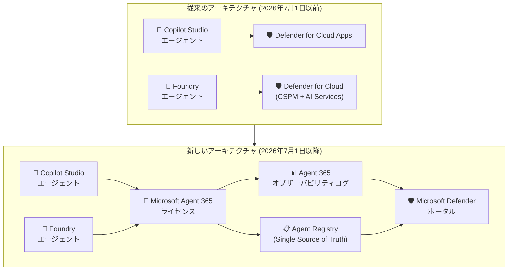

# Microsoft Defender for Cloud: Foundry エージェントセキュリティ機能の Microsoft Agent 365 ライセンスへの移行

**リリース日**: 2026-06-08

**サービス**: Microsoft Defender for Cloud

**機能**: Microsoft Foundry エージェントセキュリティ機能の Microsoft Agent 365 ライセンスへの移行

**ステータス**: In preview

[このアップデートのインフォグラフィックを見る](https://takech9203.github.io/azure-news-summary/20260608-foundry-agent-security-agent-365.html)

## 概要

2026 年 7 月 1 日より、Microsoft Defender for Cloud で提供されていた Microsoft Foundry エージェントのセキュリティ機能が、Microsoft Agent 365 ライセンスに移行する。これにより、エージェントレベルの検出・セキュリティポスチャ・脅威検出は Agent 365 ライセンスが必要となる。

この変更は、Microsoft Copilot Studio エージェント (Defender for Cloud Apps 経由) と Microsoft Foundry エージェント (Defender for Cloud 経由) の両方に影響する。Agent 365 へのオンボーディング後も、これらのエクスペリエンスは Microsoft Defender ポータル内に残るが、Agent 365 のオブザーバビリティログとエージェントレジストリを基盤として動作するようになる。

**アップデート前の課題**

- Foundry エージェントのセキュリティ機能は Defender CSPM プランおよび Defender for AI Services プランの一部として提供されていた
- エージェントインベントリは `AIAgentInfo` テーブルで管理されており、他のエージェントプラットフォームとの統合が分散していた
- Copilot Studio エージェントと Foundry エージェントのセキュリティが異なるサービス (Defender for Cloud Apps / Defender for Cloud) に分かれていた

**アップデート後の改善**

- Microsoft Agent 365 がエージェントインベントリの単一の信頼できるソース (Single Source of Truth) となる
- Agent 365 オブザーバビリティログによるリアルタイム脅威検出の統合
- Copilot Studio と Foundry の両エージェントセキュリティが統一されたライセンスモデルで管理可能
- Advanced Hunting の新しい `AgentInfo` テーブルによる統合的なエージェント管理

## アーキテクチャ図

従来は Defender for Cloud Apps と Defender for Cloud に分散していたエージェントセキュリティ機能が、Microsoft Agent 365 ライセンスの下に統合される。Agent 365 のオブザーバビリティログとエージェントレジストリが新しい基盤となる。

## サービスアップデートの詳細

### Microsoft Agent 365 ライセンスが必要となる機能

#### Microsoft Foundry エージェント (従来 Defender for Cloud 経由)

1. **エージェント検出とセキュリティポスチャ**
   - クラウドホスト型エージェントの検出 (マルチクラウド含む)
   - 従来は Defender CSPM プランで提供

2. **エージェント脅威保護**
   - エージェントに対するリアルタイム脅威検出
   - 従来は Defender for AI Services プランで提供

#### Microsoft Copilot Studio エージェント (従来 Defender for Cloud Apps 経由)

1. **エージェント検出とポスチャ**
2. **エージェント脅威検出とリアルタイム保護**
3. **Advanced Hunting でのエージェントアクティビティ調査**

### Defender for Cloud に残る機能

- **Defender CSPM**: Microsoft Foundry のアカウントとプロジェクトの検出は引き続き利用可能
- **Defender for AI Services**: Azure OpenAI などの Foundry Models に対する脅威保護は継続

### エクスペリエンスの変更点

| 項目 | 変更内容 |
|------|----------|
| Advanced Hunting | `AIAgentInfo` テーブルが廃止され、新しい `AgentInfo` テーブルに移行 |
| 脅威検出アラート | 既存のアラートが Agent 365 オブザーバビリティログベースの同等アラートに置換 |
| リアルタイム保護 | レガシールールのアラートが `BehaviorInfo` テーブルの Behaviors に移行 |
| サードパーティクラウドエージェント | Defender for Cloud コネクタでの検出が終了、Agent 365 レジストリ同期に移行 |
| Azure ポータル | Data and AI ダッシュボードおよび Cloud Security Explorer から Foundry エージェントデータが削除 |

## 技術仕様

| 項目 | 詳細 |
|------|------|
| 移行日 | 2026 年 7 月 1 日 |
| 対象エージェント | Microsoft Foundry エージェント、Microsoft Copilot Studio エージェント |
| 必要ライセンス | Microsoft Agent 365 |
| 新テーブル | `AgentInfo` (Advanced Hunting) |
| 廃止テーブル | `AIAgentInfo` (Advanced Hunting) |
| 設定トグル | Settings > Security for AI Agents |
| 新ポリシーパス | Settings > Security for AI > Policies (2026/7/1 以降) |
| トライアル | 管理者主導、25 シート、30 日間 |

## 設定方法

### 移行前の準備手順

1. **ライセンスの確認**
   - テナントに Agent 365 対応ライセンスがあることを確認
   - [Microsoft Agent 365 概要ドキュメント](https://learn.microsoft.com/microsoft-agent-365/overview) で資格と前提条件を確認

2. **トライアルの開始 (未ライセンスの場合)**
   - Microsoft Admin Center から Agent 365 管理者主導トライアルを開始
   - 25 シート、30 日間の試用が可能
   - 課金権限を持つ管理者がバナーからライセンスを直接購入可能

3. **Defender 設定の確認**
   - 2026 年 7 月 1 日にすべての Security for AI 機能が「Security for AI Agents」トグルに統合
   - トグルが On であることを確認

4. **Advanced Hunting クエリの更新**
   - `AIAgentInfo` テーブルを参照するクエリ、カスタム検出、ワークブックを確認
   - 新しい `AgentInfo` テーブルに更新

5. **リアルタイム保護ブロックルールの再定義**
   - 既存の Block ルールは 7 月 1 日に停止
   - Settings > Security for AI > Policies で新ルールを定義 (7/1 以降)

6. **サードパーティクラウドエージェントの接続**
   - Microsoft 365 エージェントレジストリのレジストリ同期を構成

7. **アラートワークフローの移行**
   - リアルタイム保護アラート: `BehaviorInfo` テーブルに移行
   - 脅威検出アラート: Agent 365 オブザーバビリティログに移行

## メリット

### ビジネス面

- エージェントセキュリティのライセンスが統合され、管理が簡素化される
- Copilot Studio と Foundry のセキュリティが一元管理できる
- エンタープライズ全体のエージェントガバナンスが統一される

### 技術面

- Agent 365 がエージェントインベントリの Single Source of Truth となり、データの一貫性が向上
- オブザーバビリティログによるエンドツーエンドの可視性
- `AgentInfo` テーブルによる統合的な Advanced Hunting
- エージェントレジストリを通じたサードパーティエージェントの統合管理

## デメリット・制約事項

- 2026 年 7 月 1 日までに Agent 365 ライセンスを取得しない場合、エージェントセキュリティ機能が完全に無効化される
- 既存の Block モードのリアルタイム保護ルールが 7 月 1 日に停止するため、新ポリシーでの再定義が必要
- `AIAgentInfo` テーブルが廃止されるため、既存のクエリ・カスタム検出・ワークブックの更新が必須
- サードパーティクラウドエージェントは Defender for Cloud コネクタでは検出不可となり、レジストリ同期の再構成が必要
- Azure ポータルの Data and AI ダッシュボードおよび Cloud Security Explorer から Foundry エージェントデータが削除される
- Defender CSPM はアカウント/プロジェクトレベルの検出のみ継続し、エージェントレベルの可視性には Agent 365 が必要

## ユースケース

### ユースケース 1: Foundry エージェントを運用するエンタープライズ

**シナリオ**: Microsoft Foundry で複数のAI エージェントを本番運用しており、Defender for Cloud でセキュリティポスチャと脅威検出を行っている組織。

**必要なアクション**:
- Agent 365 ライセンスを取得
- 7 月 1 日までに Advanced Hunting クエリを `AgentInfo` テーブルに移行
- リアルタイム保護ルールを新ポリシーで再定義

**効果**: エージェントレベルの検出・ポスチャ・脅威保護が継続され、さらに統合されたオブザーバビリティログによる一元管理が実現する。

### ユースケース 2: マルチプラットフォームのエージェント管理

**シナリオ**: Copilot Studio と Microsoft Foundry の両方でエージェントを構築・運用しており、セキュリティ監視が分散している組織。

**必要なアクション**:
- Agent 365 ライセンスを取得
- Security for AI Agents トグルを有効化
- 統合されたエージェントインベントリで一元管理

**効果**: 従来は Defender for Cloud Apps と Defender for Cloud に分散していたセキュリティ管理が、Agent 365 のもとで統合される。

## 料金

Microsoft Agent 365 ライセンスの具体的な料金は、本アップデート情報からは確認できない。以下の情報が確認されている:

- **トライアル**: 管理者主導、25 シート、30 日間の無料試用が可能
- **購入方法**: Microsoft Admin Center のバナーから直接購入、またはエンタープライズ顧客は Microsoft アカウントチームに連絡
- **従来の料金**: Defender CSPM プランおよび Defender for AI Services プランの料金に含まれていた (エージェントセキュリティ部分)

詳細な料金情報は [Microsoft Agent 365 概要ページ](https://learn.microsoft.com/microsoft-agent-365/overview) を参照。

## 関連サービス・機能

- **Microsoft Defender for Cloud (CSPM)**: Foundry アカウント/プロジェクトレベルの検出は継続。エージェントレベルの機能は Agent 365 に移行
- **Microsoft Defender for AI Services**: Foundry Models (Azure OpenAI 等) の脅威保護は継続。エージェント固有のアラートは Agent 365 に移行
- **Microsoft Defender for Cloud Apps**: Copilot Studio のリアルタイム保護は継続。エージェント検出・ポスチャは Agent 365 に移行
- **Microsoft Foundry Agent Service**: エージェントのビルド・デプロイ・スケーリングのマネージドプラットフォーム。オブザーバビリティとトレース機能を提供
- **Microsoft Defender XDR**: 統合的なセキュリティポータル。Agent 365 移行後もエージェントセキュリティ体験の提供先として継続
- **Microsoft 365 Agent Registry**: Agent 365 のエージェントインベントリの基盤。サードパーティエージェントのレジストリ同期にも対応

## 参考リンク

- [インフォグラフィック](https://takech9203.github.io/azure-news-summary/20260608-foundry-agent-security-agent-365.html)
- [公式アップデート情報](https://azure.microsoft.com/updates?id=565171)
- [Transition AI agent security capabilities to Microsoft Agent 365 - Microsoft Learn](https://learn.microsoft.com/defender-xdr/security-for-ai/transition-agent-security-to-agent-365)
- [AI security posture management - Microsoft Defender for Cloud](https://learn.microsoft.com/azure/defender-for-cloud/ai-security-posture)
- [AI threat protection in Microsoft Defender for Cloud](https://learn.microsoft.com/azure/defender-for-cloud/ai-threat-protection)
- [Microsoft Foundry Agent Service 概要](https://learn.microsoft.com/azure/foundry/agents/overview)
- [Microsoft Agent 365 概要](https://learn.microsoft.com/microsoft-agent-365/overview)

## まとめ

本アップデートは、Microsoft Defender for Cloud で提供されていた Foundry エージェントのセキュリティ機能 (検出・ポスチャ・脅威保護) が、2026 年 7 月 1 日より Microsoft Agent 365 ライセンスに移行することを示している。Defender CSPM によるアカウント/プロジェクトレベルの検出や、Defender for AI Services による Foundry Models の保護は継続されるが、エージェントレベルのセキュリティ機能には Agent 365 ライセンスが必須となる。

**推奨される次のアクション:**
1. 自組織のテナントが Agent 365 ライセンスの対象か確認する
2. 未取得の場合は 30 日間のトライアルを開始する
3. `AIAgentInfo` テーブルを参照する既存クエリを棚卸しし、移行計画を立てる
4. リアルタイム保護の Block ルールを使用している場合は、7 月 1 日以降の再定義を計画する
5. セキュリティ運用チームおよびコンプライアンスチームに変更内容を周知する

---

**タグ**: #MicrosoftDefenderForCloud #MicrosoftAgent365 #AIエージェントセキュリティ #ライセンス移行 #MicrosoftFoundry #CSPM #SecurityPosture
