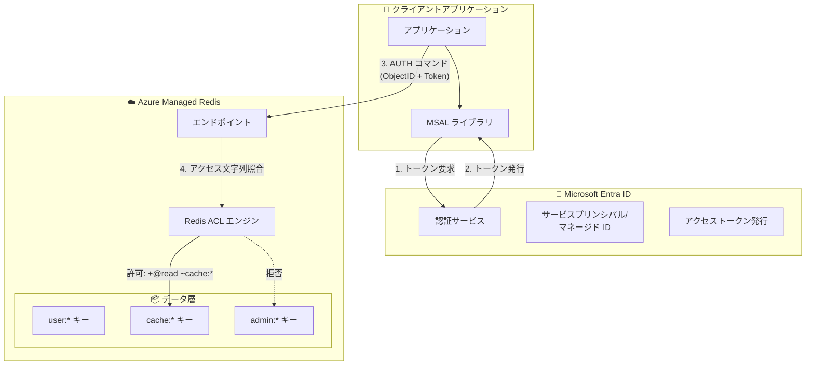

# Azure Managed Redis: Entra ID ベースの RBAC によるデータアクセス制御

**リリース日**: 2026-06-08

**サービス**: Azure Managed Redis

**機能**: Microsoft Entra ID ベースのロールベースアクセス制御 (RBAC) によるデータ管理

**ステータス**: In preview

[このアップデートのインフォグラフィックを見る](https://takech9203.github.io/azure-news-summary/20260608-managed-redis-entra-id-rbac.html)

## 概要

Azure Managed Redis において、Microsoft Entra ID を使用したロールベースアクセス制御 (RBAC) によるデータアクセス管理機能がパブリックプレビューとして提供開始された。この機能により、共有キーに依存することなく、Redis データに対する読み取り、書き込み、管理操作を Microsoft Entra ID のユーザーやサービスプリンシパル単位で精密に制御できるようになる。

従来の Azure Managed Redis では、Microsoft Entra ID 認証を有効化した場合でも、認証されたすべてのユーザーがすべてのコマンドとすべてのキーに対するフルアクセス権を持っていた。今回のアップデートにより、Redis の Access Control Lists (ACL) 構文を活用したカスタムアクセス文字列を個々のユーザーに割り当てることが可能になり、最小権限の原則に基づいたきめ細かなデータアクセス制御が実現する。

**アップデート前の課題**

- Microsoft Entra ID で認証されたユーザーは一律にすべてのコマンド・キーへのフルアクセス権を持ち、権限の細分化ができなかった
- 共有アクセスキーによる認証では、キーの漏洩リスクやローテーション管理の負荷があった
- マルチテナント環境やチーム間でデータを分離する標準的な手段がなかった

**アップデート後の改善**

- ユーザーごとに Redis ACL ベースのカスタムアクセス文字列を割り当て、コマンドとキーパターンを制限可能に
- Microsoft Entra ID のサービスプリンシパル・マネージド ID と組み合わせ、パスワードレスかつ最小権限のアクセスを実現
- API バージョン `2026-05-01-preview` による REST API、ARM テンプレート、Azure Portal からの設定に対応

## アーキテクチャ図



Microsoft Entra ID で認証されたユーザーが Redis に接続する際、割り当てられたカスタムアクセス文字列に基づいて ACL エンジンがコマンドとキーパターンを評価し、許可された操作のみを実行する。

## サービスアップデートの詳細

### 主要機能

1. **カスタムアクセス文字列による権限制御**
   - Redis ACL 構文を使用し、ユーザーごとに実行可能なコマンドカテゴリとアクセス可能なキーパターンを定義
   - コマンドカテゴリ: `+@read`, `+@write`, `+@all` などで一括許可/拒否
   - 個別コマンド: `+set`, `-flushall` などで特定コマンドを許可/拒否
   - キーパターン: `~user:*`, `~cache:*` などで対象キーを限定

2. **Azure Portal からの設定**
   - Authentication 画面からユーザー追加時に「Custom data access policy (preview)」を選択し、アクセス文字列を入力可能

3. **ARM テンプレート / REST API 対応**
   - API バージョン `2026-05-01-preview` で `accessPolicyAssignments` リソースとして管理
   - Infrastructure as Code による一貫した権限管理が可能

4. **インプレース権限更新**
   - ユーザーの接続を切断することなく、アクセス文字列を変更して権限を即時更新可能

## 技術仕様

| 項目 | 詳細 |
|------|------|
| 必要な API バージョン | `2026-05-01-preview` 以降 |
| 認証プロトコル | SSL 接続のみサポート |
| トークンスコープ | `https://redis.azure.com/.default` |
| デフォルト権限 | `+@all ~*` (全コマンド・全キーアクセス) |
| アクセス文字列省略時 | フルアクセスが付与される |
| ユーザーあたりの割り当て | データベースごとに 1 つのアクセスポリシー |
| キーパターン | 大文字小文字を区別 |
| サポートされるティア | Balanced, Memory Optimized, Compute Optimized, Flash Optimized (全ティア) |

## 設定方法

### 前提条件

1. Azure Managed Redis インスタンスが作成済みであること
2. API バージョン `2026-05-01-preview` 以降へのアクセス
3. 対象ユーザーまたはサービスプリンシパルの Object ID

### Azure Portal

1. Azure Portal で Azure Managed Redis インスタンスに移動
2. リソースメニューから **Authentication** を選択
3. **Microsoft Entra Authentication** タブで **User or service principal** を選択し、**+ Select member** をクリック
4. ユーザーまたはサービスプリンシパルを検索して選択
5. **Access policy** で **Custom data access policy (preview)** を選択
6. アクセス文字列を入力 (例: `+@read ~cache:*`)
7. **Assign** をクリック

### ARM テンプレート

```json
{
    "$schema": "https://schema.management.azure.com/schemas/2019-04-01/deploymentTemplate.json#",
    "contentVersion": "1.0.0.0",
    "parameters": {
        "cacheName": { "type": "String" },
        "assignmentName": { "type": "String" },
        "objectId": { "type": "String" },
        "accessString": { "defaultValue": "+@all ~*", "type": "String" }
    },
    "resources": [
        {
            "type": "Microsoft.Cache/redisEnterprise/databases/accessPolicyAssignments",
            "apiVersion": "2026-05-01-preview",
            "name": "[concat(parameters('cacheName'), '/default/', parameters('assignmentName'))]",
            "properties": {
                "accessPolicyName": "default",
                "accessString": "[parameters('accessString')]",
                "user": {
                    "objectId": "[parameters('objectId')]"
                }
            }
        }
    ]
}
```

### Azure CLI (デプロイ)

```bash
az deployment group create \
    --resource-group myResourceGroup \
    --template-file AccessPolicyAssignment.json \
    --parameters cacheName=myCache assignmentName=myAssignment \
        objectId=aaaaaaaa-0000-1111-2222-bbbbbbbbbbbb \
        accessString="+@read ~cache:*"
```

### REST API

```http
PUT https://management.azure.com/subscriptions/{subscriptionId}/resourceGroups/{resourceGroup}/providers/Microsoft.Cache/redisEnterprise/{cacheName}/databases/{databaseName}/accessPolicyAssignments/{assignmentName}?api-version=2026-05-01-preview

{
  "properties": {
    "accessPolicyName": "default",
    "accessString": "+@read ~cache:*",
    "user": {
      "objectId": "aaaaaaaa-0000-1111-2222-bbbbbbbbbbbb"
    }
  }
}
```

## メリット

### ビジネス面

- **コンプライアンス強化**: 最小権限の原則を適用し、監査要件への対応を容易にする
- **セキュリティリスク低減**: 共有アクセスキーへの依存を排除し、キー漏洩による全データ露出リスクを削減
- **マルチテナント対応**: テナントごとにキーパターンを分離し、データの安全な共存を実現

### 技術面

- **きめ細かなアクセス制御**: コマンドカテゴリとキーパターンの組み合わせにより、用途に応じた最小権限を設定可能
- **パスワードレス認証**: Microsoft Entra ID のマネージド ID と統合し、シークレット管理の負荷を軽減
- **インプレース更新**: ユーザーの接続を切断せずに権限変更が可能で、運用中のサービスへの影響を最小化
- **IaC 対応**: ARM テンプレート、REST API による自動化・再現性のある権限管理

## デメリット・制約事項

- プレビュー段階のため、GA 時に仕様変更の可能性がある
- API バージョン `2026-05-01-preview` 以降が必要であり、古い API バージョンでは常にフルアクセスが付与される
- Microsoft Entra ID グループはサポートされていない (個々のユーザー/サービスプリンシパル単位での割り当てが必要)
- SSL 接続のみでの認証サポート
- 一部の Redis コマンドは ACL 設定に関係なくブロックされる
- データベースあたりユーザー 1 つのアクセスポリシー割り当てに限定
- キーパターンは大文字小文字を区別するため、命名規則の統一が重要

## ユースケース

### ユースケース 1: マルチテナント SaaS アプリケーション

**シナリオ**: 複数テナントが同一の Redis インスタンスを共有する SaaS アプリケーションにおいて、テナント間のデータ分離を実現する。

**実装例**:

```
# テナント A のサービスプリンシパルに割り当てるアクセス文字列
+@all ~tenantA:*

# テナント B のサービスプリンシパルに割り当てるアクセス文字列
+@all ~tenantB:*
```

**効果**: 各テナントは自身のキープレフィックスのみにアクセスでき、他テナントのデータには一切触れられないため、論理的なデータ分離が実現する。

### ユースケース 2: 読み取り専用キャッシュクライアント

**シナリオ**: レポーティングサービスがキャッシュデータを読み取るが、書き込みや削除は許可したくない場合。

**実装例**:

```
# 読み取り専用アクセス (全キー)
+@read ~*

# 特定のキャッシュプレフィックスに限定した読み取り
+@read ~cache:*
```

**効果**: 誤操作やバグによるデータの書き換え・削除を防止し、データの整合性を保護する。

### ユースケース 3: マイクロサービスごとの権限分離

**シナリオ**: セッション管理サービスとアプリケーションデータサービスが同一 Redis を共有し、それぞれが自身の責務に必要な権限のみを持つ。

**実装例**:

```
# セッション管理サービス: session:* キーへの読み書き
+@read +@write ~session:*

# アプリデータサービス: app:* キーへの読み書き
+@read +@write ~app:*
```

**効果**: サービス間の関心の分離を強制し、障害や侵害の影響範囲を限定する。

## 料金

RBAC によるデータアクセス制御機能自体に追加料金は発生しない。Azure Managed Redis の既存のティアに基づく料金体系が適用される。

詳細な料金情報は [Azure Managed Redis の料金ページ](https://azure.microsoft.com/pricing/details/managed-redis/) を参照。

## 利用可能リージョン

Azure Managed Redis が提供されているすべてのリージョンで、全ティア (Balanced, Memory Optimized, Compute Optimized, Flash Optimized) において利用可能。

リージョンごとの提供状況は [Products available by region](https://azure.microsoft.com/explore/global-infrastructure/products-by-region/table) を参照。

## 関連サービス・機能

- **Microsoft Entra ID**: 認証基盤として、ユーザー・サービスプリンシパル・マネージド ID の管理を担当
- **Azure RBAC (コントロールプレーン)**: キャッシュインスタンス自体の管理権限 (作成、削除、スケーリング等) を制御。今回のデータプレーン RBAC と補完関係にある
- **Azure Key Vault**: 従来のアクセスキー管理に使用されていたサービス。Entra ID 認証への移行により依存度が低下
- **Azure Private Link**: ネットワーク層でのアクセス制限と組み合わせ、多層防御を実現
- **MSAL (Microsoft Authentication Library)**: クライアントアプリケーションでの Entra ID トークン取得に使用

## 参考リンク

- [インフォグラフィック](https://takech9203.github.io/azure-news-summary/20260608-managed-redis-entra-id-rbac.html)
- [公式アップデート情報](https://azure.microsoft.com/updates?id=564873)
- [Microsoft Learn - Microsoft Entra を使用した Azure Managed Redis の認証](https://learn.microsoft.com/azure/redis/entra-for-authentication)
- [Microsoft Learn - カスタムデータアクセス権限の構成](https://learn.microsoft.com/azure/redis/configure-access-permissions)
- [Microsoft Learn - Azure Managed Redis の概要](https://learn.microsoft.com/azure/redis/overview)
- [料金ページ](https://azure.microsoft.com/pricing/details/managed-redis/)

## まとめ

Azure Managed Redis における Entra ID ベースの RBAC データアクセス制御は、キャッシュデータへのアクセスをユーザー/サービスプリンシパル単位で精密に制御するための重要なセキュリティ強化である。Redis ACL 構文を活用したカスタムアクセス文字列により、コマンドレベル・キーパターンレベルでの最小権限アクセスが実現する。

Solutions Architect としての推奨アクション:
- 現在共有アクセスキーを使用している環境では、Microsoft Entra ID 認証への移行を計画する
- マルチテナントやマイクロサービス構成では、キーの命名規則を統一し、テナント/サービスごとのアクセス文字列設計を行う
- プレビュー段階であるため、本番環境への適用前に検証環境での動作確認を推奨する
- Microsoft Entra ID グループ非対応の制約を考慮し、サービスプリンシパルやマネージド ID を活用した運用設計を検討する

---

**タグ**: #AzureManagedRedis #EntraID #RBAC #セキュリティ #アクセス制御 #Preview #MicrosoftBuild
