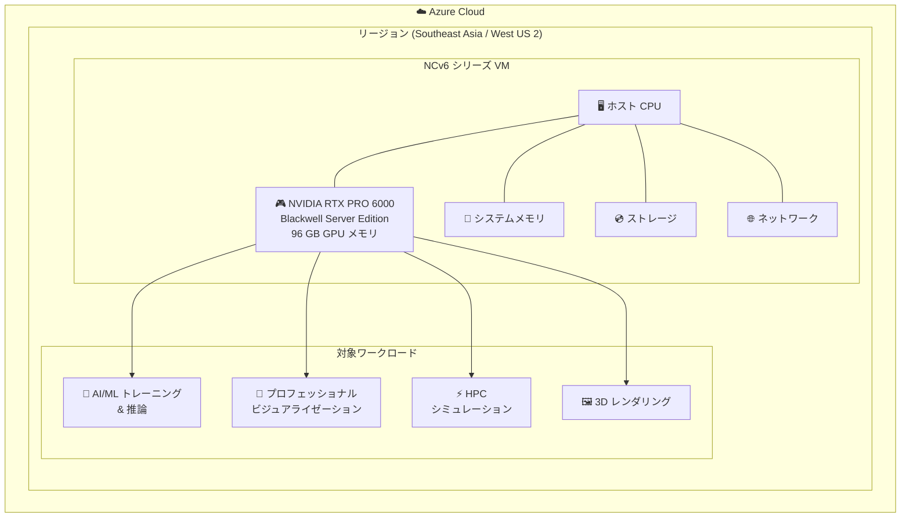

# Azure Virtual Machines: NC RTX PRO 6000 Blackwell Server Edition v6 シリーズの一般提供開始

**リリース日**: 2026-06-08

**サービス**: Azure Virtual Machines

**機能**: NCv6 シリーズ仮想マシン (NVIDIA RTX PRO 6000 Blackwell Server Edition GPU 搭載)

**ステータス**: Launched (GA)

[このアップデートのインフォグラフィックを見る](https://takech9203.github.io/azure-news-summary/20260608-nc-rtx-pro-6000-blackwell-v6.html)

## 概要

Azure NCv6 シリーズ仮想マシン (VM) が、Azure Southeast Asia および West US 2 リージョンで一般提供 (GA) を開始した。NCv6 シリーズは NVIDIA RTX PRO 6000 Blackwell Server Edition グラフィックスプロセッシングユニット (GPU) を搭載しており、各 GPU には 96 GB のメモリが搭載されている。

NC シリーズは Azure の GPU 最適化 VM インスタンスの 1 つであり、AI および機械学習モデルのトレーニング、ハイパフォーマンスコンピューティング (HPC)、グラフィックスインテンシブなアプリケーション向けに設計されている。NCv6 シリーズは、NVIDIA の最新アーキテクチャである Blackwell を採用した RTX PRO 6000 Server Edition を搭載することで、前世代と比較してコンピューティング性能とメモリ容量の両面で強化されている。

**アップデート前の課題**

- NC シリーズの既存世代 (NCv3: Tesla V100 16GB、NCasT4_v3: T4 16GB、NC_A100_v4: A100 80GB、NCads_H100_v5: H100 94GB) では、プロフェッショナルビジュアライゼーションやレンダリングワークロードに特化した GPU オプションが限定的だった
- RTX プロフェッショナル向け GPU のクラウド提供が限られており、ISV 認定が必要なアプリケーション (CAD/CAM/CAE) のクラウド移行に制約があった
- Southeast Asia および West US 2 リージョンでの最新世代 GPU VM の選択肢が限られていた

**アップデート後の改善**

- NVIDIA RTX PRO 6000 Blackwell Server Edition (96 GB GPU メモリ) を搭載した NCv6 シリーズが利用可能になった
- プロフェッショナルビジュアライゼーション、3D レンダリング、AI/ML ワークロードに対応した最新アーキテクチャの GPU をクラウドで利用可能
- Southeast Asia および West US 2 リージョンでの GPU コンピューティングの選択肢が拡大

## アーキテクチャ図

NCv6 シリーズ VM は NVIDIA RTX PRO 6000 Blackwell Server Edition GPU を搭載し、AI/ML、ビジュアライゼーション、HPC、レンダリングなどの GPU アクセラレーションを必要とする多様なワークロードに対応する。

## サービスアップデートの詳細

### 主要機能

1. **NVIDIA RTX PRO 6000 Blackwell Server Edition GPU 搭載**
   - NVIDIA の最新 Blackwell アーキテクチャを採用したプロフェッショナル向け GPU
   - GPU あたり 96 GB のメモリを搭載し、大規模データセットやモデルの処理に対応

2. **プロフェッショナルワークロード対応**
   - NC シリーズは AI/ML トレーニング、HPC、グラフィックスインテンシブなアプリケーション向けに最適化
   - ISV 認定アプリケーション (CAD、シミュレーション、ビジュアライゼーション) での利用を想定

3. **リージョン展開**
   - Southeast Asia および West US 2 リージョンで一般提供開始
   - 今後追加リージョンへの展開が期待される

## 技術仕様

| 項目 | 詳細 |
|------|------|
| シリーズ名 | NCv6 シリーズ |
| GPU | NVIDIA RTX PRO 6000 Blackwell Server Edition |
| GPU メモリ | 96 GB / GPU |
| GPU アーキテクチャ | NVIDIA Blackwell |
| ステータス | 一般提供 (GA) |
| 対象 OS | Linux VM / Windows VM (NC シリーズ共通) |
| スケールセット対応 | Flexible scale sets / Uniform scale sets (NC シリーズ共通) |

> **注**: VM サイズ (vCPU 数、システムメモリ容量、ストレージ、ネットワーク帯域幅) の詳細仕様は、公式ドキュメントの更新を確認してください。

## メリット

### ビジネス面

- クラウド上でプロフェッショナル向け最新 GPU を利用できるため、高額なオンプレミス GPU ワークステーションへの初期投資が不要
- 従量課金により、プロジェクト単位での柔軟なコスト管理が可能
- Southeast Asia リージョンの利用により、APAC 地域のユーザーに対する低レイテンシーのリモートビジュアライゼーション環境を提供可能

### 技術面

- 96 GB の GPU メモリにより、大規模な AI/ML モデルや高解像度 3D データセットをメモリ内で処理可能
- Blackwell アーキテクチャの採用により、前世代比で演算性能の向上が期待される
- Azure のインフラストラクチャ (可用性ゾーン、マネージドディスク、仮想ネットワーク) との統合

## デメリット・制約事項

- 現時点では Southeast Asia および West US 2 の 2 リージョンのみで利用可能。日本リージョン (Japan East / Japan West) での提供は未発表
- GPU VM はクォータ制限が設定されており、利用開始前にクォータ引き上げの申請が必要な場合がある (NC シリーズ共通)
- 試用版サブスクリプションや Visual Studio Subscriber サブスクリプションでは利用できない可能性がある (NC シリーズ共通の制約)
- VM サイズの詳細仕様 (vCPU 数、システムメモリ等) が公式ドキュメントで未確認

## ユースケース

### ユースケース 1: AI/ML モデルのトレーニングと推論

**シナリオ**: 大規模な深層学習モデル (コンピュータビジョン、自然言語処理等) のトレーニングおよびバッチ推論を実行する。

**効果**: 96 GB の GPU メモリにより、大規模モデルのパラメータをメモリ内に保持しながらトレーニングが可能。モデル分割やチェックポイント頻度の削減によりトレーニング効率が向上する。

### ユースケース 2: プロフェッショナルビジュアライゼーションとリモートワークステーション

**シナリオ**: 建築設計 (BIM)、自動車設計 (CAD/CAE)、映像制作 (VFX) などのプロフェッショナルアプリケーションをクラウド上のリモートワークステーションとして提供する。

**効果**: ISV 認定の RTX プロフェッショナル GPU を搭載しているため、SOLIDWORKS、Autodesk、Siemens NX 等のアプリケーションで正式サポートされた環境を提供可能。グローバル拠点のエンジニアが一貫した設計環境にアクセスできる。

### ユースケース 3: HPC シミュレーション

**シナリオ**: 流体力学シミュレーション (CFD)、構造解析 (FEA)、気象モデリングなど、GPU アクセラレーションによって高速化可能な科学技術計算を実行する。

**効果**: Blackwell アーキテクチャの高い演算性能と 96 GB のメモリにより、大規模なシミュレーションメッシュやデータセットの処理が可能。

### ユースケース 4: 3D レンダリングと映像制作

**シナリオ**: 映画制作、ゲーム開発、建築ビジュアライゼーションにおける高品質な 3D レンダリングをクラウド上で実行する。

**効果**: RTX GPU のハードウェアレイトレーシング機能と大容量 GPU メモリを活用し、高解像度・高品質なレンダリングをクラウドスケールで実行可能。

## 料金

NCv6 シリーズの具体的な料金は、公式発表時点で Azure 料金計算ツールを参照してください。

- [Azure VM 料金計算ツール](https://azure.microsoft.com/pricing/calculator/)
- [GPU VM 料金ページ](https://azure.microsoft.com/pricing/details/virtual-machines/series/nc/)

> **参考**: NC シリーズの GPU VM は一般的に他のシリーズ (NV、ND) と同様にリザーブドインスタンス (1 年 / 3 年) による割引が適用される場合があります。

## 利用可能リージョン

| リージョン | 提供状況 |
|----------|---------|
| Southeast Asia | 一般提供中 |
| West US 2 | 一般提供中 |

> **注**: 今後の追加リージョン展開については、[Azure リージョン別サービス提供状況](https://azure.microsoft.com/explore/global-infrastructure/products-by-region/) を確認してください。

## 関連サービス・機能

- **NCads_H100_v5 シリーズ**: NVIDIA H100 NVL GPU (94 GB) を搭載した NC シリーズ。AI/ML トレーニングおよびバッチ推論向け
- **NC_A100_v4 シリーズ**: NVIDIA A100 PCIe GPU (80 GB) を搭載した NC シリーズ。前世代の GPU コンピューティング向け
- **NV シリーズ**: リモートビジュアライゼーションおよびストリーミング向けに最適化された GPU VM
- **ND シリーズ**: 大規模分散トレーニング向けに最適化された GPU VM (InfiniBand 接続)
- **Azure Machine Learning**: GPU VM をコンピュートターゲットとして利用した ML モデルのトレーニングと推論
- **Azure Virtual Desktop**: GPU VM と組み合わせたリモートワークステーション環境の提供

## 参考リンク

- [インフォグラフィック](https://takech9203.github.io/azure-news-summary/20260608-nc-rtx-pro-6000-blackwell-v6.html)
- [公式アップデート情報](https://azure.microsoft.com/updates?id=565271)
- [NC ファミリー VM サイズシリーズ - Microsoft Learn](https://learn.microsoft.com/azure/virtual-machines/sizes/gpu-accelerated/nc-family)
- [GPU 最適化 VM サイズ - Microsoft Learn](https://learn.microsoft.com/azure/virtual-machines/sizes-gpu)
- [Azure VM 料金計算ツール](https://azure.microsoft.com/pricing/calculator/)

## まとめ

Azure NCv6 シリーズ VM が Southeast Asia および West US 2 リージョンで一般提供を開始した。NVIDIA RTX PRO 6000 Blackwell Server Edition GPU (96 GB メモリ) を搭載し、AI/ML トレーニング、プロフェッショナルビジュアライゼーション、HPC シミュレーション、3D レンダリングなどの GPU アクセラレーションを必要とするワークロードに対応する。

Solutions Architect としては、以下の点を把握しておくべきである:

- **APAC 地域のユーザー**: Southeast Asia リージョンでの提供により、日本を含む APAC 地域からの低レイテンシーアクセスが可能。ただし日本リージョンでの提供は未発表
- **GPU VM 選定**: NC シリーズ (コンピューティング/トレーニング向け) と NV シリーズ (ビジュアライゼーション向け) の違いを理解し、ワークロードに適した VM を選択する
- **クォータ申請**: 利用開始前に vCPU クォータの確認と必要に応じた引き上げ申請を計画する
- **コスト管理**: GPU VM は時間単価が高いため、自動シャットダウンやスケーリング戦略の設計が重要

---

**タグ**: #Azure #VirtualMachines #GPU #NCv6 #NVIDIA #RTX-PRO-6000 #Blackwell #AI #ML #HPC #Rendering #GA
