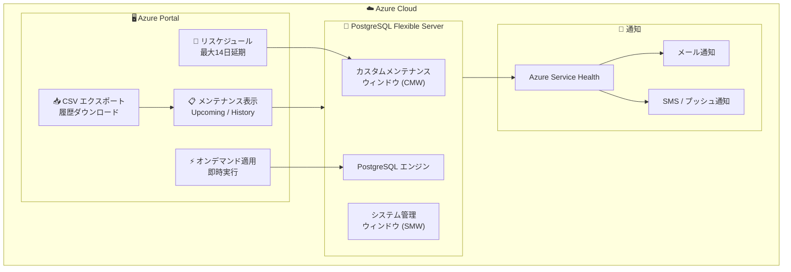

# Azure Database for PostgreSQL: メンテナンス制御機能の強化 (リスケジュール、オンデマンド適用、履歴表示・ダウンロード)

**リリース日**: 2026-06-08

**サービス**: Azure Database for PostgreSQL Flexible Server

**機能**: メンテナンス制御の強化 (Maintenance Control)

**ステータス**: Launched (GA)

[このアップデートのインフォグラフィックを見る](https://takech9203.github.io/azure-news-summary/20260608-postgresql-maintenance-control.html)

## 概要

Azure Database for PostgreSQL Flexible Server において、プラットフォームメンテナンスイベントの管理に関する強化されたメンテナンス制御機能が一般提供 (GA) となった。これにより、メンテナンスのリスケジュール、オンデマンド適用、メンテナンス履歴の表示およびダウンロードが可能になる。

従来のメンテナンス管理では、スケジュールされたメンテナンスウィンドウの設定 (システム管理またはカスタム) のみが可能であったが、今回の強化により、予定されたメンテナンスイベントに対してより細かい制御が可能になった。これにより、ビジネスクリティカルな期間への影響を最小限に抑えつつ、計画的なメンテナンス管理が実現される。

**アップデート前の課題**

- メンテナンスがスケジュールされた後に日時を変更する手段がなかった
- メンテナンスを即時適用したい場合でも、スケジュールされた時間まで待つ必要があった
- 過去のメンテナンス履歴を確認する統一的な手段がなかった
- メンテナンスの詳細情報 (種類、ステータス、開始・終了時間) を一覧で把握しにくかった

**アップデート後の改善**

- メンテナンスを最大 14 日間先まで延期可能 (リスケジュール)
- オンデマンドでメンテナンスを即時適用可能
- メンテナンス履歴を Azure Portal で確認し、CSV でダウンロード可能
- 今後のメンテナンス予定、種類、ステータス、リスケジュール可否を事前に確認可能

## アーキテクチャ図



メンテナンス制御機能は Azure Portal の「メンテナンス」ページから操作し、カスタムメンテナンスウィンドウを持つサーバーに対してリスケジュールやオンデマンド適用が可能。Azure Service Health 経由で通知を受信する。

## サービスアップデートの詳細

### 主要機能

1. **今後のメンテナンス表示 (View Upcoming Maintenance)**
   - サーバーの Overview ページの「Next Maintenance」フィールドで次回メンテナンス予定を確認
   - メンテナンスページの「Maintenance status」セクションで詳細情報を表示
   - 表示項目: スケジュール日時、メンテナンス種類、ステータス、リスケジュール可否、リスケジュール期限

2. **メンテナンスのリスケジュール (Reschedule Planned Maintenance)**
   - 予定されたメンテナンスを最大 14 日間延期可能
   - ビジネスクリティカルな期間 (ピーク時間、リリースウィンドウ、移行期間、決算期) の回避が可能
   - リスケジュールは複数回変更可能 (メンテナンスが準備状態に入る前まで)
   - リスケジュール対象のメンテナンスイベントが存在し、対象サーバーがカスタムメンテナンスウィンドウを使用している必要がある

3. **オンデマンドメンテナンス適用 (Apply Maintenance On-Demand)**
   - スケジュールされたメンテナンスを待たずに即時適用
   - ワークロードが中断を許容できるタイミングで自発的にメンテナンスを実行
   - メンテナンスが「Scheduled」または「Rescheduled」状態の場合にのみ利用可能

4. **メンテナンス履歴の表示とダウンロード (View Maintenance History)**
   - 過去のメンテナンスイベントの一覧表示
   - 各イベントの種類、開始時間、終了時間、最終ステータスを確認
   - Tracking ID による詳細確認
   - CSV エクスポートによるメンテナンス履歴のダウンロード
   - 運用レビュー、インシデント調査、監査要件への対応

## 技術仕様

| 項目 | 詳細 |
|------|------|
| 対象サービス | Azure Database for PostgreSQL Flexible Server |
| リスケジュール最大延期期間 | 14 日間 (当初予定日から) |
| リスケジュール対応コンピュートティア | General Purpose、Memory Optimized |
| リスケジュール非対応ティア | Burstable |
| リスケジュールロック期間 | メンテナンス予定時間の 15 分前から不可 |
| メンテナンスウィンドウ | 60 分間 |
| 事前通知 | 5 カレンダー日前 |
| メンテナンス最小間隔 | 通常 30 日以上 (緊急時を除く) |
| CLI / REST API サポート | 開発中 (現時点では Azure Portal のみ) |
| 停止サーバーへの適用 | サーバー再起動時に適用 (再起動時間 +5-8 分) |

## 設定方法

### 前提条件

1. Azure Database for PostgreSQL Flexible Server インスタンスが存在すること
2. リスケジュールにはカスタムメンテナンスウィンドウ (CMW) が構成されていること
3. General Purpose または Memory Optimized コンピュートティアであること (リスケジュール利用時)
4. リスケジュール対象のメンテナンスイベントが存在すること

### カスタムメンテナンスウィンドウの設定 (Azure CLI)

```bash
# カスタムスケジュールの設定 (水曜日 14:29 UTC 開始)
az postgres flexible-server update \
  --resource-group <resource_group> \
  --name <server> \
  --maintenance-window Wed:14:29

# システム管理スケジュールに戻す
az postgres flexible-server update \
  --resource-group <resource_group> \
  --name <server> \
  --maintenance-window Disabled
```

### Azure Portal でのメンテナンスリスケジュール

1. Azure Portal でサーバーに移動
2. 左メニューの「Settings」配下の「Maintenance」を選択
3. 「Maintenance status」セクションで今後のメンテナンスイベントを確認
4. 対象イベントが適格な場合、「Reschedule」を選択
5. 利用可能な日時を選択して確認

### Azure Portal でのオンデマンド適用

1. Azure Portal でサーバーの「Maintenance」ページに移動
2. 「Maintenance status」セクションで今後のメンテナンスイベントを確認
3. 「Reschedule」を選択し、続けて「Apply now」を選択
4. 確認ダイアログで「Yes - Apply Maintenance Now」を選択
5. メンテナンスステータスが InProgress に遷移し、完了後に History に移動

## メリット

### ビジネス面

- ビジネスクリティカルな期間 (決算、大規模セール、年度末処理) にメンテナンスを回避可能
- ダウンタイムのタイミングをチームのスケジュールに合わせて調整可能
- メンテナンス履歴の CSV エクスポートにより、SLA レポートや監査への対応が容易に
- 運用計画の精度が向上し、ステークホルダーへの事前連絡が可能に

### 技術面

- メンテナンスの可視性が向上し、予期しないダウンタイムのリスクを低減
- オンデマンド適用により、低負荷時間帯を選んでメンテナンスを実行可能
- デプロイパイプラインやマイグレーションとのコンフリクトを回避可能
- メンテナンス履歴により、パフォーマンス問題の原因調査が容易に

## デメリット・制約事項

- **Burstable ティアはリスケジュール非対応**: 開発・テスト環境で多用される Burstable ティアではリスケジュール機能が利用できない
- **Azure Portal のみ対応**: 現時点では CLI / REST API でのリスケジュール・オンデマンド適用はサポートされておらず、自動化が困難
- **リスケジュール上限 14 日**: メンテナンスを無期限に延期することはできず、最大 14 日間の猶予のみ
- **緊急メンテナンスは対象外**: 重大な脆弱性対応など、セキュリティやコンプライアンス上必須のメンテナンスはリスケジュール不可
- **カスタムメンテナンスウィンドウが前提**: リスケジュールにはカスタムスケジュールが構成されている必要がある
- **ロック期間**: 予定時間の 15 分前からはリスケジュール不可
- **メンテナンス中のサーバー操作禁止**: メンテナンス実行中は設定変更、起動・停止などの操作を避ける必要がある

## ユースケース

### ユースケース 1: EC サイトの大規模セール期間のメンテナンス回避

**シナリオ**: 年末のセール期間中にメンテナンスが予定された場合、ピーク期間を避けてリスケジュールする。

**手順**:
1. 5 日前の通知でメンテナンス予定を確認
2. Azure Portal の「Maintenance」ページで「Reschedule」を選択
3. セール終了後の低負荷時間帯に変更
4. メンテナンス完了後、履歴で正常終了を確認

**効果**: セール期間中のダウンタイムを回避し、売上への影響をゼロに抑える。

### ユースケース 2: 計画的リリースとの整合性確保

**シナリオ**: アプリケーションのデプロイ直後にメンテナンスが予定されている場合、デプロイの安定確認後にオンデマンドでメンテナンスを適用する。

**手順**:
1. デプロイ前にメンテナンス予定を確認
2. デプロイを実施し、安定動作を確認
3. 安定確認後、「Apply now」でメンテナンスを即時適用
4. メンテナンス完了後にアプリケーションの動作を再確認

**効果**: デプロイとメンテナンスの問題切り分けが容易になり、障害時の原因特定が迅速化。

### ユースケース 3: 監査・コンプライアンス対応

**シナリオ**: 定期監査でデータベースのメンテナンス実績を報告する必要がある。

**手順**:
1. Azure Portal の「Maintenance」ページで「Maintenance history」セクションを表示
2. 「Export to CSV」でメンテナンス履歴をダウンロード
3. 各イベントの種類、開始・終了時間、ステータスを監査レポートに記載

**効果**: メンテナンス実施証跡の提出が容易になり、監査対応工数を削減。

## 料金

メンテナンス制御機能自体に追加料金は発生しない。Azure Database for PostgreSQL Flexible Server の既存料金の範囲内で利用可能。

詳細な料金情報は以下を参照:
- [Azure Database for PostgreSQL 料金ページ](https://azure.microsoft.com/pricing/details/postgresql/flexible-server/)

## 関連サービス・機能

- **Azure Service Health**: メンテナンス通知の配信基盤。計画メンテナンスの事前通知やステータス更新を受信
- **Azure Monitor**: サーバーのパフォーマンスメトリクス監視。メンテナンス前後の性能比較に活用
- **Azure Resource Health**: サーバーの正常性状態の確認。メンテナンス中・後のリソース状態監視
- **統合メンテナンス通知 (Consolidated Maintenance Notifications)**: 同一リージョン内の複数サーバーに対するメンテナンス通知を 1 件に統合し、通知疲れを軽減

## 参考リンク

- [インフォグラフィック](https://takech9203.github.io/azure-news-summary/20260608-postgresql-maintenance-control.html)
- [公式アップデート情報](https://azure.microsoft.com/updates?id=563756)
- [Microsoft Learn - Planned Maintenance](https://learn.microsoft.com/azure/postgresql/flexible-server/concepts-maintenance)
- [Microsoft Learn - Schedule maintenance (How-to)](https://learn.microsoft.com/azure/postgresql/flexible-server/how-to-configure-scheduled-maintenance)
- [料金ページ](https://azure.microsoft.com/pricing/details/postgresql/flexible-server/)

## まとめ

Azure Database for PostgreSQL Flexible Server のメンテナンス制御機能の GA により、データベース管理者はプラットフォームメンテナンスに対してより主体的に関与できるようになった。リスケジュール (最大 14 日延期)、オンデマンド適用、履歴表示・CSV ダウンロードの 3 つの柱により、ビジネス影響の最小化と運用の可視化が実現される。

Solutions Architect として推奨されるアクションは以下の通り:

1. 本番サーバーにカスタムメンテナンスウィンドウを設定し、リスケジュール機能の利用準備を整える
2. Azure Service Health アラートを構成し、メンテナンス通知を確実に受信する体制を構築する
3. Burstable ティアでは本機能が利用できないため、本番ワークロードには General Purpose 以上のティアを選択する
4. CLI / REST API サポートの提供開始を待ち、自動化パイプラインへの組み込みを検討する

---

**タグ**: #Azure #PostgreSQL #FlexibleServer #Maintenance #GA #Database #メンテナンス制御
