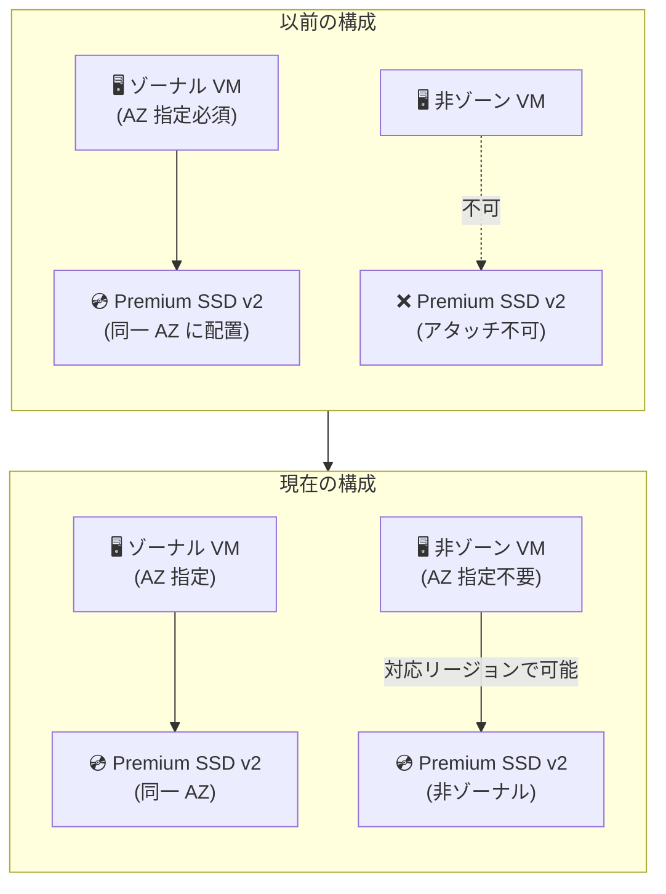

# Azure Premium SSD v2: 非ゾーン仮想マシンのサポート開始

**リリース日**: 2026-06-08

**サービス**: Azure Disk Storage

**機能**: Premium SSD v2 ディスクの非ゾーン (Non-zonal) VM サポート

**ステータス**: Launched (GA)

[このアップデートのインフォグラフィックを見る](https://takech9203.github.io/azure-news-summary/20260608-premium-ssd-v2-non-zonal-vms.html)

## 概要

Azure Premium SSD v2 ディスクが、可用性ゾーン (Availability Zones) をサポートする一部の Azure リージョンにおいて、非ゾーン (Non-zonal) のシングルインスタンス仮想マシンへのアタッチに対応した。これにより、可用性ゾーンを指定せずにデプロイされた VM でも Premium SSD v2 の高性能ストレージを利用できるようになる。

従来、Premium SSD v2 はほとんどのリージョンでゾーナル VM (特定の可用性ゾーンに配置された VM) にのみアタッチ可能であったが、今回のアップデートにより一部リージョンでこの制約が緩和された。

**アップデート前の課題**

- 可用性ゾーンをサポートするリージョンでは、Premium SSD v2 をアタッチするために VM を特定の可用性ゾーンにデプロイする必要があった
- 既存の非ゾーン VM に Premium SSD v2 を後からアタッチすることができなかった
- 可用性ゾーンの指定が不要なシンプルな単一インスタンス構成で Premium SSD v2 を使用できなかった

**アップデート後の改善**

- 対象リージョンにおいて、可用性ゾーンを指定せずに Premium SSD v2 ディスクをデプロイ・アタッチ可能になった
- 非ゾーン VM でも Premium SSD v2 の高性能 (最大 80,000 IOPS、2,000 MB/s スループット) を活用できるようになった
- デプロイの柔軟性が向上し、ゾーン指定なしのシンプルな構成でもハイパフォーマンスストレージが利用可能になった

## アーキテクチャ図



従来は Premium SSD v2 の利用にゾーナル VM が必須だったが、対応リージョンでは非ゾーン VM でも利用可能になった。Azure が内部的に可用性ゾーンを選択し、必要に応じてバックグラウンドコピーでゾーンアラインメントを実行する。

## サービスアップデートの詳細

### 主要機能

1. **非ゾーン VM への Premium SSD v2 アタッチ**
   - 可用性ゾーンを指定せずにデプロイされた単一インスタンス VM に Premium SSD v2 をアタッチ可能
   - Azure がバックエンドで適切な可用性ゾーンを自動選択

2. **バックグラウンドゾーンアラインメント**
   - 非ゾーナルデプロイ時、Azure は内部的に可用性ゾーンを選択
   - VM とディスクのゾーンが異なる場合、バックグラウンドコピーによりゾーンアラインメントを実行
   - コピーには最大 24 時間を要する可能性がある

3. **既存のパフォーマンス特性を維持**
   - 非ゾーナルデプロイでも Premium SSD v2 の全パフォーマンス仕様は変わらない
   - IOPS、スループット、容量の個別調整は引き続き可能

## 技術仕様

| 項目 | 詳細 |
|------|------|
| ディスクタイプ | Premium SSD v2 (PremiumV2_LRS) |
| 最大容量 | 1 GiB - 64 TiB |
| 最大 IOPS | 80,000 |
| 最大スループット | 2,000 MB/s |
| ベースライン IOPS (無料) | 3,000 |
| ベースラインスループット (無料) | 125 MB/s |
| レイテンシ | サブミリ秒 |
| セクターサイズ | 4K (デフォルト) / 512E |
| OS ディスクとしての利用 | 不可 |
| ホストキャッシュ | 非対応 |

## 設定方法

### 前提条件

1. 非ゾーナル Premium SSD v2 がサポートされるリージョンであること
2. Azure CLI (最新版) または Azure PowerShell (最新版)
3. Premium Storage をサポートする VM サイズ

### Azure CLI

```bash
# 変数の初期化
diskName="yourDiskName"
resourceGroupName="yourResourceGroupName"
region="yourRegionName"
logicalSectorSize=4096
vmName="yourVMName"
vmImage="Win2016Datacenter"
adminPassword="yourAdminPassword"
adminUserName="yourAdminUserName"
vmSize="Standard_D4s_v3"

# 非ゾーナル Premium SSD v2 ディスクの作成 (--zone を指定しない)
az disk create -n $diskName -g $resourceGroupName \
--size-gb 100 \
--disk-iops-read-write 5000 \
--disk-mbps-read-write 150 \
--location $region \
--sku PremiumV2_LRS \
--logical-sector-size $logicalSectorSize

# 非ゾーナル VM の作成とディスクのアタッチ
az vm create -n $vmName -g $resourceGroupName \
--image $vmImage \
--authentication-type password --admin-password $adminPassword --admin-username $adminUserName \
--size $vmSize \
--location $region \
--attach-data-disks $diskName
```

### Azure Portal

1. Azure Portal にサインインし、**ディスク** に移動して新規ディスクを作成
2. サポートされるリージョンを選択
3. **サイズの変更** からディスクタイプを **Premium SSD v2** に変更
4. **可用性ゾーン** を **インフラストラクチャ冗長は不要** に設定
5. サイズ・パフォーマンスを設定して **OK** を選択
6. デプロイ完了後、新規または既存の VM にアタッチ

## メリット

### ビジネス面

- **デプロイの簡素化**: 可用性ゾーンの選択・管理を意識せずにハイパフォーマンスストレージを利用可能
- **既存環境への適用**: 非ゾーン VM として運用中の環境でも Premium SSD v2 へのアップグレードが可能に
- **コスト効率**: Premium SSD v2 のきめ細かなパフォーマンス調整 (IOPS/スループットの独立設定) による最適化が非ゾーン構成でも利用可能

### 技術面

- **柔軟なアーキテクチャ設計**: ゾーン冗長が不要な単一インスタンス構成でもハイパフォーマンスディスクを選択可能
- **サブミリ秒レイテンシ**: 非ゾーン構成でも Premium SSD v2 の低レイテンシ性能を活用
- **パフォーマンスのダウンタイムなし調整**: 非ゾーナルディスクでも IOPS/スループットのランタイム変更が可能 (24 時間あたり最大 4 回)

## デメリット・制約事項

- **対応リージョンが限定的**: 非ゾーナルデプロイは一部のリージョンでのみサポート
- **バックグラウンドコピーの制約**: ゾーンアラインメントのためのバックグラウンドコピーに最大 24 時間かかる可能性がある
- **同時コピー制限**: 1 ディスクあたり同時に 1 つのバックグラウンドコピーのみ実行可能
- **コピー中のデタッチ/リアタッチ不可**: バックグラウンドコピー中にディスクのデタッチ・リアタッチ操作は失敗する
- **停止/割当解除 VM への制限**: 非ゾーナルディスクは実行中の非ゾーナル VM にのみアタッチすべき。停止/割当解除された VM にアタッチすると、バックグラウンドコピーの競合により VM 再起動が失敗する可能性がある
- **スナップショットからのディスク制限**: バックグラウンドコピー実行中のスナップショットから作成されたディスクは非ゾーン VM にアタッチできない
- **コピー中のサイズ変更・CMK 変更不可**: バックグラウンドコピー中はディスクサイズの増加やカスタマーマネージドキーの変更ができない
- **OS ディスクとしての使用不可**: Premium SSD v2 は引き続きデータディスクとしてのみ利用可能

## ユースケース

### ユースケース 1: 開発・テスト環境の高性能化

**シナリオ**: 開発チームが非ゾーン VM で構成されたテスト環境を運用しており、本番相当のストレージパフォーマンスでテストしたい

**効果**: 可用性ゾーンを意識せずに Premium SSD v2 をアタッチし、本番同等の IOPS/スループットでパフォーマンステストが可能

### ユースケース 2: 単一インスタンスのデータベースサーバー

**シナリオ**: 高可用性が不要だが高い I/O パフォーマンスが求められるデータベース (小規模な SQL Server、MongoDB など) を単一 VM で運用

**効果**: ゾーン冗長のオーバーヘッドなしに Premium SSD v2 の最大 80,000 IOPS を活用可能

### ユースケース 3: 既存非ゾーン VM のストレージアップグレード

**シナリオ**: 非ゾーン VM として運用中のワークロードで、Premium SSD のパフォーマンスが不足している

**効果**: VM を再作成せずに Premium SSD v2 データディスクを追加し、パフォーマンスを向上

## 料金

Premium SSD v2 の料金体系は以下の 3 つの要素で構成される (非ゾーナルデプロイでも同一の料金体系が適用される)。

| 課金要素 | ベースライン (無料枠) | 追加課金 |
|---------|---------------------|---------|
| 容量 | なし (1 GiB から課金) | GiB 単位で課金 |
| IOPS | 3,000 IOPS (無料) | 3,000 超過分に対して課金 |
| スループット | 125 MB/s (無料) | 125 MB/s 超過分に対して課金 |

詳細な料金は [Azure Managed Disks の料金ページ](https://azure.microsoft.com/pricing/details/managed-disks/) を参照。

## 利用可能リージョン

非ゾーナル Premium SSD v2 デプロイがサポートされるリージョン (可用性ゾーン対応リージョン):

- Brazil South
- East Asia
- Germany West Central

上記は Microsoft Learn ドキュメント (2026-06-05 更新) で確認されたリージョン。今回のアップデートにより対応リージョンが追加されている可能性がある。最新の対応リージョンは `az vm list-skus` コマンドまたは公式ドキュメントで確認することを推奨する。

また、可用性ゾーンのないリージョンでは従来から非ゾーナルデプロイが可能:

- Australia Central 2、Australia Southeast、Brazil Southeast、Canada East、Germany North、North Central US、Norway West、South India、Switzerland West、Taiwan North、UK West、US Gov Arizona、West Central US、West US

## 関連サービス・機能

- **Azure Virtual Machines**: Premium SSD v2 のアタッチ先となる仮想マシンサービス
- **Azure Managed Disks**: Premium SSD v2 を含むマネージドディスクの管理基盤
- **可用性ゾーン (Availability Zones)**: リージョン内の物理的に分離されたデータセンター群。今回のアップデートはゾーン指定不要の構成を可能にした
- **Ultra Disks**: Premium SSD v2 より高性能 (最大 400,000 IOPS) だが、同様にゾーン制約がある上位ティア
- **Premium SSD**: 従来型の Premium ディスク。固定サイズベースの IOPS/スループット設定

## 参考リンク

- [インフォグラフィック](https://takech9203.github.io/azure-news-summary/20260608-premium-ssd-v2-non-zonal-vms.html)
- [公式アップデート情報](https://azure.microsoft.com/updates?id=565359)
- [Microsoft Learn - Azure ディスクタイプの選択](https://learn.microsoft.com/azure/virtual-machines/disks-types#premium-ssd-v2)
- [Microsoft Learn - Premium SSD v2 のデプロイ](https://learn.microsoft.com/azure/virtual-machines/disks-deploy-premium-v2)
- [料金ページ - Azure Managed Disks](https://azure.microsoft.com/pricing/details/managed-disks/)

## まとめ

今回のアップデートにより、Azure Premium SSD v2 ディスクが非ゾーン (Non-zonal) VM でも利用可能になった。これは、可用性ゾーンの選択を必要としないシンプルな単一インスタンス構成でも Premium SSD v2 のハイパフォーマンス (最大 80,000 IOPS、2,000 MB/s) を活用できることを意味する。

ただし、バックグラウンドコピーによるゾーンアラインメントの制約事項 (最大 24 時間のコピー時間、コピー中の操作制限) を理解した上で運用設計を行う必要がある。対応リージョンは限定的であるため、利用前にリージョンのサポート状況を確認することを推奨する。

既存の非ゾーン VM を運用中で Premium SSD v2 のパフォーマンスが必要な場合、VM の再作成なしにデータディスクとして追加できるため、移行コストを抑えたストレージアップグレードが可能である。

---

**タグ**: `Azure Disk Storage` `Premium SSD v2` `Managed Disks` `非ゾーン VM` `パフォーマンス` `GA`
