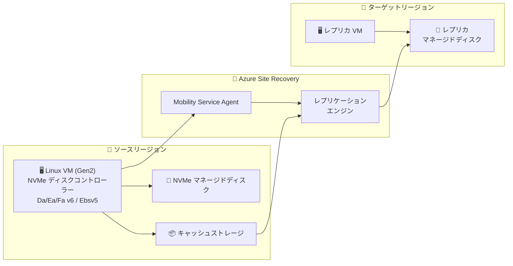

# Azure Site Recovery: Linux VM の NVMe ディスクコントローラーサポート

**リリース日**: 2026-06-08

**サービス**: Azure Site Recovery

**機能**: Linux Azure VM の NVMe ディスクコントローラー対応レプリケーション

**ステータス**: In preview

[このアップデートのインフォグラフィックを見る](https://takech9203.github.io/azure-news-summary/20260608-site-recovery-linux-nvme.html)

## 概要

Azure Site Recovery が、NVMe 対応の第 2 世代 (Gen2) VM ファミリーで稼働する Linux Azure Virtual Machines のレプリケーションおよびディザスターリカバリーをサポートするようになった。対象となる VM ファミリーは Da/Ea/Fa v6 シリーズ、Ebsv5/Ebdsv5 などの NVMe インターフェースを使用する VM で、Azure-to-Azure のシナリオに限定される。

これまで NVMe ディスクコントローラーを使用する Linux VM は Azure Site Recovery のレプリケーション対象外であったが、本パブリックプレビューにより、最新の高性能 VM ファミリーを使用しながらもディザスターリカバリー (DR) を構成できるようになった。

**アップデート前の課題**

- NVMe ディスクコントローラーを使用する Linux VM では Azure Site Recovery によるレプリケーションが非対応だった
- 高性能な v6 シリーズ VM を採用する場合、DR 戦略の選択肢が限られていた
- NVMe 対応 VM への移行を検討する際、DR の非対応がブロッカーとなっていた

**アップデート後の改善**

- NVMe 対応 Gen2 Linux VM で Azure Site Recovery によるレプリケーションが可能に
- Da/Ea/Fa v6 シリーズ、Ebsv5/Ebdsv5 を使用しつつ、リージョン間 DR を構成可能
- 高性能な NVMe ストレージの恩恵を受けながら、事業継続性を確保

## アーキテクチャ図

Azure Site Recovery の Mobility Service Agent がソース VM 上で動作し、NVMe ディスクの変更データをキャッシュストレージ経由でターゲットリージョンのレプリカディスクにレプリケーションする。

## サービスアップデートの詳細

### 主要機能

1. **NVMe ディスクコントローラー対応レプリケーション**
   - NVMe インターフェースを使用する Gen2 Linux VM のディスクレプリケーションをサポート
   - Azure-to-Azure シナリオでのリージョン間ディザスターリカバリーが可能

2. **対応 VM ファミリー**
   - Da v6 シリーズ (汎用)
   - Ea v6 シリーズ (メモリ最適化)
   - Fa v6 シリーズ (コンピューティング最適化)
   - Ebsv5 / Ebdsv5 (メモリ最適化、ストレージ最適化)
   - その他 NVMe インターフェースを使用する Gen2 VM ファミリー

3. **対応 Linux ディストリビューション**
   - Red Hat Enterprise Linux (RHEL) 9
   - SUSE Linux Enterprise Server (SLES) 15
   - Ubuntu 24

## 技術仕様

| 項目 | 詳細 |
|------|------|
| ステータス | パブリックプレビュー |
| 対象シナリオ | Azure-to-Azure レプリケーション |
| VM 世代 | Generation 2 (UEFI ブート) のみ |
| ディスクコントローラー | NVMe |
| 対応 VM ファミリー | Da/Ea/Fa v6 シリーズ、Ebsv5/Ebdsv5 |
| 対応 Linux OS | RHEL 9、SLES 15、Ubuntu 24 |
| エフェメラル OS ディスク | 非対応 |
| ローカル NVMe ディスク | 非対応 |
| 混合コントローラー VM (SCSI + NVMe) | 非対応 (例: Lsv3) |

## メリット

### ビジネス面

- 最新の高性能 VM ファミリーを採用しつつ、DR 要件を満たすことが可能
- NVMe 対応 VM への移行時に DR 非対応によるブロッカーが解消される
- 事業継続計画 (BCP) のカバー範囲が拡大

### 技術面

- NVMe の高 IOPS・高スループットを活かしたワークロードで DR を構成可能
- Azure Boost との組み合わせにより、ストレージ性能とレジリエンスの両立が実現
- v6 シリーズ VM で SCSI から NVMe への移行を DR の心配なく実施可能

## デメリット・制約事項

- **パブリックプレビュー段階**: SLA は提供されない。本番環境での使用には注意が必要
- **Azure-to-Azure シナリオのみ**: オンプレミスから Azure へのレプリケーションは対象外
- **Linux のみ**: 本アップデートは Linux VM が対象 (Windows の NVMe 対応は別途確認が必要)
- **対応 OS が限定的**: RHEL 9、SLES 15、Ubuntu 24 のみサポート
- **エフェメラル OS ディスク非対応**: エフェメラル OS ディスクを使用する構成ではレプリケーション不可
- **ローカル NVMe ディスク非対応**: 一時ストレージ用のローカル NVMe ディスクはレプリケーション対象外
- **混合コントローラー (SCSI + NVMe) 非対応**: Lsv3 などの混合構成 VM SKU はサポートされない
- **Gen2 VM 限定**: Generation 1 VM は NVMe 自体をサポートしないため対象外

## ユースケース

### ユースケース 1: v6 シリーズ VM への移行と DR 構成

**シナリオ**: 旧世代 (v5) の SCSI ベース VM から、高性能な Da/Ea/Fa v6 シリーズ NVMe VM への移行を計画しているが、DR の継続性が必要。

**効果**: 移行後も Azure Site Recovery による Azure-to-Azure DR を維持でき、性能向上と事業継続性を両立。

### ユースケース 2: 高 I/O データベースワークロードの保護

**シナリオ**: RHEL 9 上で稼働するデータベースサーバーが Ebsv5 VM で NVMe ストレージを活用しており、リージョン障害時のフェイルオーバーが必要。

**効果**: NVMe の高スループットを活かしたデータベースワークロードに対して、リージョン間のレプリケーションと自動フェイルオーバーを構成可能。

### ユースケース 3: コンプライアンス要件への対応

**シナリオ**: 規制要件により、全ての本番 VM にリージョン間 DR を構成する必要があり、新規採用した v6 シリーズ VM も対象。

**効果**: 最新 VM ファミリーを含む全ての本番環境で DR 要件を満たすことが可能に。

## 料金

Azure Site Recovery の料金は、保護対象のインスタンスごとに課金される。NVMe 対応 VM であっても、既存の Azure Site Recovery 料金体系が適用される。

詳細は [Azure Site Recovery 料金ページ](https://azure.microsoft.com/pricing/details/site-recovery/) を参照。

## 利用可能リージョン

Azure Site Recovery がサポートする全ての Azure リージョン間での Azure-to-Azure レプリケーションが対象。具体的なリージョンの制限については [Azure Site Recovery サポートマトリックス](https://learn.microsoft.com/azure/site-recovery/azure-to-azure-support-matrix#region-support) を参照。

## 関連サービス・機能

- **Azure Boost**: NVMe VM のストレージ処理をハードウェアにオフロードし、高スループットを実現する基盤技術
- **Azure Managed Disks**: NVMe インターフェースを介してアクセスされるマネージドディスク
- **Azure Site Recovery (Windows NVMe)**: Windows VM 向けの NVMe サポートは既に提供中
- **Recovery Services Vault**: レプリケーション構成やリカバリーポイントを管理するコンテナー

## 参考リンク

- [インフォグラフィック](https://takech9203.github.io/azure-news-summary/20260608-site-recovery-linux-nvme.html)
- [公式アップデート情報](https://azure.microsoft.com/updates?id=565103)
- [Azure Site Recovery サポートマトリックス (Azure-to-Azure)](https://learn.microsoft.com/azure/site-recovery/azure-to-azure-support-matrix)
- [NVMe Overview - Azure Virtual Machines](https://learn.microsoft.com/azure/virtual-machines/nvme-overview)
- [Azure Site Recovery 料金](https://azure.microsoft.com/pricing/details/site-recovery/)

## まとめ

本アップデートにより、NVMe ディスクコントローラーを使用する Linux Gen2 VM (Da/Ea/Fa v6 シリーズ、Ebsv5/Ebdsv5) で Azure Site Recovery によるリージョン間 DR が構成可能になった。対応 OS は RHEL 9、SLES 15、Ubuntu 24 に限定されるが、最新の高性能 VM ファミリーを採用する組織にとって、DR 戦略のギャップを埋める重要なアップデートである。

パブリックプレビュー段階のため、本番利用前にはテスト環境での十分な検証を推奨する。エフェメラル OS ディスクやローカル NVMe ディスク、混合コントローラー VM は非対応であることに注意が必要。今後の GA に向けた対応 OS の拡大やゾーン間 DR サポートの動向にも注目したい。

---

**タグ**: #AzureSiteRecovery #NVMe #DisasterRecovery #Linux #Gen2VM #Preview #BCDR
