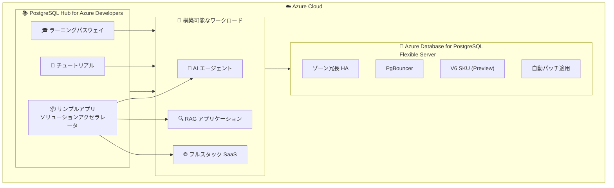

# Azure Database for PostgreSQL: PostgreSQL Hub for Azure Developers

**リリース日**: 2026-06-09

**サービス**: Azure Database for PostgreSQL

**機能**: PostgreSQL Hub for Azure Developers

**ステータス**: Launched (GA)

[このアップデートのインフォグラフィックを見る](https://takech9203.github.io/azure-news-summary/20260609-postgresql-hub-azure-developers.html)

## 概要

PostgreSQL Hub for Azure Developers が一般提供 (GA) となった。これは Azure 上の PostgreSQL に関する AI およびアプリケーション開発リソースを一元的に集約した開発者向けハブである。新しいデータベース機能ではなく、開発者が Azure Database for PostgreSQL を活用したアプリケーションを効率的に構築するためのリソースポータルとなる。

本ハブでは、キュレーションされたサンプルアプリやソリューションアクセラレータ、チュートリアル、体系化されたラーニングパスウェイを提供する。AI エージェント、RAG (Retrieval-Augmented Generation) アプリケーション、フルスタック SaaS ソリューションなど、多様なワークロードの構築を支援する。

**アップデート前の課題**

- Azure Database for PostgreSQL に関する AI 開発リソースが各所に分散しており、適切な情報を見つけるのに時間がかかった
- RAG アプリケーションや AI エージェント構築のためのサンプルコードやベストプラクティスが体系化されていなかった
- 初学者から上級者まで段階的に学習するための統一されたラーニングパスが存在しなかった
- ソリューションアクセラレータが散在しており、プロジェクト開始時の参考実装を探す負担が大きかった

**アップデート後の改善**

- AI およびアプリケーション開発リソースが一箇所に集約され、必要な情報への迅速なアクセスが可能に
- キュレーションされたサンプルアプリとソリューションアクセラレータにより、開発の迅速な開始が可能に
- 体系化されたラーニングパスウェイにより、段階的なスキルアップが実現
- AI エージェント、RAG、SaaS など用途別のガイダンスが整備

## アーキテクチャ図

PostgreSQL Hub for Azure Developers は開発者向けリソースの集約ポータルであり、サンプルアプリ・チュートリアル・ラーニングパスを通じて、Azure Database for PostgreSQL Flexible Server 上に AI エージェントや RAG アプリケーション、SaaS ソリューションを構築する際のガイダンスを提供する。

## サービスアップデートの詳細

### 主要機能

1. **キュレーションされたサンプルアプリとソリューションアクセラレータ**
   - AI エージェント、RAG アプリケーション、フルスタック SaaS ソリューションなどの実装例を提供
   - プロジェクトの迅速な立ち上げを支援するテンプレートとして活用可能

2. **チュートリアル**
   - Azure Database for PostgreSQL を活用した AI およびアプリケーション開発の手順を段階的にガイド
   - 実際のシナリオに基づいた実践的な内容

3. **体系化されたラーニングパスウェイ**
   - 初学者から上級者まで、スキルレベルに応じた学習経路を提供
   - AI 開発、アプリケーション構築など目的別のパスを用意

## 技術仕様

| 項目 | 詳細 |
|------|------|
| 対象基盤 | Azure Database for PostgreSQL Flexible Server |
| 対応ワークロード | AI エージェント、RAG アプリケーション、フルスタック SaaS |
| HA | ゾーン冗長高可用性対応 |
| 接続プーリング | PgBouncer 組み込み |
| コンピュート | V6 SKU ファミリー (Preview) |
| メンテナンス | 自動パッチ適用 |
| グローバル展開 | 60 以上のリージョンで利用可能 |

## 設定方法

### Azure Portal

1. Azure Portal にアクセス
2. Azure Database for PostgreSQL のサービスページに移動
3. PostgreSQL Hub for Azure Developers セクションを参照
4. 目的に応じたサンプルアプリ、チュートリアル、ラーニングパスを選択

### 前提条件

1. Azure サブスクリプション
2. AI/RAG アプリケーションを構築する場合は Azure Database for PostgreSQL Flexible Server インスタンス

## メリット

### ビジネス面

- 開発者のオンボーディング時間を短縮し、プロジェクトの立ち上げを迅速化
- ソリューションアクセラレータにより、POC から本番環境への移行を効率化
- AI 活用アプリケーションの構築に関する参入障壁を低減

### 技術面

- ベストプラクティスに基づいたサンプルコードにより、品質の高い実装を促進
- RAG パターンや AI エージェント構築の実装パターンを参照可能
- Azure Database for PostgreSQL の各機能 (ゾーン冗長 HA、PgBouncer、V6 SKU) を活用した設計パターンを学習可能

## デメリット・制約事項

- 開発者リソースハブであり、新しいデータベース機能やサービス機能ではない
- サンプルアプリの対応言語・フレームワークは限定される可能性がある
- ラーニングコンテンツは英語中心で提供される可能性がある
- サンプルアプリの更新頻度やメンテナンス状況は Microsoft の方針に依存する

## ユースケース

### ユースケース 1: RAG アプリケーションの構築

**シナリオ**: 社内ドキュメントを対象とした RAG (Retrieval-Augmented Generation) アプリケーションを Azure Database for PostgreSQL 上に構築する。

**手順**:
1. PostgreSQL Hub から RAG アプリケーションのサンプルを選択
2. ソリューションアクセラレータをベースにプロジェクトを開始
3. pgvector 拡張を利用したベクトル検索の実装パターンを参照
4. 本番環境への展開手順をチュートリアルに従って実施

**効果**: ゼロからの設計・実装に比べて開発期間を大幅に短縮し、ベストプラクティスに準拠した実装を実現。

### ユースケース 2: AI エージェントの開発

**シナリオ**: Azure Database for PostgreSQL をバックエンドとした AI エージェントを開発する。

**手順**:
1. PostgreSQL Hub から AI エージェントのサンプルアプリを参照
2. ラーニングパスウェイに沿って基礎知識を習得
3. サンプルコードをカスタマイズしてエージェントを構築
4. Flexible Server のゾーン冗長 HA を活用して本番環境を構成

**効果**: AI エージェント構築のパターンを迅速に理解し、PostgreSQL の強みを活かした実装が可能。

### ユースケース 3: フルスタック SaaS ソリューションの構築

**シナリオ**: マルチテナント SaaS アプリケーションを Azure Database for PostgreSQL 上に構築する。

**手順**:
1. PostgreSQL Hub から SaaS ソリューションアクセラレータを選択
2. マルチテナントアーキテクチャのパターンを学習
3. PgBouncer を活用した接続管理の実装を参照
4. スケーラブルな設計パターンをプロジェクトに適用

**効果**: SaaS に適したデータベース設計のベストプラクティスを適用し、スケーラブルなアプリケーションを構築。

## 料金

PostgreSQL Hub for Azure Developers は Azure Database for PostgreSQL の一部として追加料金なしで利用可能な開発者リソースポータルである。サンプルアプリやチュートリアルの参照自体に費用は発生しない。

実際にアプリケーションを構築・デプロイする場合は、Azure Database for PostgreSQL Flexible Server の通常料金が適用される。

## 利用可能リージョン

PostgreSQL Hub for Azure Developers はポータル/ドキュメントリソースであり、グローバルに利用可能。Azure Database for PostgreSQL Flexible Server 自体は 60 以上のリージョンで利用可能。

## 関連サービス・機能

- **Azure Database for PostgreSQL Flexible Server**: 本ハブのリソースが対象とする基盤データベースサービス。ゾーン冗長 HA、自動パッチ、PgBouncer を標準搭載
- **Azure AI Services**: RAG アプリケーションや AI エージェント構築時に連携する AI サービス群
- **pgvector 拡張**: PostgreSQL 上でのベクトル検索を実現する拡張。RAG アプリケーションの中核コンポーネント
- **Azure Kubernetes Service (AKS)**: フルスタック SaaS ソリューションのホスティング基盤として連携

## 参考リンク

- [インフォグラフィック](https://takech9203.github.io/azure-news-summary/20260609-postgresql-hub-azure-developers.html)
- [公式アップデート情報](https://azure.microsoft.com/updates?id=562084)
- [Azure Database for PostgreSQL 料金ページ](https://azure.microsoft.com/pricing/details/postgresql/flexible-server/)

## まとめ

PostgreSQL Hub for Azure Developers の GA により、Azure Database for PostgreSQL を活用した AI アプリケーションや SaaS ソリューションの構築がより容易になった。本ハブは新しいデータベース機能ではなく、開発者がプロジェクトを迅速に開始し、ベストプラクティスに基づいた実装を行うためのリソース集約ポータルである。

Solutions Architect として推奨されるアクションは以下の通り:

1. PostgreSQL Hub を確認し、自チームの開発プロジェクトに活用できるサンプルアプリやアクセラレータを特定する
2. AI エージェントや RAG アプリケーションの構築を検討している場合、ラーニングパスウェイを活用してチームのスキルアップを図る
3. 新規プロジェクト開始時にはソリューションアクセラレータをベースとすることで、開発期間の短縮と品質の確保を両立する

---

**タグ**: #Azure #PostgreSQL #FlexibleServer #DeveloperHub #AI #RAG #SaaS #GA #開発者リソース
