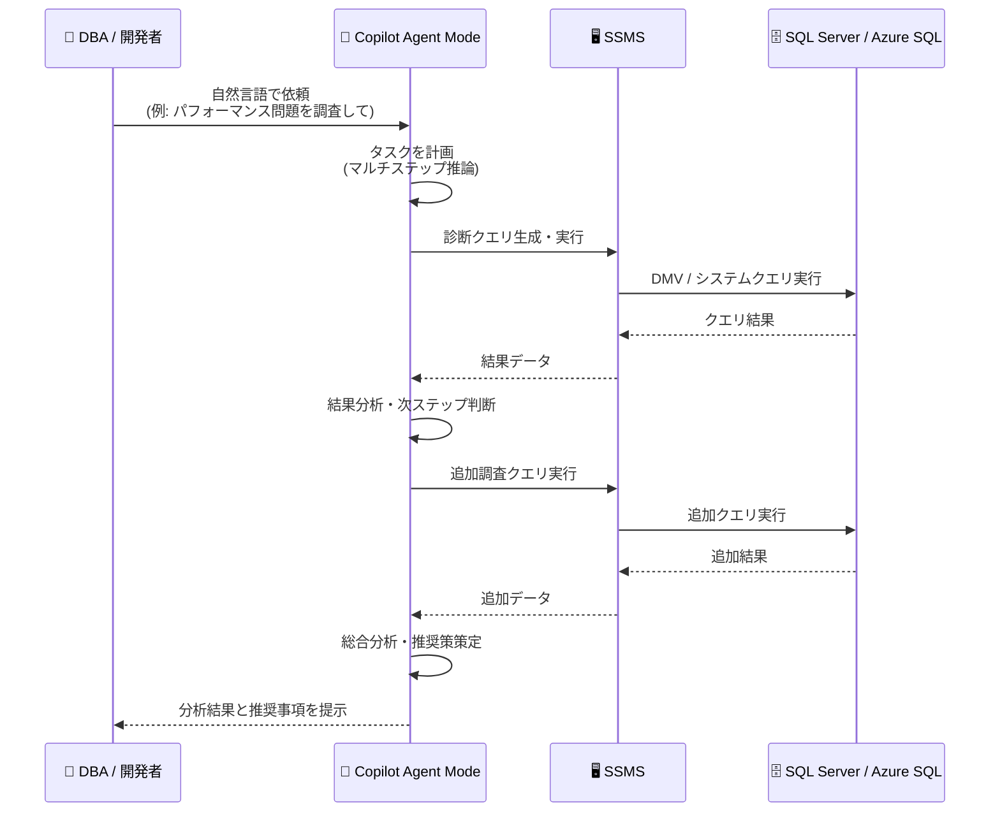

# SQL Server Management Studio: GitHub Copilot Agent Mode

**リリース日**: 2026-06-09

**サービス**: SQL Server Management Studio (SSMS)

**機能**: Agent mode for GitHub Copilot in SSMS

**ステータス**: In preview

[このアップデートのインフォグラフィックを見る](https://takech9203.github.io/azure-news-summary/20260609-ssms-copilot-agent-mode.html)

## 概要

SQL Server Management Studio (SSMS) の GitHub Copilot に Agent mode (エージェントモード) がパブリックプレビューとして追加された。Agent mode は、データベースに対して自律的にマルチステップの推論を行い、複雑なタスクを遂行する新しい対話モードである。

従来の GitHub Copilot in SSMS では、Chat (Ask mode) による単発の質問応答や、Code Completions によるコード補完、Next Edit Suggestions による編集提案が提供されていた。Agent mode はこれらとは異なり、ユーザーの要求に対して複数のステップを自律的に計画・実行し、データベースの調査から推奨事項の提示まで一貫して対応する。パフォーマンス問題の調査、クエリチューニング、メンテナンスおよび構成のレビュー、セキュリティ上の懸念の特定、エラーのトラブルシューティング、運用タスクの支援が主なユースケースとなる。

**アップデート前の課題**

- Chat (Ask mode) では単発の質問に対する応答のみで、複雑な調査タスクには複数回の手動プロンプトが必要だった
- パフォーマンス問題の調査は、DBA が複数の DMV クエリを手動で実行し、結果を自分で分析する必要があった
- セキュリティ監査やメンテナンスレビューは、チェックリストに沿って個別に確認する手間がかかった
- エラーのトラブルシューティングでは、原因の特定から解決策の提示まで段階的な作業を手動で行う必要があった

**アップデート後の改善**

- Agent mode により、複雑なタスクを自然言語で依頼するだけで、自律的にマルチステップの推論・実行が可能に
- パフォーマンス調査では、問題の特定から原因分析、チューニング推奨まで一連のフローを自動的に実施
- セキュリティレビューやメンテナンス確認を包括的に実行し、結果と推奨事項を提示
- エラー発生時の根本原因分析と解決策の提案を一貫して実施

## アーキテクチャ図



Agent mode は、ユーザーの自然言語による依頼を受けて自律的にタスクを計画し、SQL Server に対する診断クエリの生成・実行・結果分析を繰り返し行い、最終的な分析結果と推奨事項をユーザーに提示する。従来の Ask mode が単一の質問応答であるのに対し、Agent mode はマルチステップの自律的推論により複雑なタスクを完遂する。

## サービスアップデートの詳細

### 主要機能

1. **パフォーマンス問題の調査 (Performance Investigation)**
   - 待機統計、リソース使用率、ブロッキングチェーンなどを自律的に調査
   - 問題の根本原因を特定し、改善策を提案

2. **クエリチューニング (Query Tuning)**
   - 実行プランの分析、インデックスの推奨、クエリの書き換え提案
   - 既存の `/optimize` スラッシュコマンドを超えた包括的なチューニング支援

3. **メンテナンスおよび構成のレビュー (Maintenance & Configuration Review)**
   - インデックスの断片化、統計情報の鮮度、データベース設定の最適性を確認
   - メンテナンスプランの改善提案

4. **セキュリティ上の懸念の特定 (Security Concerns)**
   - 権限設定の監査、脆弱な構成の検出
   - セキュリティベストプラクティスへの準拠状況を確認

5. **エラーのトラブルシューティング (Error Troubleshooting)**
   - エラーメッセージからの根本原因分析
   - 解決手順の自動生成と実施支援

6. **運用タスクの支援 (Operational Assistance)**
   - 日常的な管理タスクの支援
   - 構成変更の影響分析

### Agent mode と Ask mode の違い

| 項目 | Ask mode (従来) | Agent mode (新規) |
|------|----------------|------------------|
| 推論方式 | 単一ステップの質問応答 | マルチステップの自律的推論 |
| タスク実行 | ユーザーが各ステップを指示 | Agent が自律的に計画・実行 |
| クエリ実行 | 読み取り専用クエリのみ (分類システムで制御) | 複数のクエリを連続的に実行し調査 |
| 対象タスク | 個別の質問、コード生成 | 複雑な調査、分析、最適化タスク |
| コンテキスト | 単一の応答内で完結 | 複数のステップにわたりコンテキストを維持 |

## 技術仕様

| 項目 | 詳細 |
|------|------|
| 対象ツール | SQL Server Management Studio 22 |
| ステータス | パブリックプレビュー |
| 必要なワークロード | AI Assistance (Visual Studio Installer で追加) |
| 対応データベース | SQL Server、Azure SQL Database、Azure SQL Managed Instance、Azure Synapse Analytics |
| GitHub Copilot | GitHub Copilot サブスクリプション (Free、Pro、Business、Enterprise) が必要 |
| セキュリティモデル | ユーザーのログインと権限のコンテキストで実行 |

## 設定方法

### 前提条件

1. SQL Server Management Studio 22 以降をインストール (最新版推奨)
2. Visual Studio Installer で「AI Assistance」ワークロードを追加
3. GitHub アカウントで GitHub Copilot サブスクリプションを有効化 (Copilot Free でも利用可能)
4. SSMS で GitHub Copilot にサインイン

### 利用開始手順

1. SSMS を起動し、対象のサーバーまたはデータベースに接続
2. 右上の **GitHub Copilot** バッジをクリック
3. **Open Chat Window to Sign In** を選択してサインイン
4. Chat ウィンドウで Agent mode を選択して利用開始

## メリット

### ビジネス面

- DBA の調査・分析作業の大幅な効率化により、運用コストを削減
- パフォーマンス問題の迅速な解決による SLA 改善とダウンタイム短縮
- セキュリティ監査の自動化により、コンプライアンス対応の負担を軽減

### 技術面

- 複雑な調査タスクを自然言語で依頼可能 (専門的な DMV 知識が不要)
- マルチステップ推論により、人間が見落としがちな関連要因も自動的に調査
- 実行プラン分析からインデックス推奨まで一貫したチューニングフロー
- データベースの接続コンテキストとスキーマ理解に基づく的確な回答

## デメリット・制約事項

- パブリックプレビュー段階のため、本番環境での利用には注意が必要
- Agent mode が実行するクエリはユーザーの権限で実行されるため、適切な権限管理が前提
- セキュリティ境界は SQL Server の権限制御であり、Copilot の分類システムではない (最小権限の原則で制御すべき)
- AI による推奨事項は参考情報であり、重要な変更は人間のレビューが必要
- GitHub Copilot サブスクリプションが必要 (追加コスト)

## ユースケース

### ユースケース 1: パフォーマンス問題の調査

**シナリオ**: 本番データベースで応答時間が悪化したとの報告があり、DBA が原因を調査する必要がある。

**Agent mode への依頼例**:
```
このデータベースのパフォーマンス問題を調査してください。
応答時間が遅くなっている原因を特定し、改善策を提案してください。
```

**効果**: Agent mode が待機統計、ブロッキング、リソース使用率、最もコストの高いクエリなどを自律的に調査し、根本原因と推奨アクションを一括で提示。従来は複数の DMV クエリを手動で実行していた作業が自動化される。

### ユースケース 2: セキュリティ監査

**シナリオ**: 定期的なセキュリティレビューとして、データベースの権限設定と構成を確認する。

**Agent mode への依頼例**:
```
このデータベースのセキュリティ状態をレビューしてください。
過剰な権限、脆弱な構成、ベストプラクティスからの逸脱を報告してください。
```

**効果**: 権限の過剰付与、orphaned users、暗号化設定、監査構成などを包括的にチェックし、リスクと改善策を提示。

### ユースケース 3: クエリの最適化

**シナリオ**: 特定のストアドプロシージャが遅く、チューニングが必要。

**Agent mode への依頼例**:
```
このストアドプロシージャのパフォーマンスを分析し、最適化してください。
```

**効果**: 実行プランの取得・分析、Missing Index の確認、統計情報の鮮度チェック、書き換え候補の提案まで自律的に実施。

## 料金

Agent mode は GitHub Copilot サブスクリプションの一部として提供される。

| プラン | 料金 |
|--------|------|
| GitHub Copilot Free | 無料 (月間リクエスト数に制限あり) |
| GitHub Copilot Pro | 月額 $10/ユーザー |
| GitHub Copilot Business | 月額 $19/ユーザー |
| GitHub Copilot Enterprise | 月額 $39/ユーザー |

SSMS 自体は無料でダウンロード・使用可能。GitHub Copilot Free プランでも基本的な利用が可能だが、月間のリクエスト数に制限がある。

## 関連サービス・機能

- **GitHub Copilot Chat in SSMS**: Agent mode の基盤となる既存のチャット機能。Ask mode で単発の質問応答を提供
- **GitHub Copilot Code Completions**: エディター内でのリアルタイムコード補完 (Agent mode とは独立した機能)
- **Query Hint Recommendation Tool**: SSMS 22 で GA となったクエリヒント推奨ツール。Agent mode と補完的に利用可能
- **Azure SQL Database**: Agent mode がサポートする対象データベースの一つ。クラウド環境での利用が可能
- **Database Instructions**: データベースにビジネスルールやコンテキストを保存し、Copilot の精度を向上させる機能

## 参考リンク

- [インフォグラフィック](https://takech9203.github.io/azure-news-summary/20260609-ssms-copilot-agent-mode.html)
- [公式アップデート情報](https://azure.microsoft.com/updates?id=562637)
- [Microsoft Learn - Get Started with GitHub Copilot in SSMS](https://learn.microsoft.com/ssms/github-copilot/get-started)
- [Microsoft Learn - GitHub Copilot Chat in SSMS](https://learn.microsoft.com/ssms/github-copilot/chat)
- [SSMS 22 リリースノート](https://learn.microsoft.com/ssms/release-notes-22)
- [SSMS ダウンロード](https://aka.ms/ssms/22/release/vs_SSMS.exe)

## まとめ

GitHub Copilot in SSMS の Agent mode は、DBA やデータベース開発者にとって大きな生産性向上をもたらす機能である。従来の単発の質問応答 (Ask mode) から、自律的にマルチステップの推論を行い複雑なタスクを遂行する Agent mode への進化により、パフォーマンス調査、セキュリティ監査、クエリチューニングなどの高度なタスクを自然言語で依頼するだけで実行可能となる。

**推奨される次のアクション:**
- SSMS 22 の最新版にアップデートし、AI Assistance ワークロードを追加
- GitHub Copilot サブスクリプション (Free でも可) を有効化
- 開発・検証環境で Agent mode を試用し、パフォーマンス調査やセキュリティレビューのワークフローに組み込み可能か評価
- 本番環境での利用は GA 後を推奨 (プレビュー段階では検証用途に限定)

---

**タグ**: #SSMS #GitHubCopilot #AgentMode #AI #SQLServer #AzureSQL #DBA #パフォーマンスチューニング #セキュリティ #Preview
