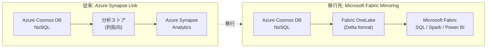

# Azure Cosmos DB: Azure Synapse Link for NoSQL のリタイア

**リリース日**: 2026-06-10

**サービス**: Azure Cosmos DB / Azure Synapse Analytics

**機能**: Azure Synapse Link for Azure Cosmos DB NoSQL のリタイア

**ステータス**: Retirement

[このアップデートのインフォグラフィックを見る](https://takech9203.github.io/azure-news-summary/20260610-cosmosdb-synapse-link-retirement.html)

## 概要

Microsoft は Azure Synapse Link for Azure Cosmos DB NoSQL のリタイア (廃止) を正式に発表した。2026 年 3 月 31 日以降、新規の Azure Cosmos DB NoSQL アカウントでは Azure Synapse Link を有効化できなくなっている。既存ユーザーは 2029 年 3 月 31 日まで完全にサポートされるが、その日をもって Azure Synapse Link は End of Life (EOL) を迎える。

後継ソリューションとして、Microsoft は **Microsoft Fabric の Azure Cosmos DB ミラーリング** への移行を推奨している。Fabric ミラーリングは Synapse Link と同様のゼロ ETL によるリアルタイム分析機能を提供しつつ、Microsoft Fabric エコシステムと完全に統合されている。

**アップデート前の状況**

- Azure Synapse Link は Cosmos DB の運用データに対するリアルタイム分析 (HTAP) の主要ソリューションだった
- 分析ストア (列指向ストア) を介して Azure Synapse Analytics から直接クエリが可能だった
- 新規プロジェクトでも従来通り有効化できた

**アップデート後の変更**

- 2026 年 3 月 31 日以降: 新規アカウントでの Synapse Link 有効化が不可
- 2029 年 3 月 31 日: 既存ユーザーを含む完全な EOL
- 後継: Microsoft Fabric の Cosmos DB ミラーリング (GA 済み) への移行を推奨

## アーキテクチャ図

従来の Azure Synapse Link は Cosmos DB の分析ストアを経由して Synapse Analytics に接続していたが、移行先の Microsoft Fabric ミラーリングでは Cosmos DB のデータが OneLake に Delta 形式で継続的にレプリケートされ、Fabric の各種分析エンジン (SQL、Spark、Power BI) から直接アクセス可能になる。

## サービスアップデートの詳細

### リタイアのタイムライン

| マイルストーン | 日付 | 影響 |
|---------------|------|------|
| 新規アカウントでの有効化停止 | 2026 年 3 月 31 日 | 新しい Cosmos DB NoSQL アカウントでは Synapse Link を有効化不可 |
| 既存ユーザーのサポート終了 (EOL) | 2029 年 3 月 31 日 | すべてのユーザーに対して Synapse Link が完全に廃止 |

### 移行先: Microsoft Fabric ミラーリング

1. **ゼロ ETL のリアルタイムレプリケーション**
   - Azure Cosmos DB のデータが Fabric OneLake に自動的に継続レプリケートされる
   - RU (Request Units) を消費せず、トランザクションワークロードに影響なし
   - データはオープンソースの Delta Lake 形式で保存される

2. **完全なワークロード分離**
   - トランザクション処理と分析処理が完全に分離される
   - 分析クエリが運用ワークロードのパフォーマンスに影響しない

3. **統合された分析エコシステム**
   - T-SQL による複雑な集計クエリ
   - Apache Spark によるデータ探索・ML モデル構築
   - Power BI の DirectLake モードによるリアルタイム BI
   - Copilot による生成 AI を活用したインサイト取得

4. **ネストデータのサポート**
   - JSON 形式のネストデータを `OPENJSON`、`CROSS APPLY` で展開可能
   - スキーマ自動推論によるフラット化もサポート

## 技術仕様

| 項目 | Synapse Link (廃止予定) | Fabric ミラーリング (後継) |
|------|------------------------|--------------------------|
| データ形式 | 列指向分析ストア | Delta Lake (オープンソース) |
| 分析エンジン | Synapse Spark / Serverless SQL | Fabric SQL / Spark / Power BI |
| RU 消費 | 分析ストアは RU 非消費 | ミラーリングも RU 非消費 |
| 対応 API | NoSQL, Gremlin, MongoDB | NoSQL のみ (現時点) |
| ネットワーク | Private Endpoint サポート | VNet / Private Endpoint サポート (Network ACL Bypass) |
| 前提条件 | Synapse Link をアカウントで有効化 | 継続バックアップ (7 日間推奨、無料) を有効化 |
| 複数書込リージョン | 非推奨 (本番環境) | 非サポート |

## 移行手順

### 前提条件

1. Microsoft Fabric の容量 (Capacity) が利用可能であること
2. Azure Cosmos DB アカウントで継続バックアップ (Continuous Backup) を有効化すること (7 日間推奨、追加費用なし)
3. Microsoft Entra ID またはアカウントキーによる認証設定

### 移行の流れ

1. **Fabric ワークスペースの準備**: Microsoft Fabric でワークスペースを作成
2. **ミラーリングの設定**: Fabric からミラーリング対象の Cosmos DB データベースを選択
3. **コンテナの選択**: ミラーリングするコンテナを個別に選択可能
4. **レプリケーション開始**: 初期スナップショットの取得後、継続的なレプリケーションが開始
5. **分析ワークロードの移行**: Synapse Analytics のクエリを Fabric SQL / Spark に移行
6. **検証**: データの整合性とクエリ結果を検証
7. **Synapse Link の無効化**: 移行完了後、不要になった Synapse Link を無効化

## メリット (Fabric ミラーリングへの移行)

### ビジネス面

- Microsoft Fabric エコシステムとの統合により、組織全体のデータ分析基盤を一元化できる
- Power BI DirectLake モードによる高速な BI レポーティング
- Copilot (生成 AI) によるインサイト取得の効率化

### 技術面

- Delta Lake (オープンソース形式) によるデータポータビリティの向上
- Azure Databricks、Azure HDInsight など他サービスからも OneLake のデータにアクセス可能
- ベクトル検索・インデックスをサポートし、AI/ML ワークロードに対応
- メダリオンアーキテクチャ (Bronze/Silver/Gold) の構築が容易

## デメリット・制約事項

- 現時点では NoSQL API のみ対応 (Gremlin、MongoDB API は Fabric ミラーリング未対応)
- 複数書込リージョンのアカウントは非サポート
- OneLake では顧客管理キー (CMK) による暗号化は非サポート
- Fabric の容量 (Capacity) が必要で、追加のライセンスコストが発生する可能性がある
- ミラーリングから Azure Cosmos DB への書き戻しは不可 (読み取り専用)

## 料金

**Fabric ミラーリングのコスト構成:**

| 項目 | 料金 |
|------|------|
| Cosmos DB → OneLake へのレプリケーション (Fabric コンピュート) | 無料 |
| OneLake ストレージ | Fabric Capacity サイズに基づく無料枠あり |
| SQL / Spark / Power BI によるクエリ実行 | Fabric Capacity に基づく課金 |
| 継続バックアップ (7 日間) | 追加費用なし |
| データエクスプローラーの使用 | 通常の RU 課金 |

詳細は [Microsoft Fabric 料金ページ](https://azure.microsoft.com/pricing/details/microsoft-fabric/) および [Azure Cosmos DB 料金ページ](https://azure.microsoft.com/pricing/details/cosmos-db/) を参照。

## 関連サービス・機能

- **Microsoft Fabric**: 統合データ分析プラットフォーム。ミラーリングの移行先
- **Azure Synapse Analytics**: 廃止される Synapse Link の接続先。Fabric への統合が進行中
- **Azure Cosmos DB 分析ストア**: Synapse Link と組み合わせて使用していた列指向ストア。Fabric ミラーリングでは不使用
- **Azure Cosmos DB Change Feed**: ミラーリングとは独立して引き続き利用可能
- **Power BI**: Fabric 統合により DirectLake モードでの高速アクセスが可能

## 参考リンク

- [インフォグラフィック](https://takech9203.github.io/azure-news-summary/20260610-cosmosdb-synapse-link-retirement.html)
- [公式アップデート情報](https://azure.microsoft.com/updates?id=558560)
- [Azure Synapse Link for Cosmos DB ドキュメント](https://learn.microsoft.com/azure/cosmos-db/synapse-link)
- [Azure Cosmos DB の分析・BI オプション概要](https://learn.microsoft.com/azure/cosmos-db/analytics-and-business-intelligence-overview)
- [Microsoft Fabric ミラーリング (Cosmos DB)](https://learn.microsoft.com/fabric/database/mirrored-database/azure-cosmos-db)
- [Fabric ミラーリング チュートリアル](https://learn.microsoft.com/fabric/database/mirrored-database/azure-cosmos-db-tutorial)
- [Microsoft Fabric 料金](https://azure.microsoft.com/pricing/details/microsoft-fabric/)
- [Azure Cosmos DB 料金](https://azure.microsoft.com/pricing/details/cosmos-db/)

## まとめ

Azure Synapse Link for Azure Cosmos DB NoSQL は 2029 年 3 月 31 日に完全廃止される。Solutions Architect としては以下のアクションを推奨する:

1. **即座に対応**: 新規プロジェクトでは Synapse Link を使用せず、Microsoft Fabric ミラーリングを採用する
2. **移行計画の策定**: 既存の Synapse Link 利用環境について、2029 年 3 月の EOL に向けた移行計画を策定する (余裕を持って 2028 年内の移行完了を目標とすることを推奨)
3. **Fabric 導入の検討**: Microsoft Fabric の容量・ライセンスを確認し、組織の分析基盤としての導入を検討する
4. **API 制約の確認**: Gremlin や MongoDB API を使用している場合、Fabric ミラーリングは現時点で NoSQL API のみ対応のため、代替手段を別途検討する必要がある

移行先の Fabric ミラーリングは Synapse Link と同等のゼロ ETL 機能を提供しつつ、より広範な分析エコシステムとの統合を実現しているため、長期的にはアップグレードと捉えることができる。

---

**タグ**: #Azure #CosmosDB #SynapseLink #Retirement #MicrosoftFabric #Analytics #Migration
