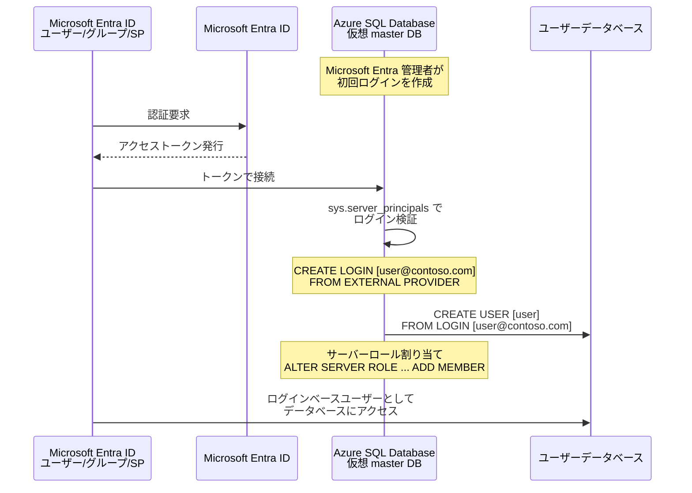

# Azure SQL Database: Microsoft Entra サーバープリンシパル (ログイン) の一般提供開始

**リリース日**: 2026-06-10

**サービス**: Azure SQL Database

**機能**: Microsoft Entra server principals (logins)

**ステータス**: Launched (GA)

[このアップデートのインフォグラフィックを見る](https://takech9203.github.io/azure-news-summary/20260610-sql-database-entra-server-principals.html)

## 概要

Microsoft Entra サーバープリンシパル (ログイン) が Azure SQL Database で一般提供 (GA) となった。これにより、仮想 `master` データベースで `CREATE LOGIN ... FROM EXTERNAL PROVIDER` 構文を使用して、Microsoft Entra ID (旧 Azure Active Directory) の ID に基づくサーバーレベルのログインを作成できるようになった。

従来、Azure SQL Database での Microsoft Entra 認証は、主にデータベースレベルの包含ユーザー (contained database user) として構成する必要があった。今回の GA により、SQL ログインと同等の機能パリティが Microsoft Entra ID ベースのログインにも提供され、サーバーレベルでの一元的な ID 管理が可能になった。

この機能は、Azure SQL Managed Instance、SQL Server 2022 以降でも利用可能であり、Azure Synapse Analytics (専用 SQL プール) ではパブリックプレビューとして提供されている。

**アップデート前の課題**

- Microsoft Entra ユーザーはデータベースごとに包含ユーザーとして個別に作成する必要があり、サーバーレベルでの一元管理ができなかった
- SQL ログインで利用できるサーバーロール (`##MS_DefinitionReader##`、`##MS_ServerStateReader##` など) を Microsoft Entra ID に対して割り当てる手段が限定的だった
- 複数の Microsoft Entra ユーザーに `loginmanager` や `dbmanager` などの特別なロールを付与する運用が煩雑だった
- geo レプリカへの Microsoft Entra プリンシパルによるアクセス制御が困難だった

**アップデート後の改善**

- `CREATE LOGIN ... FROM EXTERNAL PROVIDER` により、仮想 `master` データベースでサーバーレベルのログインを作成可能
- SQL ログインとの機能パリティを実現し、サーバーロールへの Microsoft Entra ログインの割り当てが可能
- ログインベースのユーザーを各データベースに作成でき、サーバーレベルのアクセス制御を一元化
- `ALTER LOGIN ... DISABLE` によるログインの無効化で、即座にアクセスを遮断可能
- Microsoft Entra 専用認証 (Entra-only authentication) と組み合わせて SQL 認証を完全に無効化可能
- サービスプリンシパルログインによるユーザー・データベースの作成・メンテナンスの完全自動化が可能

## アーキテクチャ図



この図は、Microsoft Entra サーバープリンシパルを使用した認証フローを示している。Microsoft Entra ID で認証されたトークンを使用して仮想 `master` データベースに接続し、サーバーレベルのログインとして検証された後、各ユーザーデータベースにアクセスする流れである。

## サービスアップデートの詳細

### 主要機能

1. **サーバーレベルの Microsoft Entra ログイン作成**
   - 仮想 `master` データベースで `CREATE LOGIN ... FROM EXTERNAL PROVIDER` を実行
   - Microsoft Entra ユーザー、グループ、サービスプリンシパル (アプリケーション) に対応
   - `WITH OBJECT_ID` オプションで表示名が一意でないサービスプリンシパルにも対応

2. **ログインベースユーザーの作成**
   - `CREATE USER [user] FROM LOGIN [login]` でデータベースレベルのユーザーをログインにマッピング
   - サーバーレベルのロールと権限をログインベースユーザーが継承

3. **サーバーロールの割り当て**
   - `##MS_DefinitionReader##`: メタデータの読み取り
   - `##MS_ServerStateReader##`: サーバー状態の読み取り
   - `##MS_ServerStateManager##`: サーバー状態の管理
   - `loginmanager` / `dbmanager`: ログイン・データベースの管理

4. **ログインの無効化/有効化**
   - `ALTER LOGIN [user] DISABLE` でアクセスを即座に遮断
   - geo レプリカでの読み取り専用アクセスの制御に活用可能

5. **Microsoft Entra 専用認証との連携**
   - SQL 認証を完全に無効化し、Microsoft Entra のみで運用可能
   - SQL サーバー管理者アカウント、SQL ログインを含むすべての SQL 認証を停止可能

## 技術仕様

| 項目 | 詳細 |
|------|------|
| 対象サービス | Azure SQL Database、Azure SQL Managed Instance、SQL Server 2022 以降 |
| サポートされる ID タイプ | Microsoft Entra ユーザー、グループ、サービスプリンシパル、マネージド ID |
| ログインのタイプ値 | `E` (外部ログイン/アプリ)、`X` (外部グループ) |
| SID 形式 | ログイン: Microsoft Entra オブジェクト ID のバイナリ表現、ユーザー: + `AADE` サフィックス (18 バイト) |
| 必要な Microsoft Graph 権限 | ユーザー作成: `User.Read.All`、グループ作成: `GroupMember.Read.All`、サービスプリンシパル作成: `Application.Read.All` |
| 最初のログイン作成者 | Microsoft Entra 管理者のみ |
| 以降のログイン作成者 | `loginmanager` ロールを持つ Microsoft Entra プリンシパル |

## 設定方法

### 前提条件

1. Azure SQL Database の論理サーバーまたは Managed Instance が作成済みであること
2. Microsoft Entra 認証が構成済みであること (Microsoft Entra 管理者が設定済み)
3. Microsoft Entra 管理者アカウントでアクセス可能であること

### Azure CLI

```bash
# Microsoft Entra 管理者の設定
az sql server ad-admin create \
  --resource-group <resource-group> \
  --server <server-name> \
  --display-name <admin-display-name> \
  --object-id <admin-object-id>
```

### T-SQL examples

```sql
-- 1. Microsoft Entra ログインの作成 (仮想 master データベースで実行)
-- Microsoft Entra 管理者として接続後に実行
CREATE LOGIN [bob@contoso.com] FROM EXTERNAL PROVIDER
GO

-- サービスプリンシパル (表示名が一意でない場合は OBJECT_ID を指定)
CREATE LOGIN [myapp] FROM EXTERNAL PROVIDER
  WITH OBJECT_ID = 'aaaaaaaa-0000-1111-2222-bbbbbbbbbbbb'
GO

-- 2. ログインベースユーザーの作成
CREATE USER [bob@contoso.com] FROM LOGIN [bob@contoso.com]
GO

-- 3. サーバーロールの割り当て
ALTER SERVER ROLE ##MS_DefinitionReader## ADD MEMBER [bob@contoso.com]
ALTER SERVER ROLE ##MS_ServerStateReader## ADD MEMBER [bob@contoso.com]
GO

-- 4. 特別なデータベースロールの割り当て (master データベース内)
ALTER ROLE [dbmanager] ADD MEMBER [bob@contoso.com]
ALTER ROLE [loginmanager] ADD MEMBER [bob@contoso.com]
GO

-- 5. ログインの無効化
ALTER LOGIN [bob@contoso.com] DISABLE
GO

-- キャッシュのクリア (権限変更の即時反映)
DBCC FLUSHAUTHCACHE
DBCC FREESYSTEMCACHE('TokenAndPermUserStore') WITH NO_INFOMSGS
GO

-- 6. 作成されたログインの確認
SELECT name, type_desc, type, is_disabled
FROM sys.server_principals
WHERE type_desc LIKE 'external%'
GO
```

## メリット

### ビジネス面

- **コンプライアンス強化**: Microsoft Entra 専用認証によりパスワードベースの SQL 認証を廃止でき、セキュリティ監査要件への準拠が容易になる
- **運用コスト削減**: サーバーレベルでの一元的な ID 管理により、データベースごとの個別ユーザー管理の手間を削減
- **自動化の促進**: サービスプリンシパルログインを活用した CI/CD パイプラインでのデータベースプロビジョニングの完全自動化が可能

### 技術面

- **SQL ログインとの機能パリティ**: サーバーロール、ログインの無効化/有効化など、SQL ログインと同等の管理機能を Microsoft Entra ID で利用可能
- **多要素認証 (MFA) の活用**: Microsoft Entra の MFA、条件付きアクセスをサーバーレベルの認証に適用可能
- **geo レプリカのアクセス制御**: ログインの無効化を利用して、プライマリへの書き込みを拒否しつつ geo レプリカへの読み取りのみを許可する構成が可能
- **マネージド ID のサポート**: パスワードレスでのサービス間認証をサーバーレベルで実現

## デメリット・制約事項

- SQL サーバー管理者 (SA) は Microsoft Entra ログインやユーザーを作成できない (Microsoft Entra 管理者または `loginmanager` ロール保持者が必要)
- Azure SQL Database および Azure Synapse Analytics では、Microsoft Entra サーバープリンシパルの偽装 (EXECUTE AS) はサポートされない
- Microsoft Entra ログインは Microsoft Entra 管理者と重複できない (管理者権限が優先される)
- Microsoft Entra グループログインにはサーバーロールの割り当てがサポートされない
- 2048 を超える Microsoft Entra セキュリティグループのメンバーであるユーザーはログイン不可
- 権限変更後、即時反映するにはキャッシュのクリア (`DBCC FLUSHAUTHCACHE`) が必要
- データベースの所有権を Microsoft Entra グループに変更することはサポートされない

## ユースケース

### ユースケース 1: エンタープライズでの一元的なアクセス管理

**シナリオ**: 大規模組織で多数の Azure SQL Database を運用しており、各データベースへのアクセスを一元管理したい。

**実装例**:

```sql
-- サーバーレベルでチーム用ログインを作成
CREATE LOGIN [db-admins@contoso.com] FROM EXTERNAL PROVIDER
GO

-- 各データベースにログインベースユーザーを作成
USE [ApplicationDB]
CREATE USER [db-admins@contoso.com] FROM LOGIN [db-admins@contoso.com]
ALTER ROLE db_owner ADD MEMBER [db-admins@contoso.com]
GO
```

**効果**: Microsoft Entra グループのメンバーシップを変更するだけで、サーバー上のすべてのデータベースへのアクセスを一括制御できる。

### ユースケース 2: CI/CD パイプラインでの自動化

**シナリオ**: GitHub Actions や Azure DevOps からデータベースのスキーマ変更やユーザープロビジョニングを自動化したい。

**実装例**:

```sql
-- サービスプリンシパルにログインを作成
CREATE LOGIN [deployment-sp] FROM EXTERNAL PROVIDER
  WITH OBJECT_ID = 'xxxxxxxx-xxxx-xxxx-xxxx-xxxxxxxxxxxx'
GO

-- loginmanager ロールを付与して他のログイン作成を許可
ALTER ROLE [loginmanager] ADD MEMBER [deployment-sp]
ALTER ROLE [dbmanager] ADD MEMBER [deployment-sp]
GO
```

**効果**: パスワードレスのマネージド ID を使用し、セキュアかつ自動的にデータベースとユーザーのライフサイクル管理が可能になる。

### ユースケース 3: geo レプリカでの読み取り分離

**シナリオ**: プライマリサーバーへの書き込みを遮断し、geo レプリカへの読み取りのみを許可するレポーティングユーザーを構成したい。

**実装例**:

```sql
-- プライマリサーバーでログインを無効化
ALTER LOGIN [reporting-user@contoso.com] DISABLE
GO

-- geo レプリカではログインが有効のまま読み取りアクセスが可能
```

**効果**: ログインの無効化がプライマリにのみ適用され、geo レプリカでは引き続き読み取りアクセスが可能な構成を実現できる。

## 料金

Microsoft Entra サーバープリンシパル (ログイン) の機能自体に追加料金は発生しない。Azure SQL Database の既存の料金体系内で利用可能である。

詳細は [Azure SQL Database の料金ページ](https://azure.microsoft.com/pricing/details/azure-sql-database/) を参照。

## 関連サービス・機能

- **Microsoft Entra ID**: ID プロバイダーとしてユーザー、グループ、サービスプリンシパルを管理
- **Azure SQL Database サーバーロール**: `##MS_DefinitionReader##`、`##MS_ServerStateReader##` などのサーバーレベル権限管理
- **Microsoft Entra 専用認証**: SQL 認証を無効化し Microsoft Entra のみで運用する機能
- **Azure SQL Managed Instance**: 同等の Microsoft Entra サーバープリンシパル機能を提供 (偽装もサポート)
- **geo レプリケーション**: ログインの無効化/有効化による読み取りアクセス制御
- **Azure RBAC**: 管理プレーン (ARM) のアクセス制御 (データプレーンの認証とは独立)

## 参考リンク

- [インフォグラフィック](https://takech9203.github.io/azure-news-summary/20260610-sql-database-entra-server-principals.html)
- [公式アップデート情報](https://azure.microsoft.com/updates?id=565154)
- [Microsoft Learn - Microsoft Entra server principals](https://learn.microsoft.com/azure/azure-sql/database/authentication-azure-ad-logins)
- [Microsoft Learn - チュートリアル: Microsoft Entra サーバーログインの作成と利用](https://learn.microsoft.com/azure/azure-sql/database/authentication-azure-ad-logins-tutorial)
- [Microsoft Learn - Microsoft Entra 認証の概要](https://learn.microsoft.com/azure/azure-sql/database/authentication-aad-overview)
- [料金ページ](https://azure.microsoft.com/pricing/details/azure-sql-database/)

## まとめ

Microsoft Entra サーバープリンシパル (ログイン) の GA により、Azure SQL Database における ID 管理が大幅に強化された。従来の包含データベースユーザーに加え、サーバーレベルでのログイン管理が可能になったことで、SQL ログインとの完全な機能パリティが実現した。

Solutions Architect として推奨される次のアクションは以下の通り:

1. 既存の包含データベースユーザーをログインベースのユーザーに移行し、一元管理を検討する
2. Microsoft Entra 専用認証の有効化を検討し、SQL 認証の廃止によるセキュリティ強化を図る
3. CI/CD パイプラインでサービスプリンシパルログインを活用した自動化を推進する

---

**タグ**: #Azure #AzureSQLDatabase #MicrosoftEntra #Authentication #Security #GA #ServerPrincipals #Databases
