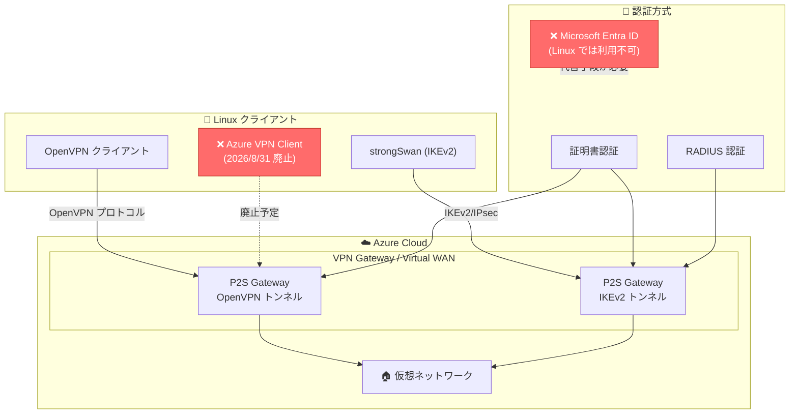

# Azure VPN Client for Linux (Preview): 2026 年 8 月 31 日に廃止

**リリース日**: 2026-06-10

**サービス**: VPN Gateway / Virtual WAN

**機能**: Azure VPN Client for Linux (Preview) の廃止

**ステータス**: Retirement

[このアップデートのインフォグラフィックを見る](https://takech9203.github.io/azure-news-summary/20260610-vpn-client-linux-retirement.html)

## 概要

Microsoft は、Azure VPN Client for Linux (Preview) を 2026 年 8 月 31 日に廃止することを発表した。このクライアントは、Linux マシンから Azure VPN ゲートウェイへの Point-to-Site (P2S) 接続を確立するために使用されていた Microsoft 提供の VPN クライアントアプリケーション (microsoft-azurevpnclient パッケージ) である。

このクライアントはリリース以来パブリックプレビューのまま留まり、一般提供 (GA) への移行パスが存在しなかった。Microsoft のセキュリティおよび信頼性基準に適合させるための取り組みの一環として、サポートされていないプレビューを無期限に維持し続けるのではなく、廃止する決定が下された。

重要な点として、この廃止は Azure VPN Gateway 自体、Azure VPN Client for Windows/macOS、または Site-to-Site VPN 機能には影響しない。廃止対象は Linux 用プレビュークライアントアプリケーションのみである。

**アップデート前の課題**

- Azure VPN Client for Linux はプレビューのまま GA への道筋がなかった
- サポート対象 OS が Ubuntu 20.04 と 22.04 のみに限定されていた
- 現行のセキュリティおよび信頼性基準を満たしていなかった
- Microsoft Entra ID (AAD) 認証を Linux で利用するには Azure VPN Client for Linux が唯一の選択肢だった

**アップデート後の改善**

- サポートされる代替クライアント (OpenVPN、strongSwan) は幅広い Linux ディストリビューションに対応
- 代替クライアントはオープンソースで活発にメンテナンスされている
- 証明書認証・RADIUS 認証による安定した接続が可能

## アーキテクチャ図



Linux から Azure VPN Gateway への P2S 接続における代替手段を示す。廃止される Azure VPN Client に代わり、OpenVPN クライアント (OpenVPN トンネル + 証明書認証) または strongSwan (IKEv2 + 証明書/RADIUS 認証) を使用する。

## サービスアップデートの詳細

### 廃止タイムライン

| マイルストーン | 日付 | 内容 |
|------|------|------|
| 廃止発表 | 2026 年 6 月 10 日 | 公式アナウンス |
| 廃止日 | 2026 年 8 月 31 日 | サポート終了・パッケージ削除 |

### 影響範囲

1. **影響を受けるもの**
   - Azure VPN Client for Linux (microsoft-azurevpnclient パッケージ)
   - Linux からの Microsoft Entra ID (AAD) 認証による P2S 接続

2. **影響を受けないもの**
   - Azure VPN Gateway 自体
   - Azure VPN Client for Windows / macOS
   - Site-to-Site VPN 接続
   - P2S ゲートウェイ構成

### 代替ソリューション

| クライアント | トンネルタイプ | 認証方式 | 対応 Linux ディストリビューション |
|------|------|------|------|
| OpenVPN クライアント | OpenVPN | 証明書認証 | 幅広い Linux ディストリビューション |
| strongSwan | IKEv2 | 証明書認証 / RADIUS 認証 | 幅広い Linux ディストリビューション |

## 技術仕様

| 項目 | 詳細 |
|------|------|
| 廃止対象 | microsoft-azurevpnclient パッケージ (Linux) |
| 廃止日 | 2026 年 8 月 31 日 |
| 代替 (OpenVPN) | OpenVPN クライアント + 証明書認証 |
| 代替 (IKEv2) | strongSwan + 証明書認証 or RADIUS 認証 |
| 対応プロトコル (OpenVPN) | TLS 1.2 / TLS 1.3、TCP 443 |
| 対応プロトコル (IKEv2) | IKEv2/IPsec、AES256-GCM |
| Microsoft Entra ID 認証 | Linux では代替なし (Windows/macOS のみ) |

## 設定方法

### 代替 1: OpenVPN クライアント (証明書認証)

#### 前提条件

1. VPN Gateway が OpenVPN トンネルタイプ + 証明書認証で構成済み
2. VPN クライアントプロファイル構成ファイルを生成済み
3. クライアント証明書を準備済み

#### インストールと構成

```bash
# OpenVPN クライアントのインストール
sudo apt-get install openvpn
sudo apt-get -y install network-manager-openvpn
sudo service network-manager restart

# VPN クライアントプロファイルを使用して接続
sudo openvpn --config <vpnconfig.ovpn ファイルのパス> &
```

### 代替 2: strongSwan (IKEv2 + 証明書認証)

#### 前提条件

1. VPN Gateway が IKEv2 トンネルタイプ + 証明書認証で構成済み
2. VPN クライアントプロファイル構成ファイルを生成済み
3. クライアント証明書と秘密鍵を準備済み

#### インストールと構成

```bash
# strongSwan のインストール
sudo apt-get install strongswan
sudo apt install strongswan-pki
sudo apt install libstrongswan-extra-plugins
sudo apt install libtss2-tcti-tabrmd0

# 証明書の配置
sudo cp ${USERNAME}Cert.pem /etc/ipsec.d/certs/
sudo cp ${USERNAME}Key.pem /etc/ipsec.d/private/
sudo chmod -R go-rwx /etc/ipsec.d/private /etc/ipsec.d/certs

# 接続の開始
sudo ipsec restart
sudo ipsec up azure
```

## 移行手順

### 高レベル移行手順

1. **ゲートウェイ構成の更新** - 選択した代替クライアントが必要とするトンネルタイプをサポートするように P2S ゲートウェイ構成を更新 (strongSwan の場合は IKEv2、OpenVPN クライアントの場合は OpenVPN)
2. **プロファイルの再生成** - ゲートウェイから新しい VPN クライアントプロファイル構成ファイルを生成
3. **クライアントのインストール** - 各 Linux デバイスに代替 VPN クライアントをインストール・構成
4. **接続テスト** - 接続性を検証し、ユーザーベースに展開
5. **旧クライアントの削除** - Azure VPN Client for Linux をアンインストール

### ゲートウェイ構成の変更要否

| 現在の構成 | 移行先 | ゲートウェイ変更 |
|------|------|------|
| OpenVPN + 証明書認証 | OpenVPN クライアント | 不要 |
| OpenVPN + Microsoft Entra ID のみ | OpenVPN クライアント | 証明書認証または RADIUS 認証の追加が必要 |
| IKEv2 有効 + 証明書認証 | strongSwan | 不要 |
| OpenVPN のみ | strongSwan | IKEv2 の有効化が必要 |

## デメリット・制約事項

- **Microsoft Entra ID 認証の喪失**: Linux での Microsoft Entra ID (AAD) 認証は代替手段なし。証明書認証または RADIUS 認証への切り替えが必要
- **廃止後のリスク**: 2026 年 8 月 31 日以降、バグ修正・セキュリティパッチ・サポートは提供されない
- **パッケージの削除**: microsoft-azurevpnclient パッケージは Microsoft の Linux リポジトリから削除される
- **条件付きアクセスの制限**: Microsoft Entra ID を使用できないため、条件付きアクセスポリシーや MFA の直接適用が困難になる

## ユースケース

### ユースケース 1: 証明書認証で OpenVPN を使用する移行

**シナリオ**: 現在 Azure VPN Client for Linux で証明書認証を使用してP2S 接続しているチーム

**移行手順**:

1. ゲートウェイが既に OpenVPN トンネルタイプで構成されている場合、ゲートウェイ変更は不要
2. VPN クライアントプロファイル構成ファイルを再生成
3. 各 Linux マシンに OpenVPN クライアントをインストール
4. vpnconfig.ovpn ファイルにクライアント証明書と秘密鍵を設定
5. 接続テストを実施

**効果**: 幅広い Linux ディストリビューションで安定した P2S 接続が可能になる

### ユースケース 2: Microsoft Entra ID 認証を利用していた場合

**シナリオ**: Linux ユーザーが Microsoft Entra ID 認証で P2S 接続していた環境

**対応方針**:

1. 証明書認証または RADIUS 認証への切り替えを検討
2. RADIUS サーバーを Active Directory と統合すれば、組織ドメイン資格情報での認証が可能
3. Windows/macOS クライアントでは引き続き Microsoft Entra ID 認証が利用可能

**効果**: Linux ユーザーは認証方式の変更が必要だが、RADIUS + AD 統合により組織認証を維持できる

## 関連サービス・機能

- **Azure VPN Gateway**: P2S VPN 接続の基盤。ゲートウェイ自体は影響を受けない
- **Azure Virtual WAN**: Virtual WAN の P2S ゲートウェイも同様に Linux クライアントの移行が必要
- **Microsoft Entra ID**: Linux での AAD 認証は代替手段がないため、認証方式の見直しが必要
- **Azure VPN Client (Windows/macOS)**: 引き続き GA でサポートされる

## 参考リンク

- [インフォグラフィック](https://takech9203.github.io/azure-news-summary/20260610-vpn-client-linux-retirement.html)
- [公式アップデート情報](https://azure.microsoft.com/updates?id=565393)
- [VPN Gateway - Azure VPN Client for Linux 廃止ガイド](https://learn.microsoft.com/azure/vpn-gateway/azure-vpn-client-linux-retirement)
- [Virtual WAN - Azure VPN Client for Linux 廃止ガイド](https://learn.microsoft.com/azure/virtual-wan/azure-vpn-client-linux-retirement)
- [P2S VPN - OpenVPN クライアント (Linux) 構成ガイド](https://learn.microsoft.com/azure/vpn-gateway/point-to-site-vpn-client-certificate-openvpn-linux)
- [P2S VPN - strongSwan (IKEv2/Linux) 構成ガイド](https://learn.microsoft.com/azure/vpn-gateway/point-to-site-vpn-client-certificate-ike-linux)
- [Azure Point-to-Site VPN について](https://learn.microsoft.com/azure/vpn-gateway/point-to-site-about)

## まとめ

Azure VPN Client for Linux (Preview) は 2026 年 8 月 31 日に廃止される。プレビューのまま GA への移行パスがなく、現行のセキュリティ・信頼性基準を満たさないことが廃止理由である。影響を受けるユーザーは、廃止日までに OpenVPN クライアント (証明書認証) または strongSwan (IKEv2 + 証明書/RADIUS 認証) への移行が必要。特に Microsoft Entra ID 認証を利用していた Linux ユーザーは、認証方式自体の見直しが求められる点に注意が必要である。移行期間は約 2.5 か月あるため、早期にテスト環境での検証を開始し、計画的な移行を推奨する。

---

**タグ**: #VPN-Gateway #Virtual-WAN #Networking #Security #Retirement #Linux #P2S #OpenVPN #strongSwan #IKEv2
