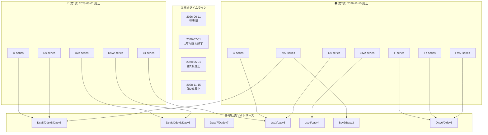

# Azure Batch: プール用 VM シリーズの廃止 (D/Ds/Dv2/Dsv2/Ls/Av2/F/Fs/Fsv2/G/Gs/Lsv2)

**リリース日**: 2026-06-11

**サービス**: Azure Batch

**機能**: Batch プール用旧世代 VM シリーズの廃止

**ステータス**: Retirement (廃止予定)

[このアップデートのインフォグラフィックを見る](https://takech9203.github.io/azure-news-summary/20260611-batch-vm-series-retirement.html)

## 概要

Microsoft Azure は、Azure Batch プールで使用されている複数の旧世代 VM シリーズの廃止を発表しました。これは Azure Compute 全体の VM シリーズ廃止の一環であり、Batch サービスに特化した影響と対応が求められます。

**第 1 波 (2028 年 5 月 1 日廃止)**: D-series、Ds-series、Dv2-series、Dsv2-series、Ls-series の 5 シリーズが対象です。これらは汎用およびストレージ最適化の旧世代 VM であり、廃止日以降は新規 Batch プールの作成ができなくなり、既存プールも影響を受けます。

**第 2 波 (2028 年 11 月 15 日廃止)**: Av2-series、F-series、Fs-series、Fsv2-series、G-series、Gs-series、Lsv2-series の 7 シリーズが対象です。エントリーレベル、コンピューティング最適化、メモリ最適化、ストレージ最適化の各カテゴリにまたがる旧世代 VM であり、同様に廃止日以降は新規プール作成不可、既存プールへの影響が発生します。

**アップデート前の課題**

- 旧世代 VM シリーズは最新のハードウェア機能 (NVMe ディスクコントローラー、MANA ネットワークアダプター等) に対応していない
- 新世代 VM と比較して価格対性能比が劣る
- 一部シリーズはキャパシティが制限されており、リージョンによっては利用困難な状況が発生

**アップデート後の改善**

- 新世代 VM (v5/v6/v7 シリーズ) への移行により、最新ハードウェアの性能向上を享受可能
- NVMe ディスクコントローラーによるストレージ I/O の大幅改善
- より広いリージョン可用性と将来的なサポートの継続性を確保

## アーキテクチャ図



廃止は 2 段階で実施されます。第 1 波 (2028 年 5 月) では汎用 D 系とストレージ最適化 Ls が、第 2 波 (2028 年 11 月) ではエントリーレベル、コンピューティング最適化、メモリ最適化系が対象となります。

## サービスアップデートの詳細

### 主要機能

1. **第 1 波廃止対象 (2028 年 5 月 1 日)**
   - D-series: 汎用 VM (初代)
   - Ds-series: Premium Storage 対応の汎用 VM (初代)
   - Dv2-series: 第 2 世代汎用 VM
   - Dsv2-series: Premium Storage 対応の第 2 世代汎用 VM
   - Ls-series: ストレージ最適化 VM (初代)

2. **第 2 波廃止対象 (2028 年 11 月 15 日)**
   - Av2-series: エントリーレベル汎用 VM
   - F-series: コンピューティング最適化 VM (初代)
   - Fs-series: Premium Storage 対応のコンピューティング最適化 VM
   - Fsv2-series: 第 2 世代コンピューティング最適化 VM
   - G-series: メモリ最適化 VM
   - Gs-series: Premium Storage 対応のメモリ最適化 VM
   - Lsv2-series: 第 2 世代ストレージ最適化 VM

3. **廃止後の影響**
   - 廃止日以降、対象 VM シリーズを使用した新規 Batch プールの作成は不可
   - 既存の Batch プールも影響を受ける (VM の割り当て解除の可能性)
   - SLA およびサポートの対象外となる

## 技術仕様

| 廃止対象シリーズ | カテゴリ | 廃止日 | 推奨移行先 |
|------|------|------|------|
| D-series | 汎用 | 2028-05-01 | Dsv5/Ddsv5/Dasv5/Dsv6/Ddsv6/Dasv6 |
| Ds-series | 汎用 | 2028-05-01 | Dsv5/Ddsv5/Dasv5/Dsv6/Ddsv6/Dasv6 |
| Dv2-series | 汎用 | 2028-05-01 | Dsv5/Ddsv5/Dasv5/Dsv6/Ddsv6/Dasv6 |
| Dsv2-series | 汎用 | 2028-05-01 | Dsv5/Ddsv5/Dasv5/Dsv6/Ddsv6/Dasv6 |
| Ls-series | ストレージ最適化 | 2028-05-01 | Lsv3/Lasv3/Lsv4/Lasv4 |
| Av2-series | 汎用 (エントリー) | 2028-11-15 | Bsv2/Basv2/Dsv5/Dsv6 |
| F-series | コンピューティング最適化 | 2028-11-15 | Dlsv6/Dldsv6/Dalsv6/Daldsv6/Falsv6 |
| Fs-series | コンピューティング最適化 | 2028-11-15 | Dlsv6/Dldsv6/Dalsv6/Daldsv6/Falsv6 |
| Fsv2-series | コンピューティング最適化 | 2028-11-15 | Dlsv6/Dldsv6/Dalsv6/Daldsv6/Falsv6 |
| G-series | メモリ最適化 | 2028-11-15 | Lsv3/Lasv3/Lsv4/Lasv4 |
| Gs-series | メモリ最適化 | 2028-11-15 | Lsv3/Lasv3/Lsv4/Lasv4 |
| Lsv2-series | ストレージ最適化 | 2028-11-15 | Lsv3/Lasv3/Lsv4/Lasv4 |

### 移行先 VM の主な技術的差異

| 項目 | 旧世代 (v1/v2) | 新世代 (v5/v6/v7) |
|------|------|------|
| ディスクコントローラー | SCSI | SCSI (v5) / NVMe (v6/v7) |
| ネットワーク | 標準 | MANA (v6 以降) |
| VM 世代 | Gen1 対応 | Gen2 必須 (v6 以降) |
| NVMe サポート | なし | あり (v6 以降で必須) |

## 設定方法

### 前提条件

1. 現在使用中の Batch プールで対象 VM シリーズを利用しているか確認
2. 移行先 VM シリーズのクォータが十分であることを確認
3. v6 シリーズへの移行時は NVMe 対応 OS イメージの使用が必要

### Azure CLI

```bash
# 現在の Batch プールで使用中の VM サイズを確認
az batch pool list --account-name <batch-account-name> \
  --query "[].{Name:id, VMSize:vmSize}" -o table

# リージョンでサポートされている VM SKU と EOL 日を確認
az batch location list-skus --location <region> \
  --query "[?contains(name, 'Standard_D') || contains(name, 'Standard_F')].{Name:name, EOL:batchSupportEndOfLife}" -o table

# 新しいプールを作成 (移行先 VM シリーズを使用)
az batch pool create --account-name <batch-account-name> \
  --id <new-pool-id> \
  --vm-size Standard_D4s_v5 \
  --image "canonical:0001-com-ubuntu-server-jammy:22_04-lts:latest" \
  --node-agent-sku-id "batch.node.ubuntu 22.04"

# ジョブを新しいプールに移行
az batch job set --job-id <job-id> \
  --pool-id <new-pool-id>
```

### PowerShell

```powershell
# サポート対象の VM SKU と EOL 日を確認
Get-AzBatchSupportedVirtualMachineSku -Location <region> |
  Where-Object { $_.Name -like "Standard_D*" -or $_.Name -like "Standard_F*" } |
  Select-Object Name, BatchSupportEndOfLife
```

## メリット

### ビジネス面

- 新世代 VM は価格対性能比が向上しており、同等ワークロードをより低コストで実行可能
- 2028 年の廃止までに計画的に移行することで、突然の中断リスクを回避
- Azure Savings Plan やリザーブドインスタンスの新規購入が可能な新世代シリーズへの移行

### 技術面

- NVMe ディスクコントローラーによるストレージ I/O パフォーマンスの大幅向上
- 最新プロセッサ世代 (Intel/AMD) による処理性能の向上
- より広いリージョン可用性
- 最新のセキュリティ機能とハードウェアアクセラレーションへのアクセス

## デメリット・制約事項

- v6 シリーズへの移行には NVMe 対応 OS イメージが必要であり、カスタムイメージの再構築が必要になる可能性がある
- v6 シリーズは Generation 2 VM のみサポートするため、Generation 1 VM イメージからの移行作業が発生
- v6 シリーズは MANA (Microsoft Azure Network Adapter) 対応 OS が必要
- v6 シリーズのリージョン可用性が限定的な場合あり (その場合は v5 シリーズを検討)
- Batch プールの再作成が必要 (既存プールの VM サイズのインプレース変更は不可)
- 移行期間中は新旧プールの並行運用によるコスト増の可能性

## ユースケース

### ユースケース 1: バッチ処理ワークロードの移行

**シナリオ**: D/Dv2 シリーズを使用した大規模データ処理パイプラインを運用中

**対応方法**:

```bash
# 1. 新世代 VM で新規プールを作成
az batch pool create --account-name mybatch \
  --id pool-dsv5-migration \
  --vm-size Standard_D4s_v5 \
  --target-dedicated-nodes 10 \
  --image "canonical:0001-com-ubuntu-server-jammy:22_04-lts:latest" \
  --node-agent-sku-id "batch.node.ubuntu 22.04"

# 2. 新プールでテスト実行
# 3. パフォーマンスを検証後、ジョブを新プールに切り替え
az batch job set --job-id data-pipeline-job \
  --pool-id pool-dsv5-migration
```

**効果**: 最新プロセッサとストレージ性能の向上により、同等コストで処理時間の短縮が期待される

### ユースケース 2: コンピューティング最適化ワークロードの移行

**シナリオ**: Fsv2 シリーズを使用したレンダリング/シミュレーション処理

**対応方法**: Dlsv6/Dldsv6/Falsv6 シリーズへ移行。NVMe 対応 OS イメージへの切り替えが前提。ワークロードのテスト実行後、本番切り替えを実施。

## リザーブドインスタンス (RI) への影響

| VM シリーズ | 3 年 RI 期限 | 1 年 RI 新規購入終了 | 廃止日 |
|------|------|------|------|
| D/Ds/Dv2/Dsv2/Ls | 2025-05-01 | 2026-07-01 | 2028-05-01 |
| Av2/F/Fs/Fsv2/G/Gs/Lsv2 | 2025-11-15 | 2026-07-01 | 2028-11-15 |

対象 VM シリーズの 1 年 RI は 2026 年 7 月 1 日以降に新規購入・更新ができなくなります。既存の RI は元の期間満了まで有効です。Azure Savings Plan for Compute への切り替えまたは新世代 VM シリーズの RI 購入が推奨されます。

## 関連サービス・機能

- **Azure Batch**: 直接影響を受けるサービス。プール作成時の VM サイズ選択が制限される
- **Azure Virtual Machines**: 基盤となる VM シリーズの廃止が Batch に波及
- **Azure Virtual Machine Scale Sets**: Batch プールの基盤技術として関連
- **Azure Cost Management**: RI の交換・Savings Plan への移行で活用
- **Azure Advisor**: VM SKU の EOL に関する推奨事項の確認に活用

## 参考リンク

- [インフォグラフィック](https://takech9203.github.io/azure-news-summary/20260611-batch-vm-series-retirement.html)
- [公式アップデート情報 (第 1 波: D/Ds/Dv2/Dsv2/Ls)](https://azure.microsoft.com/updates?id=564772)
- [公式アップデート情報 (第 2 波: Av2/F/Fs/Fsv2/G/Gs/Lsv2)](https://azure.microsoft.com/updates?id=564774)
- [VM シリーズ移行ガイド](https://learn.microsoft.com/en-us/azure/virtual-machines/migration/sizes/d-ds-dv2-dsv2-ls-series-migration-guide)
- [Azure Batch プールの VM サイズ選択](https://learn.microsoft.com/en-us/azure/batch/batch-pool-vm-sizes)
- [Azure Batch ベストプラクティス](https://learn.microsoft.com/en-us/azure/batch/best-practices)
- [旧世代 VM サイズ一覧](https://learn.microsoft.com/en-us/azure/virtual-machines/sizes/previous-gen-sizes-list)
- [Azure VM サイズ概要](https://learn.microsoft.com/en-us/azure/virtual-machines/sizes/overview)

## まとめ

Azure Batch プールで使用されている旧世代 VM シリーズ (計 12 シリーズ) が 2 段階で廃止されます。第 1 波 (D/Ds/Dv2/Dsv2/Ls) は 2028 年 5 月 1 日、第 2 波 (Av2/F/Fs/Fsv2/G/Gs/Lsv2) は 2028 年 11 月 15 日が期限です。

推奨されるアクションは以下の通りです:
1. `az batch location list-skus` コマンドで現在のプールが使用している VM SKU の EOL 日を確認
2. 移行先の VM シリーズ (v5/v6) を選定し、クォータを確認・必要に応じて増加申請
3. 新しい VM サイズで Batch プールを作成し、テスト実行でパフォーマンスを検証
4. ジョブを新プールに切り替え、旧プールを削除
5. RI を利用中の場合は、新世代 VM シリーズの RI への交換または Azure Savings Plan への移行を検討

廃止までの期間は十分にありますが、v6 シリーズへの移行には NVMe 対応 OS イメージや Generation 2 VM への対応が必要なため、早期の計画策定と段階的な移行が推奨されます。

---

**タグ**: #Azure #Batch #Compute #VM #Retirement #Migration #D-series #Dv2-series #Av2-series #F-series #Fsv2-series #G-series #Ls-series #Lsv2-series
