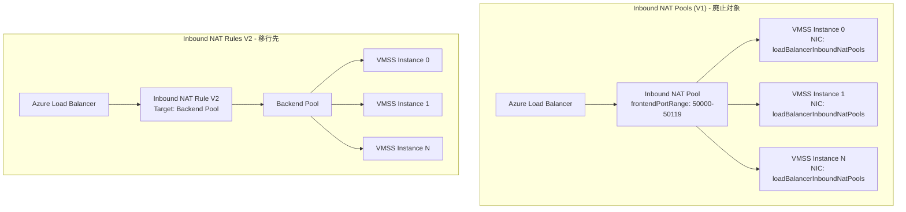

# Azure Load Balancer: Inbound NAT rule version 1 (NAT Pools) の廃止

**リリース日**: 2026-06-11

**サービス**: Azure Load Balancer

**機能**: Inbound NAT rule version 1 (Inbound NAT Pools for VMSS) の廃止

**ステータス**: Retirement (廃止予定: 2027年9月30日)

[このアップデートのインフォグラフィックを見る](https://takech9203.github.io/azure-news-summary/20260611-load-balancer-inbound-nat-v1-retirement.html)

## 概要

Microsoft は Azure Load Balancer の Inbound NAT rule version 1 の廃止について、スコープを縮小する重要な更新を発表した。以前のアナウンスでは、すべての Inbound NAT rules version 1 リソース (単一 VM 用 NAT ルールおよび Virtual Machine Scale Sets 用 NAT Pools の両方) が廃止対象とされていたが、今回の更新により廃止対象が **Virtual Machine Scale Sets (VMSS) 用の Inbound NAT Pools のみ** に限定された。

これにより、単一 VM 向けの Inbound NAT rules V1 は引き続きサポートされ、移行の必要はない。VMSS を使用している環境で Inbound NAT Pools を利用しているユーザーのみが、2027年9月30日までに Inbound NAT rules V2 への移行を完了する必要がある。また、2026年11月15日以降は新しい Inbound NAT Pools の作成ができなくなる。

Inbound NAT Pools は VMSS 専用の機能で、ロードバランサーのフロントエンド IP アドレスとフロントエンドポートの範囲を使用して、個々の VMSS インスタンスへの接続をマッピングする従来のアプローチである。V2 ではバックエンドプールを直接ターゲットとするアーキテクチャに移行することで、デプロイメントの簡素化と更新の最適化が実現される。

**アップデート前の課題**

- 以前のアナウンスではすべての Inbound NAT rules V1 (単一 VM 用を含む) が廃止対象とされており、影響範囲が広すぎた
- Inbound NAT Pools はロードバランサーと VM の NIC の両方を更新する必要があり、運用が複雑だった
- NAT ルールとバックエンドインスタンス間のポートマッピングの確認に、VM の NIC との相関が必要だった

**アップデート後の改善**

- 廃止対象が VMSS 用の Inbound NAT Pools のみに縮小され、単一 VM 用 NAT ルール V1 は影響を受けない
- V2 への移行により、ロードバランサーの設定のみで NAT ルールを管理可能になる (NIC の更新不要)
- V2 ではポートマッピングがロードバランサーの設定に直接注入され、確認が容易になる

## アーキテクチャ図



V1 (NAT Pools) ではロードバランサーと各 VMSS インスタンスの NIC の双方に設定が必要だったが、V2 ではロードバランサーのバックエンドプールを直接ターゲットとし、NIC への参照が不要になる。

## サービスアップデートの詳細

### 主要な変更点

1. **廃止スコープの縮小**
   - 以前のアナウンス: すべての Inbound NAT rules V1 リソース (単一 VM NAT ルール + NAT Pools) が廃止対象
   - 今回の更新: **VMSS 用の Inbound NAT Pools のみ** が廃止対象
   - 単一 VM 用の Inbound NAT rules V1 は引き続きサポートされる

2. **タイムライン**
   - 2026年11月15日: 新しい Inbound NAT Pools の作成が不可になる
   - 2027年9月30日: Inbound NAT Pools が完全に廃止される

3. **影響を受ける構成の識別方法**
   - ロードバランサーの `inboundNatPools` プロパティが空でない場合に該当
   - Azure CLI: `az network lb inbound-nat-pool list -g <RG> --lb-name <LB>`
   - PowerShell: `(Get-AzLoadBalancer -Name <LB> -ResourceGroupName <RG>).InboundNatPools`

## 技術仕様

| 項目 | 詳細 |
|------|------|
| 廃止対象 | Inbound NAT Pools (VMSS 用の Inbound NAT rules V1) |
| 非対象 | 単一 VM 用 Inbound NAT rules V1 |
| 新規作成停止日 | 2026年11月15日 |
| 完全廃止日 | 2027年9月30日 |
| 移行先 | Inbound NAT rules V2 (バックエンドプールをターゲット) |
| V1 の ARM プロパティ | `inboundNatPools` (ロードバランサー) + `loadBalancerInboundNatPools` (VMSS NIC) |
| V2 の ARM プロパティ | `inboundNatRules` + `backendAddressPool` |
| 必要な LB SKU | Standard (Basic の場合は先にアップグレードが必要) |
| サポートされる VMSS アップグレードポリシー | Manual または Automatic (Rolling は非サポート) |

## 設定方法

### 前提条件

1. ロードバランサーの SKU が **Standard** であること (Basic の場合は先にアップグレードが必要)
2. VMSS のアップグレードポリシーが **Manual** または **Automatic** であること (Rolling は非サポート)
3. 最新バージョンの Azure CLI または Azure PowerShell モジュールがインストールされていること

### Azure CLI

```bash
# 1. Inbound NAT Pool を削除
az network lb inbound-nat-pool delete \
  -g MyResourceGroup \
  --lb-name MyLoadBalancer \
  -n MyNatPool

# 2. VMSS から NAT Pool 参照を削除
az vmss update \
  -g MyResourceGroup \
  -n MyVMScaleSet \
  --remove virtualMachineProfile.networkProfile.networkInterfaceConfigurations[0].ipConfigurations[0].loadBalancerInboundNatPools

# 3. 全 VMSS インスタンスを更新
az vmss update-instances \
  --instance-ids '*' \
  --resource-group MyResourceGroup \
  --name MyVMScaleSet

# 4. Inbound NAT Rule V2 を作成
az network lb inbound-nat-rule create \
  -g MyResourceGroup \
  --lb-name MyLoadBalancer \
  -n MyNatRule \
  --protocol Tcp \
  --frontend-port-range-start 201 \
  --frontend-port-range-end 500 \
  --backend-port 22 \
  --backend-address-pool MybackendPool
```

### PowerShell (自動移行スクリプト)

```powershell
# AzureLoadBalancerNATPoolMigration モジュールをインストール
Install-Module -Name AzureLoadBalancerNATPoolMigration -Scope CurrentUser -Repository PSGallery -Force

# 移行を実行
Start-AzNATPoolMigration -ResourceGroupName <loadBalancerResourceGroupName> -LoadBalancerName <loadBalancerName>
```

## メリット

### ビジネス面

- 廃止スコープの縮小により、単一 VM 構成のユーザーは移行作業が不要になった
- 自動移行スクリプトが提供されており、移行コストを最小化できる

### 技術面

- V2 ではロードバランサーの設定のみで NAT ルールを管理でき、NIC の更新が不要
- ポートマッピングがロードバランサーの設定に直接注入され、確認が容易
- デプロイメントが簡素化され、更新時のオペレーションが最適化される
- スケールアップ時に新しいインスタンスへのポートマッピングが自動作成される

## デメリット・制約事項

- 移行中は NAT ルールを通過するアクティブなトラフィックにダウンタイムが発生する (ロードバランシングルールやアウトバウンドルールのトラフィックは影響なし)
- VMSS のアップグレードポリシーが Rolling の場合は自動移行スクリプトが使用できない
- Basic SKU のロードバランサーは先に Standard SKU へのアップグレードが必要
- フロントエンドポート範囲が不十分な場合、バックエンドプールのスケールアップがブロックされる
- 複数の NAT ルールでポート範囲が重複したり、同じバックエンドポートを共有したりできない

## ユースケース

### ユースケース 1: VMSS への SSH/RDP アクセス

**シナリオ**: VMSS の各インスタンスに対して SSH (ポート 22) アクセスを提供する環境で、現在 Inbound NAT Pools を使用している場合

**実装例**:

```bash
# V2 NAT ルールで同等の機能を実現
az network lb inbound-nat-rule create \
  -g MyResourceGroup \
  --lb-name MyLoadBalancer \
  -n SSHNatRule \
  --protocol Tcp \
  --frontend-port-range-start 50000 \
  --frontend-port-range-end 50119 \
  --backend-port 22 \
  --backend-address-pool MyVMSSBackendPool
```

**効果**: スケールセットのスケール操作に応じて、各インスタンスへのポートマッピングが自動的に管理される

## 関連サービス・機能

- **Azure Virtual Machine Scale Sets**: Inbound NAT Pools の主要な利用先。VMSS のネットワーク構成に直接影響する
- **Azure Load Balancer Standard SKU**: 移行先の V2 NAT ルールは Standard SKU が必須
- **Azure Load Balancer ロードバランシングルール**: NAT ルールとバックエンドポートを共有できないため、設計時に考慮が必要
- **Azure Load Balancer アウトバウンドルール**: 移行中もアウトバウンドトラフィックは影響を受けない

## 参考リンク

- [インフォグラフィック](https://takech9203.github.io/azure-news-summary/20260611-load-balancer-inbound-nat-v1-retirement.html)
- [公式アップデート情報](https://azure.microsoft.com/updates?id=565482)
- [Microsoft Learn - Inbound NAT rules](https://learn.microsoft.com/en-us/azure/load-balancer/inbound-nat-rules)
- [Microsoft Learn - NAT Pool から V2 への移行ガイド](https://learn.microsoft.com/en-us/azure/load-balancer/load-balancer-nat-pool-migration)
- [Microsoft Learn - Basic から Standard へのアップグレード](https://learn.microsoft.com/en-us/azure/load-balancer/upgrade-basic-standard-with-powershell)

## まとめ

今回の更新で最も重要なポイントは、廃止スコープが当初のアナウンスから縮小され、**VMSS 用の Inbound NAT Pools のみ** が対象になったことである。単一 VM 用の Inbound NAT rules V1 を利用しているユーザーは移行不要となった。

VMSS で Inbound NAT Pools を利用しているユーザーは、以下のアクションを推奨する:
1. `az network lb inbound-nat-pool list` コマンドで影響を受ける構成があるか確認する
2. 2026年11月15日の新規作成停止日前に移行計画を策定する
3. `AzureLoadBalancerNATPoolMigration` PowerShell モジュールまたは Azure CLI による手動移行を実施する
4. 移行時にダウンタイムが発生するため、メンテナンスウィンドウを確保する

---

**タグ**: #AzureLoadBalancer #InboundNATRules #VMSS #Retirement #Migration #Networking
